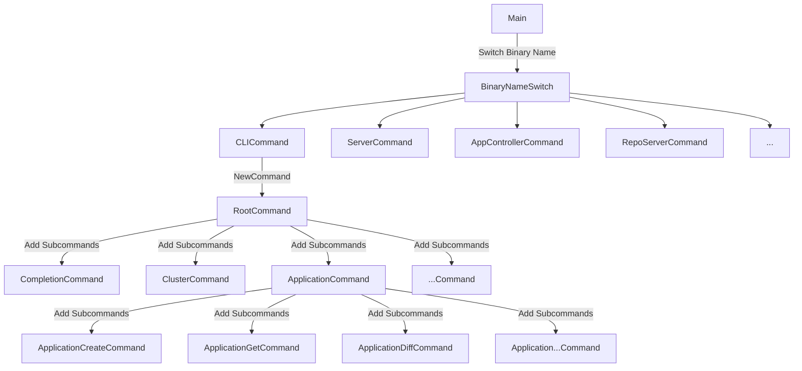

이번 “argocd 분석“ 시리즈는 argocd에서 application을 생성했을 때 argocd 내부 코드가 어떻게 실행되는지 추적합니다. cli에서 app을 생성했을 때 argocd의 컴포넌트는 어떻게 상호작용하게 되는지 살펴보겠습니다.

가장 먼저 argocd의 동작을 살펴보기 위해서 해야할 일은 cli와 다른 컴포넌트의 시작점을 찾는 것입니다. argocd의 모든 컴포넌트의 시작점은 동일한 부분으로부터 출발합니다. 이번 아티클은 argocd의 모든 컴포넌트에 적용되는 main 시작점에 대하여 알아보겠습니다.

argocd의 2.13-release를 기준으로 하겠습니다.

[GitHub - argoproj/argo-cd at release-2.13](https://github.com/argoproj/argo-cd/tree/release-2.13)

---

# argocd의 main진입점

argocd의 main 진입점은 다음 부분입니다.

```go
// https://github.com/argoproj/argo-cd/blob/079754c63913522803f7dbe4bded6b6de37f7e34/cmd/main.go#L27
func main() {
	var command *cobra.Command // ✅ cobra command 생성

	// ✅ 실행하는 바이너리 이름 가져오기
	binaryName := filepath.Base(os.Args[0])
	if val := os.Getenv(binaryNameEnv); val != "" {
		binaryName = val
	}

	// ✅ 바이너리 이름에 따라 실행할 대상 매칭
	isCLI := false
	switch binaryName {
	case "argocd", "argocd-linux-amd64", "argocd-darwin-amd64", "argocd-windows-amd64.exe":
		command = cli.NewCommand()
		isCLI = true
	case "argocd-server":
		command = apiserver.NewCommand()
	case "argocd-application-controller":
		command = appcontroller.NewCommand()
	case "argocd-repo-server":
		command = reposerver.NewCommand()
	// ...
	default:
		command = cli.NewCommand()
		isCLI = true
	}
	util.SetAutoMaxProcs(isCLI)

	// ✅ 바이너리 실행
	if err := command.Execute(); err != nil {
		os.Exit(1)
	}
}
```

argocd의 모든 구성 요소의 시작은 cobra라고 하는 golang cli 라이브러리 패키지를 활용하여 구성됩니다. 실행한 바이너리 종류에 따라 분기 처리되어 command가 최종으로 실행되는 구조를 가집니다.

분기처리에서 argocd에서 실행하는 주요한 컴포넌트가 포함되어 있습니다. 이 종류를 살펴보면 다음과 같습니다. 분석에 필요한 주요 컴포넌트를 간단히 살펴보겠습니다.

- argocd: argocd와 사용자가 상호작용하기 위한 cli입니다.
- argocd-server: argocd의 웹앱, cli 시스템과 상호작용하기 위한 api서버입니다.
- argocd-application-controller: 원격 저장소의 상태와 라이브 상태를 동기화하는 역할을 수행합니다.
- argocd-repo-server: repo서버는 app에 속한 모든 k8s 리소스에 대해 원하는 상태를 만들기 위해 원격 저장소와 상호작용합니다.

argocd는 cobra를 이용하고 있기 때문에 간단하게 cobra를 살펴보겠습니다. cobra는 다음처럼 매우 쉽게 cli를 만들 수 있도록 도와줍니다. 예시 코드를 보겠습니다.

```go
package main

import (
	"fmt"

	"github.com/spf13/cobra"
)

var name string

var rootCmd = &cobra.Command{
	Use:   "app",                      // 명령어 이름
	Short: "App is a simple CLI tool", // 간단한 설명
	Long: `App is a CLI tool built with Cobra.
This is an example application to demonstrate how Cobra works.`, // 상세 설명
	Run: func(cmd *cobra.Command, args []string) {
		fmt.Println("Hello, Cobra!")
	},
}

var greetCmd = &cobra.Command{
	Use:   "greet",
	Short: "Prints a greeting message",
	Run: func(cmd *cobra.Command, args []string) {
		fmt.Printf("Hello, %s!\n", name)
	},
}

func init() {
	greetCmd.Flags().StringVarP(&name, "name", "n", "World", "Name to greet") // 플래그 추가
	rootCmd.AddCommand(greetCmd) // rootCmd에 greetCmd 추가
}

func main() {
	if err := rootCmd.Execute(); err != nil {
		fmt.Println(err)
	}
}

```

cobra.Command는 Use, Short, Log, Run의 주요 필드로 구성되며 핵심 로직은 Run 메서드 내부에서 실행됩니다. 따라서 주요하게 봐야 할 지점은 Run내부에 존재합니다. 내부에서 사용할 변수는 cobra.Command에 대한 Flags 메서드를 이용하여 변수를 등록할 수 있습니다. 위 바이너리를 실행하여 다음을 확인할 수 있습니다. 

```go
 ./main greet --help
 
# Prints a greeting message
# 
# Usage:
#   app greet [flags]
#
# Flags:
#   -h, --help          help for greet
#   -n, --name string   Name to greet (default "World")
```

cobra에서 중요한 건 위의 구현에서 다음의 두 가지입니다.

- 변수의 입력: Flags()를 활용하여 변수 및 기본값을 등록합니다. 실행 시점에 참조로 받은 변수의 주소에 cli 실행 시 외부에서 주입한 값을 저장합니다.
- 로직의 실행: 로직은 command의 로직이 진행됩니다.

그럼 이번에는 argocd의 해당 분기에 직접 들어가보겠습니다. cli인 경우 위의 코드에서 제일 처음의 분기에 진입합니다.

```go
func main() {
	// ...
	case "argocd", "argocd-linux-amd64", "argocd-darwin-amd64", "argocd-windows-amd64.exe":
		command = cli.NewCommand()
		isCLI = true
	// ...
}
```

cli.NewCommand()의 내부는 다음과 같습니다.

```go
// https://github.com/argoproj/argo-cd/blob/079754c63913522803f7dbe4bded6b6de37f7e34/cmd/argocd/commands/root.go#L31
func NewCommand() *cobra.Command {
	var (
		clientOpts argocdclient.ClientOptions
		pathOpts   = clientcmd.NewDefaultPathOptions()
	)

	command := &cobra.Command{
		Use:   cliName,
		Short: "argocd controls a Argo CD server",
		Run: func(c *cobra.Command, args []string) {
			c.HelpFunc()(c, args)
		},
		DisableAutoGenTag: true,
		SilenceUsage:      true,
	}

	command.AddCommand(NewCompletionCommand())
	command.AddCommand(initialize.InitCommand(NewVersionCmd(&clientOpts, nil)))
	command.AddCommand(initialize.InitCommand(NewClusterCommand(&clientOpts, pathOpts)))
	command.AddCommand(initialize.InitCommand(NewApplicationCommand(&clientOpts))) // ✅ application에 대한 command가 추가되는 부분
	// 커맨드 추가 부분
	// ...

	defaultLocalConfigPath, err := localconfig.DefaultLocalConfigPath()
	errors.CheckError(err)
	command.PersistentFlags().StringVar(&clientOpts.ConfigPath, "config", config.GetFlag("config", defaultLocalConfigPath), "Path to Argo CD config")
	command.PersistentFlags().StringVar(&clientOpts.ServerAddr, "server", config.GetFlag("server", ""), "Argo CD server address")
	command.PersistentFlags().BoolVar(&clientOpts.PlainText, "plaintext", config.GetBoolFlag("plaintext"), "Disable TLS")
	// 커맨드의 flag 추가 부분
	// ...

	return command
}
```

여기서 application에 대한 생성 요청이라면 `command.AddCommand(initialize.InitCommand(NewApplicationCommand(&clientOpts)))` 이 부분을 확인해야 합니다. 해당 부분은 applicationCommand를 생성하고 cobra에 등록하는 부분입니다.

이 부분의 코드는 다음과 같습니다.

```go
// https://github.com/argoproj/argo-cd/blob/079754c63913522803f7dbe4bded6b6de37f7e34/cmd/argocd/commands/app.go#L62
func NewApplicationCommand(clientOpts *argocdclient.ClientOptions) *cobra.Command {
	command := &cobra.Command{
		// ... Run만 확인
		Run: func(c *cobra.Command, args []string) {
			c.HelpFunc()(c, args)
			os.Exit(1)
		},
	}
	command.AddCommand(NewApplicationCreateCommand(clientOpts)) // ✅ application 생성에 대한 부분
	command.AddCommand(NewApplicationGetCommand(clientOpts))
	command.AddCommand(NewApplicationDiffCommand(clientOpts))
	command.AddCommand(NewApplicationSetCommand(clientOpts))
	// ...
	return command
}
```

application에도 여러 command를 등록하는 것을 확인할 수 있습니다. 해당 코드에서 application에 대한 crud 요청에 관련된 동작이 cobra에 등록됩니다. 좀 더 들어가서 create application에 대한 부분을 확인해보겠습니다.

```go
// https://github.com/argoproj/argo-cd/blob/079754c63913522803f7dbe4bded6b6de37f7e34/cmd/argocd/commands/app.go#L114
func NewApplicationCreateCommand(clientOpts *argocdclient.ClientOptions) *cobra.Command {
	//  ✅ 1. Run 클로저에서 캡처할 변수
	var (
		appOpts      cmdutil.AppOptions
		fileURL      string
		appName      string
		upsert       bool
		labels       []string
		annotations  []string
		setFinalizer bool
		appNamespace string
	)
	command := &cobra.Command{
		// ...
		Run: func(c *cobra.Command, args []string) {
			// ✅ 2. Create Application에 대한 로직
		},
	}
	
	// ✅ 3. 캡처할 변수를 참조하여 인자를 변수로 가져옴
	command.Flags().StringVar(&appName, "name", "", "A name for the app, ignored if a file is set (DEPRECATED)")
	command.Flags().BoolVar(&upsert, "upsert", false, "Allows to override application with the same name even if supplied application spec is different from existing spec")
	command.Flags().StringVarP(&fileURL, "file", "f", "", "Filename or URL to Kubernetes manifests for the app")
	command.Flags().StringArrayVarP(&labels, "label", "l", []string{}, "Labels to apply to the app")
	command.Flags().StringArrayVarP(&annotations, "annotations", "", []string{}, "Set metadata annotations (e.g. example=value)")
	command.Flags().BoolVar(&setFinalizer, "set-finalizer", false, "Sets deletion finalizer on the application, application resources will be cascaded on deletion")
	// Only complete files with appropriate extension.
	err := command.Flags().SetAnnotation("file", cobra.BashCompFilenameExt, []string{"json", "yaml", "yml"})
	if err != nil {
		log.Fatal(err)
	}
	command.Flags().StringVarP(&appNamespace, "app-namespace", "N", "", "Namespace where the application will be created in")
	cmdutil.AddAppFlags(command, &appOpts)
	return command
}
```

해당 코드는 크게 3부분으로 이루어집니다.

1. 캡처할 변수를 선언하는 부분
2. create application요청이 들어왔을 때 실제 실행하는 함수를 command에 등록하는 부분
3. 캡처할 변수에 인자를 넣는 부분

각각 ✅ 의 인덱스에 대응됩니다. 2번인 create시 실행되는 핵심 로직은 다음과 같습니다.

```go
// https://github.com/argoproj/argo-cd/blob/079754c63913522803f7dbe4bded6b6de37f7e34/cmd/argocd/commands/app.go#L148
		Run: func(c *cobra.Command, args []string) {
			// ✅ argocd client 생성
			argocdClient := headless.NewClientOrDie(clientOpts, c)
			// ✅ app을 파일로부터 가져옴
			apps, err := cmdutil.ConstructApps(fileURL, appName, labels, annotations, args, appOpts, c.Flags())
			errors.CheckError(err)

			// app을 순회하면서
			for _, app := range apps {
				
				// ...
				
				// ✅ argoClient에서 applicationClient 생성
				conn, appIf := argocdClient.NewApplicationClientOrDie()
				defer argoio.Close(conn)
				
				// ✅ 생성 요청 생성
				appCreateRequest := application.ApplicationCreateRequest{
					Application: app,
					Upsert:      &upsert,
					Validate:    &appOpts.Validate,
				}
				
				// ...
				
				// ✅ 생성 전달
				created, err := appIf.Create(ctx, &appCreateRequest)

				// 생성에 따른 응답 처리
				// ...
		},
```

함수 내부 로직은 다음 단계로 실행됩니다.

1. argocdClient를 생성합니다.
2. 파일로부터 app을 가져옵니다.
3. argocdClient부터 applicationClient를 생성합니다.
4. grpc 생성 요청을 구성하고 요청을 argocd api server에 전달합니다. 

`argocdClient.NewApplicationClientOrDie()` 내부를 확인하면 grpc클라이언트 커넥션을 만드는 부분을 확인할 수 있습니다.

```go
// https://github.com/argoproj/argo-cd/blob/079754c63913522803f7dbe4bded6b6de37f7e34/pkg/apiclient/apiclient.go#L702
func (c *client) NewApplicationClientOrDie() (io.Closer, applicationpkg.ApplicationServiceClient) {
	conn, appIf, err := c.NewApplicationClient()
	if err != nil {
		log.Fatalf("Failed to establish connection to %s: %v", c.ServerAddr, err)
	}
	return conn, appIf
}

// https://github.com/argoproj/argo-cd/blob/079754c63913522803f7dbe4bded6b6de37f7e34/pkg/apiclient/apiclient.go#L667
func (c *client) NewApplicationClient() (io.Closer, applicationpkg.ApplicationServiceClient, error) {
	conn, closer, err := c.newConn()
	if err != nil {
		return nil, nil, err
	}
	appIf := applicationpkg.NewApplicationServiceClient(conn)
	return closer, appIf, nil
}

// https://github.com/argoproj/argo-cd/blob/079754c63913522803f7dbe4bded6b6de37f7e34/pkg/apiclient/apiclient.go#L488
func (c *client) newConn() (*grpc.ClientConn, io.Closer, error) {
	// ...
}
```

위에서 command가 등록되는 과정을 mermaid 다이어그램으로 나타내면 다음과 같이 표현할 수 있습니다.



다음 아티클에서 cli로 보낸 app 생성 요청이 어떻게 api 서버에서 처리되는지 확인해보겠습니다.

---

참고자료

[Component Architecture - Argo CD - Declarative GitOps CD for Kubernetes](https://argo-cd.readthedocs.io/en/stable/developer-guide/architecture/components/)