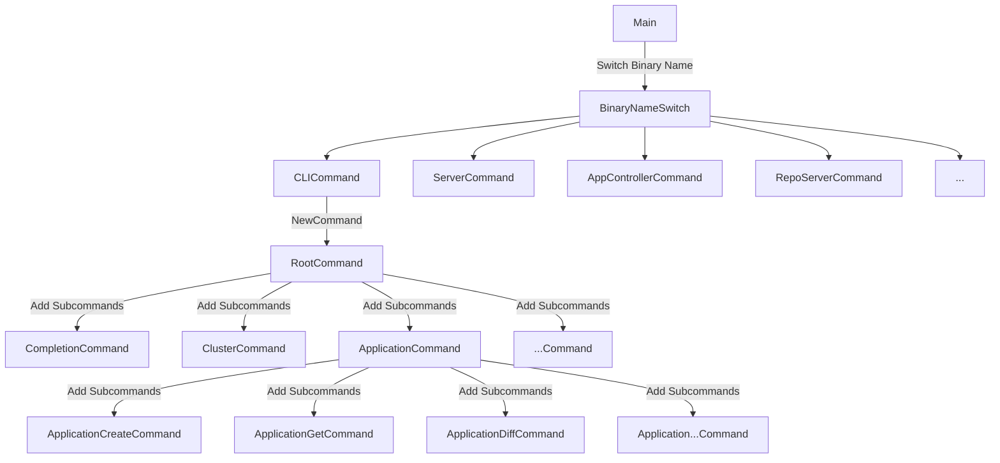

이번 "argocd 분석" 시리즈에서는 application을 생성할 때 Argo CD 내부 코드가 어떻게 실행되는지 추적합니다. CLI에서 app을 생성했을 때 Argo CD 컴포넌트가 어떻게 상호작용하는지 살펴보겠습니다.

가장 먼저 봐야 할 부분은 CLI와 다른 컴포넌트의 시작점입니다. Argo CD의 주요 컴포넌트는 같은 main 진입점에서 출발합니다. 이번 글에서는 그 공통 진입점을 먼저 살펴보겠습니다.

이번 글은 Argo CD release-2.13을 기준으로 합니다.

[GitHub - argoproj/argo-cd at release-2.13](https://github.com/argoproj/argo-cd/tree/release-2.13)

---

# argocd의 main 진입점

Argo CD의 공통 main 진입점은 다음 코드입니다.

```go
// https://github.com/argoproj/argo-cd/blob/a70b2293a06be06db/cmd/main.go#L27-L70
func main() {
	var command *cobra.Command // ✅ cobra command 생성

	// ✅ 실행하는 바이너리 이름 가져오기
	binaryName := filepath.Base(os.Args[0])
	if val := os.Getenv(binaryNameEnv); val != "" {
		binaryName = val
	}

	// ✅ 바이너리 이름에 따라 실행할 대상 매칭
	isCLI := false
	switch binaryName {
	case "argocd", "argocd-linux-amd64", "argocd-darwin-amd64", "argocd-windows-amd64.exe":
		command = cli.NewCommand()
		isCLI = true
	case "argocd-server":
		command = apiserver.NewCommand()
	case "argocd-application-controller":
		command = appcontroller.NewCommand()
	case "argocd-repo-server":
		command = reposerver.NewCommand()
	// ...
	default:
		command = cli.NewCommand()
		isCLI = true
	}
	util.SetAutoMaxProcs(isCLI)

	// ✅ 바이너리 실행
	if err := command.Execute(); err != nil {
		os.Exit(1)
	}
}
```

## Cobra 기반 공통 진입 구조

Argo CD의 각 바이너리는 Cobra라는 Go CLI 라이브러리를 기반으로 시작합니다. 실행한 바이너리 이름에 따라 적절한 command를 선택한 뒤, 마지막에 그 command를 실행하는 구조입니다.

이 분기 안에 Argo CD의 주요 컴포넌트가 모두 들어 있습니다. 이 글에서 계속 추적할 핵심 컴포넌트는 다음과 같습니다.

- argocd: Argo CD와 사용자가 상호작용하는 CLI입니다.
- argocd-server: 웹 UI와 CLI가 호출하는 API 서버입니다.
- argocd-application-controller: 원격 저장소의 상태와 라이브 상태를 동기화하는 역할을 수행합니다.
- argocd-repo-server: application에 포함된 모든 k8s 리소스의 원하는 상태를 만들기 위해 원격 저장소와 상호작용합니다.

Argo CD가 Cobra를 사용하므로, 먼저 Cobra의 기본 형태를 간단히 보겠습니다. Cobra는 다음처럼 CLI를 계층적으로 구성할 수 있게 해줍니다.

```go
package main

import (
	"fmt"

	"github.com/spf13/cobra"
)

var name string

var rootCmd = &cobra.Command{
	Use:   "app",                      // 명령어 이름
	Short: "App is a simple CLI tool", // 간단한 설명
	Long: `App is a CLI tool built with Cobra.
This is an example application to demonstrate how Cobra works.`, // 상세 설명
	Run: func(cmd *cobra.Command, args []string) {
		fmt.Println("Hello, Cobra!")
	},
}

var greetCmd = &cobra.Command{
	Use:   "greet",
	Short: "Prints a greeting message",
	Run: func(cmd *cobra.Command, args []string) {
		fmt.Printf("Hello, %s!\n", name)
	},
}

func init() {
	greetCmd.Flags().StringVarP(&name, "name", "n", "World", "Name to greet") // 플래그 추가
	rootCmd.AddCommand(greetCmd) // rootCmd에 greetCmd 추가
}

func main() {
	if err := rootCmd.Execute(); err != nil {
		fmt.Println(err)
	}
}

```

cobra.Command는 Use, Short, Long, Run 같은 필드로 구성되며, 핵심 로직은 Run 내부에서 실행됩니다. 따라서 실제 동작을 이해하려면 Run을 보면 됩니다. 명령 실행에 필요한 값은 Flags 메서드로 등록하고, 실행 시점에 해당 변수에 주입됩니다. 예시 바이너리를 실행하면 다음과 같습니다.

```go
 ./main greet --help
 
# Prints a greeting message
# 
# Usage:
#   app greet [flags]
#
# Flags:
#   -h, --help          help for greet
#   -n, --name string   Name to greet (default "World")
```

이 예시에서 중요한 점은 두 가지입니다.

- 변수의 입력: Flags()를 활용하여 변수 및 기본값을 등록합니다. 실행 시점에 참조로 받은 변수의 주소에 cli 실행 시 외부에서 주입한 값을 저장합니다.
- 로직의 실행: 실제 로직은 각 command의 Run에서 실행됩니다.

이제 Argo CD 코드로 돌아가 보겠습니다. CLI 바이너리라면 위 switch의 첫 번째 분기로 들어갑니다.

```go
func main() {
	// ...
	case "argocd", "argocd-linux-amd64", "argocd-darwin-amd64", "argocd-windows-amd64.exe":
		command = cli.NewCommand()
		isCLI = true
	// ...
}
```

## CLI command 등록 구조

이때 호출되는 cli.NewCommand()는 다음과 같습니다.

```go
// https://github.com/argoproj/argo-cd/blob/a70b2293a06be06db/cmd/argocd/commands/root.go#L33-L70
func NewCommand() *cobra.Command {
	var (
		clientOpts argocdclient.ClientOptions
		pathOpts   = clientcmd.NewDefaultPathOptions()
	)

	command := &cobra.Command{
		Use:   cliName,
		Short: "argocd controls a Argo CD server",
		Run: func(c *cobra.Command, args []string) {
			c.HelpFunc()(c, args)
		},
		DisableAutoGenTag: true,
		SilenceUsage:      true,
	}

	command.AddCommand(NewCompletionCommand())
	command.AddCommand(initialize.InitCommand(NewVersionCmd(&clientOpts, nil)))
	command.AddCommand(initialize.InitCommand(NewClusterCommand(&clientOpts, pathOpts)))
	command.AddCommand(initialize.InitCommand(NewApplicationCommand(&clientOpts))) // ✅ application에 대한 command가 추가되는 부분
	// 커맨드 추가 부분
	// ...

	defaultLocalConfigPath, err := localconfig.DefaultLocalConfigPath()
	errors.CheckError(err)
	command.PersistentFlags().StringVar(&clientOpts.ConfigPath, "config", config.GetFlag("config", defaultLocalConfigPath), "Path to Argo CD config")
	command.PersistentFlags().StringVar(&clientOpts.ServerAddr, "server", config.GetFlag("server", ""), "Argo CD server address")
	command.PersistentFlags().BoolVar(&clientOpts.PlainText, "plaintext", config.GetBoolFlag("plaintext"), "Disable TLS")
	// 커맨드의 flag 추가 부분
	// ...

	return command
}
```

application 생성 요청을 따라가려면 `command.AddCommand(initialize.InitCommand(NewApplicationCommand(&clientOpts)))` 이 부분을 확인해야 합니다. 이 코드는 application 관련 하위 command 묶음을 생성해 루트 command에 등록합니다.

관련 코드는 다음과 같습니다.

```go
// https://github.com/argoproj/argo-cd/blob/a70b2293a06be06db/cmd/argocd/commands/app.go#L62-L91
func NewApplicationCommand(clientOpts *argocdclient.ClientOptions) *cobra.Command {
	command := &cobra.Command{
		// ... Run만 확인
		Run: func(c *cobra.Command, args []string) {
			c.HelpFunc()(c, args)
			os.Exit(1)
		},
	}
	command.AddCommand(NewApplicationCreateCommand(clientOpts)) // ✅ application 생성에 대한 부분
	command.AddCommand(NewApplicationGetCommand(clientOpts))
	command.AddCommand(NewApplicationDiffCommand(clientOpts))
	command.AddCommand(NewApplicationSetCommand(clientOpts))
	// ...
	return command
}
```

여기서도 여러 하위 command가 등록됩니다. 즉, application 관련 CRUD 동작이 이 지점에서 Cobra 트리에 연결됩니다. 이제 create 요청 경로를 더 따라가 보겠습니다.

```go
// https://github.com/argoproj/argo-cd/blob/a70b2293a06be06db/cmd/argocd/commands/app.go#L114-L211
func NewApplicationCreateCommand(clientOpts *argocdclient.ClientOptions) *cobra.Command {
	//  ✅ 1. Run 클로저에서 캡처할 변수
	var (
		appOpts      cmdutil.AppOptions
		fileURL      string
		appName      string
		upsert       bool
		labels       []string
		annotations  []string
		setFinalizer bool
		appNamespace string
	)
	command := &cobra.Command{
		// ...
		Run: func(c *cobra.Command, args []string) {
			// ✅ 2. Create Application에 대한 로직
		},
	}
	
	// ✅ 3. 캡처할 변수를 참조하여 인자를 변수로 가져옴
	command.Flags().StringVar(&appName, "name", "", "A name for the app, ignored if a file is set (DEPRECATED)")
	command.Flags().BoolVar(&upsert, "upsert", false, "Allows to override application with the same name even if supplied application spec is different from existing spec")
	command.Flags().StringVarP(&fileURL, "file", "f", "", "Filename or URL to Kubernetes manifests for the app")
	command.Flags().StringArrayVarP(&labels, "label", "l", []string{}, "Labels to apply to the app")
	command.Flags().StringArrayVarP(&annotations, "annotations", "", []string{}, "Set metadata annotations (e.g. example=value)")
	command.Flags().BoolVar(&setFinalizer, "set-finalizer", false, "Sets deletion finalizer on the application, application resources will be cascaded on deletion")
	// Only complete files with appropriate extension.
	err := command.Flags().SetAnnotation("file", cobra.BashCompFilenameExt, []string{"json", "yaml", "yml"})
	if err != nil {
		log.Fatal(err)
	}
	command.Flags().StringVarP(&appNamespace, "app-namespace", "N", "", "Namespace where the application will be created in")
	cmdutil.AddAppFlags(command, &appOpts)
	return command
}
```

## app create 요청 경로

이 함수는 크게 세 부분으로 나뉩니다.

1. 캡처할 변수를 선언하는 부분
2. create application 요청이 들어왔을 때 실제 실행할 Run 로직을 command에 등록하는 부분
3. 캡처한 변수에 CLI 인자를 바인딩하는 부분

위 코드의 ✅ 번호가 각각 대응됩니다. 그중 실제 create 요청을 보내는 핵심 부분은 다음입니다.

```go
func NewApplicationCreateCommand(clientOpts *argocdclient.ClientOptions) *cobra.Command {
	// ...
	command := &cobra.Command{
		// ...
		// https://github.com/argoproj/argo-cd/blob/a70b2293a06be06db/cmd/argocd/commands/app.go#L148-L195
		Run: func(c *cobra.Command, args []string) {
			// ✅ argocd client 생성
			argocdClient := headless.NewClientOrDie(clientOpts, c)
			// ✅ 파일이나 인자에서 app 정의 구성
			apps, err := cmdutil.ConstructApps(fileURL, appName, labels, annotations, args, appOpts, c.Flags())
			errors.CheckError(err)

			// ✅ app 목록을 순회하며 생성 요청 처리
			for _, app := range apps {
				// ...

				// ✅ application 서비스용 gRPC client 생성
				conn, appIf := argocdClient.NewApplicationClientOrDie()
				defer argoio.Close(conn)

				// ✅ 생성 요청 payload 구성
				appCreateRequest := application.ApplicationCreateRequest{
					Application: app,
					Upsert:      &upsert,
					Validate:    &appOpts.Validate,
				}

				// ...

				// ✅ API server로 생성 요청 전달
				created, err := appIf.Create(ctx, &appCreateRequest)

				// 생성 결과에 따른 응답 처리
				// ...
			}
		},
	}
	// ...
}
```

함수 내부 로직은 다음 단계로 실행됩니다.

1. argocdClient를 생성합니다.
2. 파일이나 인자에서 app 정의를 구성합니다.
3. argocdClient로부터 applicationClient를 생성합니다.
4. gRPC 생성 요청을 구성하고 이를 Argo CD API server에 전달합니다.

`argocdClient.NewApplicationClientOrDie()`를 따라가면 gRPC 클라이언트를 만드는 흐름이 이어집니다.

```go
// https://github.com/argoproj/argo-cd/blob/a70b2293a06be06db/pkg/apiclient/apiclient.go#L686-L692
func (c *client) NewApplicationClientOrDie() (io.Closer, applicationpkg.ApplicationServiceClient) {
	conn, appIf, err := c.NewApplicationClient()
	if err != nil {
		log.Fatalf("Failed to establish connection to %s: %v", c.ServerAddr, err)
	}
	return conn, appIf
}

// https://github.com/argoproj/argo-cd/blob/a70b2293a06be06db/pkg/apiclient/apiclient.go#L668-L674
func (c *client) NewApplicationClient() (io.Closer, applicationpkg.ApplicationServiceClient, error) {
	conn, closer, err := c.newConn()
	if err != nil {
		return nil, nil, err
	}
	appIf := applicationpkg.NewApplicationServiceClient(conn)
	return closer, appIf, nil
}

// https://github.com/argoproj/argo-cd/blob/a70b2293a06be06db/pkg/apiclient/apiclient.go#L489-L540
func (c *client) newConn() (*grpc.ClientConn, io.Closer, error) {
	// ...
}
```

## command 트리 정리

위에서 본 command 등록 과정을 Mermaid 다이어그램으로 정리하면 다음과 같습니다.



다음 글에서는 CLI에서 보낸 app 생성 요청이 API server에서 어떻게 처리되는지 이어서 살펴보겠습니다.

---

참고자료

[Component Architecture - Argo CD - Declarative GitOps CD for Kubernetes](https://argo-cd.readthedocs.io/en/stable/developer-guide/architecture/components/)