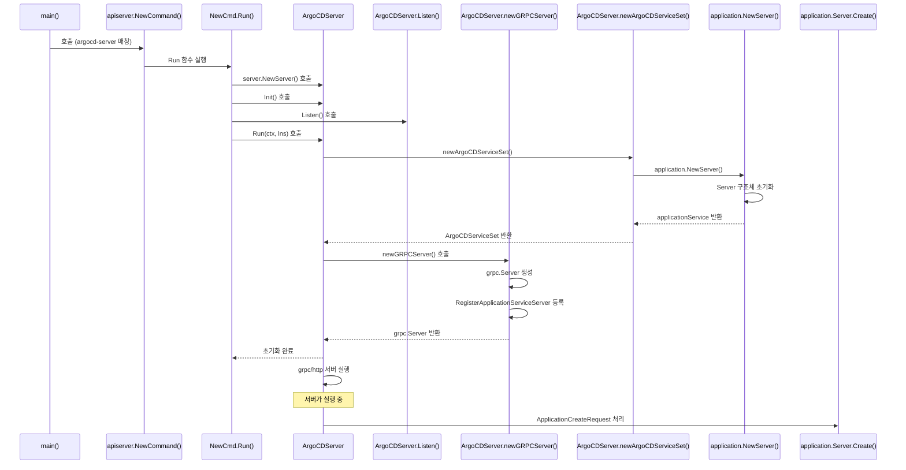

이전 아티클에서는 argocd cli가 app 생성용 grpc 요청을 api server로 보내는 지점까지 살펴봤습니다. 이번에는 그 요청을 받은 api server가 어떤 초기화 과정을 거쳐 실제 application 생성 로직까지 도달하는지 확인해보겠습니다.

---

## api server의 생명 주기

웹앱이나 cli에서 들어온 요청은 api server가 받아 처리합니다. api server의 진입점도 argocd cli와 마찬가지로 동일한 `main()` 함수에서 시작합니다.

```go
// https://github.com/argoproj/argo-cd/blob/a70b2293a06be06dbb5fb30d0925331e72a6de14/cmd/main.go#L35
func main() {
	var command *cobra.Command // ✅ 실행할 cobra command

	// ✅ 실행하는 바이너리 이름 가져오기
	binaryName := filepath.Base(os.Args[0])
	if val := os.Getenv(binaryNameEnv); val != "" {
		binaryName = val
	}

	// ✅ 바이너리 이름에 따라 실행할 대상 매칭
	isArgocdCLI := false
	switch binaryName {
	// ...
	// ✅ argocd api server인 경우 case 매칭
	case "argocd-server":
		command = apiserver.NewCommand()
	// ...
}
```

`apiserver.NewCommand()` 내부도 cli 쪽과 비슷하게 진행됩니다. 먼저 함수 내부에서 사용할 변수를 선언하고, 그다음 `cobra.Command`를 만들면서 `Run` 로직을 등록한 뒤, 마지막에 필요한 flag를 바인딩합니다.

```go
// https://github.com/argoproj/argo-cd/blob/a70b2293a06be06dbb5fb30d0925331e72a6de14/cmd/argocd-server/commands/argocd_server.go#L55
func NewCommand() *cobra.Command {
	// ✅ 함수 내부에서 사용할 변수 선언
	// ...

	command := &cobra.Command{
		Use: cliName,
		// ...
		Run: func(c *cobra.Command, _ []string) {
			// ✅ api server 초기화 및 실행
			// ...
		},
	}

	// ✅ 커맨드 flag 바인딩
	// ...

	return command
}
```

`Run` 내부 흐름을 지금 글에서 필요한 부분만 추리면 다음과 같습니다.

```go
// https://github.com/argoproj/argo-cd/blob/a70b2293a06be06dbb5fb30d0925331e72a6de14/cmd/argocd-server/commands/argocd_server.go#L104
		Run: func(c *cobra.Command, args []string) {
			// ✅ argocd server 설정
			// ...

			argocd := server.NewServer(ctx, argoCDOpts, appsetOpts) // ✅ api server 생성
			argocd.Init(ctx) // ✅ informer 관련 초기화

			lns, err := argocd.Listen() // ✅ tcp listener 준비
			errors.CheckError(err)

			for {
				ctx, cancel := context.WithCancel(ctx)
				// ...

				argocd.Run(ctx, lns) // ✅ 서버 실행

				cancel()
				// ...
			}
		},
```

`apiserver.NewCommand()`의 `Run` 내부는 크게 서버 옵션 구성, api server 생성, listener 준비, 서버 실행 순서로 이어집니다. 여기서는 마지막 단계인 `argocd.Run(ctx, lns)` 부터 먼저 보겠습니다.

```go
// https://github.com/argoproj/argo-cd/blob/a70b2293a06be06dbb5fb30d0925331e72a6de14/server/server.go#L517
func (a *ArgoCDServer) Run(ctx context.Context, listeners *Listeners) {
	// ...

	// ✅ 서버 초기화
	svcSet := newArgoCDServiceSet(a)
	a.serviceSet = svcSet
	grpcS, appResourceTreeFn := a.newGRPCServer()
	grpcWebS := grpcweb.WrapServer(grpcS)
	var httpS *http.Server
	var httpsS *http.Server
	if a.useTLS() {
		httpS = newRedirectServer(a.ListenPort, a.RootPath)
		httpsS = a.newHTTPServer(ctx, a.ListenPort, grpcWebS, appResourceTreeFn, listeners.GatewayConn, metricsServ)
	} else {
		httpS = a.newHTTPServer(ctx, a.ListenPort, grpcWebS, appResourceTreeFn, listeners.GatewayConn, metricsServ)
	}

	// ...

	// ✅ 서버 실행
	go func() { a.checkServeErr("grpcS", grpcS.Serve(grpcL)) }()
	go func() { a.checkServeErr("httpS", httpS.Serve(httpL)) }()

	// ...

	go a.watchSettings()
	go a.rbacPolicyLoader(ctx)
	go func() { a.checkServeErr("tcpm", tcpm.Serve()) }()
	go func() { a.checkServeErr("metrics", metricsServ.Serve(listeners.Metrics)) }()

	// ...

	a.stopCh = make(chan struct{})
	<-a.stopCh
}
```

`Run()`은 크게 서비스 집합 초기화와 실제 서버 실행으로 나눌 수 있습니다. 이 과정에서 http 서버와 grpc 서버를 구성한 뒤 각각을 고루틴으로 띄웁니다. 앞선 아티클에서 grpc 요청 경로를 살펴봤으니, 이번에는 grpc 서버가 어떻게 구성되는지 이어서 추적해보겠습니다.

grpc 서버 구성을 이해하려면 `newGRPCServer()` 내부를 보면 됩니다.

```go
// https://github.com/argoproj/argo-cd/blob/a70b2293a06be06dbb5fb30d0925331e72a6de14/server/server.go#L760
func (a *ArgoCDServer) newGRPCServer() (*grpc.Server, application.AppResourceTreeFn) {
	// ✅ 서버 구성을 위한 옵션 설정
	// ...

	// ✅ grpc 서버 생성
	grpcS := grpc.NewServer(sOpts...)

	// ✅ grpc 서버에 service 레지스터
	versionpkg.RegisterVersionServiceServer(grpcS, a.serviceSet.VersionService)
	clusterpkg.RegisterClusterServiceServer(grpcS, a.serviceSet.ClusterService)
	applicationpkg.RegisterApplicationServiceServer(grpcS, a.serviceSet.ApplicationService) // ✅ application에 대한 service가 등록됨
	applicationsetpkg.RegisterApplicationSetServiceServer(grpcS, a.serviceSet.ApplicationSetService) 
	
	// ...
	
	return grpcS, a.serviceSet.AppResourceTreeFn
}

```

`newGRPCServer()` 안에서는 여러 grpc 서비스가 등록됩니다. 그중 application 관련 서비스는 `applicationpkg.RegisterApplicationServiceServer(...)` 호출에서 등록되는 것을 확인할 수 있습니다. 물론 이 함수가 동작하려면 인자로 넘기는 `a.serviceSet.ApplicationService`가 미리 초기화되어 있어야 합니다.

이 초기화는 `newGRPCServer()`보다 앞에서 호출되는 `svcSet := newArgoCDServiceSet(a)` 안에서 이뤄집니다.

```go
// https://github.com/argoproj/argo-cd/blob/a70b2293a06be06dbb5fb30d0925331e72a6de14/server/server.go#L863
func newArgoCDServiceSet(a *ArgoCDServer) *ArgoCDServiceSet {
	// ...

	// ✅ application service 초기화
	applicationService, appResourceTreeFn := application.NewServer(
		// ...
	)

	// ...
	// ✅ application 외 service도 함께 초기화
	// ...

	return &ArgoCDServiceSet{
		ClusterService:        clusterService,
		RepoService:           repoService,
		RepoCredsService:      repoCredsService,
		SessionService:        sessionService,
		ApplicationService:    applicationService,
		// ...
	}
}
```

여기서 `applicationService`가 초기화되고, 마지막에 `ArgoCDServiceSet`의 `ApplicationService` 필드로 묶입니다. 이제 `application.NewServer()` 안으로 더 들어가서 실제로 어떤 구현체가 반환되는지 보겠습니다.

```go
// https://github.com/argoproj/argo-cd/blob/a70b2293a06be06dbb5fb30d0925331e72a6de14/server/application/application.go#L102
func NewServer(
	// ...
) (application.ApplicationServiceServer, AppResourceTreeFn) { // ✅ 함수 리턴으로 인터페이스가 리턴

	// ...

	// ✅ 실제 구현체는 Server
	s := &Server{
		// 내부 필드에 k8s 리소스를 CRUD하기 위한 필드를 주입
		ns:                namespace,
		appclientset:      appclientset,
		appLister:         appLister,
		appInformer:       appInformer,
		appBroadcaster:    appBroadcaster,
		kubeclientset:     kubeclientset,
		// ...
	}
	return s, s.getAppResources
}
```

여기서 반환되는 `*Server`가 실제 grpc 서비스 구현체입니다. 예를 들어 다음과 같은 메서드들을 직접 구현합니다.

- `Create(ctx context.Context, q *application.ApplicationCreateRequest)`
- `Delete(ctx context.Context, q *application.ApplicationDeleteRequest)`
- `DeleteResource(ctx context.Context, q *application.ApplicationResourceDeleteRequest)`
- `Get(ctx context.Context, q *application.ApplicationQuery)`
- `GetApplicationSyncWindows(ctx context.Context, q *application.ApplicationSyncWindowsQuery)`

`Server` 메서드를 따라가면 `Create()`의 실제 구현을 찾을 수 있습니다. 흐름은 다음과 같습니다.

```go
// https://github.com/argoproj/argo-cd/blob/a70b2293a06be06dbb5fb30d0925331e72a6de14/server/application/application.go#L317
// Create creates an application
func (s *Server) Create(ctx context.Context, q *application.ApplicationCreateRequest) (*appv1.Application, error) {
	// ✅ application nil 체크, rbac 체크

	// ✅ project 단위로 락
	s.projectLock.RLock(a.Spec.GetProject())
	defer s.projectLock.RUnlock(a.Spec.GetProject())

	// ...
	// ✅ project, namespace 조회 및 배포 가능 여부 확인
	// ...

	// ✅ application 생성 요청
	created, err := s.appclientset.ArgoprojV1alpha1().Applications(appNs).Create(ctx, a, metav1.CreateOptions{})
	if err == nil {
		// ...
	}

	// ...
	// ✅ 에러 및 upsert 처리
	// ...
}
```

정리하면 `Create()`는 다음 순서로 동작합니다.

- 요청 검증 과정: app nil 체크, rbac 체크, project, ns에 대한 배포 가능 여부 확인을 진행합니다.
- app create 요청 수행: application 생성 요청을 수행합니다.
- 발생한 결과 처리: 에러나 이미 application이 존재하는 경우 upsert flag에 따른 결과를 처리합니다.

위 로직을 mermaid로 단순화하면 다음과 같이 표현할 수 있습니다. 



지금까지 argocd cli를 통해 app 생성 요청이 api server로 전달되고, 그 요청이 실제 `Application` 리소스 생성으로 이어지는 과정까지 살펴봤습니다. app 생성은 argocd cli, argocd 웹, k8s 리소스 생성 등 여러 경로로 들어올 수 있습니다. 그렇다면 argocd는 이 `Application` 리소스의 변화를 어디서 감지할까요? 다음 아티클에서는 application controller가 어떤 방식으로 application 상태를 감시하는지 살펴보겠습니다.