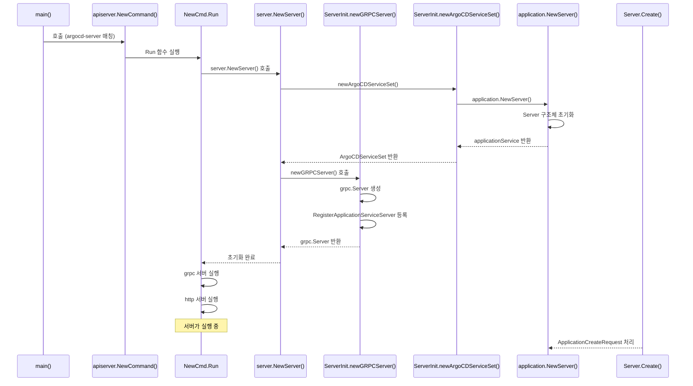

이전 아티클에서 argocd cli로 app 생성에 대한 grpc요청을 api server에 보내는 부분까지 진행했습니다. 클라이언트 측을 진행했으니 서버측 코드를 살펴보겠습니다.

---

# api server의 생명 주기

웹앱이나 cli를 통해 받은 요청은 api server가 수집합니다. api server에 대한 진입점도 argocd cli와 마찬가지로 같은 main에서 출발합니다.

```go
// https://github.com/argoproj/argo-cd/blob/079754c63913522803f7dbe4bded6b6de37f7e34/cmd/main.go#L27
func main() {
	var command *cobra.Command // ✅ cobra command 생성

	// ✅ 실행하는 바이너리 이름 가져오기
	binaryName := filepath.Base(os.Args[0])
	if val := os.Getenv(binaryNameEnv); val != "" {
		binaryName = val
	}

	// ✅ 바이너리 이름에 따라 실행할 대상 매칭
	isCLI := false
	switch binaryName {
	// ...
	// ✅ argocd api server인 경우 case 매칭
	case "argocd-server":
		command = apiserver.NewCommand()
	// ...
}
```

`apiserver.NewCommand()` 이 함수 내부도 cli와 마찬가지로 “캡처 변수 선언” → “로직 함수 등록” → 캡처 변수를 인자로 받기” 단계로 이루어져 있습니다.

```go
// https://github.com/argoproj/argo-cd/blob/079754c63913522803f7dbe4bded6b6de37f7e34/cmd/argocd-server/commands/argocd_server.go#L54
func NewCommand() *cobra.Command {

	// 함수 내부 변수 세팅
	// ...
	
	command := &cobra.Command{
		// ...
		Run: func(c *cobra.Command, args []string) {
		
			// some logic
			// ...
			
		}
		
		// 커맨드 변수 flagging
		// ...
		
	return command
```

Run 내부 함수를 간략하게 요약하면 다음과 같습니다.

```go
// https://github.com/argoproj/argo-cd/blob/079754c63913522803f7dbe4bded6b6de37f7e34/cmd/argocd-server/commands/argocd_server.go#L104
		Run: func(c *cobra.Command, args []string) {
			
			// argocd server 설정
			// ...
			
			// ✅ argocd api server 생성
			argocd := server.NewServer(ctx, argoCDOpts, appsetOpts)
			argocd.Init(ctx) // informer 고루틴 실행
			
			// 계속 반복하면서
			for {
				// ...
				lns, err := argocd.Listen() // ✅ tcp 서버 열기
				errors.CheckError(err)
				
				// ...
				
				argocd.Run(serverCtx, lns) // ✅ 서버 실행
				
				// ...
			}
		},
```

apiserver의 NewCommand의 Run 내부는 argocd api server 초기화, 호스팅, 실행을 순차적으로 진행합니다. 여기서 제일 마지막에 존재하는 `argocd.Run(serverCtx, lns)` 를 먼저 확인해봅시다.

```go
// https://github.com/argoproj/argo-cd/blob/079754c63913522803f7dbe4bded6b6de37f7e34/server/server.go#L517
func (a *ArgoCDServer) Run(ctx context.Context, listeners *Listeners) {
	
	// ...
	
	// ✅ 서버 초기화
	svcSet := newArgoCDServiceSet(a)
	a.serviceSet = svcSet
	grpcS, appResourceTreeFn := a.newGRPCServer()
	grpcWebS := grpcweb.WrapServer(grpcS)
	var httpS *http.Server
	var httpsS *http.Server
	if a.useTLS() {
		httpS = newRedirectServer(a.ListenPort, a.RootPath)
		httpsS = a.newHTTPServer(ctx, a.ListenPort, grpcWebS, appResourceTreeFn, listeners.GatewayConn, metricsServ)
	} else {
		httpS = a.newHTTPServer(ctx, a.ListenPort, grpcWebS, appResourceTreeFn, listeners.GatewayConn, metricsServ)
	}
	
	// ...

	// ✅ 서버 실행
	go func() { a.checkServeErr("grpcS", grpcS.Serve(grpcL)) }()
	go func() { a.checkServeErr("httpS", httpS.Serve(httpL)) }()
	
	// ...
	
	go a.watchSettings()
	go a.rbacPolicyLoader(ctx)
	go func() { a.checkServeErr("tcpm", tcpm.Serve()) }()
	go func() { a.checkServeErr("metrics", metricsServ.Serve(listeners.Metrics)) }()
	
	// ...
	
	a.stopCh = make(chan struct{})
	<-a.stopCh
}
```

Run 내부 함수를 크게 나누면 서버 설정을 초기화하고 서버를 실행하는 두 가지 부분으로 나눌 수 있습니다. 초기화 과정에서 http, grpc 서버를 초기화하고 고루틴으로 실행합니다. 앞선 아티클에서 grpc요청에 대하여 분석했으므로 grpc 서버 구성이 어떻게 이루어지는지 추적해보겠습니다.

grpc 서버 구성을 이해하기 위해서 `newGRPCServer` 함수 내부를 확인해보겠습니다.

```go
// https://github.com/argoproj/argo-cd/blob/079754c63913522803f7dbe4bded6b6de37f7e34/server/server.go#L760
func (a *ArgoCDServer) newGRPCServer() (*grpc.Server, application.AppResourceTreeFn) {
	
	// 서버 구성을 위한 옵션 
	// ...

	// ✅ grpc 서버 생성
	grpcS := grpc.NewServer(sOpts...)

	// ✅ grpc 서버에 service 레지스터
	versionpkg.RegisterVersionServiceServer(grpcS, a.serviceSet.VersionService)
	clusterpkg.RegisterClusterServiceServer(grpcS, a.serviceSet.ClusterService)
	applicationpkg.RegisterApplicationServiceServer(grpcS, a.serviceSet.ApplicationService) // ✅ application에 대한 service가 등록됨
	applicationsetpkg.RegisterApplicationSetServiceServer(grpcS, a.serviceSet.ApplicationSetService) 
	
	// ...
	
	return grpcS, a.serviceSet.AppResourceTreeFn
}

```

`newGRPCServer` 함수 내부에서 다양한 서비스가 등록되는 것을 확인할 수 있습니다. 이 중에 application에 대한 부분은 `applicationpkg.RegisterApplicationServiceServer( … )` 부분에서 등록되는 것을 변수명을 통해 확인할 수 있습니다. 한편, `applicationpkg.RegisterApplicationServiceServer( … )` 이 함수가 동작하려면 내부 인자로 전달하는 `a.serviceSet.ApplicationService` 값이 어디선가 초기화되어야 합니다. 

이 초기화 과정은 `newGRPCServer` 보다 앞에서 호출되는 `svcSet := newArgoCDServiceSet(a)` 에서 확인할 수 있습니다. 

```go
// https://github.com/argoproj/argo-cd/blob/079754c63913522803f7dbe4bded6b6de37f7e34/server/server.go#L863
func newArgoCDServiceSet(a *ArgoCDServer) *ArgoCDServiceSet {
	
	// ...
	
	// ✅ applicaiton에 대한 service가 초기화
	applicationService, appResourceTreeFn := application.NewServer(
		
		// ...
		
	)

	// ...
	// application 외 service가 초기화
	// ...

	return &ArgoCDServiceSet{
		ClusterService:        clusterService,
		RepoService:           repoService,
		RepoCredsService:      repoCredsService,
		SessionService:        sessionService,
		ApplicationService:    applicationService,
		// ...
	}
}
```

이 부분에서 applicationService가 초기화되는 것을 확인할 수 있습니다. argoCDServiceSet의 필드로 applicationService가 등록되는 것을 제일 마지막에 확인할 수 있습니다. 좀 더 `application.NewServer` 내부로 들어가보겠습니다. 내부에서 실제 리턴되는 구현체를 확인할 수 있습니다.

```go
// https://github.com/argoproj/argo-cd/blob/079754c63913522803f7dbe4bded6b6de37f7e34/server/application/application.go#L99
func NewServer(
	// ...
) (application.ApplicationServiceServer, AppResourceTreeFn) { // ✅ 함수 리턴으로 인터페이스가 리턴

	// ...

	// ✅ 실제 구현체는 Server
	s := &Server{
		// 내부 필드에 k8s 리소스를 CRUD하기 위한 필드를 주입
		ns:                namespace,
		appclientset:      appclientset,
		appLister:         appLister,
		appInformer:       appInformer,
		appBroadcaster:    appBroadcaster,
		kubeclientset:     kubeclientset,
		// ...
	}
	return s, s.getAppResources
}
```

여기서 리턴되는 &Server는 다음 메서드를 갖습니다. 이 메서드가 grpc 서비스를 구현하는 메서드임을 확인할 수 있습니다. 5개만 확인해보겠습니다.

```go
func (s *Server) Create(ctx context.Context, q *application.ApplicationCreateRequest) (*appv1.Application, error)
func (s *Server) Delete(ctx context.Context, q *application.ApplicationDeleteRequest) (*application.ApplicationResponse, error)
func (s *Server) DeleteResource(ctx context.Context, q *application.ApplicationResourceDeleteRequest) (*application.ApplicationResponse, error)
func (s *Server) Get(ctx context.Context, q *application.ApplicationQuery) (*appv1.Application, error)
func (s *Server) GetApplicationSyncWindows(ctx context.Context, q *application.ApplicationSyncWindowsQuery) (*application.ApplicationSyncWindowsResponse, error)
// ...
```

*Server의 메서드 정의를 통해 Create에 대한 실제 로직 구현체를 찾을 수 있습니다. 동작은 다음과 같습니다.

```go
// https://github.com/argoproj/argo-cd/blob/079754c63913522803f7dbe4bded6b6de37f7e34/server/application/application.go#L314
// Create creates an application
func (s *Server) Create(ctx context.Context, q *application.ApplicationCreateRequest) (*appv1.Application, error) {
	
	// application nil, rbac 체크

	// project 단위로 락
	s.projectLock.RLock(a.Spec.GetProject())
	defer s.projectLock.RUnlock(a.Spec.GetProject())
	
	// ...
	// project, ns 조회 및 배포 가능성 확인
	// ...

	// app create 호출
	created, err := s.appclientset.ArgoprojV1alpha1().Applications(appNs).Create(ctx, a, metav1.CreateOptions{})
	if err == nil {
		// ...
	}
	
	// ...
	// 에러 및 upsert에 대한 처리	
	// ...

}
```

간단하게 동작을 살펴보면 다음 과정으로 동작합니다.

- 요청 검증 과정: app nil 체크, rbac 체크, project, ns에 대한 배포 가능 여부 확인을 진행합니다.
- app create 요청 수행: application 생성 요청을 수행합니다.
- 발생한 결과 처리: 에러나 이미 application이 존재하는 경우 upsert flag에 따른 결과를 처리합니다.

위 로직을 mermaid로 단순화하면 다음과 같이 표현할 수 있습니다. 



지금까지 argocd cli를 통해 app 생성 요청을 api server에 전달하고 api server에서 application을 생성하는 과정을 살펴봤습니다. app 생성은 argocd cli, argocd 웹, k8s 리소스 생성의 방법으로 진행할 수 있습니다. 그렇다면 argocd의 어딘가에서 application 리소스의 변화를 감지해야 합니다. 이 부분은 어디서 일어날까요? 다음 아티클에서는 어디서 application 상태를 확인하는지 application controller 코드를 살펴보겠습니다.