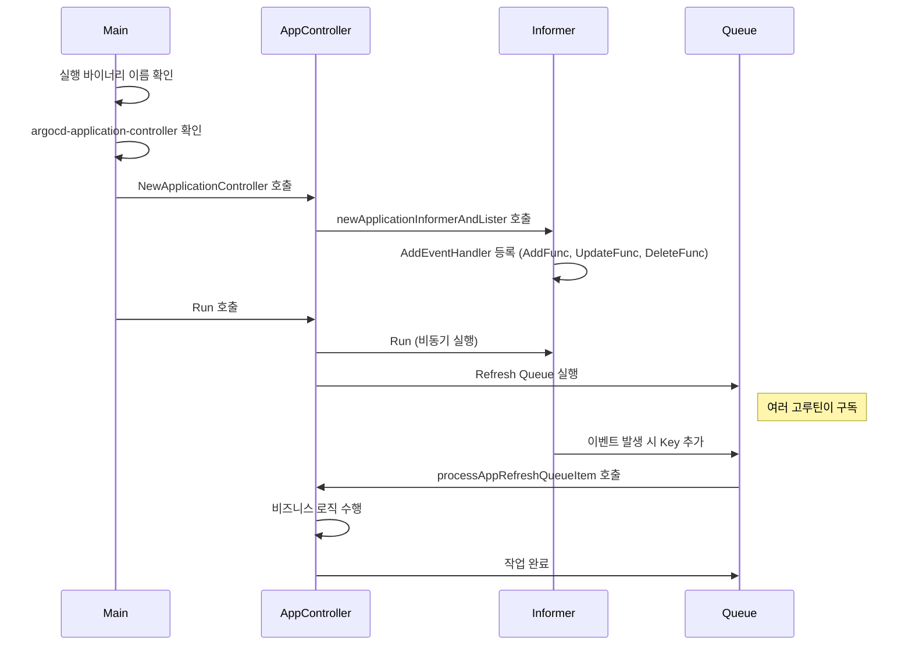

app이 api server를 통해 생성되는 과정은 앞서 확인했습니다. 이번에는 이렇게 생성된 app을 argocd가 어떻게 감지하는지 살펴보겠습니다. 이번 글에서는 application controller 코드를 중심으로 보겠습니다.

---

# application controller의 시작점

이번에도 `main` 함수에서 출발하겠습니다.

```go
// https://github.com/argoproj/argo-cd/blob/a70b2293a06be06dbb5fb30d0925331e72a6de14/cmd/main.go#L27-L42
func main() {
	var command *cobra.Command // ✅ 실행할 cobra command 변수

	// ✅ 현재 실행 중인 바이너리 이름 확인
	binaryName := filepath.Base(os.Args[0])
	if val := os.Getenv(binaryNameEnv); val != "" {
		binaryName = val
	}

	// ✅ 바이너리 이름에 따라 실행 대상 결정
	isCLI := false
	switch binaryName {
	// ...
	// ✅ application controller 바이너리면 해당 command 선택
	case "argocd-application-controller":
		command = appcontroller.NewCommand()
	// ...
	}
}
```

바이너리 이름이 `argocd-application-controller` 이면 `appcontroller.NewCommand()` 가 선택됩니다. 따라서 다음으로는 이 command가 실제로 무엇을 실행하는지 확인하면 됩니다.

```go
// https://github.com/argoproj/argo-cd/blob/a70b2293a06be06dbb5fb30d0925331e72a6de14/cmd/argocd-application-controller/commands/argocd_application_controller.go#L50-L223
func NewCommand() *cobra.Command {
	// ...
	command := cobra.Command{
		// ...
		RunE: func(c *cobra.Command, args []string) error {
			// ✅ 실행 컨텍스트 준비
			ctx, cancel := context.WithCancel(c.Context())
			defer cancel()

			// log format, client config 등 설정 초기화
			// ...

			// ✅ application controller 생성
			appController, err = controller.NewApplicationController(
				// ...
			)
			errors.CheckError(err)

			// ...

			// ✅ controller 실행
			go appController.Run(ctx, statusProcessors, operationProcessors)

			// ...
		},
	}
	return &command
}
```

전체 흐름은 api server와 비슷합니다. 설정을 초기화하고, controller를 생성한 뒤, `Run` 으로 실행하고, 마지막에는 종료를 대기하는 순서입니다.

여기서 생성자인 `controller.NewApplicationController` 함수를 살펴보겠습니다.

```go
// https://github.com/argoproj/argo-cd/blob/a70b2293a06be06dbb5fb30d0925331e72a6de14/controller/appcontroller.go#L152-L217
func NewApplicationController(

	// 설정 ...

) (*ApplicationController, error) {

	// ...

	ctrl := ApplicationController{
		// ...
	}

	// ...

	// ✅ application informer와 lister 생성
	appInformer, appLister := ctrl.newApplicationInformerAndLister()

	// ...

}
```

이 함수는 `ApplicationController` 의 필드를 초기화하고 필요한 의존성을 연결하는 역할을 합니다. 여기서 중요한 지점은 `appInformer, appLister := ctrl.newApplicationInformerAndLister()` 입니다.

Kubernetes controller를 분석할 때 가장 먼저 볼 지점 중 하나가 informer입니다. informer는 Kubernetes 객체의 생성, 수정, 삭제 같은 변화를 감지해 런타임에 전달합니다. 따라서 `appInformer` 는 Argo CD `Application` 객체의 변경을 감지하는 핵심 구성 요소라고 볼 수 있습니다.

이제 `appInformer` 를 만드는 내부 코드를 보겠습니다. `newApplicationInformerAndLister()` 안에는 app 변경 시 호출되는 event handler가 등록되어 있습니다.

```go
// https://github.com/argoproj/argo-cd/blob/a70b2293a06be06dbb5fb30d0925331e72a6de14/controller/appcontroller.go#L2188-L2337
func (ctrl *ApplicationController) newApplicationInformerAndLister() (cache.SharedIndexInformer, applisters.ApplicationLister) {
	// ...

	// ✅ informer 생성
	informer := cache.NewSharedIndexInformer( ... )

	// ...

	// ✅ event handler 등록
	_, err := informer.AddEventHandler(
		cache.ResourceEventHandlerFuncs{
			AddFunc: func(obj interface{}) {
				// ...
			},
			UpdateFunc: func(old, new interface{}) {
				// ...
			},
			DeleteFunc: func(obj interface{}) {
				// ...
			},
		},
	)
}
```

`newApplicationInformerAndLister()` 내부에서는 informer를 만든 뒤 `AddEventHandler` 로 callback을 등록합니다. 여기서 `AddFunc`, `UpdateFunc`, `DeleteFunc` 는 각각 대상 객체의 생성, 수정, 삭제 이벤트를 처리하는 함수입니다.

각 callback 코드를 살펴보겠습니다.

```go
// https://github.com/argoproj/argo-cd/blob/a70b2293a06be06dbb5fb30d0925331e72a6de14/controller/appcontroller.go#L2272-L2334
func (ctrl *ApplicationController) newApplicationInformerAndLister() (cache.SharedIndexInformer, applisters.ApplicationLister) {
	// ...
	_, err := informer.AddEventHandler(
		cache.ResourceEventHandlerFuncs{
			AddFunc: func(obj interface{}) {
				// ✅ 처리 대상 app인지 먼저 확인
				if !ctrl.canProcessApp(obj) {
					return
				}

				// ✅ obj에서 namespace/name key 생성
				key, err := cache.MetaNamespaceKeyFunc(obj)
				if err == nil {
					// ✅ refresh queue에 key 추가
					ctrl.appRefreshQueue.AddRateLimited(key)
				}
			},
			UpdateFunc: func(old, new interface{}) {
				// ✅ 새 객체 기준으로 key 생성
				key, err := cache.MetaNamespaceKeyFunc(new)
				if err != nil {
					return
				}

				oldApp, oldOK := old.(*appv1.Application)
				newApp, newOK := new.(*appv1.Application)

				// ...

				// ✅ refresh 요청 등록
				ctrl.requestAppRefresh(newApp.QualifiedName(), compareWith, delay)
				if !newOK || (delay != nil && *delay != time.Duration(0)) {
					// ✅ 필요 시 operation queue에도 추가
					ctrl.appOperationQueue.AddRateLimited(key)
				}
			},
			DeleteFunc: func(obj interface{}) {
				// ...

				key, err := cache.DeletionHandlingMetaNamespaceKeyFunc(obj)
				if err == nil {
					// ✅ 삭제 이벤트도 refresh queue에 즉시 추가
					ctrl.appRefreshQueue.Add(key)
				}
			},
		},
	)
}
```

흐름은 단순합니다. app에 생성, 수정, 삭제 이벤트가 발생하면 controller는 해당 app의 key를 queue에 넣습니다. 다만 `appRefreshQueue` 는 Go 기본 `chan` 이 아니라 client-go의 rate limiting workqueue이므로, 단순 pub/sub 채널이라기보다 재시도와 rate limit를 포함한 작업 큐에 가깝습니다.

그럼 appRefreshQueue에 들어간 원소를 실제로 꺼내 처리하는 부분은 어디일까요?

이제 다시 `Run` 쪽으로 돌아가 보겠습니다.

```go
// https://github.com/argoproj/argo-cd/blob/a70b2293a06be06dbb5fb30d0925331e72a6de14/cmd/argocd-application-controller/commands/argocd_application_controller.go#L171-L223
func NewCommand() *cobra.Command {
	// ...
	command := cobra.Command{
		RunE: func(c *cobra.Command, args []string) error {
			// ...

			// ✅ controller 실행
			go appController.Run(ctx, statusProcessors, operationProcessors)

			// ...
		},
	}
	return &command
}
```

---

## appController.Run 내부

이번에는 실행하는 부분의 내부를 살펴보겠습니다.

```go
// https://github.com/argoproj/argo-cd/blob/a70b2293a06be06dbb5fb30d0925331e72a6de14/controller/appcontroller.go#L836-L889
func (ctrl *ApplicationController) Run(ctx context.Context, statusProcessors int, operationProcessors int) {

	// ...

	// ✅ 앞서 event handler를 등록한 informer 실행
	go ctrl.appInformer.Run(ctx.Done())
	go ctrl.projInformer.Run(ctx.Done())

	// ...

	// ✅ 각 queue 소비 루프 실행
	for i := 0; i < statusProcessors; i++ {
		go wait.Until(func() {
			for ctrl.processAppRefreshQueueItem() {
			}
		}, time.Second, ctx.Done())
	}

	for i := 0; i < operationProcessors; i++ {
		go wait.Until(func() {
			for ctrl.processAppOperationQueueItem() {
			}
		}, time.Second, ctx.Done())
	}

	go wait.Until(func() {
		for ctrl.processAppComparisonTypeQueueItem() {
		}
	}, time.Second, ctx.Done())

	go wait.Until(func() {
		for ctrl.processProjectQueueItem() {
		}
	}, time.Second, ctx.Done())
	<-ctx.Done()
}
```

Run함수의 구현은 크게 다음과 같이 나눠집니다.

1. informer 실행
2. queue 소비 루프 실행

먼저 informer를 실행하는 부분은 앞서 생성자에서 준비한 informer를 실제로 구동하는 역할을 합니다. 이 시점부터 Kubernetes API 변경 이벤트를 받을 수 있습니다.

그다음에는 여러 queue를 소비하는 루프를 별도 goroutine으로 실행합니다. informer가 queue에 넣은 key는 여기서 꺼내 처리되며, 각 루프는 자신의 목적에 맞는 로직을 수행합니다.

지금까지 과정을 다이어그램으로 나타내면 다음과 같이 표현할 수 있습니다.



지금까지 본 코드에서 특히 중요한 부분은 여러 goroutine으로 실행되는 `ctrl.processAppRefreshQueueItem()` 과 `ctrl.processAppOperationQueueItem()` 입니다. 다음 글에서는 이 queue 소비 함수 내부에서 실제로 어떤 작업이 수행되는지 이어서 살펴보겠습니다.
