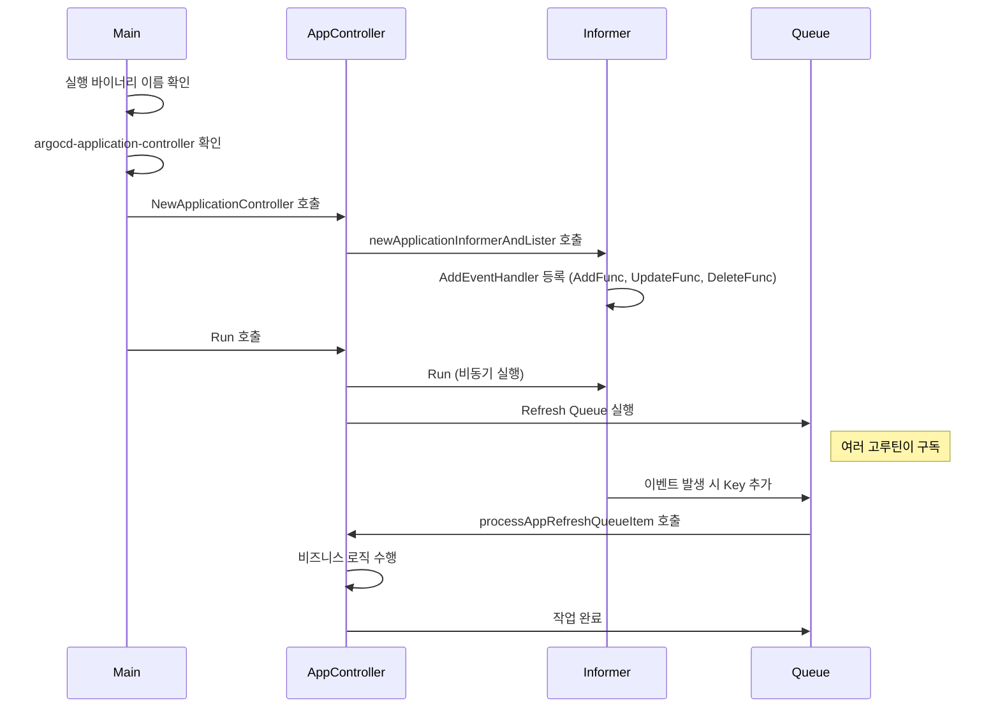

app이 api server로부터 생성되는 것을 확인했습니다. 이번에는  app 생성이 argocd에서 어떻게 감지되는지 찾아보겠습니다. 이번에는 application controller 코드를 다룹니다.

---

# application controller의 시작점

이번도 마찬가지로 같은 main에서 출발합니다.

```go
// https://github.com/argoproj/argo-cd/blob/079754c63913522803f7dbe4bded6b6de37f7e34/cmd/main.go#L27
func main() {
	var command *cobra.Command // ✅ cobra command 생성

	// ✅ 실행하는 바이너리 이름 가져오기
	binaryName := filepath.Base(os.Args[0])
	if val := os.Getenv(binaryNameEnv); val != "" {
		binaryName = val
	}

	// ✅ 바이너리 이름에 따라 실행할 대상 매칭
	isCLI := false
	switch binaryName {
	// ...
	// ✅ application controller인 경우 case 매칭
	case "argocd-application-controller":
		command = appcontroller.NewCommand()
	// ...
}
```

지금까지 그랬던 것처럼 Run메서드를 확인해보겠습니다. 

```go
// https://github.com/argoproj/argo-cd/blob/079754c63913522803f7dbe4bded6b6de37f7e34/cmd/argocd-application-controller/commands/argocd_application_controller.go#L95
		RunE: func(c *cobra.Command, args []string) error {
			
			// log 포멧 등 설정 초기화 ...
			// ...

			// ✅ appController 생성
			appController, err = controller.NewApplicationController(
				// ...
			)
			
			// ...

			// ✅ appController 실행
			go appController.Run(ctx, statusProcessors, operationProcessors)

			// ...
		},
```

핵심은 api server와 비슷합니다. 설정 초기화 → 실행 → 종료 대기 순서를따르고 있습니다.

여기서 생성자인 `controller.NewApplicationController` 함수를 살펴보겠습니다.

```go
// https://github.com/argoproj/argo-cd/blob/079754c63913522803f7dbe4bded6b6de37f7e34/controller/appcontroller.go#L152
func NewApplicationController(

	// 설정 ...
	
) (*ApplicationController, error) {

	// ...

	ctrl := ApplicationController{
		// ...
	}
	
	// ...
	
	// ✅ 주요 지점!
	appInformer, appLister := ctrl.newApplicationInformerAndLister()
	
	// ...
	
}
```

이 함수는 *ApplicationController 필드를 초기화하고 필요한 데이터를 세팅하는 부분입니다. 이때 주요 지점으로 `appInformer, appLister := ctrl.newApplicationInformerAndLister()` 가 있습니다.

k8s operator를 분석할 때 가장 주요한 지점 중 하나는 위와 같은 ~~~informer를 확인하는 것입니다. informer는 **k8s 객체의 변화를 감지하여 런타임에 알려주는 역할을 수행**합니다. 따라서 appInformer라는 대상은 argocd application 객체에 대한 변화를 런타임에 알려줄 것이라고 추측할 수 있습니다.

이번에는 appInformer를 생성하는 코드 내부를 확인해봅시다. `appInformer, appLister := ctrl.newApplicationInformerAndLister()` 이 코드 내부에 app이 변화했을 때 호출되는 함수가 존재합니다.

```go
// https://github.com/argoproj/argo-cd/blob/079754c63913522803f7dbe4bded6b6de37f7e34/controller/appcontroller.go#L2188C1-L2188C129
func (ctrl *ApplicationController) newApplicationInformerAndLister() (cache.SharedIndexInformer, applisters.ApplicationLister) {
	
	// ...
	
	// informer 생성
	informer := cache.NewSharedIndexInformer( ... )
	
	// ...
	
	// informer callback함수 업데이트
	_, err := informer.AddEventHandler(
		cache.ResourceEventHandlerFuncs{
			AddFunc: func(obj interface{}) {
			
				// ...
				
			UpdateFunc: func(old, new interface{}) {
			
				// ...
				
			DeleteFunc: func(obj interface{}) {
			
				// ...
				
			},
		},
	)
}
```

`newApplicationInformerAndLister()` 내부에서 informer가 생성되고 informer의 AddEventHandler를 이용하여 event 발생 시 호출되는 callback을 주입받습니다. 이때 AddFunc, UpdateFunc, DeleteFunc이 추가되는데, 각각 관찰하려는 대상 객체에 대한 이벤트 생성, 수정, 삭제에 대한 callback을 의미합니다.

각 callback 코드를 살펴보겠습니다.

```go
// https://github.com/argoproj/argo-cd/blob/079754c63913522803f7dbe4bded6b6de37f7e34/controller/appcontroller.go#L2274
	AddFunc: func(obj interface{}) {
	
		// ...
		
		// ✅ obj에 대한 key 조회
		key, err := cache.MetaNamespaceKeyFunc(obj)
		if err == nil {
			// ✅ 에러가 없는 경우만 appRefreshQueue에 삽입
			// 채널에 key 추가
			ctrl.appRefreshQueue.AddRateLimited(key)
		}
		
		// ...
	
	},
	UpdateFunc: func(old, new interface{}) {
		
		// ...
		
		// ✅ obj에 대한 key 조회
		key, err := cache.MetaNamespaceKeyFunc(new)
		if err != nil {
			return
		}
		
		// ...

		oldApp, oldOK := old.(*appv1.Application)
		newApp, newOK := new.(*appv1.Application)
		
		// ...

		// ✅ appRefreshQueue에 삽입
		ctrl.requestAppRefresh(newApp.QualifiedName(), compareWith, delay)
		
		// ...
	},
	DeleteFunc: func(obj interface{}) {
	
		// ...
	
		key, err := cache.DeletionHandlingMetaNamespaceKeyFunc(obj)
		if err == nil {
			
			// ...
			
			// ✅ delete 또한 appRefreshQueue에 삽입
			ctrl.appRefreshQueue.Add(key)
		}
		
		// ...

	},
```

코드의 흐름은 거의 비슷합니다. CUD에 대한 app 변경 사항이 있을 때마다 appRefreshQueue에 key를 삽입합니다. appRefreshQueue 내부는 golang의 기본적인 channel을 이용하여 pub sub으로 동작합니다.

그럼 appRefreshQueue에 원소를 가져가는 부분은 어디일까요?

이 부분은 처음 확인했던 부분에서 Run을 봐야합니다.

```go
// https://github.com/argoproj/argo-cd/blob/079754c63913522803f7dbe4bded6b6de37f7e34/cmd/argocd-application-controller/commands/argocd_application_controller.go#L95
		RunE: func(c *cobra.Command, args []string) error {
		
			// ...
		
			// ✅ appController 실행
			go appController.Run(ctx, statusProcessors, operationProcessors)

			// ...
		},
```

---

# appController.Run 내부

이번에는 실행하는 부분의 내부를 살펴보겠습니다.

```go
// https://github.com/argoproj/argo-cd/blob/079754c63913522803f7dbe4bded6b6de37f7e34/controller/appcontroller.go#L836
func (ctrl *ApplicationController) Run(ctx context.Context, statusProcessors int, operationProcessors int) {

	// ...

	// ✅ 앞서 callback함수를 등록한 Informer의 실행
	go ctrl.appInformer.Run(ctx.Done())
	go ctrl.projInformer.Run(ctx.Done())

	// ...

	// ✅ refresh queue, operation queue, app comparison type queue, project queue 실행
	for i := 0; i < statusProcessors; i++ {
		go wait.Until(func() {
			for ctrl.processAppRefreshQueueItem() {
			}
		}, time.Second, ctx.Done())
	}

	for i := 0; i < operationProcessors; i++ {
		go wait.Until(func() {
			for ctrl.processAppOperationQueueItem() {
			}
		}, time.Second, ctx.Done())
	}

	go wait.Until(func() {
		for ctrl.processAppComparisonTypeQueueItem() {
		}
	}, time.Second, ctx.Done())

	go wait.Until(func() {
		for ctrl.processProjectQueueItem() {
		}
	}, time.Second, ctx.Done())
	<-ctx.Done()
}
```

Run함수의 구현은 크게 다음과 같이 나눠집니다.

1. informer 실행
2. queue subscribe 함수 실행

먼저 informer를 실행하는 부분은 앞서 appController 생성자에서 확인했던 informer함수를 활성화하는 역할을 수행합니다. Run 메서드를 비동기로 호출하면서 쿠버네티스 이벤트를 감지합니다.

다음으로 queue를 비동기로 실행하여 informer에서 전달되는 이벤트를 구독합니다. queue의 구독 함수에서 동작에 알맞는 행동을 수행합니다.

지금까지 과정을 다이어그램으로 나타내면 다음과 같이 표현할 수 있습니다.



확인한 코드에서 중요한 부분은 여러 고루틴으로 실행하는 `ctrl.processAppRefreshQueueItem()` 과 `ctrl.processAppOperationQueueItem()` 입니다. 다음 아티클에서 비동기로 실행되는 queue 이벤트 구독 함수에서 어떤 일이 일어나는지 확인해보겠습니다.