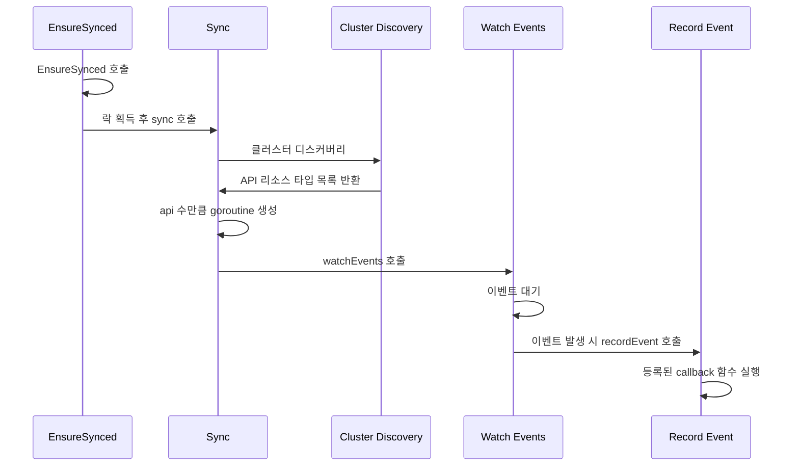

argocd는 다른 클러스터에 배포한 애플리케이션의 상태를 모니터링 할 수 있습니다. 그럼 argocd는 다른 클러스터의 리소스를 어떻게 확인하는 걸까요? argocd 내부에서 어떻게 이 로직이 동작하는지 확인해보겠습니다.

---

# DiscoveryClient

argocd가 다른 클러스터의 리소스를 어떻게 감시하는지 이해하기 위해 먼저 kubernetes/client-go의 DiscoveryClient에 대해 알아보겠습니다.

kubernetes에는 여러 오브젝트가 존재합니다. pod, deployment, service와 같은 기본적인 오브젝트일 수 있고 다른 operator가 관리하는 커스텀 리소스일 수 있습니다. 각 클러스터는 서로 다른 오브젝트 타입을 소유합니다. 따라서 kubernetes 리소스를 감시하려면 가장 먼저 해야 하는 작업은 현재 대상 클러스터가 어떤 오브젝트 타입을 소유하는지 아는 것입니다. 이를 알기 위해 kubernetes/client-go의 DiscoveryClient를 활용합니다.

아래 코드는 DiscoveryClient를 이용하여 대상 클러스터에 존재하는 모든 리소스 타입을 출력하는 예시입니다. kubectl을 사용할 수 있는 로컬 환경이나 pod 내부에서 사용할 수 있습니다.

```go
package main

import (
	"fmt"
	"os"

	"github.com/rs/zerolog/log"
	metav1 "k8s.io/apimachinery/pkg/apis/meta/v1"
	"k8s.io/apimachinery/pkg/runtime/schema"
	"k8s.io/client-go/discovery"
	"k8s.io/client-go/rest"
	"k8s.io/client-go/tools/clientcmd"
)

func main() {
	config, err := getKubeConfig()
	if err != nil {
		log.Fatal().Err(err).Send()
	}

	// ✅ discovery client 생성: api server에서 지원하는 리소스를 검색
	disco, err := discovery.NewDiscoveryClientForConfig(config)
	if err != nil {
		log.Fatal().Err(err).Send()
	}

	// ✅ cluster version 조회
	version, err := disco.ServerVersion()
	if err != nil {
		log.Fatal().Err(err).Send()
	}

	// ✅ server resources 조회
	_, serverResources, err := disco.ServerGroupsAndResources()
	if err != nil {
		log.Fatal().Err(err).Send()
	}

	// ✅ version 출력
	fmt.Printf("%s.%s\n", version.Major, version.Minor)

	// ✅ cluster에 존재하는 모든 리소스 타입 순회
	// ✅ 첫번째 루프는 group version(ex: "argoproj.io/v1alpha1")
	for _, apiResourceList := range serverResources {
		gv, err := schema.ParseGroupVersion(apiResourceList.GroupVersion)
		if err != nil {
			log.Fatal().Err(err).Send()
		}
		// ✅ 두번째 루프는 APIResource(ex: "applications", "applicationsets")
		for _, apiResource := range apiResourceList.APIResources {
			fmt.Printf("group %s \t kind %s \t name %s\n", gv.Group, apiResource.Kind, apiResource.Name)
		}
	}
}

func getKubeConfig() (*rest.Config, error) {
	config, err := rest.InClusterConfig()
	if err == nil {
		return config, nil
	}

	kubeconfig := os.ExpandEnv("$HOME/.kube/config") // 환경 변수 값 대체
	return clientcmd.BuildConfigFromFlags("", kubeconfig)
}

```

실행 예시 결과입니다.

```go
$ go run .
// 1.32
// group security.istio.io 	 kind AuthorizationPolicy 	 name authorizationpolicies
// group security.istio.io 	 kind AuthorizationPolicy 	 name authorizationpolicies/status
// group security.istio.io 	 kind PeerAuthentication 	 name peerauthentications
// group security.istio.io 	 kind PeerAuthentication 	 name peerauthentications/status
// group security.istio.io 	 kind RequestAuthentication 	 name requestauthentications
// group security.istio.io 	 kind RequestAuthentication 	 name requestauthentications/status
// ...
```

kubernetes의 *rest.Config를 가져와서 discovery.NewDiscoveryClientForConfig를 호출하면 DiscoveryClient를 얻습니다. 이 클라이언트를 이용하면 kubernetes의 서버 버전과 클러스터 내부에 존재하는 오브젝트 타입을 찾을 수 있습니다. 위의 예시 구현에서 `version, err := disco.ServerVersion()`을 이용하여 서버 버전을 탐색하고 `_, serverResources, err := disco.ServerGroupsAndResources()`을 이용하여 클러스터 내부의 리소스 타입을 탐색했습니다. argocd 내부의 gitops-engine은 이 DiscoveryClient를 활용하여 다른 클러스터의 오브젝트 타입을 동적으로 탐색합니다.

---

# gitops-engine 내부의 kubectl 구현체

gitops-engine에는 내부에서 kubectl 구현체를 만들어 DiscoveryClient를 추상화하여 동적으로 다른 클러스터의 리소스 타입을 찾는 로직을 구현하고 있습니다. kubectl을 추상화한 코드에서 어떻게 argocd는 DiscoveryClient를 사용하는지 살펴보겠습니다.

먼저 DiscoveryClient는 KubectlCmd라는 구조체에서 활용됩니다. 구조체 정의는 아래에서 확인할 수 있습니다. KubectlCmd는 Kubectl인터페이스를 구현합니다.

```go
// https://github.com/argoproj/gitops-engine/blob/54992bf42431e71f71f11647e82105530e56305e/pkg/utils/kube/ctl.go#L30

type Kubectl interface {
	ManageResources(config *rest.Config, openAPISchema openapi.Resources) (ResourceOperations, func(), error)
	LoadOpenAPISchema(config *rest.Config) (openapi.Resources, *managedfields.GvkParser, error)
	ConvertToVersion(obj *unstructured.Unstructured, group, version string) (*unstructured.Unstructured, error)
	DeleteResource(ctx context.Context, config *rest.Config, gvk schema.GroupVersionKind, name string, namespace string, deleteOptions metav1.DeleteOptions) error
	GetResource(ctx context.Context, config *rest.Config, gvk schema.GroupVersionKind, name string, namespace string) (*unstructured.Unstructured, error)
	CreateResource(ctx context.Context, config *rest.Config, gvk schema.GroupVersionKind, name string, namespace string, obj *unstructured.Unstructured, createOptions metav1.CreateOptions, subresources ...string) (*unstructured.Unstructured, error)
	PatchResource(ctx context.Context, config *rest.Config, gvk schema.GroupVersionKind, name string, namespace string, patchType types.PatchType, patchBytes []byte, subresources ...string) (*unstructured.Unstructured, error)
	GetAPIResources(config *rest.Config, preferred bool, resourceFilter ResourceFilter) ([]APIResourceInfo, error)
	GetServerVersion(config *rest.Config) (string, error)
	NewDynamicClient(config *rest.Config) (dynamic.Interface, error)
	SetOnKubectlRun(onKubectlRun OnKubectlRunFunc)
}

type KubectlCmd struct {
	Log          logr.Logger
	Tracer       tracing.Tracer
	OnKubectlRun OnKubectlRunFunc
}
```

직접 KubectlCmd가 DiscoveryClient를 내부 필드로 소유하진 않지만 여러 메서드에서 DiscoveryClient를 활용하는 것을 확인할 수 있습니다. kubernetes 버전을 가져오는 명령어인 GetServerVersion와 리소스 타입을 가져오는 명령어인 GetAPIResources을 살펴보겠습니다.

## GetServerVersion

```go
// https://github.com/argoproj/gitops-engine/blob/54992bf42431e71f71f11647e82105530e56305e/pkg/utils/kube/ctl.go#L312
func (k *KubectlCmd) GetServerVersion(config *rest.Config) (string, error) {
	// ...
	// ✅ discovery 클라이언트 생성하여 ServerVersion 조회
	client, err := discovery.NewDiscoveryClientForConfig(config)
	// ...
	v, err := client.ServerVersion()
	// ...
	return fmt.Sprintf("%s.%s", v.Major, v.Minor), nil
}
```

## GetAPIResources

```go
// https://github.com/argoproj/gitops-engine/blob/54992bf42431e71f71f11647e82105530e56305e/pkg/utils/kube/ctl.go#L165
func (k *KubectlCmd) GetAPIResources(config *rest.Config, preferred bool, resourceFilter ResourceFilter) ([]APIResourceInfo, error) {
	// ...
	// ✅ filterAPIResources 호출
	apiResIfs, err := k.filterAPIResources(config, preferred, resourceFilter, func(apiResource *metav1.APIResource) bool {
		return isSupportedVerb(apiResource, listVerb) && isSupportedVerb(apiResource, watchVerb)
	})
	// ...
}

// https://github.com/argoproj/gitops-engine/blob/54992bf42431e71f71f11647e82105530e56305e/pkg/utils/kube/ctl.go#L58
func (k *KubectlCmd) filterAPIResources(config *rest.Config, preferred bool, resourceFilter ResourceFilter, filter filterFunc) ([]APIResourceInfo, error) {
	// ✅ DiscoveryClient 생성
	disco, err := discovery.NewDiscoveryClientForConfig(config)

	// ✅ 클러스터에 존재하는 리소스 조회
	var serverResources []*metav1.APIResourceList
	if preferred {
		serverResources, err = disco.ServerPreferredResources()
	} else {
		_, serverResources, err = disco.ServerGroupsAndResources()
	}

	// ✅ cluster에 존재하는 모든 리소스 타입 순회
	// ✅ 첫번째 루프는 group version(ex: "argoproj.io/v1alpha1")
	apiResIfs := make([]APIResourceInfo, 0)
	for _, apiResourcesList := range serverResources {
		// ...
		// ✅ 두번째 루프는 APIResource(ex: "applications", "applicationsets")
		for _, apiResource := range apiResourcesList.APIResources {
				
				// ✅ 제외 대상 리소스인 경우 무시
			if resourceFilter.IsExcludedResource(gv.Group, apiResource.Kind, config.Host) {
				continue
			}

			if filter(&apiResource) {
				resource := ToGroupVersionResource(apiResourcesList.GroupVersion, &apiResource)
				gv, err := schema.ParseGroupVersion(apiResourcesList.GroupVersion)
				if err != nil {
					return nil, err
				}
				
				// ✅ 타입 정보 구성
				
				apiResIf := APIResourceInfo{
					GroupKind:            schema.GroupKind{Group: gv.Group, Kind: apiResource.Kind},
					Meta:                 apiResource,
					GroupVersionResource: resource,
				}
				apiResIfs = append(apiResIfs, apiResIf)
			}
		}
	}
	return apiResIfs, nil
}
```

이렇게 argocd gitops-engine 내부에서 DiscoveryClient를 추상화하여 클러스터 접근에 관한 config를 외부에서 의존성 주입으로 가져와 명령만 수행하는 구조로 kubectl을 추상화하고 있습니다. 따라서 Kubectl 인터페이스는 다른 클러스터의 config만 있으면 해당 클러스터에 대한 리소스 타입 정보를 가져올 수 있게 됩니다. 다음으로 gitops-engine 내부의 Kubectl인터페이스 구현에서 확인한 함수를 이용하여 어떻게 클러스터를 감시하기 위한 초기화를 진행하는지 확인해보겠습니다.

---

# ClusterCache

ClusterCache는 클러스터 상태를 캐싱하는 역할을 수행하는 gitops-engine 내부의 인터페이스입니다. clusterCache는 이 인터페이스를 구현하고 있고 clusterCache 내부에서 클러스터와 관련된 다양한 처리를 수행합니다.

인터페이스 형식은 다음과 같습니다.

```go
// https://github.com/argoproj/gitops-engine/blob/54992bf42431e71f71f11647e82105530e56305e/pkg/cache/cluster.go#L116
type ClusterCache interface {

	// ✅ 클러스터 상태 동기화
	// EnsureSynced checks cache state and synchronizes it if necessary
	EnsureSynced() error

	// ✅ 클러스터 버전 & 타입 & 리소스 조회
	// GetServerVersion returns observed cluster version
	GetServerVersion() string
	// GetAPIResources returns information about observed API resources
	GetAPIResources() []kube.APIResourceInfo
	// GetOpenAPISchema returns open API schema of supported API resources
	GetOpenAPISchema() openapi.Resources
	// GetGVKParser returns a parser able to build a TypedValue used in
	// structured merge diffs.
	GetGVKParser() *managedfields.GvkParser
	// Invalidate cache and executes callback that optionally might update cache settings
	Invalidate(opts ...UpdateSettingsFunc)
	// FindResources returns resources that matches given list of predicates from specified namespace or everywhere if specified namespace is empty
	FindResources(namespace string, predicates ...func(r *Resource) bool) map[kube.ResourceKey]*Resource
	// IterateHierarchy iterates resource tree starting from the specified top level resource and executes callback for each resource in the tree.
	// The action callback returns true if iteration should continue and false otherwise.
	
	// ✅ 리소스에 대한 iterate
	IterateHierarchy(key kube.ResourceKey, action func(resource *Resource, namespaceResources map[kube.ResourceKey]*Resource) bool)
	// IterateHierarchyV2 iterates resource tree starting from the specified top level resources and executes callback for each resource in the tree.
	// The action callback returns true if iteration should continue and false otherwise.
	IterateHierarchyV2(keys []kube.ResourceKey, action func(resource *Resource, namespaceResources map[kube.ResourceKey]*Resource) bool)
	// IsNamespaced answers if specified group/kind is a namespaced resource API or not
	IsNamespaced(gk schema.GroupKind) (bool, error)
	// GetManagedLiveObjs helps finding matching live K8S resources for a given resources list.
	// The function returns all resources from cache for those `isManaged` function returns true and resources
	// specified in targetObjs list.
	GetManagedLiveObjs(targetObjs []*unstructured.Unstructured, isManaged func(r *Resource) bool) (map[kube.ResourceKey]*unstructured.Unstructured, error)
	// GetClusterInfo returns cluster cache statistics
	GetClusterInfo() ClusterInfo
	
	// ✅ 이벤트 등록
	// OnResourceUpdated register event handler that is executed every time when resource get's updated in the cache
	OnResourceUpdated(handler OnResourceUpdatedHandler) Unsubscribe
	// OnEvent register event handler that is executed every time when new K8S event received
	OnEvent(handler OnEventHandler) Unsubscribe
	// OnProcessEventsHandler register event handler that is executed every time when events were processed
	OnProcessEventsHandler(handler OnProcessEventsHandler) Unsubscribe
}
```

해당 인터페이스 기능을 크게 분류하면 

- 클러스터 상태 동기화
- 클러스터 버전 & 타입 & 리소스 조회
- 리소스 이터레이션
- 이벤트 등록

으로 구분할 수 있습니다. 여기서 위에서 확인한 타입 디스커버링과 관련된 기능은 EnsureSynced에서 담당하고 있습니다. 해당 메서드 구현을 살펴보겠습니다.

```go
// https://github.com/argoproj/gitops-engine/blob/54992bf42431e71f71f11647e82105530e56305e/pkg/cache/cluster.go#L995
func (c *clusterCache) EnsureSynced() error {

	// ... 동시성 관련 처리

	err := c.sync()
	
	// ...
	
}

// https://github.com/argoproj/gitops-engine/blob/54992bf42431e71f71f11647e82105530e56305e/pkg/cache/cluster.go#L867
func (c *clusterCache) sync() error {
	
	// ...

	// ✅ 1. 기존 리소스 감시 중단
	for i := range c.apisMeta {
		c.apisMeta[i].watchCancel()
	}
	
	// ... clusterCache 필드 초기화
	
	// ✅ 2. 클러스터 메타데이터 가져오기: 리소스 타입 디스커버리
	version, err := c.kubectl.GetServerVersion(config)
	apis, err := c.kubectl.GetAPIResources(c.config, true, c.settings.ResourcesFilter)
	openAPISchema, gvkParser, err := c.kubectl.LoadOpenAPISchema(config)
	
	// ...
	client, err := c.kubectl.NewDynamicClient(c.config)
	clientset, err := kubernetes.NewForConfig(config)

	// ✅ 3. 리소스 병렬 처리: RunAllAsync func 내부에 있는 로직을 apis 개수로 병렬 실행
	// Each API is processed in parallel, so we need to take out a lock when we update clusterCache fields.
	lock := sync.Mutex{}
	err = kube.RunAllAsync(len(apis), func(i int) error {
		api := apis[i]

		// ...

		// callback함수 실행
		return c.processApi(client, api, func(resClient dynamic.ResourceInterface, ns string) error {
			// 리소스 버전 조회
			resourceVersion, err := c.listResources(ctx, resClient, func(listPager *pager.ListPager) error {

				// ...

			})

			// ✅ 4. 감시 goroutine 실행
			go c.watchEvents(ctx, api, resClient, ns, resourceVersion)

			return nil
		})
	})

	// ...
}
```

EnsureSynced 메서드를 확인하면 동시성 제어를 위해 락을 획득하고 sync메서드를 호출합니다. sync메서드 내부를 확인해보면 다음 작업이 이루어집니다.

1. 기존 리소스의 감시를 중단합니다.
2. 클러스터 메타데이터를 조회합니다. 여기서 이전에 확인한 kubernetes discovery기능을 활용합니다.
3. 리소스에 따라 병렬로 처리합니다.  discovery를 통해 전달받은 api마다 병렬로 실행합니다.
4. 리소스 버전을 조회하고 감시 메서드인 watchEvents를 호출하는 goroutine을 실행합니다.

잠시 watchEvents 내부를 살펴봅시다.

```go
// https://github.com/argoproj/gitops-engine/blob/acb47d5407b6deedbce7d7cec20c4e6fa5e64048/pkg/cache/cluster.go#L653
func (c *clusterCache) watchEvents(ctx context.Context, api kube.APIResourceInfo, resClient dynamic.ResourceInterface, ns string, resourceVersion string) {
	kube.RetryUntilSucceed(ctx, watchResourcesRetryTimeout, fmt.Sprintf("watch %s on %s", api.GroupKind, c.config.Host), c.log, func() (err error) {
		
		// ...

		// ✅ 1. retry watcher 생성: 내부에서 watchEvents가 호출될 때
		// 주입한 resClient에 대한 watch를 시작
		// resClient는 dynamic.ResourceInterface로 kubernetes에 오브젝트에 대한 crud가 가능
		w, err := watchutil.NewRetryWatcher(resourceVersion, &cache.ListWatch{
			WatchFunc: func(options metav1.ListOptions) (watch.Interface, error) {
				res, err := resClient.Watch(ctx, options)
				if apierrors.IsNotFound(err) {
					c.stopWatching(api.GroupKind, ns)
				}
				return res, err
			},
		})
		
		// ...

		for {
			select {
			
			// ...

			// ✅ 2. watcher로부터 이벤트 받기
			case event, ok := <-w.ResultChan():
				if !ok {
					return fmt.Errorf("Watch %s on %s has closed", api.GroupKind, c.config.Host)
				}

				obj, ok := event.Object.(*unstructured.Unstructured)
				if !ok {
					return fmt.Errorf("Failed to convert to *unstructured.Unstructured: %v", event.Object)
				}

				// ✅ 3. recordEvent 호출: 이벤트 기록 함수
				c.recordEvent(event.Type, obj)
				if kube.IsCRD(obj) {
				
					// ...
					// crd의 경우에 대한 처리
				}
			}
		}
	})
}
```

watchEvents는 리소스 api와 일치하는 타입에 대하여 kubernetes/client-go의 감시를 담당하는 watcher를 생성합니다. 이후 루프에서 이벤트가 발생하면 clusterCache의 recordEvent메서드를 호출합니다. 따라서 clusterCache를 통해 감시하는 대상 클러스터의 리소스에 변화가 생기면 이벤트를 watchEvents 루프 내부에서 전달받고 recordEvent를 호출한다는 것을 알 수 있습니다. 

한편 recordEvent의 정의도 살펴보겠습니다 

```go
// https://github.com/argoproj/gitops-engine/blob/54992bf42431e71f71f11647e82105530e56305e/pkg/cache/cluster.go#L1299
func (c *clusterCache) recordEvent(event watch.EventType, un *unstructured.Unstructured) {
	// ✅ 등록된 eventHandlers 호출
	for _, h := range c.getEventHandlers() {
		h(event, un)
	}
	key := kube.GetResourceKey(un)
	if event == watch.Modified && skipAppRequeuing(key) {
		return
	}

	// ✅ batch 처리하거나 processEvent 호출
	if c.batchEventsProcessing {
		c.eventMetaCh <- eventMeta{event, un} // batch 처리에서도 processEvent 호출
	} else {
		c.lock.Lock()
		defer c.lock.Unlock()
		c.processEvent(key, eventMeta{event, un})
	}
}

// https://github.com/argoproj/gitops-engine/blob/54992bf42431e71f71f11647e82105530e56305e/pkg/cache/cluster.go#L1317
// ✅ node 이벤트에 따라 삭제 또는 업데이트 진행
func (c *clusterCache) processEvent(key kube.ResourceKey, evMeta eventMeta) {
	existingNode, exists := c.resources[key]
	
	// ✅ clusterCache에 등록된 ResourceUpdatedHandlers 호출
	if evMeta.event == watch.Deleted {
		if exists {
			c.onNodeRemoved(key)
		}
	} else {
		c.onNodeUpdated(existingNode, c.newResource(evMeta.un))
	}
}

func (c *clusterCache) onNodeUpdated(oldRes *Resource, newRes *Resource) {
	c.setNode(newRes)
	for _, h := range c.getResourceUpdatedHandlers() {
		h(newRes, oldRes, c.nsIndex[newRes.Ref.Namespace])
	}
}

func (c *clusterCache) onNodeRemoved(key kube.ResourceKey) {
	existing, ok := c.resources[key]
	if ok {
		delete(c.resources, key)
		
		// ...
		
		for _, h := range c.getResourceUpdatedHandlers() {
			h(nil, existing, ns)
		}
	}
}
```

recordEvent가 호출되면 clusterCache는 등록된 이벤트 핸들러를 호출합니다. 여기서 핸들러가 두 종류로 보이는데, 하나는 getEventHandlers로 가져오는 핸들러이고 다른 하나는 node 수준에서 발생하는 getResourceUpdatedHandlers입니다.

그럼 ClusterCache의 이벤트 처리 관련 메서드에 대한 정의를 살펴보지 않아도 동작을 예상할 수 있습니다.

```go
type ClusterCache interface {
	// ...
	// ✅ 이벤트 등록
	// OnResourceUpdated register event handler that is executed every time when resource get's updated in the cache
	OnResourceUpdated(handler OnResourceUpdatedHandler) Unsubscribe // onNodeUpdated & onNodeDeleted가 호출됐을 때 실행할 callback 목록
	// OnEvent register event handler that is executed every time when new K8S event received
	OnEvent(handler OnEventHandler) Unsubscribe // recordEvent가 호출됐을 때 실행할 callback 목록
}
```

그럼 ClusterCache의 동작 흐름을 요약해보면 다음과 같습니다.

1. gitops-engine 외부에서 EnsureSynced를 호출하면 락을 획득하고 sync를 호출합니다.
2. sync 내에서 관찰할 cluster를 디스커버리하고 관측할 api 수마다 goroutine을 생성하며 watchEvents를 호출합니다.
3. watchEvents 내부에서 반복문으로 이벤트 감시를 대기하고 이벤트가 발생할 때마다 recordEvent를 호출합니다.
4. recordEvent에서 clusterCache에 등록된 이벤트 callback함수를 실행합니다.

이를 다이어그램으로 표현하면 다음과 같이 나타낼 수 있습니다.



그럼 ClusterCache가 관측할 클러스터의 리소스 타입을 런타임에 감지하고 클러스터의 리소스가 변화했을 때 등록된 callback을 실행한다는 것을 알았습니다. 그럼 다음에는 argocd와 ClusterCache가 어떻게 상호작용하는지 분석해보겠습니다.