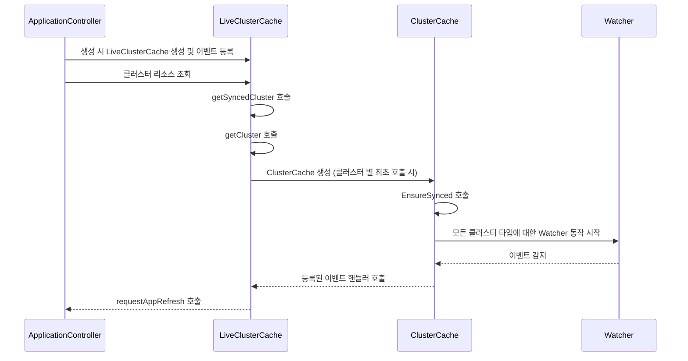

저번에는 gitops-engine 내부에서 어떻게 대상 클러스터에 배포된 애플리케이션 상태를 모니터링하는지 살펴봤습니다. gitops-engine 내부에서 ClusterCache를 이용하여 대상 클러스터의 오브젝트 타입을 디스커버리하고 클러스터 리소스 변화를 감지했을 때 이벤트를 발생시키는 방식으로 동작한다는 것을 이해했습니다. 이번에는 ClusterCache가 argocd와 어떻게 상호작용하는지 알아보겠습니다.

---

# liveStateCache의 클러스터 조회

argocd는 LiveStateCache라는 인터페이스로 클러스터에 대한 정보를 조회하고 있습니다. 이 인터페이스의 실제 구현체는 liveStateCache가 수행하고 있습니다. 인터페이스와 구조체의 필드를 각각 살펴보면 다음과 같습니다.

```go
// https://github.com/argoproj/argo-cd/blob/079754c63913522803f7dbe4bded6b6de37f7e34/controller/cache/cache.go#L119
type LiveStateCache interface {
	// Returns k8s server version
	GetVersionsInfo(serverURL string) (string, []kube.APIResourceInfo, error)
	// Returns true of given group kind is a namespaced resource
	IsNamespaced(server string, gk schema.GroupKind) (bool, error)
	// Returns synced cluster cache
	GetClusterCache(server string) (clustercache.ClusterCache, error)
	// Executes give callback against resource specified by the key and all its children
	IterateHierarchy(server string, key kube.ResourceKey, action func(child appv1.ResourceNode, appName string) bool) error
	// Executes give callback against resources specified by the keys and all its children
	IterateHierarchyV2(server string, keys []kube.ResourceKey, action func(child appv1.ResourceNode, appName string) bool) error
	// Returns state of live nodes which correspond for target nodes of specified application.
	GetManagedLiveObjs(a *appv1.Application, targetObjs []*unstructured.Unstructured) (map[kube.ResourceKey]*unstructured.Unstructured, error)
	// IterateResources iterates all resource stored in cache
	IterateResources(server string, callback func(res *clustercache.Resource, info *ResourceInfo)) error
	// Returns all top level resources (resources without owner references) of a specified namespace
	GetNamespaceTopLevelResources(server string, namespace string) (map[kube.ResourceKey]appv1.ResourceNode, error)
	// Starts watching resources of each controlled cluster.
	Run(ctx context.Context) error
	// Returns information about monitored clusters
	GetClustersInfo() []clustercache.ClusterInfo
	// Init must be executed before cache can be used
	Init() error
}

// https://github.com/argoproj/argo-cd/blob/079754c63913522803f7dbe4bded6b6de37f7e34/controller/cache/cache.go#L208
type liveStateCache struct {
	db                   db.ArgoDB
	appInformer          cache.SharedIndexInformer
	onObjectUpdated      ObjectUpdatedHandler
	kubectl              kube.Kubectl
	settingsMgr          *settings.SettingsManager
	metricsServer        *metrics.MetricsServer
	clusterSharding      sharding.ClusterShardingCache
	resourceTracking     argo.ResourceTracking
	ignoreNormalizerOpts normalizers.IgnoreNormalizerOpts

	clusters      map[string]clustercache.ClusterCache
	cacheSettings cacheSettings
	lock          sync.RWMutex
}
```

여기서 liveStateCache 구조체의 clusters라는 필드에서 이전에 분석한 gitops-engine의 clustercache.ClusterCache를 맵 형태로 가지고 있습니다.

liveStateCache는 `getCluster`라는 메서드가 존재하는데 여기서 ClusterCache를 생성하고 clusters 필드에 저장합니다.

```go
// https://github.com/argoproj/argo-cd/blob/079754c63913522803f7dbe4bded6b6de37f7e34/controller/cache/cache.go#L457
func (c *liveStateCache) getCluster(server string) (clustercache.ClusterCache, error) {

	// ...
	
	clusterCache, ok = c.clusters[server]
	if ok {
		return clusterCache, nil
	}
	
	// cluster config & 옵션 생성
	clusterCacheConfig, err := cluster.RESTConfig()
	
	clusterCacheOpts := []clustercache.UpdateSettingsFunc{ // ...
	}
	
	// ✅ clusterCache 생성
	clusterCache = clustercache.NewClusterCache(clusterCacheConfig, clusterCacheOpts...)
	
	// ✅ 리소스 업데이트 함수 등록
	_ = clusterCache.OnResourceUpdated(func(newRes *clustercache.Resource, oldRes *clustercache.Resource, namespaceResources map[kube.ResourceKey]*clustercache.Resource) { // ...
	}
	
	// ✅ 업데이트 함수 등록
	_ = clusterCache.OnEvent(func(event watch.EventType, un *unstructured.Unstructured) { // ...
	}
	
	// ...
	
	// ✅ 클러스터 등록
	c.clusters[server] = clusterCache

	return clusterCache, nil
}
```

메서드의 역할을 살펴보면 server 이름이 들어오면 clusters에서 조회합니다. 조회되면 early return하고 조회되지 않으면 클러스터를 생성하고 gitops-engine의 ClusterCache에 이벤트를 등록합니다. 

`getCluster`메서드는 private이기 때문에 어느 상위 함수로부터 호출됩니다. 이 함수는 `getSyncedCluster`라는 메서드로 한 번 더 감싸지게 됩니다. 이 함수를 살펴보면 다음과 같습니다.

```go
// https://github.com/argoproj/argo-cd/blob/079754c63913522803f7dbe4bded6b6de37f7e34/controller/cache/cache.go#L613
func (c *liveStateCache) getSyncedCluster(server string) (clustercache.ClusterCache, error) {
	clusterCache, err := c.getCluster(server)
	if err != nil {
		return nil, fmt.Errorf("error getting cluster: %w", err)
	}
	err = clusterCache.EnsureSynced()
	if err != nil {
		return nil, fmt.Errorf("error synchronizing cache state : %w", err)
	}
	return clusterCache, nil
}
```

`getSyncedCluster`는 ClusterCache를 가져와서 `EnsureSynced`를 호출합니다. 그러면 이 함수가 호출되는 시점에 argocd는 다른 클러스터에 대한 현재 상태를 확인할 수 있습니다. 이 메서드는 liveStateCache의 다른 여러 public 메서드에서 호출됩니다. 아래 함수는 내부에서 위의 `getSyncedCluster`를 호출하는 함수입니다.

```go
func (c *liveStateCache) IsNamespaced(server string, gk schema.GroupKind) (bool, error)
func (c *liveStateCache) IterateHierarchy(server string, key kube.ResourceKey, action func(child appv1.ResourceNode, appName string) bool) error
func (c *liveStateCache) IterateHierarchyV2(server string, keys []kube.ResourceKey, action func(child appv1.ResourceNode, appName string) bool) error
func (c *liveStateCache) IterateResources(server string, callback func(res *clustercache.Resource, info *ResourceInfo)) error
func (c *liveStateCache) GetNamespaceTopLevelResources(server string, namespace string) (map[kube.ResourceKey]appv1.ResourceNode, error)
func (c *liveStateCache) GetManagedLiveObjs(a *appv1.Application, targetObjs []*unstructured.Unstructured) (map[kube.ResourceKey]*unstructured.Unstructured, error)
func (c *liveStateCache) GetVersionsInfo(serverURL string) (string, []kube.APIResourceInfo, error)
```

예를 들어 `IsNamespaced`는 appStateManager의 `CompareAppState`에서 호출됩니다. 또한 `IterateHierachyV2`, `GetNamespaceTopLevelResources`는 ApplicationController의 `getResourceTree`에서 호출합니다. 이처럼 `getSyncedCluster`는 여러 부분에서 호출되지만 대략적으로 `ApplicationController` 수준에서 리소스를 가져올 때 호출됨을 알 수 있습니다.

---

# liveStateCache의 이벤트 처리

이전 아티클에서 gitops-engine의 ClusterCache는 k8s 오브젝트의 변화가 발생했을 때 Watcher를 통해 변화를 관찰할 수 있다는 것을 확인했습니다. 또한 이 이벤트 변화를 외부에서 등록한 핸들러를 통해 이벤트를 상위 레이어로 전달할 수 있었습니다. 이번에는 liveStateCache에서 어떻게 이 이벤트를 처리하는지 확인해보겠습니다. 이를 확인하기 위해 다시 getCluster 메서드를 살펴보겠습니다.

```go
// https://github.com/argoproj/argo-cd/blob/079754c63913522803f7dbe4bded6b6de37f7e34/controller/cache/cache.go#L457
func (c *liveStateCache) getCluster(server string) (clustercache.ClusterCache, error) {

	// ...
	
		_ = clusterCache.OnResourceUpdated(func(newRes *clustercache.Resource, oldRes *clustercache.Resource, namespaceResources map[kube.ResourceKey]*clustercache.Resource) {
		toNotify := make(map[string]bool)
		var ref v1.ObjectReference // 변경된 리소스 정보 저장
		if newRes != nil {
			ref = newRes.Ref
		} else {
			ref = oldRes.Ref
		}

		c.lock.RLock()
		cacheSettings := c.cacheSettings
		c.lock.RUnlock()

		// 불필요한 업데이트 무시: 이전 / 이후 리소스가 모두 존재할 때 skipResourceUpdate가 참이면 무시
		if cacheSettings.ignoreResourceUpdatesEnabled && oldRes != nil && newRes != nil && skipResourceUpdate(resInfo(oldRes), resInfo(newRes)) {
			// Additional check for debug level so we don't need to evaluate the
			// format string in case of non-debug scenarios
			if log.GetLevel() >= log.DebugLevel {
				namespace := ref.Namespace
				if ref.Namespace == "" {
					namespace = "(cluster-scoped)"
				}
				log.WithFields(log.Fields{
					"server":      cluster.Server,
					"namespace":   namespace,
					"name":        ref.Name,
					"api-version": ref.APIVersion,
					"kind":        ref.Kind,
				}).Debug("Ignoring change of object because none of the watched resource fields have changed")
			}
			return
		}

		
		for _, r := range []*clustercache.Resource{newRes, oldRes} {
			if r == nil {
				continue
			}
			// ✅ 리소스에 대한 app을 가져옴
			app := getApp(r, namespaceResources)
			if app == "" || skipAppRequeuing(r.ResourceKey()) {
				continue
			}
			// ✅ toNotify에 application 등록: toNotify는 크기가 거의 1
			toNotify[app] = isRootAppNode(r) || toNotify[app]
		}
		// ✅ liveStateCache의 onObjectUpdated 호출
		c.onObjectUpdated(toNotify, ref)
	})
	
	// OnEvent 에는 별로 특별한 이벤트가 발생하지 않음
	_ = clusterCache.OnEvent(func(event watch.EventType, un *unstructured.Unstructured) {
		gvk := un.GroupVersionKind()
		c.metricsServer.IncClusterEventsCount(cluster.Server, gvk.Group, gvk.Kind)
	})

	// ...

}
```

getCluster 내부에서 ClusterCache의 `OnResourceUpdated`와 `OnEvent`를 호출하여 이벤트 등록하는 과정이 존재합니다. `OnEvent`는 간단한 함수이기 때문에 `OnResourceUpdated`만 확인해보겠습니다.

내부 로직은

- 불필요한 리소스는 무시
- 변화한 리소스에 대한 app을 가져옴
- toNotify에 application 등록
- liveStateCache의 `onObjectUpdated` 호출

순서로 호출됩니다. 그럼 살펴봐야 할 것은 liveStateCache의 `onObjectUpdated` 메서드입니다.

그럼 onObjectUpdated는 어디서 오는지 찾아보겠습니다. 이 정보는 `NewLiveStateCache`에서 찾을 수 있습니다.

```go
func NewLiveStateCache(
	db db.ArgoDB,
	appInformer cache.SharedIndexInformer,
	settingsMgr *settings.SettingsManager,
	kubectl kube.Kubectl,
	metricsServer *metrics.MetricsServer,
	onObjectUpdated ObjectUpdatedHandler, // ✅ 이 부분에서 핸들러 등록
	clusterSharding sharding.ClusterShardingCache,
	resourceTracking argo.ResourceTracking,
) LiveStateCache {
	return &liveStateCache{
		appInformer:      appInformer,
		db:               db,
		clusters:         make(map[string]clustercache.ClusterCache),
		onObjectUpdated:  onObjectUpdated, // ✅ 이 부분에서 핸들러 등록
		kubectl:          kubectl,
		settingsMgr:      settingsMgr,
		metricsServer:    metricsServer,
		clusterSharding:  clusterSharding,
		resourceTracking: resourceTracking,
	}
}
```

이제 LiveClusterCache의 생성자가 어디서 호출되는지 찾아야 합니다. 생성자가 호출되는 위치는 ApplicationController가 생성되는 부분에서 확인할 수 있습니다.

```go
// https://github.com/argoproj/argo-cd/blob/079754c63913522803f7dbe4bded6b6de37f7e34/controller/appcontroller.go#L151
// NewApplicationController creates new instance of ApplicationController.
func NewApplicationController(
	// ...
) (*ApplicationController, error) {
	
	// ...
	
	ctrl := ApplicationController{
		// ...
	}
	
	// ...

	// ✅ NewLiveStateCache에 ctrl.handleObjectUpdated를 등록
	stateCache := statecache.NewLiveStateCache(db, appInformer, ctrl.settingsMgr, kubectl, ctrl.metricsServer, ctrl.handleObjectUpdated, clusterSharding, argo.NewResourceTracking())
	
	// ... controller에 stateCache등록
	
	return &ctrl, nil
}
```

이때 주입되는 `handleObjectUpdated`를 확인해보면 다음과 같습니다.

```go

// https://github.com/argoproj/argo-cd/blob/079754c63913522803f7dbe4bded6b6de37f7e34/controller/appcontroller.go#L397
func (ctrl *ApplicationController) handleObjectUpdated(managedByApp map[string]bool, ref v1.ObjectReference) {
	// ✅ managedByApp은 크기가 대부분의 경우에 1
	// 만약 이것보다 크다면 하나의 리소스 업데이트가 두 개의 app에 영향을 준다는 의미
	
	// ...
	
	for appName, isManagedResource := range managedByApp {
		// The appName is given as <namespace>_<name>, but the indexer needs it
		// format <namespace>/<name>
		appKey := ctrl.toAppKey(appName)
		obj, exists, err := ctrl.appInformer.GetIndexer().GetByKey(appKey)
		app, ok := obj.(*appv1.Application) //  ✅ app 가져오기
		if exists && err == nil && ok && isSelfReferencedApp(app, ref) {
			// Don't force refresh app if related resource is application itself. This prevents infinite reconciliation loop.
			continue
		}

		// ...

		// ✅ refreshQueue에 추가하고 후에 refresh 함수 호출
		ctrl.requestAppRefresh(app.QualifiedName(), &level, nil)
	}
}
```

로직을 간단히 살펴보면 변화한 app과 변화한 k8s 오브젝트가 인자로 들어오고 app을 `requestAppRefresh`를 호출하여 app 새로 고침 이벤트를 발행합니다. 그럼 `requestAppRefresh`를 실행하는 큐에서 이벤트를 감지하고 오브젝트를 재갱신합니다.

---

그럼 이제 argocd가 어떻게 다른 클러스터의 이벤트를 감지하는지 알 수 있습니다.

1. ApplicationController가 생성될 때 LiveClusterCache가 생성되고 이벤트가 등록됨
2. ApplicationController에서 클러스터에 대한 리소스 조회가 발생할 때 LiveClusterCache의 `getCluster`를 호출하고 클러스터 별로 최초 호출 시 LiveClusterCache는 gitops-engine의 ClusterCache를 생성
3. 생성된 ClusterCache의 `EnsureSynced`를 호출하면 모든 클러스터 타입에 대한 Watcher가 동작하게 되고 이벤트 감시를 시작
4. 이벤트가 감지되면 등록된 이벤트 핸들러를 호출: 상위 레이어로 이벤트가 전달되면서 ApplicationController의 `requestAppRefresh`가 호출됨

