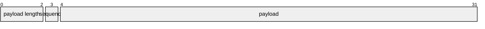

이전 아티클에서 Vitess에 연결된 커넥션은 `Listener`의 `handle` 메서드에서 처리된다는 점을 확인했습니다. 이번에는 이 함수 내부를 따라가면서 MySQL 프로토콜 처리가 어떻게 이어지는지 살펴보겠습니다.

## handle 메서드 내부

`Listener`의 `handle` 함수는 클라이언트 커넥션을 받은 직후 가장 먼저 실행되는 진입점입니다. 이 함수는 MySQL 프로토콜 기준으로 연결 수립, 인증, 초기 세션 설정, 명령 처리 루프 진입까지를 담당하는 per-connection 루틴입니다.

```go
// https://github.com/vitessio/vitess/blob/94fdc736eae8928a8fdde4/go/mysql/server.go#L363
// handle is called in a go routine for each client connection.
// FIXME(alainjobart) handle per-connection logs in a way that makes sense.
func (l *Listener) handle(conn net.Conn, connectionID uint32, acceptTime time.Time) {
	// ✅ 1. 서버 커넥션 생성: 연결 하나의 상태 및 R/W관리
	c := newServerConn(conn, l)
	c.ConnectionID = connectionID
	
	// ...

	// ✅ 2. handler에 connection 생성 이벤트 전달
	// Tell the handler about the connection coming and going.
	l.handler.NewConnection(c)
	defer l.handler.ConnectionClosed(c)

	// Adjust the count of open connections
	defer connCount.Add(-1)

	// ✅ 핸드셰이크 V10 패킷: mysql 프로토콜 첫 패킷
	// 서버 버전 / 랜덤 string / auth plugin 등 정보를 전달
	// First build and send the server handshake packet.
	serverAuthPluginData, err := c.writeHandshakeV10(l.ServerVersion, l.authServer, uint8(l.charset), l.TLSConfig.Load() != nil)
	
	// ...

	// ✅ 클라이언트 응답 수신
	// 사용자 이름 / 인증 방식 / 암호 응답 값 등 정보를 전달
	// Wait for the client response. This has to be a direct read,
	// so we don't buffer the TLS negotiation packets.
	response, err := c.readEphemeralPacketDirect()
	if err != nil {
		// Don't log EOF errors. They cause too much spam, same as main read loop.
		if err != io.EOF {
			log.Infof("Cannot read client handshake response from %s: %v, it may not be a valid MySQL client", c, err)
		}
		return
	}
	user, clientAuthMethod, clientAuthResponse, err := l.parseClientHandshakePacket(c, true, response)
	if err != nil {
		log.Errorf("Cannot parse client handshake response from %s: %v", c, err)
		return
	}

	c.recycleReadPacket()

	// ✅ TLS 관련 처리
	if c.TLSEnabled() {
		// ... 여기서는 세부 흐름만 생략
	}

	// ✅ 인증 방식 협상
	// See what auth method the AuthServer wants to use for that user.
	negotiatedAuthMethod, err := negotiateAuthMethod(c, l.authServer, user, clientAuthMethod)

	// ...

	// ✅ 최종 인증 수행
	userData, err := negotiatedAuthMethod.HandleAuthPluginData(c, user, serverAuthPluginData, clientAuthResponse, conn.RemoteAddr())
	// ...
	
	// 유저 및 유저 데이터 저장
	c.User = user
	c.UserData = userData

	if c.User != "" {
		connCountPerUser.Add(c.User, 1)
		defer connCountPerUser.Add(c.User, -1)
	}

	// ✅ 초기 DB 선택
	// Set initial db name.
	if c.schemaName != "" {
		err = l.handler.ComQuery(c, "use "+sqlescape.EscapeID(c.schemaName), func(result *sqltypes.Result) error {
			return nil
		})
		if err != nil {
			c.writeErrorPacketFromError(err)
			return
		}
	}

	// ✅ handshake 성공
	// Negotiation worked, send OK packet.
	if err := c.writeOKPacket(&PacketOK{statusFlags: c.StatusFlags}); err != nil {
		log.Errorf("Cannot write OK packet to %s: %v", c, err)
		return
	}

	// ...

	// ✅ connection ready 이벤트 전달
	l.handler.ConnectionReady(c)

	// ✅ command 루프 진입
	for {
		kontinue := c.handleNextCommand(l.handler)
		// before going for next command check if the connection should be closed or not.
		if !kontinue || c.IsMarkedForClose() {
			return
		}
	}
}
```

이 흐름을 따라가면 MySQL 연결 수립 단계가 어떻게 진행되는지 한눈에 볼 수 있습니다. 짧게 요약하면 다음과 같습니다.

1. 커넥션 구조체를 생성합니다.
2. Listener의 handler에게 커넥션 생성 이벤트를 전달합니다.
3. MySQL 프로토콜의 첫 패킷인 핸드셰이크 V10 패킷을 보냅니다.
4. 서버 V10 패킷에 대한 클라이언트 응답을 확인합니다.
5. 인증 로직을 수행합니다.
6. 초기 DB를 선택합니다.
7. handshake OK를 보냅니다.
8. `Listener`의 handler에게 `ConnectionReady` 이벤트를 전달합니다.
9. 커맨드 처리 무한루프를 수행합니다.

MySQL 처리 로직에서 더 중요한 부분은 인증 이후의 명령 처리 루프입니다. 이제 커맨드 루프 내부를 보겠습니다. 인증 과정의 세부 로직은 다음 문서에 자세히 설명되어 있습니다.

[MySQL: Connection Phase](https://dev.mysql.com/doc/dev/mysql-server/9.2.0/page_protocol_connection_phase.html)

이 지점에서 `handleNextCommand` 메서드를 확인할 수 있습니다. 내부는 다음과 같습니다.

```go
// https://github.com/vitessio/vitess/blob/94fdc736eae8928a8fdde4/go/mysql/conn.go#L890
// handleNextCommand is called in the server loop to process
// incoming packets.
func (c *Conn) handleNextCommand(handler Handler) bool {
	c.sequence = 0
	data, err := c.readEphemeralPacket() // ✅ 패킷 Read

	// ...

	switch data[0] { // ✅ 맨 앞 데이터 값에 따라 조건 분기
	case ComQuit:
		c.recycleReadPacket()
		return false
	case ComInitDB:
		db := c.parseComInitDB(data)
		c.recycleReadPacket()
		res := c.execQuery("use "+sqlescape.EscapeID(db), handler, false)
		return res != connErr
	case ComQuery:
		return c.handleComQuery(handler, data)
	case ComPing:
		return c.handleComPing()
	case ComSetOption:
		return c.handleComSetOption(data)
	case ComPrepare:
		return c.handleComPrepare(handler, data)
	case ComStmtExecute:
		return c.handleComStmtExecute(handler, data)
	case ComStmtSendLongData:
		return c.handleComStmtSendLongData(data)
	case ComStmtClose:
		stmtID, ok := c.parseComStmtClose(data)
		c.recycleReadPacket()
		if ok {
			delete(c.PrepareData, stmtID)
		}
	case ComStmtReset:
		return c.handleComStmtReset(data)
	case ComResetConnection:
		c.handleComResetConnection(handler)
		return true
	case ComFieldList:
		c.recycleReadPacket()
		if !c.writeErrorAndLog(sqlerror.ERUnknownComError, sqlerror.SSNetError, "command handling not implemented yet: %v", data[0]) {
			return false
		}
	case ComBinlogDump:
		return c.handleComBinlogDump(handler, data)
	case ComBinlogDumpGTID:
		return c.handleComBinlogDumpGTID(handler, data)
	case ComRegisterReplica:
		return c.handleComRegisterReplica(handler, data)
	default:
		log.Errorf("Got unhandled packet (default) from %s, returning error: %v", c, data)
		c.recycleReadPacket()
		if !c.writeErrorAndLog(sqlerror.ERUnknownComError, sqlerror.SSNetError, "command handling not implemented yet: %v", data[0]) {
			return false
		}
	}

	return true
}
```

이 로직은 구조가 단순합니다.

1. 패킷을 읽고
2. 패킷의 첫 자리에 따라 조건을 분기합니다.

이제 패킷을 실제로 어떻게 읽는지 보겠습니다. 여기서는 `readEphemeralPacket` 메서드를 확인하면 됩니다.

메서드의 핵심 구현은 다음과 같습니다.

```go
// https://github.com/vitessio/vitess/blob/94fdc736eae8928a8fdde4/go/mysql/conn.go#L420
func (c *Conn) readEphemeralPacket() ([]byte, error) {
	// ...

	// net.Conn
	r := c.getReader()

	// ✅ 패킷 길이 확인
	length, err := c.readHeaderFrom(r)
	if err != nil {
		return nil, err
	}

	c.currentEphemeralPolicy = ephemeralRead
	if length == 0 {
		// This can be caused by the packet after a packet of
		// exactly size MaxPacketSize.
		return nil, nil
	}

	// ✅ 여기서는 MaxPacketSize보다 작은 패킷만 보겠습니다
	// Use the bufPool.
	if length < MaxPacketSize {
		// ✅ 길이만큼 버퍼세팅하고 읽기 진행
		c.currentEphemeralBuffer = bufPool.Get(length)
		if _, err := io.ReadFull(r, *c.currentEphemeralBuffer); err != nil {
			return nil, vterrors.Wrapf(err, "io.ReadFull(packet body of length %v) failed", length)
		}
		
		// ✅ 읽은 데이터 리턴
		return *c.currentEphemeralBuffer, nil
	}
	
	// ...

	return data, nil
}

// ...

// https://github.com/vitessio/vitess/blob/94fdc736eae8928a8fdde4/go/mysql/conn.go#L382
func (c *Conn) readHeaderFrom(r io.Reader) (int, error) {

	// ...

	// ✅ 패킷 시퀀스 확인
	sequence := uint8(c.header[3])
	if sequence != c.sequence {
		return 0, vterrors.Errorf(vtrpcpb.Code_INTERNAL, "invalid sequence, expected %v got %v", c.sequence, sequence)
	}

	c.sequence++

	// ✅ 패킷 길이 확인
	return int(uint32(c.header[0]) | uint32(c.header[1])<<8 | uint32(c.header[2])<<16), nil
}
```

`readEphemeralPacket`의 역할은 비교적 명확합니다. 먼저 `readHeaderFrom`으로 헤더 4바이트를 읽고, 시퀀스를 검증한 뒤, 앞 3바이트를 payload 길이로 해석합니다. 그 다음 실제 payload를 길이만큼 읽어서 반환합니다. 이 형식은 다음 MySQL 문서의 packet 구조와 같습니다.

[MySQL: MySQL Packets](https://dev.mysql.com/doc/dev/mysql-server/9.2.0/page_protocol_basic_packets.html)

패킷을 보면 첫 4바이트가 헤더입니다.



패킷의 구성은 다음과 같습니다:

- 3바이트: payload 길이
- 1바이트: packet sequence
- 나머지: payload data

그래서 위 코드에서는 패킷 시퀀스를 `sequence := uint8(c.header[3])`로 확인하고, 길이는 `int(uint32(c.header[0]) | uint32(c.header[1])<<8 | uint32(c.header[2])<<16)`로 복원합니다.

이렇게 패킷을 해석한 다음에는 payload의 0번 바이트를 명령 코드로 사용해 분기합니다.

```go
// https://github.com/vitessio/vitess/blob/94fdc736eae8928a8fdde4/go/mysql/conn.go#L908
func (c *Conn) handleNextCommand(handler Handler) bool {
	// ...

	switch data[0] { // ✅ 맨 앞 바이트를 command code로 사용
	case ComQuit:
		c.recycleReadPacket()
		return false
	case ComInitDB:
		db := c.parseComInitDB(data)
		c.recycleReadPacket()
		res := c.execQuery("use "+sqlescape.EscapeID(db), handler, false)
		return res != connErr
	case ComQuery:
		return c.handleComQuery(handler, data)
	case ComPing:
		return c.handleComPing()
	case ComSetOption:
		return c.handleComSetOption(data)
	case ComPrepare:
		return c.handleComPrepare(handler, data)
	case ComStmtExecute:
		return c.handleComStmtExecute(handler, data)
	case ComStmtSendLongData:
		return c.handleComStmtSendLongData(data)
	case ComStmtClose:
		stmtID, ok := c.parseComStmtClose(data)
		c.recycleReadPacket()
		if ok {
			delete(c.PrepareData, stmtID)
		}
	case ComStmtReset:
		return c.handleComStmtReset(data)
	case ComResetConnection:
		c.handleComResetConnection(handler)
		return true
	case ComFieldList:
		c.recycleReadPacket()
		if !c.writeErrorAndLog(sqlerror.ERUnknownComError, sqlerror.SSNetError, "command handling not implemented yet: %v", data[0]) {
			return false
		}
	case ComBinlogDump:
		return c.handleComBinlogDump(handler, data)
	case ComBinlogDumpGTID:
		return c.handleComBinlogDumpGTID(handler, data)
	case ComRegisterReplica:
		return c.handleComRegisterReplica(handler, data)
	default:
		log.Errorf("Got unhandled packet (default) from %s, returning error: %v", c, data)
		c.recycleReadPacket()
		if !c.writeErrorAndLog(sqlerror.ERUnknownComError, sqlerror.SSNetError, "command handling not implemented yet: %v", data[0]) {
			return false
		}
	}

	return true
}
```

이 분기 로직은 다음 문서에서 볼 수 있듯 여러 종류의 명령 단계로 나뉩니다.

[MySQL: Command Phase](https://dev.mysql.com/doc/dev/mysql-server/9.2.0/page_protocol_command_phase.html)

- text protocol
- utility commands
- prepared statement
- stored programs

가장 관심 있게 볼 부분은 text protocol의 `ComQuery`입니다. 이 command byte로 시작하면 텍스트 프로토콜 기반 SQL 쿼리를 전달하고 즉시 실행합니다. 이 로직은 `handleComQuery` 메서드에 있습니다.

```go
// https://github.com/vitessio/vitess/blob/94fdc736eae8928a8fdde4/go/mysql/conn.go#L1317
func (c *Conn) handleComQuery(handler Handler, data []byte) (kontinue bool) {
	// ...
	
	// ✅ 쿼리 파싱: 0번 바이트를 제외한 나머지 payload
	query := c.parseComQuery(data)
	c.recycleReadPacket()

	// ✅ 쿼리가 여러 개로 구분된 경우 처리
	var queries []string
	var err error
	if c.Capabilities&CapabilityClientMultiStatements != 0 {
		queries, err = handler.Env().Parser().SplitStatementToPieces(query)
		if err != nil {
			log.Errorf("Conn %v: Error splitting query: %v", c, err)
			return c.writeErrorPacketFromErrorAndLog(err)
		}
	} else {
		queries = []string{query}
	}

	// ...

	for index, sql := range queries {
		more := false
		if index != len(queries)-1 {
			more = true
		}
		res := c.execQuery(sql, handler, more) // ✅ 쿼리 실행
		if res != execSuccess {
			return res != connErr
		}
	}

	timings.Record(queryTimingKey, queryStart)
	return true
}

// https://github.com/vitessio/vitess/blob/94fdc736eae8928a8fdde4/go/mysql/conn.go#L1361
func (c *Conn) execQuery(query string, handler Handler, more bool) execResult {
	callbackCalled := false
	// sendFinished is set if the response should just be an OK packet.
	sendFinished := false

	// ✅ handler 구현체에 실제 쿼리 실행을 위임
	err := handler.ComQuery(c, query, func(qr *sqltypes.Result) error {
		
		// ...
	
	})
	
	// ...

	return execSuccess
}
```

여기서 `handler.ComQuery`를 호출하는데, 이 인터페이스의 구현체는 `vtgateHandler`입니다. 따라서 `vtgateHandler.ComQuery`부터 호출 스택을 따라 내려가면 됩니다.

```go
// https://github.com/vitessio/vitess/blob/94fdc736eae8928a8fdde4/go/vt/vtgate/plugin_mysql_server.go#L209
func (vh *vtgateHandler) ComQuery(c *mysql.Conn, query string, callback func(*sqltypes.Result) error) error {
	session := vh.session(c)
	// 세션 상태 체크, context 구성, 유저 정보 설정 ...
	// ...

	// OLAP의 경우 스트리밍 방식으로 실행
	if session.Options.Workload == querypb.ExecuteOptions_OLAP {
		session, err := vh.vtg.StreamExecute(ctx, vh, session, query, make(map[string]*querypb.BindVariable), callback)
		if err != nil {
			return sqlerror.NewSQLErrorFromError(err)
		}
		fillInTxStatusFlags(c, session)
		return nil
	}
	
	// ✅ 일반 쿼리 실행
	session, result, err := vh.vtg.Execute(ctx, vh, session, query, make(map[string]*querypb.BindVariable))

	if err := sqlerror.NewSQLErrorFromError(err); err != nil {
		return err
	}
	fillInTxStatusFlags(c, session)
	return callback(result)
}

// 👇 아래 함수 호출

// https://github.com/vitessio/vitess/blob/94fdc736eae8928a8fdde4/go/vt/vtgate/vtgate.go#L463
// Execute executes a non-streaming query.
func (vtg *VTGate) Execute(
	ctx context.Context, 
	mysqlCtx vtgateservice.MySQLConnection, 
	session *vtgatepb.Session, 
	sql string, 
	bindVariables map[string]*querypb.BindVariable,
) (newSession *vtgatepb.Session, qr *sqltypes.Result, err error) {
	
	// ...

	if bvErr := sqltypes.ValidateBindVariables(bindVariables); bvErr != nil {
		// ...
	} else {
		safeSession := NewSafeSession(session)
		// ✅ 쿼리 실행
		qr, err = vtg.executor.Execute(ctx, mysqlCtx, "Execute", safeSession, sql, bindVariables)
		safeSession.RemoveInternalSavepoint()
	}
	
	// ...
	
	return session, nil, err
}

// https://github.com/vitessio/vitess/blob/94fdc736eae8928a8fdde4/go/vt/vtgate/executor.go#L221
func (e *Executor) Execute(
	ctx context.Context, 
	mysqlCtx vtgateservice.MySQLConnection, 
	method string, 
	safeSession *SafeSession, 
	sql string, 
	bindVars map[string]*querypb.BindVariable,
) (result *sqltypes.Result, err error) {
	
	// ...
	
	// ✅ 쿼리 실행
	stmtType, result, err := e.execute(ctx, mysqlCtx, safeSession, sql, bindVars, logStats)
	
	// ...
}

// https://github.com/vitessio/vitess/blob/94fdc736eae8928a8fdde4/go/vt/vtgate/executor.go#L428
func (e *Executor) execute(
	ctx context.Context, 
	mysqlCtx vtgateservice.MySQLConnection, 
	safeSession *SafeSession, 
	sql string, 
	bindVars map[string]*querypb.BindVariable, 
	logStats *logstats.LogStats,
) (sqlparser.StatementType, *sqltypes.Result, error) {
	var err error
	var qr *sqltypes.Result
	var stmtType sqlparser.StatementType
	
	// ✅ 쿼리 파싱, 분석, 계획, 실행
	err = e.newExecute(ctx, mysqlCtx, safeSession, sql, bindVars, logStats, func(ctx context.Context, plan *engine.Plan, vc *vcursorImpl, bindVars map[string]*querypb.BindVariable, time time.Time) error {
		stmtType = plan.Type
		qr, err = e.executePlan(ctx, safeSession, plan, vc, bindVars, logStats, time)
		return err
	}, func(typ sqlparser.StatementType, result *sqltypes.Result) error {
		stmtType = typ
		qr = result
		return nil
	})

	return stmtType, qr, err
}

```

`ComQuery`부터 호출 스택을 따라 내려가면 최종적으로 `Executor.execute` 내부에서 `newExecute`를 호출하는 지점을 확인할 수 있습니다. 이 함수에서 쿼리 파싱, 검증, 계획 수립, 실행이 이어집니다. 분량이 길기 때문에 `newExecute` 내부는 다음 Vitess 아티클에서 이어서 보겠습니다.