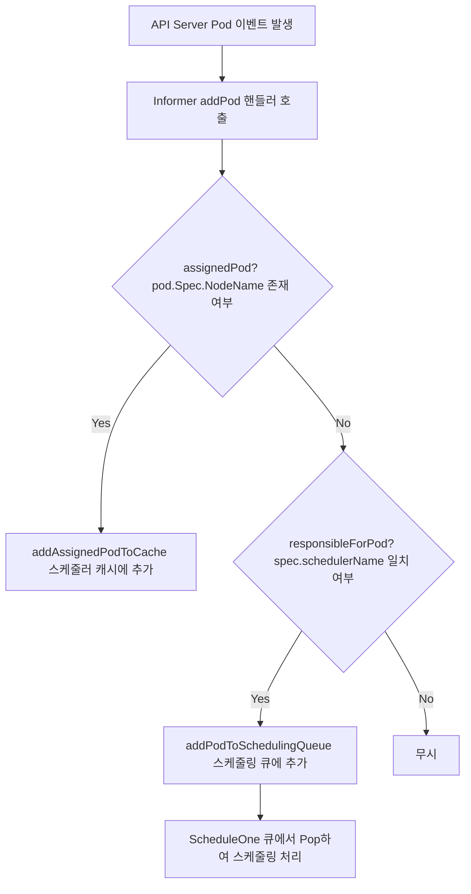
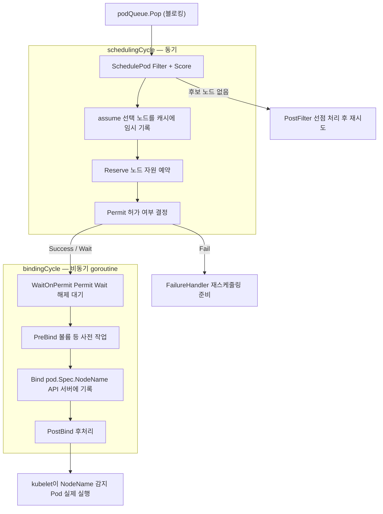
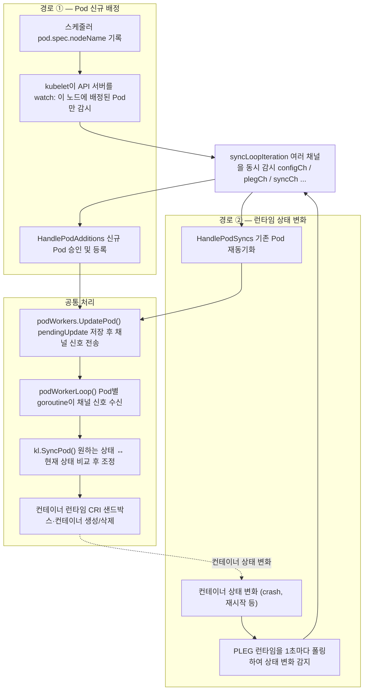

kubernetes에서 가장 기본적인 동작은 Pod를 처리하는 것입니다. 사용자가 Pod를 생성할 때 kubernetes는 다음 동작으로 Pod를 생성합니다.

1. api-server 사용자 요청 확인
2. etcd에 deployments/replicaset/pod 기록
3. api-server watch로부터 controller-manager 동작
4. controller-manager에서 pod etcd 기록
5. scheduler가 미할당 Pod를 감지하여 적합한 노드를 선택하고 `pod.Spec.NodeName` 기록
6. kubelet이 자신의 노드에 배정된 Pod를 API 서버 watch로 감지하여 컨테이너 생성

이 문서는 5번과 6번 과정, 즉 scheduler와 kubelet의 내부 동작을 코드 레벨로 따라갑니다.

# scheduler에서 Pod 생성 흐름

## scheduler의 main 진입

먼저 scheduler의 main 부분입니다.

```go
// https://github.com/kubernetes/kubernetes/blob/fdc9d74cbf2/cmd/kube-scheduler/scheduler.go#L29
func main() {
	command := app.NewSchedulerCommand()
	code := cli.Run(command)
	os.Exit(code)
}
```

`NewSchedulerCommand()`로 Cobra CLI를 호출하여 커맨드를 생성합니다. 이때 실행하는 커맨드 명령어는 다음과 같습니다.

```go
// https://github.com/kubernetes/kubernetes/blob/fdc9d74cbf2/cmd/kube-scheduler/app/server.go#L90
func NewSchedulerCommand(registryOptions ...Option) *cobra.Command {
	opts := options.NewOptions()

	cmd := &cobra.Command{
		// ...
		RunE: func(cmd *cobra.Command, args []string) error {
			// ✅ runCommand를 통해 스케줄러를 실행
			return runCommand(cmd, opts, registryOptions...)
		},
		// ...
```

`runCommand` 내에서 Setup을 수행하는 부분을 살펴보겠습니다.

```go
// https://github.com/kubernetes/kubernetes/blob/fdc9d74cbf2/cmd/kube-scheduler/app/server.go#L139
func runCommand(cmd *cobra.Command, opts *options.Options, registryOptions ...Option) error {
	// ...

	// ✅ 설정 완료 및 Scheduler 인스턴스 생성
	cc, sched, err := Setup(ctx, opts, registryOptions...)

	// ...

	// ✅ 스케줄러 실행 (blocking)
	return Run(ctx, cc, sched)
}
```

다음은 `Setup` 함수의 내부입니다. 내부에서 Scheduler의 `New` 함수를 호출하는데, 이 부분에서 Scheduler의 이벤트 핸들러가 등록됩니다.

```go
// https://github.com/kubernetes/kubernetes/blob/fdc9d74cbf2/cmd/kube-scheduler/app/server.go#L416
// Setup creates a completed config and a scheduler based on the command args and options
func Setup(ctx context.Context, // ...
) ( // ...
) {
	// ...

	// ✅ scheduler.New()를 호출하여 Scheduler 인스턴스 생성 및 이벤트 핸들러 등록
	sched, err := scheduler.New(ctx,
		// ...
	)
}
```

`New` 내부에서 Pod의 이벤트 핸들러가 등록되는 것을 확인할 수 있습니다.

코드의 마지막 부분을 보면 Scheduler를 초기화하고 이벤트 핸들러를 등록합니다.

```go
// https://github.com/kubernetes/kubernetes/blob/fdc9d74cbf2/pkg/scheduler/scheduler.go#L282
// New returns a Scheduler
func New(
	// ...
) (*Scheduler, error) {

	// ...

	// ✅ 스케줄링 큐 생성: 미할당 pod가 스케줄되기를 기다리는 우선순위 큐
	podQueue := internalqueue.NewSchedulingQueue(
		// ...
	)

	// ✅ 스케줄러 캐시 생성: 노드와 pod 상태를 인메모리로 캐싱
	schedulerCache := internalcache.New(ctx, durationToExpireAssumedPod, apiDispatcher)

	// ...

	// ✅ Scheduler 인스턴스 초기화
	sched := &Scheduler{
		// ...
	}
	sched.NextPod = podQueue.Pop
	sched.applyDefaultHandlers()

	// ✅ 모든 리소스(Pod, Node 등)에 대한 Informer 이벤트 핸들러 등록
	if err = addAllEventHandlers(sched, informerFactory, dynInformerFactory, resourceClaimCache, resourceSliceTracker, draManager, unionedGVKs(queueingHintsPerProfile)); err != nil {
		return nil, fmt.Errorf("adding event handlers: %w", err)
	}

	return sched, nil
}
```

## pod event 발행

`New` 함수에서 `addAllEventHandlers`를 호출하면서 Pod를 포함한 여러 리소스의 Informer 이벤트 핸들러가 등록됩니다. 세부적으로 어떤 이벤트 핸들러가 등록되는지 확인해보겠습니다.

먼저 `addAllEventHandlers` 내부를 살펴보겠습니다.

```go
// https://github.com/kubernetes/kubernetes/blob/fdc9d74cbf2/pkg/scheduler/eventhandlers.go#L499
func addAllEventHandlers(
	// ...
) error {

	// ...

	// ✅ Pod Informer에 이벤트 핸들러 등록: add/update/delete 각각 처리
	if handlerRegistration, err = informerFactory.Core().V1().Pods().Informer().AddEventHandler(cache.ResourceEventHandlerFuncs{
		AddFunc:    sched.addPod,
		UpdateFunc: sched.updatePod,
		DeleteFunc: sched.deletePod,
	}); err != nil {
		return err
	}
```

이때 3가지 함수로 Pod의 add, update, delete를 정의하고 있습니다. add만 살펴보겠습니다.

```go
// https://github.com/kubernetes/kubernetes/blob/fdc9d74cbf2/pkg/scheduler/eventhandlers.go#L130
func (sched *Scheduler) addPod(obj interface{}) {
	// ...
	pod, ok := obj.(*v1.Pod)

	// ...

	if sched.WorkloadManager != nil {
		// Register pod into workload manager before adding to the cache or scheduling queue.
		sched.WorkloadManager.AddPod(pod)
	}
	if assignedPod(pod) {
		// ✅ pod.Spec.NodeName이 이미 존재하는 경우: 캐시에 추가
		sched.addAssignedPodToCache(pod)
		// ✅ 스케줄러 이름이 같은 경우: spec.schedulerName에 명시된 scheduler가 있는 경우
		// 아직 미할당 pod -> 스케줄링 큐에 추가
	} else if responsibleForPod(pod, sched.Profiles) {
		// ✅ pod를 scheduling queue에 추가
		sched.addPodToSchedulingQueue(pod)
	}
}
```

`addPod`에서 Pod가 어느 경로로 흘러가는지를 정리하면 다음과 같습니다.



여기서 Queue에 이벤트를 추가하는 부분이 있습니다. 이 부분에서 넣은 이벤트를 어디서 처리하는지 확인해 보겠습니다. 이 처리 부분은 scheduler 바이너리의 Run 메서드로부터 호출됩니다.

## pod event 소비

`addPodToSchedulingQueue`로 큐에 쌓인 이벤트는 `sched.Run`에서 소비됩니다. `runCommand`에서 호출하는 `Run` 함수 내부를 먼저 살펴보겠습니다.

```go
// https://github.com/kubernetes/kubernetes/blob/fdc9d74cbf2/cmd/kube-scheduler/app/server.go#L170
func Run(ctx context.Context, cc *schedulerserverconfig.CompletedConfig, sched *scheduler.Scheduler) error {
	// ...

	if cc.LeaderElection != nil {
		cc.LeaderElection.Callbacks = leaderelection.LeaderCallbacks{
			OnStartedLeading: func(ctx context.Context) {
				// ✅ 리더 선출이 활성화된 경우: 리더가 된 순간 sched.Run() 호출
				sched.Run(ctx)
			},
			// ...
		}
		leaderElector.Run(ctx)
		// ...
	}

	// ✅ 리더 선출이 비활성화된 경우: 바로 sched.Run() 호출
	sched.Run(ctx)
	// ...
}
```

이렇게 도달한 `sched.Run`의 내부입니다.

```go
// https://github.com/kubernetes/kubernetes/blob/fdc9d74cbf2/pkg/scheduler/scheduler.go#L538
// Run begins watching and scheduling. It starts scheduling and blocked until the context is done.
func (sched *Scheduler) Run(ctx context.Context) {

	// ...

	// ✅ 스케줄링 큐에서 이벤트를 꺼내서 스케줄링하는 부분: sched.ScheduleOne() 호출
	go wait.UntilWithContext(ctx, sched.ScheduleOne, 0)

	// ...
}
```

`ScheduleOne`은 Pod 한 개를 스케줄링하는 전체 워크플로우를 담당합니다. 크게 두 단계로 나뉩니다.

- schedulingCycle: 어느 노드에 배치할지 결정하는 단계
- bindingCycle: 결정된 노드에 실제로 바인딩하는 단계

```go
// https://github.com/kubernetes/kubernetes/blob/fdc9d74cbf2/pkg/scheduler/schedule_one.go#L65
func (sched *Scheduler) ScheduleOne(ctx context.Context) {
	logger := klog.FromContext(ctx)

	// ✅ 스케줄링 큐에서 다음 Pod를 pop
	podInfo, err := sched.NextPod(logger)
	// ...

	pod := podInfo.Pod
	// ...

	// ✅ pod.Spec.SchedulerName에 해당하는 스케줄러를 가져옴
	fwk, err := sched.frameworkForPod(pod)
	if err != nil {
		// ...
	}

	// ✅ 이미 삭제 중이거나 이미 assumed된 Pod이면 스킵
	if sched.skipPodSchedule(ctx, fwk, pod) {
		sched.SchedulingQueue.Done(pod.UID)
		return
	}

	// ...

	start := time.Now()

	// ✅ CycleState: 플러그인 간 데이터를 공유하기 위한 상태 저장소
	state := framework.NewCycleState()

	// ...

	// ✅ 동기적으로 노드를 선택하는 schedulingCycle(아래 추가 설명)을 실행
	scheduleResult, assumedPodInfo, status := sched.schedulingCycle(schedulingCycleCtx, state, fwk, podInfo, start, podsToActivate)
	if !status.IsSuccess() {
		// ✅ 노드를 찾지 못하거나 플러그인이 실패하면 FailureHandler를 호출
		sched.FailureHandler(schedulingCycleCtx, fwk, assumedPodInfo, status, scheduleResult.nominatingInfo, start)
		return
	}

	// ✅ schedulingCycle에서 노드를 assume했으므로, 바인딩은 비동기로 처리
	go func() {
		// ...

		status := sched.bindingCycle(bindingCycleCtx, state, fwk, scheduleResult, assumedPodInfo, start, podsToActivate)
		// ...
	}()
}
```

`sched.NextPod`는 앞서 `New` 함수에서 `sched.NextPod = podQueue.Pop`으로 설정되어 있으므로, 실제로는 스케줄링 큐의 `Pop`을 호출합니다. 이 함수는 큐에 Pod가 들어올 때까지 블로킹됩니다.

## schedulingCycle: 노드 선택

`schedulingCycle`은 실제로 Pod를 배치할 노드를 찾는 동기 단계입니다. 크게 다음 과정을 거칩니다.

- `SchedulePod`: Filter 및 Score 플러그인을 실행하여 최적의 노드를 선택
- `assume`: 선택된 노드를 캐시에 임시로 기록 (바인딩 전에 다음 스케줄링 사이클이 이 정보를 사용 가능하게 함)
- Reserve 플러그인 실행: 노드의 리소스를 예약
- Permit 플러그인 실행: 최종 허가 여부 결정 (Wait 상태라면 bindingCycle에서 대기)

```go
// https://github.com/kubernetes/kubernetes/blob/fdc9d74cbf2/pkg/scheduler/schedule_one.go#L141
func (sched *Scheduler) schedulingCycle(
	// ...
) (ScheduleResult, *framework.QueuedPodInfo, *fwk.Status) {
	// ...

	// ✅ Filter + Score 플러그인을 실행하여 Pod를 배치할 최적 노드를 탐색
	// 커스텀 스케줄링 처리도 이 단계에서 수행
	// SchedulePod 내부에서는 먼저 Filter 플러그인을 실행하여 후보 노드를 걸러내고, Score 플러그인을 실행하여 최적 노드를 선택
	scheduleResult, err := sched.SchedulePod(ctx, schedFramework, state, pod)
	if err != nil {
		// ✅ 노드를 찾지 못한 경우: PostFilter(선점) 플러그인을 실행하여 다음 사이클을 준비
		// ...
	}

	// ...

	assumedPodInfo := podInfo.DeepCopy()
	assumedPod := assumedPodInfo.Pod

	// ✅ 선택된 노드를 스케줄러 캐시에 임시 기록
	// 실제 바인딩이 완료되기 전까지는 "assumed" 상태로 관리
	// 임시 기록만 하고 실제 API 서버에는 아직 반영하지 않음. bind가 완료되면 API 서버에 기록
	// 이 단계에서 기록하는 이유는, 다음 스케줄링 사이클에서 이 정보를 활용하여 다른 Pod에 대한 노드 중복을 방지
	err = sched.assume(logger, assumedPod, scheduleResult.SuggestedHost)
	if err != nil {
		return ScheduleResult{nominatingInfo: clearNominatedNode}, assumedPodInfo, fwk.AsStatus(err)
	}

	// ✅ Reserve 플러그인: 노드 자원을 예약, 실패 시 Unreserve로 롤백
	if sts := schedFramework.RunReservePluginsReserve(ctx, state, assumedPod, scheduleResult.SuggestedHost); !sts.IsSuccess() {
		schedFramework.RunReservePluginsUnreserve(ctx, state, assumedPod, scheduleResult.SuggestedHost)
		// ...
	}

	// ✅ Permit 플러그인: 최종 허가를 결정, Wait를 반환하면 bindingCycle에서 대기
	runPermitStatus := schedFramework.RunPermitPlugins(ctx, state, assumedPod, scheduleResult.SuggestedHost)
	if !runPermitStatus.IsWait() && !runPermitStatus.IsSuccess() {
		schedFramework.RunReservePluginsUnreserve(ctx, state, assumedPod, scheduleResult.SuggestedHost)
		// ...
	}

	// ...

	return scheduleResult, assumedPodInfo, nil
}
```

## bindingCycle: 노드 바인딩

`bindingCycle`은 goroutine으로 비동기 실행됩니다. Permit 플러그인이 Wait를 반환한 경우 여기서 실제로 대기하고, 이후 PreBind → Bind → PostBind 순서로 플러그인을 실행합니다.

```go
// https://github.com/kubernetes/kubernetes/blob/fdc9d74cbf2/pkg/scheduler/schedule_one.go#L269
func (sched *Scheduler) bindingCycle(
	// ...
) *fwk.Status {
	// ...

	assumedPod := assumedPodInfo.Pod

	// ✅ Permit 플러그인이 Wait를 반환했던 경우, 여기서 허가가 날 때까지 블로킹
	if status := schedFramework.WaitOnPermit(ctx, assumedPod); !status.IsSuccess() {
		// ...
		return status
	}

	// ✅ Permit 이후 SchedulingQueue에서 Done()을 호출
	sched.SchedulingQueue.Done(assumedPod.UID)

	// ✅ PreBind 플러그인: 바인딩 직전에 필요한 작업을 수행 (예: 볼륨 provisioning)
	if status := schedFramework.RunPreBindPlugins(ctx, state, assumedPod, scheduleResult.SuggestedHost); !status.IsSuccess() {
		return status
	}

	// ✅ Bind 플러그인: 실제로 API 서버에 pod.Spec.NodeName을 기록하여 바인딩
	if status := sched.bind(ctx, schedFramework, assumedPod, scheduleResult.SuggestedHost, state); !status.IsSuccess() {
		return status
	}

	// ...

	// ✅ PostBind 플러그인: 바인딩 이후 후처리 작업을 수행
	schedFramework.RunPostBindPlugins(ctx, state, assumedPod, scheduleResult.SuggestedHost)

	// ...

	return nil
}
```

바인딩이 완료되면 `pod.Spec.NodeName`이 API 서버에 기록되고, kubelet이 이를 감지하여 해당 노드에서 Pod를 실제로 실행하게 됩니다.

한편 `bindingCycle`에서 호출하는 `sched.bind`의 내부를 살펴봅니다.

```go
// https://github.com/kubernetes/kubernetes/blob/fdc9d74cbf2/pkg/scheduler/schedule_one.go#L978
func (sched *Scheduler) bind(ctx context.Context, schedFramework framework.Framework, assumed *v1.Pod, targetNode string, state fwk.CycleState) (status *fwk.Status) {
	logger := klog.FromContext(ctx)
	defer func() {
		// ✅ 바인딩 성공/실패 여부와 관계없이 캐시 상태를 확정하고 이벤트를 기록
		sched.finishBinding(logger, schedFramework, assumed, targetNode, status)
	}()

	// ✅ Extender(아래 추가 설명)가 Binder 역할을 담당하는 경우 Extender에게 바인딩을 위임
	// IsBinder()가 true인 Extender가 없으면 bound=false로 반환되어 아래로 진행
	bound, err := sched.extendersBinding(logger, assumed, targetNode)
	if bound {
		return fwk.AsStatus(err)
	}
	// ✅ Extender가 바인딩하지 않은 경우, 프레임워크의 Bind 플러그인을 실행: 기본 플러그인의 경우 NodeName을 API 서버에 기록
	return schedFramework.RunBindPlugins(ctx, state, assumed, targetNode)
}
```

위에서 Extender는 스케줄러 바이너리를 재빌드하지 않고 외부 HTTP 서버로 스케줄링 로직을 확장합니다. 플러그인과 달리 스케줄러 프로세스 밖에서 동작하며, `KubeSchedulerConfiguration`의 `extenders` 필드에 URL을 등록하는 것만으로 연동할 수 있습니다.

설정 예시는 다음과 같습니다.

```yaml
apiVersion: kubescheduler.config.k8s.io/v1
kind: KubeSchedulerConfiguration
extenders:
  - urlPrefix: "http://my-extender:8080/scheduler"
    filterVerb: "filter"       # Filter 단계를 Extender에 위임
    prioritizeVerb: "prioritize" # Score 단계를 Extender에 위임
    bindVerb: "bind"           # Bind 단계를 Extender에 위임 (설정 시 이 Extender가 직접 API 서버에 바인딩)
    weight: 1
    ignorable: false           # 오류 발생 시 스케줄링 실패로 처리
```

`bindVerb`가 설정된 경우, 해당 Extender는 스케줄러 대신 직접 `pod.Spec.NodeName`을 API 서버에 기록하는 책임을 가집니다. 이 때문에 `sched.bind` 내부에서 `extendersBinding`이 `true`를 반환하면 `RunBindPlugins`는 호출되지 않습니다.

단, HTTP 호출 오버헤드로 인해 성능이 떨어지기 때문에 가능하면 in-process 플러그인 방식을 권장합니다.

참조: [kube-scheduler Configuration (v1) — Extender](https://kubernetes.io/docs/reference/config-api/kube-scheduler-config.v1/#Extender)

`schedulingCycle`과 `bindingCycle`의 전체 플러그인 실행 순서를 정리하면 다음과 같습니다.



## 궁금한 점

### 그럼 custom scheduler, plugin은 어떻게 등록하는지?

애초에 코드 레벨에서 플러그인이 추가된 scheduler를 빌드해야 합니다. 예시 코드는 다음과 같습니다.

```go
// main.go - 스케줄러 바이너리 진입점
func main() {
    // 기본 스케줄러 코드 + 내 플러그인을 함께 등록
    command := app.NewSchedulerCommand(
        app.WithPlugin("MyPlugin", myplugin.New), // ← 여기서 같이 빌드
    )
    command.Execute()
}
```

이후 scheduler config에 다음 설정을 추가하여 플러그인을 활성화할 수 있습니다. 출처 [https://kubernetes.io/docs/reference/scheduling/config/#plugin-configuration](https://kubernetes.io/docs/reference/scheduling/config/#plugin-configuration)

```yaml
apiVersion: kubescheduler.config.k8s.io/v1
kind: KubeSchedulerConfiguration
profiles:
  - schedulerName: default-scheduler       # 기본 스케줄러
  - schedulerName: no-scoring-scheduler    # 커스텀 스케줄러
    plugins:
      preScore:
        disabled:
        - name: '*'
      score:
        disabled:
        - name: '*'
```

배포하는 pod는 `spec.schedulerName`에 스케줄러 이름을 명시하여 특정 스케줄러로 스케줄링할 수 있습니다.

```yaml
apiVersion: v1
kind: Pod
spec:
  schedulerName: no-scoring-scheduler  # ← 이걸로 Profile 선택
  containers:
    - name: app
      image: nginx
```

여기서 plugin은 scheduler 바이너리에 같이 빌드되어야 하며, 스케줄러 config에서 활성화해야 합니다.

# scheduler 이후의 kubelet 동작

## kubelet main에서 NewSourceApiserver까지의 호출 경로

kubelet 바이너리가 기동되면 cobra Command의 `RunE` 핸들러로 등록된 `run()`이 진입점이 됩니다. 이후 `RunKubelet()` → `createAndInitKubelet()` → `NewMainKubelet()` → `makePodSourceConfig()` 순서로 호출이 이어져 최종적으로 `NewSourceApiserver()`가 실행됩니다.

```go
func Run(ctx context.Context, s *options.KubeletServer, kubeDeps *kubelet.Dependencies, featureGate featuregate.FeatureGate) error {
// https://github.com/kubernetes/kubernetes/blob/fdc9d74cbf2/cmd/kubelet/app/server.go#L532
	if err := run(ctx, s, kubeDeps, featureGate); err != nil {
		// ✅ cobra RunE에서 run()으로 진입
		return fmt.Errorf("failed to run Kubelet: %w", err)
	}
	// ...
}
```

```go
func run(
	// ...
) (err error) {
// https://github.com/kubernetes/kubernetes/blob/fdc9d74cbf2/cmd/kubelet/app/server.go#L901
	if err := RunKubelet(ctx, s, kubeDeps); err != nil {
		// ✅ 초기화 완료 후 kubelet 본체 실행
		return err
	}
	// ...
}
```

```go
func RunKubelet(ctx context.Context, kubeServer *options.KubeletServer, kubeDeps *kubelet.Dependencies) error {
// https://github.com/kubernetes/kubernetes/blob/fdc9d74cbf2/cmd/kubelet/app/server.go#L1235
	k, err := createAndInitKubelet(ctx,
		kubeServer,
		kubeDeps,
		hostname,
		nodeName,  // ✅ 이 노드의 이름이 이후 필드셀렉터 필터로 전달됨
		nodeIPs)
	// ...

	podCfg := kubeDeps.PodConfig

	// ✅ kubelet 메인 루프(k.Run)와 HTTP 서버를 goroutine으로 기동
	startKubelet(ctx, k, podCfg, &kubeServer.KubeletConfiguration, kubeDeps, kubeServer.EnableServer)
	// ...
}
```

```go
func createAndInitKubelet(
	// ...
) (k kubelet.Bootstrap, err error) {
// https://github.com/kubernetes/kubernetes/blob/fdc9d74cbf2/cmd/kubelet/app/server.go#L1286
	k, err = kubelet.NewMainKubelet(
		ctx,
		&kubeServer.KubeletConfiguration,
		kubeDeps,
		// ✅ nodeName 등 모든 초기화 파라미터를 전달
		// ...
	)
	// ...
}
```

```go
func NewMainKubelet(
	// ...
) (*Kubelet, error) {
// https://github.com/kubernetes/kubernetes/blob/fdc9d74cbf2/pkg/kubelet/kubelet.go#L491
	if kubeDeps.PodConfig == nil {
		var err error
		// ✅ Pod 소스 설정 생성: API 서버·파일·HTTP 소스 등록
		kubeDeps.PodConfig, err = makePodSourceConfig(kubeCfg, kubeDeps, nodeName, nodeHasSynced)
		if err != nil {
			return nil, err
		}
	}
	// ...
}
```

```go
func makePodSourceConfig(kubeCfg *kubeletconfiginternal.KubeletConfiguration, kubeDeps *Dependencies, nodeName types.NodeName, nodeHasSynced func() bool) (*config.PodConfig, error) {
// https://github.com/kubernetes/kubernetes/blob/fdc9d74cbf2/pkg/kubelet/kubelet.go#L393
	if kubeDeps.KubeClient != nil {
		// ✅ API 서버 watch 소스 등록 — nodeName 필드셀렉터 기반
		config.NewSourceApiserver(logger, kubeDeps.KubeClient, nodeName, nodeHasSynced, cfg.Channel(ctx, kubetypes.ApiserverSource))
	}
	// ...
}
```

각 kubelet은 시작 시 자신의 노드에 배정된 Pod만 필터링하여 watch를 설정합니다.

```go
// https://github.com/kubernetes/kubernetes/blob/fdc9d74cbf2/pkg/kubelet/config/apiserver.go#L37
func NewSourceApiserver(logger klog.Logger, c clientset.Interface, nodeName types.NodeName, nodeHasSynced func() bool, updates chan<- interface{}) {
	// ✅ spec.nodeName == <이 kubelet의 노드 이름> 인 Pod만 list/watch
	lw := cache.NewListWatchFromClient(c.CoreV1().RESTClient(), "pods", metav1.NamespaceAll,
		fields.OneTermEqualSelector("spec.nodeName", string(nodeName)))

	go func() {
        // ✅ kubelet이 API 서버와 동기화될 때까지 대기
		for {
			if nodeHasSynced() {
				break
			}
			time.Sleep(WaitForAPIServerSyncPeriod)
		}
		// ✅ Reflector 시작
		newSourceApiserverFromLW(lw, updates)
	}()
}
```

```go
// https://github.com/kubernetes/kubernetes/blob/fdc9d74cbf2/pkg/kubelet/config/apiserver.go#L58
func newSourceApiserverFromLW(lw cache.ListerWatcher, updates chan<- interface{}) {
	send := func(objs []interface{}) {
		var pods []*v1.Pod
		for _, o := range objs {
			pods = append(pods, o.(*v1.Pod))
		}
		// ✅ watch 이벤트를 PodUpdate{Op: SET}로 변환하여 updates 채널에 전송
		updates <- kubetypes.PodUpdate{Pods: pods, Op: kubetypes.SET, Source: kubetypes.ApiserverSource}
	}
	// ✅ Reflector: API 서버를 지속적으로 watch하여 변경 사항을 UndeltaStore에 반영
	r := cache.NewReflector(lw, &v1.Pod{}, cache.NewUndeltaStore(send, cache.MetaNamespaceKeyFunc), 0)
	go r.Run(wait.NeverStop)
}
```

스케줄러가 `pod.Spec.NodeName`을 기록하는 순간, `spec.nodeName` 필드셀렉터로 watch 중인 해당 노드의 kubelet Reflector가 이 변경을 감지하여 `updates` 채널에 이벤트를 전송합니다.

## 이벤트 수신 및 디스패치

`kubelet.Run()`은 내부 모듈을 초기화하고 각종 goroutine을 기동한 뒤, 마지막에 `syncLoop()`를 블로킹으로 실행합니다. `syncLoop`는 내부에서 `syncLoopIteration()`을 반복 호출하며, `configCh`(= updates 채널)로부터 이벤트를 수신합니다.

```go
// https://github.com/kubernetes/kubernetes/blob/fdc9d74cbf2/pkg/kubelet/kubelet.go#L1774
func (kl *Kubelet) Run(updates <-chan kubetypes.PodUpdate) {
	// ✅ imageManager, serverCertificateManager 등 내부 모듈 초기화
	if err := kl.initializeModules(ctx); err != nil {
		// ...
	}

	// ✅ VolumeManager goroutine 시작
	go kl.volumeManager.Run(ctx, kl.sourcesReady)

	if kl.kubeClient != nil {
		// ✅ 노드 상태를 주기적으로 API 서버에 업데이트하는 goroutine
		go func() {
			kl.updateRuntimeUp()
			wait.JitterUntil(kl.syncNodeStatus, kl.nodeStatusUpdateFrequency, 0.04, true, wait.NeverStop)
		}()
		// ✅ 초기 노드 Ready 시점에 빠른 상태 갱신 수행
		go kl.fastStatusUpdateOnce()
		// ✅ 노드 리스(Lease) 갱신 goroutine
		go kl.nodeLeaseController.Run(context.Background())
		// ...
	}

	// ✅ Pod 상태를 관리하는 statusManager 시작
	kl.statusManager.Start(ctx)

	// ✅ PLEG 시작(아래 추가 설명) — 런타임을 주기적으로 폴링하여 컨테이너 상태 변화를 감지
	kl.pleg.Start()

	// ✅ syncLoop 블로킹 실행 — updates 채널을 비롯한 모든 이벤트 채널을 select로 처리
	kl.syncLoop(ctx, updates, kl)
}
```

kubelet의 `syncLoop`는 내부적으로 `syncLoopIteration`을 무한 루프로 반복 호출하는 kubelet의 메인 이벤트 루프입니다. 루프 진입 시 1초 주기의 `syncTicker`와 housekeeping 주기의 `housekeepingTicker`를 생성하고, PLEG의 이벤트 채널 참조(`plegCh`)를 가져옵니다. 런타임 오류가 발생하면 지수 백오프(100ms → 최대 5s)로 재시도하고, 정상 상태에서는 `syncLoopIteration`을 호출합니다.

```go
// https://github.com/kubernetes/kubernetes/blob/fdc9d74cbf2/pkg/kubelet/kubelet.go#L2509
func (kl *Kubelet) syncLoop(ctx context.Context, updates <-chan kubetypes.PodUpdate, handler SyncHandler) {
	// ...

	// ✅ 1초 주기 ticker — pod worker가 sync 필요 여부를 확인하는 주기
	syncTicker := time.NewTicker(time.Second)
	defer syncTicker.Stop()
	// ✅ housekeeping 주기 ticker — 불필요한 pod/컨테이너 정리 주기
	housekeepingTicker := time.NewTicker(housekeepingPeriod)
	defer housekeepingTicker.Stop()
	// ✅ PLEG의 이벤트 채널 참조 획득 — syncLoopIteration에 전달
	plegCh := kl.pleg.Watch()
	const (
		base   = 100 * time.Millisecond // ✅ 초기 backoff 시간
		max    = 5 * time.Second        // ✅ 최대 backoff 시간
		factor = 2
	)
	duration := base

	// ...

	for {
		if err := kl.runtimeState.runtimeErrors(); err != nil {
			// ✅ 런타임 오류 발생 시 지수 백오프로 재시도
			time.Sleep(duration)
			duration = time.Duration(math.Min(float64(max), factor*float64(duration)))
			continue
		}
		// ✅ 오류 없으면 backoff 리셋
		duration = base

		kl.syncLoopMonitor.Store(kl.clock.Now())
		if !kl.syncLoopIteration(ctx, updates, handler, syncTicker.C, housekeepingTicker.C, plegCh) {
			// ✅ false 반환(configCh 닫힘 등)이면 루프 종료
			break
		}
		kl.syncLoopMonitor.Store(kl.clock.Now())
	}
}
```

`syncLoopIteration`은 Go의 `select`를 사용해 아래 7가지 채널을 동시에 감시하며, 어느 채널에 이벤트가 들어오든 즉시 처리합니다.

```go
// https://github.com/kubernetes/kubernetes/blob/fdc9d74cbf2/pkg/kubelet/kubelet.go#L2574
func (kl *Kubelet) syncLoopIteration(ctx context.Context, configCh <-chan kubetypes.PodUpdate, handler SyncHandler,
	syncCh <-chan time.Time, housekeepingCh <-chan time.Time, plegCh <-chan *pleg.PodLifecycleEvent) bool {
	logger := klog.FromContext(ctx)
	select {
	// ✅ configCh에서 PodUpdate 이벤트 수신
	case u, open := <-configCh:
		// ...
		switch u.Op {
		case kubetypes.ADD:
			// ✅ 새 Pod가 이 노드에 배정되면 ADD 이벤트로 처리
			handler.HandlePodAdditions(u.Pods)
		// ...
		}
	// ...
	}
}
```

```go
// https://github.com/kubernetes/kubernetes/blob/fdc9d74cbf2/pkg/kubelet/kubelet.go#L2713
func (kl *Kubelet) HandlePodAdditions(pods []*v1.Pod) {
	// ...
	for _, pod := range pods {
		// ✅ podManager에 Pod 등록: kubelet의 desired state 소스로 사용
		kl.podManager.AddPod(pod)
		// ...

		// ✅ 승인(Admission) 검사: 리소스 초과 등으로 거절될 수 있음
		if ok, reason, message := kl.allocationManager.AddPod(kl.GetActivePods(), pod); !ok {
			kl.rejectPod(pod, reason, message)
			continue
		}
		// ...

		// ✅ podWorkers에 SyncPodCreate 작업 등록 → 실제 컨테이너 생성 시작
		kl.podWorkers.UpdatePod(UpdatePodOptions{
			Pod:        pod,
			MirrorPod:  mirrorPod,
			UpdateType: kubetypes.SyncPodCreate,
			StartTime:  start,
		})
	}
}
```

## 컨테이너 생성

`HandlePodAdditions`가 호출하는 `podWorkers.UpdatePod()`와 실제 컨테이너를 생성하는 `kubelet.SyncPod()`는 channel을 사이에 두고 비동기로 연결됩니다. 이 흐름은 세 단계로 나뉩니다.

### podSyncer 인터페이스와 Kubelet의 관계

`newPodWorkers()`를 호출할 때 첫 번째 인수로 `klet`(Kubelet 인스턴스 자신)을 전달합니다. `podWorkers`는 이 인수를 `podSyncer` 인터페이스로 보관하므로, 이후 `p.podSyncer.SyncPod()`를 호출하면 곧 `kl.SyncPod()`가 실행됩니다.

```go
func NewMainKubelet(
	// ...
) (*Kubelet, error) {
	// ...
	// https://github.com/kubernetes/kubernetes/blob/fdc9d74cbf2/pkg/kubelet/kubelet.go#L728
	klet.podWorkers = newPodWorkers(
		// ✅ klet 자신이 podSyncer를 구현 — SyncPod 등의 메서드를 직접 제공
		klet,
		kubeDeps.Recorder,
		klet.workQueue,
		// ...
	)
}
```

`podSyncer`는 다음과 같은 인터페이스입니다.

```go
// https://github.com/kubernetes/kubernetes/blob/fdc9d74cbf2/pkg/kubelet/pod_workers.go#L264
type podSyncer interface {
    // ✅ 컨테이너 설정·시작·재시작 담당 — Kubelet.SyncPod가 구현체
    SyncPod(ctx context.Context, updateType kubetypes.SyncPodType, pod *v1.Pod, mirrorPod *v1.Pod, podStatus *kubecontainer.PodStatus) (bool, error)
    SyncTerminatingPod(ctx context.Context, pod *v1.Pod, podStatus *kubecontainer.PodStatus, gracePeriod *int64, podStatusFn func(*v1.PodStatus)) error
    SyncTerminatingRuntimePod(ctx context.Context, runningPod *kubecontainer.Pod) error
    SyncTerminatedPod(ctx context.Context, pod *v1.Pod, podStatus *kubecontainer.PodStatus) error
}
```

따라서 위로부터 podWorkers는 podSyncer라는 인터페이스를 사용하는데, 이 인터페이스는 kubelet 자신이 구현하고 있었다고 요약할 수 있습니다.

한편 `UpdatePod`는 `SyncPod`를 직접 호출하지 않습니다. Pod UID별로 goroutine을 딱 한 번 생성하고, `pendingUpdate`에 작업 내용을 저장한 뒤 channel에 빈 신호만 보냅니다.

```go
// https://github.com/kubernetes/kubernetes/blob/fdc9d74cbf2/pkg/kubelet/pod_workers.go#L755
func (p *podWorkers) UpdatePod(options UpdatePodOptions) {
	// ...

	// ✅ Pod UID별로 처음 한 번만 채널과 goroutine 생성
	podUpdates, exists := p.podUpdates[uid]
	if !exists {
		podUpdates = make(chan struct{}, 1)
		p.podUpdates[uid] = podUpdates

		go func() {
			defer runtime.HandleCrash()
			// ✅ SyncPod는 이 goroutine 루프 안에서 호출됨 — UpdatePod가 아님
			p.podWorkerLoop(uid, outCh)
		}()
	}

	// ✅ SyncPod를 직접 호출하지 않고 처리 내용을 저장 후 신호만 전송
	status.pendingUpdate = &options
	status.working = true
	select {
	case podUpdates <- struct{}{}:
	default:
	}
	// ...
}
```

### podWorkerLoop: channel 수신 후 SyncPod 호출

goroutine이 상시 대기하다가 channel 신호를 받으면 루프를 실행합니다. Pod의 상태(WorkType)에 따라 분기하며, 정상 실행 경로에서 `p.podSyncer.SyncPod()`를 호출합니다.

```go
// https://github.com/kubernetes/kubernetes/blob/fdc9d74cbf2/pkg/kubelet/pod_workers.go#L1237
func (p *podWorkers) podWorkerLoop(podUID types.UID, podUpdates <-chan struct{}) {
	// ...

	// ✅ channel 신호를 수신할 때마다 루프 실행
	for range podUpdates {
    ctx, update, canStart, canEverStart, ok := p.startPodSync(podUID)
    // ...

    switch {
    case update.WorkType == TerminatedPod:
        err = p.podSyncer.SyncTerminatedPod(ctx, update.Options.Pod, status)
    case update.WorkType == TerminatingPod:
        // ...
        err = p.podSyncer.SyncTerminatingPod(ctx, update.Options.Pod, status, gracePeriod, podStatusFn)
    default:
        // ✅ SyncPodCreate, SyncPodUpdate 등 정상 실행 경로 — kl.SyncPod() 호출
        isTerminal, err = p.podSyncer.SyncPod(ctx, update.Options.UpdateType, update.Options.Pod, update.Options.MirrorPod, status)
    }
	// ...
}
```

`kl.SyncPod()`는 Pod의 현재 상태를 확인하고, CRI에 샌드박스와 컨테이너 생성을 위임합니다.

```go
// https://github.com/kubernetes/kubernetes/blob/fdc9d74cbf2/pkg/kubelet/kubelet.go#L1941
func (kl *Kubelet) SyncPod(ctx context.Context, updateType kubetypes.SyncPodType, pod, mirrorPod *v1.Pod, podStatus *kubecontainer.PodStatus) (isTerminal bool, err error) {
	// ...

	// ✅ 컨테이너 런타임(kubeGenericRuntimeManager)의 SyncPod 호출
	// 이 함수에서 실제 샌드박스(pause 컨테이너) 및 앱 컨테이너가 생성됨
	result := kl.containerRuntime.SyncPod(sctx, pod, podStatus, pullSecrets, kl.crashLoopBackOff, restartingAllContainers)
	// ...
}
```

`kubeGenericRuntimeManager.SyncPod()`는 다음 순서로 동작합니다.

```go
// https://github.com/kubernetes/kubernetes/blob/fdc9d74cbf2/pkg/kubelet/kuberuntime/kuberuntime_manager.go#L1394
func (m *kubeGenericRuntimeManager) SyncPod(ctx context.Context, pod *v1.Pod, podStatus *kubecontainer.PodStatus, ...) (result kubecontainer.PodSyncResult) {
	// ✅ 현재 상태와 원하는 상태를 비교하여 필요한 작업 계산
	podContainerChanges := m.computePodActions(ctx, pod, podStatus, restartAllContainers)

	// 아래에서 동작 요약 ...
}
```

SyncPod의 동작은 크게 다음과 같습니다.

1. pod의 현재 상태와 원하는 상태와 비교
2. 수행해야 할 작업을 계산
3. 작업을 순차적으로 실행

해당 작업은 ArgoCD나 terraform과 같은 동기화 도구의 동작과 유사합니다. 원하는 상태와 현재 상태의 차이를 계산하여 필요한 작업을 결정하고, 이를 순차적으로 실행하는 방식입니다.

다음은 동작 요약입니다.

1. pod 변경사항 계산
2. sandbox 변경 시 pod 전체 종료
3. 불필요한 컨테이너 개별 종료
4. sandbox 생성
5. ephemeral 컨테이너 생성
6. init 컨테이너 생성
7. 리소스 in place 업데이트(vertical scaling)
8. 일반 컨테이너 생성

한편, SyncPod를 호출하는 kubeGenericRuntimeManager는 두 가지 주요 gRPC 인터페이스를 필드로 활용하는데, runtimeService와 imageService입니다. runtimeService는 컨테이너 런타임과의 상호작용을 담당하며, imageService는 컨테이너 이미지를 관리하는 역할을 합니다. 해당 인터페이스들은 CRI를 통해 구현되며, kubelet은 이를 통해 다양한 컨테이너 런타임과 호환성을 유지합니다.

## SyncPod에서 sandbox가 변경되는 경우를 어떻게 감지하는지?: PLEG(Pod Lifecycle Event Generator)

위에서는 kube api server에서 pod를 watch하는 경우만 설명했습니다. kubelet이 직접 pod의 변화를 어떻게 감지하는지? (예: 컨테이너가 crash loop에 빠지는 경우)

kubelet은 자체적으로 런타임 상태를 감지하는 메커니즘을 가집니다. 이는 PLEG(Pod Lifecycle Event Generator)라는 컴포넌트를 통해 이루어집니다. PLEG는 런타임에서 발생하는 이벤트(예: 컨테이너 시작, 종료, 실패 등)를 감지하여 kubelet에 전달합니다. kubelet은 이러한 이벤트를 기반으로 pod의 상태를 업데이트하고, 필요한 경우 SyncPod를 호출하여 상태를 조정합니다.

PLEG는 컨테이너 런타임을 주기적으로 폴링하여 Pod 상태 변화를 감지하고, 그 결과를 이벤트 채널을 통해 `syncLoop`에 전달하는 컴포넌트입니다. API 서버 watch와는 독립적으로 동작하므로 컨테이너 crash loop과 같이 런타임 레벨에서 발생하는 변화도 감지할 수 있습니다.

PLEG는 `NewMainKubelet()` 내부에서 초기화됩니다. 이벤트를 전달할 `eventChannel`을 먼저 생성한 뒤 `GenericPLEG` 인스턴스를 만들어 `klet.pleg`에 저장합니다.

```go
func NewMainKubelet(
	// ...
) (*Kubelet, error) {
// https://github.com/kubernetes/kubernetes/blob/fdc9d74cbf2/pkg/kubelet/kubelet.go#L848
	eventChannel := make(chan *pleg.PodLifecycleEvent, plegChannelCapacity)
	// ✅ PLEG 이벤트를 전달할 버퍼 채널 생성 (용량 1000)

	// ...

	klet.pleg = pleg.NewGenericPLEG(logger, klet.containerRuntime, eventChannel,
		genericRelistDuration, klet.podCache, clock.RealClock{})
	// ✅ GenericPLEG 인스턴스 생성 — 아직 goroutine은 시작되지 않음

	// ...
}
```

다음은 PLEG의 시작입니다.

`startKubelet()`에서 `go k.Run(podCfg.Updates())`로 kubelet 메인 루프가 goroutine으로 기동됩니다. `Run()` 내부에서 `kl.pleg.Start()`를 호출함으로써 PLEG가 비로소 동작을 시작합니다.

```go
func (kl *Kubelet) Run(updates <-chan kubetypes.PodUpdate) {
// https://github.com/kubernetes/kubernetes/blob/fdc9d74cbf2/pkg/kubelet/kubelet.go#L1878
	// ...
	kl.pleg.Start()
	// ✅ GenericPLEG goroutine 시작 — 이후 주기적으로 Relist() 호출
	// ...
	kl.syncLoop(ctx, updates, kl)
	// ✅ syncLoop 블로킹 실행 — plegCh 포함 모든 이벤트 채널을 select로 처리
}
```

`pleg.Start()`는 `wait.Until`로 `Relist()`를 주기적으로 호출하는 goroutine을 딱 한 번 생성합니다.

```go
// https://github.com/kubernetes/kubernetes/blob/fdc9d74cbf2/pkg/kubelet/pleg/generic.go#L155
func (g *GenericPLEG) Start() {
	g.runningMu.Lock()
	defer g.runningMu.Unlock()
	if !g.isRunning {
		g.isRunning = true
		g.stopCh = make(chan struct{})
		go wait.Until(g.Relist, g.relistDuration.RelistPeriod, g.stopCh)
		// ✅ RelistPeriod(기본 1초) 간격으로 Relist()를 반복 호출하는 goroutine 시작
	}
}
```

`Relist()`는 컨테이너 런타임에서 현재 실행 중인 Pod 목록을 가져와 이전 상태(`podRecords`)와 비교합니다. 상태 변화가 감지되면 해당 이벤트를 `eventChannel`로 전송합니다.

```go
// https://github.com/kubernetes/kubernetes/blob/fdc9d74cbf2/pkg/kubelet/pleg/generic.go#L234
func (g *GenericPLEG) Relist() {
	// ...
	podList, err := g.runtime.GetPods(ctx, true)
	// ✅ 컨테이너 런타임(CRI)에서 현재 Pod 목록을 가져옴

	// ...
	for pid := range g.podRecords {
		// ✅ 이전 상태(old)와 현재 상태(current)를 비교하여 이벤트 목록 계산
		events = append(events, computeEvents(g.logger, oldPod, pod, &container.ID)...)

		// ...
		for i := range events {
			// ...
			select {
			case g.eventChannel <- events[i]:
			// ✅ ContainerDied, ContainerStarted 등의 이벤트를 채널에 전송
			default:
				metrics.PLEGDiscardEvents.Inc()
			}
		}
	}
	// ...
}
```

`syncLoop()`는 시작 시 `kl.pleg.Watch()`로 `eventChannel`(= `plegCh`)의 참조를 가져와 `syncLoopIteration()`에 전달합니다.

```go
// https://github.com/kubernetes/kubernetes/blob/fdc9d74cbf2/pkg/kubelet/kubelet.go#L2509
func (kl *Kubelet) syncLoop(ctx context.Context, updates <-chan kubetypes.PodUpdate, handler SyncHandler) {
	// ...
	plegCh := kl.pleg.Watch()
	// ✅ PLEG의 eventChannel을 plegCh로 받아 syncLoopIteration에 전달

	for {
		// ...
		kl.syncLoopIteration(ctx, updates, handler, syncTicker.C, housekeepingTicker.C, plegCh)
	}
}
```

`syncLoopIteration()`은 `plegCh`에서 이벤트를 수신하면 `isSyncPodWorthy(e)`로 처리 가치를 판별한 뒤 `handler.HandlePodSyncs()`를 호출합니다.

```go
// https://github.com/kubernetes/kubernetes/blob/fdc9d74cbf2/pkg/kubelet/kubelet.go#L2615
func (kl *Kubelet) syncLoopIteration(..., plegCh <-chan *pleg.PodLifecycleEvent) bool {
	// ...
	select {
	// ...
	case e := <-plegCh:
		// ✅ PLEG 이벤트 수신
		if isSyncPodWorthy(e) {
			if pod, ok := kl.podManager.GetPodByUID(e.ID); ok {
				handler.HandlePodSyncs([]*v1.Pod{pod})
				// ✅ 동기화가 필요한 이벤트(ContainerDied 등)이면 HandlePodSyncs 호출
			}
		}
		// ...
	}
}
```

### HandlePodSyncs: podWorkers에 SyncPodSync 등록

`HandlePodSyncs()`는 `UpdateType: kubetypes.SyncPodSync`로 `podWorkers.UpdatePod()`를 호출합니다. `HandlePodAdditions()`에서 `SyncPodCreate`를 사용하는 것과 달리, PLEG 경로에서는 이미 생성된 Pod의 재동기화이므로 `SyncPodSync`를 사용합니다.

```go
// https://github.com/kubernetes/kubernetes/blob/fdc9d74cbf2/pkg/kubelet/kubelet.go#L3057
func (kl *Kubelet) HandlePodSyncs(pods []*v1.Pod) {
	start := kl.clock.Now()
	for _, pod := range pods {
		// ...
		kl.podWorkers.UpdatePod(UpdatePodOptions{
			Pod:        pod,
			MirrorPod:  mirrorPod,
			UpdateType: kubetypes.SyncPodSync,
			// ✅ API 서버 경로의 SyncPodCreate와 달리 재동기화 타입 사용
			StartTime:  start,
		})
	}
}
```

이후 `podWorkers.UpdatePod()` → `podWorkerLoop()` → `p.podSyncer.SyncPod()`로 이어지는 흐름은 앞서 설명한 `HandlePodAdditions` 경로와 동일합니다.

---

## 전체 흐름 요약

`SyncPod`는 "지금 실행 중인 컨테이너가 원하는 상태와 다를 때 이를 맞추는" 함수입니다. 이 함수에 도달하는 경로는 크게 두 가지입니다. 하나는 스케줄러가 Pod를 이 노드에 배정하는 순간 API 서버 watch를 통해 들어오는 경로이고, 다른 하나는 이미 실행 중인 컨테이너가 crash 등으로 상태가 바뀌었을 때 PLEG가 이를 감지하여 들어오는 경로입니다. 두 경로 모두 `syncLoopIteration`의 `select`를 거쳐 `podWorkers`로 모인 뒤 `SyncPod`를 호출합니다.



---

## 세 줄 요약

1. scheduler는 미할당 Pod를 스케줄링 큐에서 꺼내 Filter·Score 플러그인으로 최적 노드를 선택하고, `pod.Spec.NodeName`을 API 서버에 기록하여 바인딩을 완료합니다.
2. kubelet은 자신의 노드 이름을 필드셀렉터로 API 서버를 watch하다가 NodeName이 기록되는 순간 이를 감지하고, `HandlePodAdditions` → `podWorkers` → `SyncPod` → CRI 순서로 실제 컨테이너를 생성합니다.
3. 이미 실행 중인 컨테이너가 crash 등으로 상태가 변하면 PLEG가 1초 주기로 런타임을 폴링하여 이를 감지하고, 동일한 `SyncPod` 경로로 재동기화하여 원하는 상태를 유지합니다.
