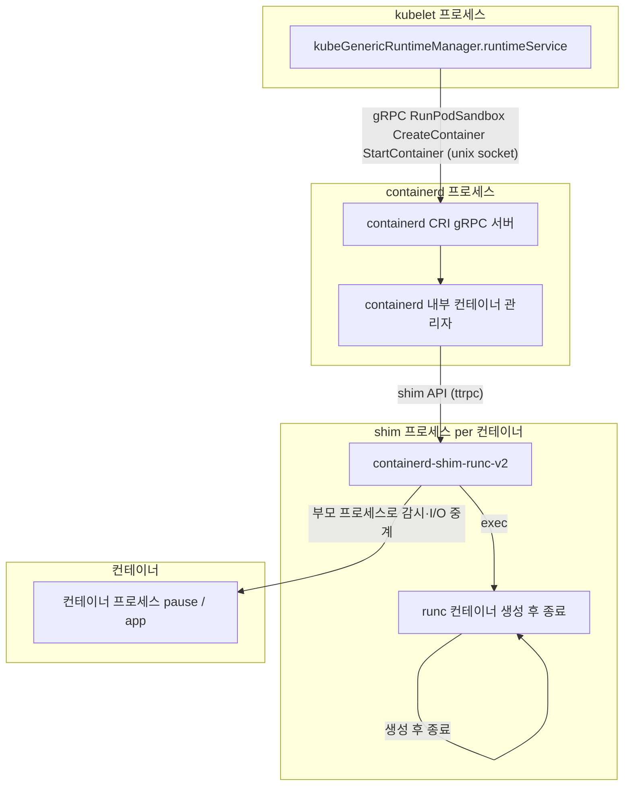

kubelet은 컨테이너 런타임과 직접 결합하지 않고, CRI(Container Runtime Interface)라는 gRPC 기반의 표준 인터페이스를 통해 통신합니다. 이 문서는 `SyncPod`가 런타임을 호출하는 지점에서 출발하여, 그 호출이 어떤 인터페이스로 정의되어 있는지, 그리고 kubelet 기동 시 해당 인터페이스 구현체가 어떻게 초기화되고 연결되는지를 코드 레벨로 따라갑니다.

# kubelet SyncPod에서 CRI가 호출되는 지점

이전 문서에서 살펴본 것처럼, `kl.SyncPod()`는 결국 `kl.containerRuntime.SyncPod()`, 즉 `kubeGenericRuntimeManager.SyncPod()`를 호출합니다. 

`kubeGenericRuntimeManager`는 `m.runtimeService`를 통해 컨테이너 런타임을 호출합니다. `m.runtimeService`는 Unix 소켓을 통해 containerd 같은 외부 런타임 프로세스로 gRPC 요청을 전송하는 클라이언트 인터페이스입니다. 즉, `m.runtimeService`를 통한 모든 호출은 kubelet 프로세스 경계를 넘어 런타임으로 전달됩니다.

`SyncPod` 안에서 CRI가 최초로 호출되는 지점은 `createPodSandbox()`이며, 여기서 `runtimeService.RunPodSandbox()`를 통해 첫 번째 gRPC 요청이 런타임으로 전송됩니다.

```go
// https://github.com/kubernetes/kubernetes/blob/fdc9d74cbf2/pkg/kubelet/kuberuntime/kuberuntime_sandbox.go#L39
func (m *kubeGenericRuntimeManager) createPodSandbox(ctx context.Context, pod *v1.Pod, attempt uint32) (string, string, error) {
    // ✅ Pod 메타데이터·네트워크·로그 경로 등을 담은 PodSandboxConfig 생성
    podSandboxConfig, err := m.generatePodSandboxConfig(ctx, pod, attempt)
    // ...

    // ✅ RuntimeClass에 등록된 runtimeHandler(예: "kata-containers") 조회
    runtimeHandler, err = m.runtimeClassManager.LookupRuntimeHandler(pod.Spec.RuntimeClassName)
    // ...

    // ✅ CRI RunPodSandbox 호출 — SyncPod에서 최초로 gRPC 요청이 런타임으로 전송되는 지점
    podSandBoxID, err := m.runtimeService.RunPodSandbox(ctx, podSandboxConfig, runtimeHandler)
    // ...
    return podSandBoxID, "", nil
}
```

샌드박스가 준비되면 이어서 `startContainer()`를 통해 `CreateContainer()`와 `StartContainer()`가 순서대로 호출됩니다. 이 두 호출도 동일하게 `m.runtimeService`를 통해 런타임으로 전달됩니다.

```go
// https://github.com/kubernetes/kubernetes/blob/fdc9d74cbf2/pkg/kubelet/kuberuntime/kuberuntime_container.go#L200
func (m *kubeGenericRuntimeManager) startContainer(ctx context.Context, podSandboxID string, // ...
) (string, error) {
    // ...
    // ✅ CRI CreateContainer 호출 — 샌드박스 안에 컨테이너 스펙 등록, ID 반환
    containerID, err := m.runtimeService.CreateContainer(ctx, podSandboxID, containerConfig, podSandboxConfig)
    // ...
    // ✅ CRI StartContainer 호출 — 컨테이너 프로세스 실제 실행
    err = m.runtimeService.StartContainer(ctx, containerID)
    // ...
}
```

위 세 호출은 kubelet 프로세스 내부에서 끝나지 않고, Unix 소켓을 통해 containerd 같은 외부 런타임 프로세스로 gRPC 요청을 전송합니다. `SyncPod`가 `m.runtimeService`를 통해 호출하는 메서드는 `RunPodSandbox`, `CreateContainer`, `StartContainer`의 세 가지입니다. 이 메서드들이 어느 인터페이스에 정의되어 있는지 살펴보겠습니다.

# CRI 인터페이스

`m.runtimeService`의 타입은 `internalapi.RuntimeService`이며, 이 인터페이스는 다음 4개의 서브 인터페이스를 합성한 형태입니다.

```go
// https://github.com/kubernetes/kubernetes/blob/fdc9d74cbf2/staging/src/k8s.io/cri-api/pkg/apis/services.go#L113
type RuntimeService interface {
    // ✅ Version(): 런타임 이름·버전 반환
    RuntimeVersioner
    // ✅ CreateContainer, StartContainer, StopContainer 등 컨테이너 생명주기 관리
    ContainerManager
    // ✅ RunPodSandbox, StopPodSandbox 등 샌드박스(pause 컨테이너) 생명주기 관리
    PodSandboxManager
    // ✅ ContainerStats, PodSandboxStats 등 리소스 사용량 통계 수집
    ContainerStatsManager

    // ✅ 런타임 설정 갱신·상태 조회·종료
    UpdateRuntimeConfig(ctx context.Context, runtimeConfig *runtimeapi.RuntimeConfig) error
    Status(ctx context.Context, verbose bool) (*runtimeapi.StatusResponse, error)
    RuntimeConfig(ctx context.Context) (*runtimeapi.RuntimeConfigResponse, error)
    Close() error
}
```

앞서 `SyncPod`에서 호출한 `RunPodSandbox`는 `PodSandboxManager`에, `CreateContainer`와 `StartContainer`는 `ContainerManager`에 각각 정의되어 있습니다.

```go
// https://github.com/kubernetes/kubernetes/blob/fdc9d74cbf2/staging/src/k8s.io/cri-api/pkg/apis/services.go#L67
type PodSandboxManager interface {
    // ✅ SyncPod → createPodSandbox에서 호출 — pause 컨테이너와 네트워크 네임스페이스 생성
    RunPodSandbox(ctx context.Context, config *runtimeapi.PodSandboxConfig, runtimeHandler string) (string, error)
    StopPodSandbox(ctx context.Context, podSandboxID string) error
    RemovePodSandbox(ctx context.Context, podSandboxID string) error
    // ...
}

// https://github.com/kubernetes/kubernetes/blob/fdc9d74cbf2/staging/src/k8s.io/cri-api/pkg/apis/services.go#L32
type ContainerManager interface {
    // ✅ SyncPod → startContainer에서 호출 — 샌드박스 안에 컨테이너 스펙 등록
    CreateContainer(ctx context.Context, podSandboxID string, config *runtimeapi.ContainerConfig, sandboxConfig *runtimeapi.PodSandboxConfig) (string, error)
    // ✅ SyncPod → startContainer에서 호출 — 컨테이너 프로세스 시작
    StartContainer(ctx context.Context, containerID string) error
    StopContainer(ctx context.Context, containerID string, timeout int64) error
    // ...
}
```

런타임(containerd, CRI-O 등)은 이 인터페이스를 구현하기만 하면 kubelet에 교체 가능하게 연결됩니다. kubelet 내부에서 이 인터페이스의 실제 구현체가 어떻게 생성되고 주입되는지는 다음 절에서 살펴봅니다.

# kubelet 내부에서 CRI 초기화

kubelet은 기동 시 `run()` 함수 안에서 `PreInitRuntimeService()`를 호출하여 CRI gRPC 연결을 먼저 수립합니다. `RunKubelet()` 이전에 수행하는 이유는, cgroup 드라이버 설정(`getCgroupDriverFromCRI`) 등 kubelet 초기화에 앞서 런타임 정보가 필요하기 때문입니다.

```go
func run(
    // ...
) (err error) {
// https://github.com/kubernetes/kubernetes/blob/fdc9d74cbf2/cmd/kubelet/app/server.go#L727
    if err := kubelet.PreInitRuntimeService(&s.KubeletConfiguration, kubeDeps); err != nil {
        // ✅ kubelet 초기화 이전에 CRI gRPC 연결 수립
        return err
    }
    // ...
}
```

`PreInitRuntimeService` 내부에서는 `ContainerRuntimeEndpoint`(기본값: `unix:///run/containerd/containerd.sock`)를 사용하여 gRPC 클라이언트를 생성합니다.

```go
// https://github.com/kubernetes/kubernetes/blob/fdc9d74cbf2/pkg/kubelet/kubelet.go#L401
func PreInitRuntimeService(kubeCfg *kubeletconfiginternal.KubeletConfiguration, kubeDeps *Dependencies) error {
    // ✅ ImageServiceEndpoint가 없으면 ContainerRuntimeEndpoint를 이미지 서비스에도 사용
    remoteImageEndpoint := kubeCfg.ImageServiceEndpoint
    if remoteImageEndpoint == "" && kubeCfg.ContainerRuntimeEndpoint != "" {
        remoteImageEndpoint = kubeCfg.ContainerRuntimeEndpoint
    }
    // ✅ 런타임 gRPC 클라이언트 생성 — kubeDeps.RemoteRuntimeService에 저장
    if kubeDeps.RemoteRuntimeService, err = remote.NewRemoteRuntimeService(
        kubeCfg.ContainerRuntimeEndpoint,
        kubeCfg.RuntimeRequestTimeout.Duration,
        // ...
    ); err != nil {
        return err
    }
    // ✅ 이미지 gRPC 클라이언트 생성 — kubeDeps.RemoteImageService에 저장
    if kubeDeps.RemoteImageService, err = remote.NewRemoteImageService(
        remoteImageEndpoint,
        kubeCfg.RuntimeRequestTimeout.Duration,
        // ...
    ); err != nil {
        return err
    }
    // ...
}
```

`NewRemoteRuntimeService`는 `k8s.io/cri-client` 패키지에 구현되어 있습니다. 내부에서 Unix 소켓 주소를 파싱하고 gRPC 연결을 수립한 뒤, CRI v1 API 호환 여부를 검증합니다.

```go
// https://github.com/kubernetes/kubernetes/blob/fdc9d74cbf2/staging/src/k8s.io/cri-client/pkg/remote_runtime.go#L84
func NewRemoteRuntimeService(endpoint string, connectionTimeout time.Duration, tp trace.TracerProvider, logger *klog.Logger) (internalapi.RuntimeService, error) {
    // ✅ "unix:///..." 형태의 주소를 파싱하여 Dialer 생성
    addr, dialer, err := util.GetAddressAndDialer(endpoint)
    // ...

    var dialOpts []grpc.DialOption
    dialOpts = append(dialOpts,
        grpc.WithTransportCredentials(insecure.NewCredentials()), // ✅ 로컬 소켓이므로 TLS 없음
        grpc.WithContextDialer(dialer),
        // ...
    )
    // ✅ gRPC 연결 수립
    conn, err := grpc.DialContext(ctx, addr, dialOpts...)
    // ...

    service := &remoteRuntimeService{
        timeout: connectionTimeout,
        conn:    conn,
        // ...
    }
    // ✅ CRI v1 API 버전 검증 — Version() 호출로 런타임과 핸드셰이크
    if err := service.validateServiceConnection(ctx, conn, endpoint); err != nil {
        return nil, fmt.Errorf("validate service connection: %w", err)
    }
    return service, nil
}
```

## kubeGenericRuntimeManager와 runtimeService

`PreInitRuntimeService()`로 생성된 `RemoteRuntimeService`는 이후 `NewMainKubelet()` → `NewKubeGenericRuntimeManager()`에 전달되어 `kubeGenericRuntimeManager.runtimeService` 필드에 저장됩니다. `kubeGenericRuntimeManager`는 kubelet의 고수준 런타임 관리자로, `kl.containerRuntime`으로 접근할 수 있습니다.

```go
func NewMainKubelet(
    // ...
) (*Kubelet, error) {
// https://github.com/kubernetes/kubernetes/blob/fdc9d74cbf2/pkg/kubelet/kubelet.go#L765
    runtime, postImageGCHooks, err := kuberuntime.NewKubeGenericRuntimeManager(
        ctx,
        // ...
        kubeDeps.RemoteRuntimeService, // ✅ CRI gRPC 클라이언트를 runtimeService로 주입
        kubeDeps.RemoteImageService,   // ✅ 이미지 서비스 클라이언트 주입
        // ...
    )
    // ...
    // ✅ kl.containerRuntime = kubeGenericRuntimeManager — SyncPod 진입점
    klet.containerRuntime = runtime
    // ...
}
```

```go
// https://github.com/kubernetes/kubernetes/blob/fdc9d74cbf2/pkg/kubelet/kuberuntime/kuberuntime_manager.go#L204
func NewKubeGenericRuntimeManager(
    // ...
    runtimeService internalapi.RuntimeService,
    // ...
) (KubeGenericRuntime, []images.PostImageGCHook, error) {
    // ✅ 계측(메트릭/트레이싱)을 위해 runtimeService를 래핑
    runtimeService = newInstrumentedRuntimeService(runtimeService)
    // ...
    kubeRuntimeManager := &kubeGenericRuntimeManager{
        // ✅ runtimeService를 구조체 필드에 저장
        runtimeService: runtimeService,
        // ...
    }
    // ...
}
```

# 쉘에서 CRI(containerd를 예시로) 동작 관찰

이번에는 CRI 구성을 어떻게 kubernetes가 설치된 환경에서 관찰할 수 있는지 살펴보겠습니다. 진행은 kind 클러스터에서 수행하였으며, kubelet이 containerd를 런타임으로 사용하도록 설정되어 있습니다.

```bash
kind create cluster
docker exec -it kind-control-plane /bin/bash
```

```bash
ps aux | grep kubelet
# root         231  1.7  0.3 2639936 96128 ?       Ssl  13:22   0:14 /usr/bin/kubelet --bootstrap-kubeconfig=/etc/kubernetes/bootstrap-kubelet.conf --kubeconfig=/etc/kubernetes/kubelet.conf --config=/var/lib/kubelet/config.yaml --container-runtime-endpoint=unix:///run/containerd/containerd.sock --node-ip=172.18.0.2 --node-labels= --pod-infra-container-image=registry.k8s.io/pause:3.10 --provider-id=kind://docker/kind/kind-control-plane --runtime-cgroups=/system.slice/containerd.service
ps aux | grep containerd
# root         143  0.3  0.2 3418404 61368 ?       Ssl  13:22   0:03 /usr/local/bin/containerd
# root         231  1.7  0.3 2639936 96128 ?       Ssl  13:22   0:14 /usr/bin/kubelet --bootstrap-kubeconfig=/etc/kubernetes/bootstrap-kubelet.conf --kubeconfig=/etc/kubernetes/kubelet.conf --config=/var/lib/kubelet/config.yaml --container-runtime-endpoint=unix:///run/containerd/containerd.sock --node-ip=172.18.0.2 --node-labels= --pod-infra-container-image=registry.k8s.io/pause:3.10 --provider-id=kind://docker/kind/kind-control-plane --runtime-cgroups=/system.slice/containerd.service
# root         379  0.0  0.0 1233548 10364 ?       Sl   13:22   0:00 /usr/local/bin/containerd-shim-runc-v2 -namespace k8s.io -id 77f37876ac93cf690b9cc29945e7e26f13455dde607ac15a297b5ec726c0ac99 -address /run/containerd/containerd.sock
# root         399  0.0  0.0 1233548 10204 ?       Sl   13:22   0:00 /usr/local/bin/containerd-shim-runc-v2 -namespace k8s.io -id cd2dc18a474af8e7d86c4192c6275eaca4602c477b219fd19becb5f358bc9eb2 -address /run/containerd/containerd.sock
# root         440  0.0  0.0 1233548 9856 ?        Sl   13:22   0:00 /usr/local/bin/containerd-shim-runc-v2 -namespace k8s.io -id ce470e1b677927680292728568360231f35c8e3075340eb18ff528e2fada3337 -address /run/containerd/containerd.sock
# root         482  0.0  0.0 1233804 9984 ?        Sl   13:22   0:00 /usr/local/bin/containerd-shim-runc-v2 -namespace k8s.io -id e9f5994b1df4993a96801f4bcb2635cdf6efacf42c4481877e7de6565c8c8a31 -address /run/containerd/containerd.sock
# root         781  0.0  0.0   3328  1536 pts/1    S+   13:36   0:00 grep containerd
```

가장 먼저 프로세스를 살펴봅시다. kubelet 프로세스가 `--container-runtime-endpoint=unix:///run/containerd/containerd.sock` 플래그로 containerd의 Unix 소켓을 가리키고 있음을 확인할 수 있습니다. 또한 containerd 프로세스와 여러 `containerd-shim-runc-v2` 프로세스가 실행 중입니다.

## containerd-shim과 runc

containerd가 컨테이너를 실행할 때는 `containerd-shim-runc-v2`와 `runc`라는 두 개의 별도 프로세스를 사용합니다.

### runc

`runc`는 OCI(Open Container Initiative) 런타임 명세를 구현한 저수준 컨테이너 실행기입니다. 컨테이너 루트 파일시스템과 OCI 스펙 파일(`config.json`)을 받아 Linux 네임스페이스·cgroup·seccomp 등 커널 기능을 직접 호출하여 컨테이너 프로세스를 생성합니다. runc는 컨테이너를 실행한 뒤 즉시 종료되는 일회성 프로세스입니다. `ls`, `cd`처럼 실행 후 결과를 반환하면 곧바로 종료되는 명령과 동일한 성질을 가집니다. 컨테이너 생성 시점에 잠깐 아래와 같은 프로세스가 나타났다가 사라집니다.

```
root  /usr/local/bin/runc --root /run/containerd/runc/k8s.io create \
      --bundle /run/containerd/io.containerd.runtime.v2.task/k8s.io/<container-id> \
      --pid-file /run/.../init.pid \
      --console-socket ... \
      <container-id>
```

### containerd-shim

`containerd-shim-runc-v2`는 containerd와 runc 사이에 위치하는 경량 중간 프로세스입니다. "shim"이라는 이름은 두 구성 요소 사이의 틈을 메우는 끼움쇠에서 유래합니다.

shim은 다음과 같은 역할을 담당합니다.

- 프로세스 분리: containerd가 재시작되더라도 살아있는 컨테이너가 영향받지 않도록, shim이 컨테이너 프로세스의 부모 프로세스로서 독립적으로 동작합니다.
- runc 수명 관리: runc를 exec하여 컨테이너를 생성하고, runc가 종료된 뒤에도 shim이 남아서 컨테이너 프로세스를 감시합니다.
- 표준 I/O 중계: 컨테이너의 stdin/stdout/stderr를 FIFO나 PTY로 연결하여 containerd 측에 전달합니다.
- 종료 코드 수집: 컨테이너가 종료되면 exit 코드를 containerd에 보고합니다.

`ps aux` 출력에서 각 shim 프로세스가 `-id <컨테이너 ID> -address /run/containerd/containerd.sock` 인자를 갖는 것을 확인할 수 있습니다. 즉, 실행 중인 컨테이너 하나당 shim 프로세스 하나가 대응되며, runc는 컨테이너 생성 직후 이미 종료된 상태입니다.

다음 다이어그램은 kubelet에서 실제 컨테이너 프로세스까지의 계층 구조를 나타냅니다.



## 프로세스 트리 확인

kubelet과 containerd, 그리고 shim과 runc이 어떻게 계층적으로 연결되어 있는지 `pstree` 명령어로 확인해봅시다.

```bash
apt update && apt install -y psmisc
pstree -a
# systemd
#   |-containerd
#   |   `-29*[{containerd}]
#   |-containerd-shim -namespace k8s.io -id77f37876ac93cf690b9cc29945e7e26f13455dde607ac15a297b5ec726c
#   |   |-kube-apiserver --advertise-address=172.18.0.2 --allow-privileged=true --authorization-mode=Node,RBAC...
#   |   |   `-17*[{kube-apiserver}]
#   |   |-pause
#   |   `-12*[{containerd-shim}]
#   |-containerd-shim -namespace k8s.io -idcd2dc18a474af8e7d86c4192c6275eaca4602c477b219fd19becb5f358b
#   |   |-etcd --advertise-client-urls=https://172.18.0.2:2379 --cert-file=/etc/kubernetes/pki/etcd/server.crt...
#   |   |   `-17*[{etcd}]
#   |   |-pause
#   |   `-12*[{containerd-shim}]
#   |-containerd-shim -namespace k8s.io -idce470e1b677927680292728568360231f35c8e3075340eb18ff528e2fad
#   |   |-kube-controller --allocate-node-cidrs=true ...
#   |   |   `-14*[{kube-controller}]
#   |   |-pause
#   |   `-12*[{containerd-shim}]
#   |-containerd-shim -namespace k8s.io -ide9f5994b1df4993a96801f4bcb2635cdf6efacf42c4481877e7de6565c8
#   |   |-kube-scheduler --authentication-kubeconfig=/etc/kubernetes/scheduler.conf...
#   |   |   `-16*[{kube-scheduler}]
#   |   |-pause
#   |   `-12*[{containerd-shim}]
#   |-kubelet --bootstrap-kubeconfig=/etc/kubernetes/bootstrap-kubelet.conf--kubeconfig=/etc/kubernetes/kubelet.conf
#   |   `-19*[{kubelet}]
#   `-systemd-journal
```

위의 결과를 분석해보면 systemd의 직접 자식으로 다음이 나열됩니다.

- containerd
- 여러 `containerd-shim-runc-v2` 프로세스 (각각 다른 컨테이너 ID로 실행)
- kubelet
- systemd-journal

systemd의 자식 프로세스로 containerd와 `containerd-shim-runc-v2` 프로세스가 존재하는 것을 확인할 수 있습니다. 이로부터 shim은 containerd가 실행한 뒤 고의로 systemd의 자식 프로세스로 실행된다는 것을 알 수 있습니다. 따라서 containerd가 재시작되더라도 shim과 그 자식인 컨테이너 프로세스는 영향을 받지 않고 계속 실행됩니다.

shim 프로세스 하나가 Pod 하나에 대응합니다. 각 shim 아래를 보면 자식 프로세스가 두 종류입니다.

- pause: 네트워크 네임스페이스를 보유하는 인프라 컨테이너입니다. Pod의 IP 주소는 pause 컨테이너의 네트워크 네임스페이스에 부여됩니다.
- 실제 워크로드 컨테이너: kube-apiserver, etcd, kube-controller, kube-scheduler

따라서 모든 컨테이너는 shim의 자식 프로세스로 실행된다는 것을 확인할 수 있습니다.

## containerd config

containerd는 `/etc/containerd/config.toml`에서 런타임 설정을 읽어옵니다. 해당 설정을 확인해보겠습니다. 해당 부분은 당장은 이런 게 있다로 넘어가고 나중에 확인해보겠습니다.

```bash
cat /etc/containerd/config.toml
# # explicitly use v2 config format
# version = 2

# [proxy_plugins]
# # fuse-overlayfs is used for rootless
# [proxy_plugins."fuse-overlayfs"]
#   type = "snapshot"
#   address = "/run/containerd-fuse-overlayfs.sock"

# [plugins."io.containerd.grpc.v1.cri".containerd]
#   # save disk space when using a single snapshotter
#   discard_unpacked_layers = true
#   # explicitly use default snapshotter so we can sed it in entrypoint
#   snapshotter = "overlayfs"
#   # explicit default here, as we're configuring it below
#   default_runtime_name = "runc"
# [plugins."io.containerd.grpc.v1.cri".containerd.runtimes.runc]
#   # set default runtime handler to v2, which has a per-pod shim
#   runtime_type = "io.containerd.runc.v2"
#   # Generated by "ctr oci spec" and modified at base container to mount poduct_uuid
#   base_runtime_spec = "/etc/containerd/cri-base.json"
#   [plugins."io.containerd.grpc.v1.cri".containerd.runtimes.runc.options]
#     # use systemd cgroup by default
#     SystemdCgroup = true

# # Setup a runtime with the magic name ("test-handler") used for Kubernetes
# # runtime class tests ...
# [plugins."io.containerd.grpc.v1.cri".containerd.runtimes.test-handler]
#   # same settings as runc
#   runtime_type = "io.containerd.runc.v2"
#   base_runtime_spec = "/etc/containerd/cri-base.json"
#   [plugins."io.containerd.grpc.v1.cri".containerd.runtimes.test-handler.options]
#     SystemdCgroup = true

# [plugins."io.containerd.grpc.v1.cri"]
#   # use fixed sandbox image
#   sandbox_image = "registry.k8s.io/pause:3.10"
#   # allow hugepages controller to be missing
#   # see https://github.com/containerd/cri/pull/1501
#   tolerate_missing_hugepages_controller = true
#   # restrict_oom_score_adj needs to be true when running inside UserNS (rootless)
#   restrict_oom_score_adj = false
```

## crictl로 CRI 호출

`crictl`은 CRI 호환 런타임에 직접 CLI 명령을 보낼 수 있는 디버깅 도구입니다. kubectl이 kube-apiserver를 거쳐 Pod를 관리하는 것과 달리, `crictl`은 kubelet을 완전히 우회하여 Unix 소켓으로 containerd CRI gRPC 서버에 직접 요청을 전송합니다. 앞서 살펴본 `RunPodSandbox`, `CreateContainer`, `StartContainer` 등 동일한 CRI API를 직접 호출하기 때문에, kubelet과 containerd 사이의 상태를 있는 그대로 관찰할 수 있습니다.

`crictl`이 연결할 소켓은 `/etc/crictl.yaml`로 지정하거나 `--runtime-endpoint` 플래그로 전달합니다.

```bash
cat /etc/crictl.yaml
# runtime-endpoint: unix:///run/containerd/containerd.sock
```

`crictl info`로 CRI `RuntimeServiceServer`의 상태 및 containerd의 설정 정보를 조회할 수 있습니다. kubelet이 `PreInitRuntimeService()`에서 `validateServiceConnection()`으로 핸드셰이크할 때 호출하는 `Version()`과 동일한 엔드포인트를 사용합니다.

```bash
crictl version
# Version:  0.1.0
# RuntimeName:  containerd
# RuntimeVersion:  v2.1.1
# RuntimeApiVersion:  v1
```

`RuntimeApiVersion: v1`은 CRI v1 API를 사용하고 있음을 나타내며, kubelet이 `validateServiceConnection()`에서 검증하는 값과 동일합니다.

### 샌드박스(Pod) 목록 확인

CRI에서 샌드박스는 pause 컨테이너와 네트워크 네임스페이스를 포함하는 Pod 단위 격리 환경입니다. `crictl pods`로 현재 실행 중인 샌드박스를 조회할 수 있습니다.

```bash
crictl pods
# POD ID              CREATED             STATE               NAME                                         NAMESPACE            ATTEMPT             RUNTIME
# e9f5994b1df49       48 minutes ago      Ready               kube-scheduler-kind-control-plane            kube-system          2                   (default)
# ce470e1b67792       48 minutes ago      Ready               kube-controller-manager-kind-control-plane   kube-system          2                   (default)
# 77f37876ac93c       48 minutes ago      Ready               kube-apiserver-kind-control-plane            kube-system          0                   (default)
# cd2dc18a474af       48 minutes ago      Ready               etcd-kind-control-plane                      kube-system          0                   (default)
# 088053c3fec63       7 hours ago         NotReady            local-path-provisioner-7dc846544d-bt2g7      local-path-storage   1                   (default)
# fff602002ffa5       7 hours ago         NotReady            kindnet-f6cmt                                kube-system          1                   (default)
# 85a884ebba541       7 hours ago         NotReady            kube-proxy-nwkqc                             kube-system          1                   (default)
# 0f4346aea2548       7 hours ago         NotReady            coredns-674b8bbfcf-6c7mv                     kube-system          1                   (default)
# 1eb76cb395f31       7 hours ago         NotReady            coredns-674b8bbfcf-vvfwf                     kube-system          1                   (default)
# ef07e10d84240       7 hours ago         NotReady            kube-scheduler-kind-control-plane            kube-system          1                   (default)
# 0d597187a5dcd       7 hours ago         NotReady            kube-controller-manager-kind-control-plane   kube-system          1                   (default)
# ba5058a0bd01f       7 hours ago         NotReady            kube-apiserver-kind-control-plane            kube-system          1                   (default)
# 0b71f14f49994       7 hours ago         NotReady            etcd-kind-control-plane                      kube-system          1                   (default)
```

POD ID는 앞서 `ps aux`에서 확인한 `containerd-shim-runc-v2`의 `-id` 인자와 동일합니다. 즉, shim 프로세스 하나가 샌드박스 하나에 정확히 대응합니다.

### 컨테이너 목록 확인

`crictl ps`로 샌드박스 안에서 실행 중인 컨테이너 목록을 조회할 수 있습니다.

```bash
crictl ps
# CONTAINER           IMAGE               CREATED             STATE               NAME                      ATTEMPT             POD ID              POD                                          NAMESPACE
# 7d9901a8a1f65       ef43894fa110c       49 minutes ago      Running             kube-controller-manager   2                   ce470e1b67792       kube-controller-manager-kind-control-plane   kube-system
# 68311d8b108fb       c6ab243b29f82       49 minutes ago      Running             kube-apiserver            0                   77f37876ac93c       kube-apiserver-kind-control-plane            kube-system
# a0011f0af4d07       499038711c081       49 minutes ago      Running             etcd                      0                   cd2dc18a474af       etcd-kind-control-plane                      kube-system
# 73566681dad7a       398c985c0d950       49 minutes ago      Running             kube-scheduler            2                   e9f5994b1df49       kube-scheduler-kind-control-plane            kube-system
```

`kubectl get pods`와 달리 여기서 나열되는 것은 kube-apiserver가 아닌 containerd가 직접 관리하는 컨테이너 목록입니다. `crictl ps`와 `kubectl get pods`의 결과가 불일치하는 경우, kubelet의 reconcile 루프와 실제 런타임 상태 사이에 괴리가 생긴 것을 의미하므로 디버깅 단서가 됩니다.

### 컨테이너 상세 정보 확인

`crictl inspect <container-id>`로 특정 컨테이너의 OCI 스펙, 마운트 목록, cgroup 경로, 프로세스 PID 등 런타임 수준의 상세 정보를 확인할 수 있습니다.

```bash
crictl inspect 68311d8b108fb
# {
#   "info": {
#     "config": {
#       "annotations": {
#         "io.kubernetes.container.hash": "ee7c1246",
#         "io.kubernetes.container.restartCount": "0",
#         "io.kubernetes.container.terminationMessagePath": "/dev/termination-log",
#         "io.kubernetes.container.terminationMessagePolicy": "File",
#         "io.kubernetes.pod.terminationGracePeriod": "30"
#       },
# # ...
```

컨테이너 상세 정보는 OCI 스펙과 런타임 수준의 정보를 포함하므로, kubelet을 우회하여 containerd와 직접 통신할 때 유용한 디버깅 수단이 됩니다.

## OCI 런타임 명세와 config.json

runc는 OCI(Open Container Initiative) 런타임 명세를 구현한 저수준 컨테이너 실행기입니다. runc가 컨테이너를 생성할 때는 번들(bundle) 디렉토리를 입력으로 받으며, 번들 안에는 두 가지가 포함됩니다.

- `config.json`: 컨테이너의 프로세스·마운트·Linux 네임스페이스·cgroup·seccomp 등 모든 설정을 담은 JSON 파일입니다.
- 루트 파일시스템: 이미지 레이어가 마운트된 컨테이너의 루트 파일시스템 경로입니다.

containerd가 CRI `CreateContainer` 요청을 처리할 때, kubelet에서 전달받은 `ContainerConfig`를 OCI `Spec`(`config.json`)으로 변환하여 다음 경로에 기록합니다. 이때 `config.json`은 `crictl inspect`에서 info.runtimeSpec으로 조회되는 스펙과 동일한 내용을 담고 있습니다.

```bash
ls -al /run/containerd/io.containerd.runtime.v2.task/k8s.io
# total 0
# drwx--x--x 10 root root 200 Mar 10 13:22 .
# drwx--x--x  3 root root  60 Mar 10 13:22 ..
# drwx------  3 root root 240 Mar 10 13:22 68311d8b108fb8857baaa1683cfa6c384151bc297ebec8c7e6cce80079b7d8a9

ls -al /run/containerd/io.containerd.runtime.v2.task/k8s.io/68311d8b108fb8857baaa1683cfa6c384151bc297ebec8c7e6cce80079b7d8a9/
# total 32
# drwx------  3 root root   240 Mar 10 13:22 .
# drwx--x--x 10 root root   200 Mar 10 13:22 ..
# -rw-rw-rw-  1 root root   134 Mar 10 13:22 bootstrap.json
# -rw-r--r--  1 root root 11647 Mar 10 13:22 config.json
# -rw-r--r--  1 root root     3 Mar 10 13:22 init.pid
# prwx------  1 root root     0 Mar 10 13:22 log
# -rw-r--r--  1 root root     0 Mar 10 13:22 log.json
# -rw-------  1 root root    23 Mar 10 13:22 options.json
# drwxr-xr-x  1 root root  4096 Mar 10 13:22 rootfs
# -rw-------  1 root root     0 Mar 10 13:22 runtime
# -rw-------  1 root root    64 Mar 10 13:22 sandbox
# lrwxrwxrwx  1 root root   121 Mar 10 13:22 work -> /var/lib/containerd/io.containerd.runtime.v2.task/k8s.io/68311d8b108fb8857baaa1683cfa6c384151bc297ebec8c7e6cce80079b7d8a9
```

OCI 런타임 명세의 세부 구조(`Spec`, `Process`, `Linux`, `Mounts` 등), kubelet의 `ContainerConfig`가 `config.json`으로 변환되는 필드 대응 관계, 그리고 pause 컨테이너 네임스페이스 공유 메커니즘에 대한 추가 개념은 containerd의 OCI spec 생성 코드, runc의 컨테이너 생성 흐름에서 확인할 수 있습니다.

# 요약

- kubelet은 기동 시 `PreInitRuntimeService()`로 Unix 소켓 gRPC 클라이언트를 생성하고, `SyncPod`는 이 클라이언트를 통해 `RunPodSandbox` → `CreateContainer` → `StartContainer` 순서로 CRI를 호출합니다.
- kind 클러스터에서 `pstree`로 확인하면 shim이 containerd와 독립된 systemd 자식 프로세스로 분리되어 있고, `crictl pods`·`crictl ps`·`crictl inspect`로 kubelet을 우회하여 샌드박스·컨테이너 상태를 런타임 수준에서 직접 조회할 수 있습니다.
- containerd는 CRI `CreateContainer` 요청을 처리할 때 kubelet의 `ContainerConfig`를 OCI `config.json`으로 변환하여 shim에 전달하고, shim이 runc를 exec해 컨테이너를 생성한 뒤 runc는 즉시 종료되고 shim만 남아 컨테이너 생명 주기를 감시합니다.
