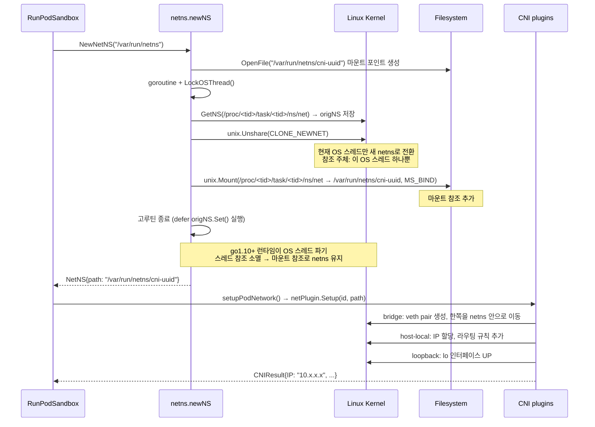
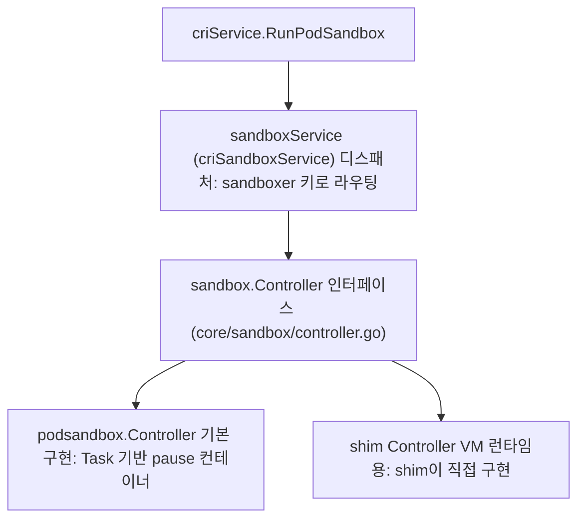
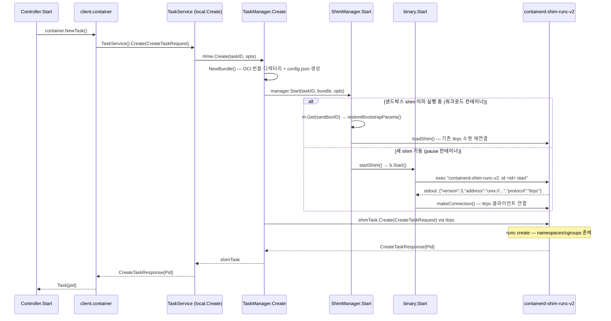

지금까지 scheduler, kubelet의 동작을 코드로 살펴봤고 kubelet에서 CRI의 호출 지점과 쉘에서 containerd, shim 프로세스를 살펴봤습니다. shim은 kubelet과 containerd 사이에서 파드의 라이프사이클을 관리하는 역할을 수행함을 알 수 있었습니다. 이번에는 쉘에서 확인한 containerd의 내부 동작을 살펴보도록 하겠습니다.

---

kubelet은 containerd의 gRPC API를 통해 컨테이너 런타임과 상호작용합니다. 이전 아티클에서 kubelet이 CRI를 통해 `RunPodSandbox`, `CreateContainer`, `StartContainer` 등의 메서드를 호출하는 것을 확인했습니다. 이제 containerd가 이러한 요청을 처리하는 과정을 살펴보겠습니다.

containerd는 gRPC 서버로 동작하며, kubelet이 보낸 요청을 처리하기 위해 다양한 메서드를 구현하고 있습니다. 예를 들어, `RunPodSandbox` 요청이 들어오면 containerd는 해당 요청을 처리하기 위해 내부적으로 여러 단계를 거칩니다.

containerd는 기능별 컴포넌트를 **플러그인**으로 분리하고, 플러그인이 `grpcService` 인터페이스를 구현하면 자동으로 gRPC 서버에 등록되는 구조를 가집니다. 이 흐름을 `main()`부터 이미지 RPC 호출까지 단계별로 추적해 보겠습니다.

# 플러그인 사전 등록

[cmd/containerd/main.go](https://github.com/containerd/containerd/blob/v2.2.1/cmd/containerd/main.go)의 `main()`은 단순합니다.

```go
// https://github.com/containerd/containerd/blob/dea7da592f5d1/cmd/containerd/main.go#L24
import (
    _ "github.com/containerd/containerd/v2/cmd/containerd/builtins"
)

func main() {
    app := command.App()
    if err := app.Run(os.Args); err != nil { ... }
}
```

핵심은 blank import `_`입니다. Go 런타임은 `main()`이 실행되기 전에 import된 패키지의 `init()` 함수를 모두 실행합니다. [cmd/containerd/builtins/builtins.go](https://github.com/containerd/containerd/blob/v2.2.1/cmd/containerd/builtins/builtins.go)는 containerd가 제공하는 모든 빌트인 플러그인 패키지를 blank import하고 있습니다.

```go
// https://github.com/containerd/containerd/blob/dea7da592f5d1/cmd/containerd/builtins/builtins.go#L20
import (
    _ "github.com/containerd/containerd/v2/plugins/services/images"
    _ "github.com/containerd/containerd/v2/plugins/services/containers"
    _ "github.com/containerd/containerd/v2/plugins/services/tasks"
    // ... 기타 서비스 플러그인들
)
```

각 플러그인 패키지의 `init()` 함수가 import 될 때 실행됩니다. 이때 `registry.Register()`를 호출하여 플러그인의 타입, ID, 의존성, 초기화 함수(`InitFn`)를 전역 레지스트리에 등록합니다. 예를 들어 `GRPCPlugin`("images")은 gRPC 게이트웨이 역할을 하며 `ServicePlugin` 의존성을 선언합니다 ([plugins/services/images/service.go#L31](https://github.com/containerd/containerd/blob/v2.2.1/plugins/services/images/service.go#L31)).

```go
// https://github.com/containerd/containerd/blob/dea7da592f5d1/plugins/services/images/service.go#L31
func init() {
    registry.Register(&plugin.Registration{
        Type: plugins.GRPCPlugin,
        ID:   "images",
        Requires: []plugin.Type{
            plugins.ServicePlugin,
        },
        InitFn: func(ic *plugin.InitContext) (interface{}, error) {
            i, err := ic.GetByID(plugins.ServicePlugin, services.ImagesService)
            // ...
            return &service{local: i.(imagesapi.ImagesClient)}, nil
        },
    })
}
```

`ServicePlugin`("images")은 실제 비즈니스 로직을 담당하며 `MetadataPlugin`, `GCPlugin` 등을 의존성으로 선언합니다 ([plugins/services/images/local.go#L45](https://github.com/containerd/containerd/blob/v2.2.1/plugins/services/images/local.go#L45)).

```go
// https://github.com/containerd/containerd/blob/dea7da592f5d1/plugins/services/images/local.go#L45
func init() {
    registry.Register(&plugin.Registration{
        Type: plugins.ServicePlugin,
        ID:   services.ImagesService,
        Requires: []plugin.Type{
            plugins.MetadataPlugin,
            plugins.GCPlugin,
            plugins.WarningPlugin,
        },
        InitFn: func(ic *plugin.InitContext) (interface{}, error) {
            m, _ := ic.GetSingle(plugins.MetadataPlugin)  // bolt DB
            g, _ := ic.GetSingle(plugins.GCPlugin)
            // ...
            return &local{
                store: metadata.NewImageStore(m.(*metadata.DB)),
                gc:    g.(gcScheduler),
            }, nil
        },
    })
}
```

이 시점에서는 인스턴스를 생성하지 않고 `Registration` 구조체만 전역 레지스트리에 저장합니다. 실제 인스턴스 생성(`InitFn` 실행)은 이후 `server.New()` 단계에서 이루어집니다.


# 플러그인 로드 및 gRPC 서버 실행

이번은 gRPC 서버가 어떻게 생성되고 플러그인이 초기화되는지 살펴보겠습니다. 이 흐름은 `main()`에서 출발합니다.

```go
// https://github.com/containerd/containerd/blob/dea7da592f5d1/cmd/containerd/main.go#L28
func main() {
    app := command.App() // ✅ cli.App 인스턴스 생성 (app.Action 포함)
    if err := app.Run(os.Args); err != nil { // ✅ urfave/cli가 인수 파싱 후 app.Action 호출
        // ...
    }
}
```

`command.App()` 내부에서 데몬 실행 로직을 등록합니다. 이때 서브커맨드가 주어지지 않으면 urfave/cli는 기본 동작으로 등록된 `app.Action` 클로저를 실행합니다.

```go
// https://github.com/containerd/containerd/blob/dea7da592f5d1/cmd/containerd/command/main.go#L73
func App() *cli.App {
    app := cli.NewApp()
    app.Commands = []*cli.Command{
        configCommand,
        publishCommand,
        ociHook,
    }
    app.Action = func(cliContext *cli.Context) error { // ✅ 서브커맨드 없을 때 실행되는 기본 동작
        // ...
    }
    return app
}
```

`app.Action` 클로저 본문에서는 설정 로드 → `server.New()` 호출 → 소켓 리스너 생성 → `serve()` 순으로 진행됩니다.

```go
// https://github.com/containerd/containerd/blob/dea7da592f5d1/cmd/containerd/command/main.go#L121
func App() *cli.App {
    // ...
    app.Action = func(cliContext *cli.Context) error {
        // ...
        go func() { // ✅ 고루틴에서 서버 초기화 (bolt DB 잠금 등 장시간 블로킹 방지)
            server, err := server.New(ctx, config) // ✅ 플러그인 로드 + gRPC 서버 생성
            // ...
        }()
        // ...
        l, err := sys.GetLocalListener(config.GRPC.Address, config.GRPC.UID, config.GRPC.GID)
        // ...
        serve(ctx, l, server.ServeGRPC) // ✅ 별도 고루틴에서 grpcServer.Serve(l) 실행
    }
}
```

`server.New()`는 먼저 `LoadPlugins()`를 호출하여 전역 레지스트리에 등록된 모든 플러그인을 의존성 순서로 정렬된 슬라이스로 반환받습니다.

```go
// https://github.com/containerd/containerd/blob/dea7da592f5d1/cmd/containerd/server/server.go#L132
func New(ctx context.Context, config *srvconfig.Config) (*Server, error) {
    // ...
    loaded, err := LoadPlugins(ctx, config) // ✅ 위상 정렬된 []plugin.Registration 반환
    // ...
}
```

`LoadPlugins`는 proxy 플러그인을 추가로 등록한 뒤 `registry.Graph()`를 호출합니다.

```go
// https://github.com/containerd/containerd/blob/dea7da592f5d1/cmd/containerd/server/server.go#L494
func LoadPlugins(ctx context.Context, config *srvconfig.Config) ([]plugin.Registration, error) {
    // ... proxy plugin 등록 ...
    return registry.Graph(filter(config.DisabledPlugins)), nil // ✅ 비활성화 필터 적용 후 위상 정렬
}
```

`registry.Graph()`는 DFS 방식으로 각 플러그인의 `Requires` 의존성을 재귀적으로 먼저 삽입하여, 피의존 플러그인이 항상 의존 플러그인보다 앞에 오도록 정렬합니다.

```go
// https://github.com/containerd/containerd/blob/dea7da592f5d1/vendor/github.com/containerd/plugin/plugin.go#L112
func (registry Registry) Graph(filter DisableFilter) []Registration {
    // ...
    for _, r := range registry {
        if disabled[r] {
            continue
        }
        children(r, registry, added, disabled, &ordered) // ✅ DFS로 Requires 먼저 삽입
        if !added[r] {
            ordered = append(ordered, *r)
            added[r] = true
        }
    }
    return ordered
}
```

## 플러그인 초기화와 의존성 주입

다시 돌아와서 `server.New()`는 위상 정렬된 `loaded`를 순회하며 각 플러그인을 순차적으로 초기화합니다.

```go
// https://github.com/containerd/containerd/blob/dea7da592f5d1/cmd/containerd/server/server.go#L246
func New(ctx context.Context, config *srvconfig.Config) (*Server, error) {
    // ...
    var (
        grpcServer  = grpc.NewServer(serverOpts...)  // ✅ gRPC 서버 인스턴스 생성
        // ...
        initialized = plugin.NewPluginSet()          // ✅ 초기화 완료 플러그인 집합
    )
    for _, p := range loaded { // ✅ 위상 정렬 순서로 순차 초기화
        // ...
        initContext := plugin.NewContext(
            ctx,
            initialized, // ✅ 이미 초기화된 플러그인만 담긴 집합 전달
            map[string]string{
                plugins.PropertyRootDir:      filepath.Join(config.Root, id),
                plugins.PropertyGRPCAddress:  config.GRPC.Address,
                plugins.PropertyTTRPCAddress: config.TTRPC.Address, 
                // ...
            },
        )
        result := p.Init(initContext)    // ✅ InitFn 실행, instance 또는 err 저장
        initialized.Add(result)          // ✅ 완료 집합에 추가 (이후 플러그인이 참조 가능)

        instance, err := result.Instance()
        // ...
        if src, ok := instance.(grpcService); ok { // ✅ grpcService 구현 여부 확인
            grpcServices = append(grpcServices, src)
        }
    }
}
```

모든 플러그인 초기화가 완료된 후 `grpcServices`에 수집된 서비스들을 gRPC 서버에 등록합니다.

```go
// https://github.com/containerd/containerd/blob/dea7da592f5d1/cmd/containerd/server/server.go#L359
func New(ctx context.Context, config *srvconfig.Config) (*Server, error) {
    // ...
    for _, service := range grpcServices {
        if err := service.Register(grpcServer); err != nil { // ✅ gRPC 서버에 RPC 메서드 등록
            return nil, err
        }
    }
    return s, nil
}
```

`service.Register()`는 예를 들어 이미지 서비스의 경우 내부적으로 `imagesapi.RegisterImagesServer(s, &service{...})`를 호출하여 protobuf로부터 자동 생성된 핸들러를 gRPC 서버에 연결합니다.

이후 `command/main.go`에서 Unix 소켓 리스너를 생성하고 `serve()`를 통해 `grpcServer.Serve(l)`를 고루틴으로 실행합니다.

```go
// https://github.com/containerd/containerd/blob/dea7da592f5d1/cmd/containerd/command/main.go#L284
func App() *cli.App {
    // ...
    app.Action = func(cliContext *cli.Context) error {
        // ...
        l, err := sys.GetLocalListener(config.GRPC.Address, config.GRPC.UID, config.GRPC.GID)
        // ...
        serve(ctx, l, server.ServeGRPC) // ✅ 고루틴에서 grpcServer.Serve(l) 실행
        // ...
    }
}
```

이로써 containerd는 소켓 파일(`/run/containerd/containerd.sock`)에서 gRPC 요청을 수신할 준비가 완료됩니다. kubelet이 CRI 요청을 보내면 해당 소켓을 통해 등록된 핸들러로 라우팅됩니다.

지금까지의 흐름을 정리하면 다음과 같습니다.

1. blank import → 각 플러그인 패키지의 `init()` 실행 → `registry.Register()`로 타입·ID·`InitFn`을 전역 레지스트리에 등록합니다.
2. `server.New()` → `LoadPlugins()` → `registry.Graph()`로 의존 관계를 DFS 위상 정렬하여 `[]Registration` 슬라이스를 얻습니다.
3. 정렬된 순서로 `p.Init(initContext)`를 실행하고 결과를 `initialized` 집합에 누적합니다. `grpcService`를 구현한 인스턴스는 `grpcServices`에 수집합니다.
4. 수집된 서비스마다 `service.Register(grpcServer)`를 호출하여 protobuf 핸들러를 gRPC 서버에 연결합니다.
5. Unix 소켓에서 `grpcServer.Serve(l)`를 실행하여 kubelet 요청을 수신합니다.

앞서 이미지 서비스(`GRPCPlugin "images"`)를 예시로 플러그인 등록 메커니즘을 살펴봤습니다. kubelet의 파드 생성 요청인 `RunPodSandbox`, `CreateContainer`, `StartContainer`도 마찬가지로 플러그인으로 등록된 핸들러가 처리하며, 이를 담당하는 핵심 플러그인이 `GRPCPlugin "cri"`입니다.

`GRPCPlugin "cri"`는 kubelet이 보내는 CRI 요청의 gRPC 진입점 역할을 합니다. 이미지 서비스와 동일한 구조로, 이 플러그인은 gRPC 게이트웨이로서 요청을 수신하고 `Requires`에 선언된 `CRIServicePlugin`과 `PodSandboxPlugin`에 실제 처리를 위임합니다. `GRPCPlugin`이 프로토콜 어댑터라면, `CRIServicePlugin`이 실제 비즈니스 로직을 구현하는 계층입니다.

다음 절에서는 이 구조를 바탕으로 `GRPCPlugin "cri"` 플러그인이 어떻게 등록되고, 세 CRI 메서드가 containerd 내부에서 어떤 단계를 거쳐 처리되는지 추적해 보겠습니다.

# 내부 RPC 흐름

`plugins/cri/cri.go`의 `init()`은 `GRPCPlugin` 타입의 `"cri"` 플러그인을 전역 레지스트리에 등록합니다.

```go
// https://github.com/containerd/containerd/blob/v2.2.1/plugins/cri/cri.go#L44
func init() {
    registry.Register(&plugin.Registration{
        Type: plugins.GRPCPlugin,
        ID:   "cri",           // ✅ 이미지 서비스와 동일한 GRPCPlugin 타입으로 등록
        Requires: []plugin.Type{
            plugins.CRIServicePlugin,
            plugins.PodSandboxPlugin,
            // ...
        },
        InitFn: initCRIService,
    })
}
```

`server.New()`에서 초기화 수행 시 `InitFn`인 `initCRIService`가 실행됩니다. 이 함수는 `CRIServicePlugin`에서 런타임/이미지 서비스를 꺼내 조립한 뒤, 마지막에 `&criGRPCServer{...}`를 생성하여 반환합니다.

```go
// https://github.com/containerd/containerd/blob/dea7da592f5d1/plugins/cri/cri.go#L141
func initCRIService(ic *plugin.InitContext) (interface{}, error) {
    // ...
    service := &criGRPCServer{               // ✅ grpcService 인터페이스를 구현하는 구조체 생성
        RuntimeServiceServer: rs,
        ImageServiceServer:   is,
        // ...
    }
    // ...
    return criGRPCServerWithTCP{service}, nil // ✅ InitFn의 반환값이 plugin instance가 됨
}
```

`server.New()`는 앞서 살펴본 대로 반환된 인스턴스가 `grpcService`(`Register` 메서드)를 구현하는지 확인하고, 구현한다면 `grpcServices` 슬라이스에 수집합니다. 모든 플러그인 초기화가 끝난 뒤 `service.Register(grpcServer)`를 호출하여 CRI 핸들러를 gRPC 서버에 연결합니다.

```go
// https://github.com/containerd/containerd/blob/v2.2.1/plugins/cri/cri.go#L179
func (c *criGRPCServer) Register(s *grpc.Server) error {
    instrumented := instrument.NewService(c)
    runtime.RegisterRuntimeServiceServer(s, instrumented) // ✅ CRI RuntimeService 핸들러 등록
    runtime.RegisterImageServiceServer(s, instrumented)
    return nil
}
```

이제 kubelet이 파드를 생성할 때 실제로 호출하는 세 메서드가 containerd 내부에서 어떻게 처리되는지 살펴보겠습니다.

## RunPodSandbox

`RunPodSandbox`는 파드 수준의 샌드박스를 생성하고 시작하는 메서드입니다. 샌드박스는 파드 내의 모든 컨테이너가 공유하는 네트워크/IPC 네임스페이스의 기준점 역할을 하며, 흔히 `pause` 컨테이너라고 불립니다.

구현은 `internal/cri/server/sandbox_run.go`의 `criService.RunPodSandbox`에 있으며, 단계별로 살펴보면 다음과 같습니다.

### 샌드박스 ID 예약과 메타데이터 생성

```go
// https://github.com/containerd/containerd/blob/v2.2.1/internal/cri/server/sandbox_run.go#L51
func (c *criService) RunPodSandbox(ctx context.Context, r *runtime.RunPodSandboxRequest) (_ *runtime.RunPodSandboxResponse, retErr error) {
    // ...
    id := util.GenerateID()    // ✅ UUID 기반의 고유 샌드박스 ID 생성
    name := makeSandboxName(metadata)

    if err := c.sandboxNameIndex.Reserve(name, id); err != nil { // ✅ 이름 중복 방지를 위한 예약
        return nil, fmt.Errorf("failed to reserve sandbox name %q: %w", name, err)
    }

    // ...
    ls, lerr := leaseSvc.Create(ctx, leases.WithID(id)) // ✅ 리소스 누락 방지를 위한 lease 생성

    // ...
    ociRuntime, err := c.config.GetSandboxRuntime(config, r.GetRuntimeHandler()) // ✅ runtimeClass에 따른 OCI 런타임 결정

    // ...
    sandbox := sandboxstore.NewSandbox(
        sandboxstore.Metadata{
            ID:             id,
            Name:           name,
            Config:         config,
            RuntimeHandler: r.GetRuntimeHandler(),
        },
        sandboxstore.Status{State: sandboxstore.StateUnknown, ...},
    )
    // ✅ 내부 샌드박스 객체를 생성하고 sandbox store에 저장
    if _, err := c.client.SandboxStore().Create(ctx, sandboxInfo); err != nil { ... }
```

### 네트워크 네임스페이스 생성과 CNI 설정

호스트 네트워크를 사용하지 않는 경우, `netns.NewNetNS()`로 새로운 Linux 네트워크 네임스페이스를 생성한 뒤 CNI 플러그인을 실행합니다.

```go
// https://github.com/containerd/containerd/blob/v2.2.1/internal/cri/server/sandbox_run.go#L195
func (c *criService) RunPodSandbox(...) {
    // ...
    if !hostNetwork(config) {
        sandbox.NetNS, err = netns.NewNetNS(netnsMountDir) // ✅ /var/run/netns 하위에 netns 바인드 마운트 생성
        sandbox.NetNSPath = sandbox.NetNS.GetPath()

        // ...
        if err := c.setupPodNetwork(ctx, &sandbox); err != nil { // ✅ CNI Add 호출 → 가상 이더넷과 IP 할당
            return nil, fmt.Errorf("failed to setup network for sandbox %q: %w", id, err)
        }
    }
```

#### netns.NewNetNS 내부 동작

`netns.NewNetNS()`는 `pkg/netns/netns_linux.go`에 구현되어 있습니다. `NewNetNS` → `NewNetNSFromPID` → `newNS` 순으로 호출되며, 마지막 `newNS()`가 실제 네트워크 네임스페이스를 생성하고 바인드 마운트합니다.

```go
// https://github.com/containerd/containerd/blob/dea7da592f5d1/pkg/netns/netns_linux.go#L183
func NewNetNS(baseDir string) (*NetNS, error) {
    return NewNetNSFromPID(baseDir, 0) // ✅ pid=0: 새 netns를 생성 (기존 프로세스의 netns를 가져오는 경우 pid를 전달)
}

func NewNetNSFromPID(baseDir string, pid uint32) (*NetNS, error) {
    path, err := newNS(baseDir, pid) // ✅ 실제 netns 생성 및 바인드 마운트 수행
    if err != nil {
        return nil, fmt.Errorf("failed to setup netns: %w", err)
    }
    return &NetNS{path: path}, nil
}
```

`newNS()` 내부에서는 전용 OS 스레드를 잠근 고루틴 안에서 두 가지 핵심 작업을 수행합니다. 첫 번째는 `unshare` syscall로 새 netns를 생성하는 것이고, 두 번째는 바인드 마운트로 그 netns를 파일시스템 경로에 고정하는 것입니다.

Linux 네트워크 네임스페이스는 프로세스가 아니라 OS 스레드 단위로 적용되는 커널 오브젝트입니다. `unshare(CLONE_NEWNET)`은 현재 OS 스레드의 네트워크 네임스페이스를 새로 분리하는 syscall입니다. `clone(CLONE_NEWNET)`처럼 새 프로세스를 생성하지 않고, 오직 현재 스레드가 새 netns로 전환됩니다. 그런데 Go 런타임은 M:N 스레드 모델(가상 고루틴 : OS 스레드 = N:M)이기 때문에, 일반 고루틴은 실행 중에 다른 OS 스레드로 이동할 수 있습니다. netns는 스레드 단위이므로  OS 스레드를 고루틴에 고정(`LockOSThread`)하지 않으면 `unshare` 효과가 사라집니다. 따라서 전용 고루틴을 만들고 그 안에서 `LockOSThread`를 호출한 뒤 `unshare`를 수행합니다.

그런데 여기서 문제가 발생합니다. 커널의 netns는 참조 카운트가 0이 되는 순간 소멸합니다. 참조를 보유하는 주체는 세 가지입니다. 해당 netns를 사용하는 스레드, `/proc/<tid>/ns/net`을 가리키는 열린 파일 디스크립터, 그리고 그 경로를 대상으로 한 바인드 마운트입니다. `unshare` 직후에는 전용 OS 스레드 하나만 참조를 보유하고 있습니다. 고루틴이 종료되면 go1.10+ 런타임은 `LockOSThread` 상태에서 Unlock 없이 끝난 OS 스레드를 파기하고, 스레드 참조도 함께 사라집니다. 따라서 아무런 조치 없이 고루틴을 종료하면 netns는 즉시 소멸됩니다.

이 문제를 해결하기 위해 바인드 마운트를 사용합니다. 고루틴이 종료되기 전, `/proc/<tid>/task/<tid>/ns/net`(현재 OS 스레드의 netns 경로)을 `/var/run/netns/cni-<uuid>` 파일에 바인드 마운트합니다. 바인드 마운트는 VFS 레벨의 경로 참조를 커널 netns 오브젝트에 추가로 연결하므로, OS 스레드가 사라져 스레드 참조가 없어져도 마운트 참조가 살아있는 한 netns는 소멸하지 않습니다. 이후 CNI 플러그인은 이 경로를 통해 veth를 netns 안으로 이동시킬 수 있고, pause 프로세스는 `setns()`로 이 netns에 진입하여 자신을 이 네트워크 환경에 고정합니다.

```go
// https://github.com/containerd/containerd/blob/dea7da592f5d1/pkg/netns/netns_linux.go#L55
func newNS(baseDir string, pid uint32) (nsPath string, err error) {
    // ...
    nsName := fmt.Sprintf("cni-%x-%x-%x-%x-%x", ...) // ✅ cni-<uuid> 형식의 이름 생성
    nsPath = path.Join(baseDir, nsName)               // ✅ /var/run/netns/cni-<uuid>

    mountPointFd, err := os.OpenFile(nsPath, os.O_RDWR|os.O_CREATE|os.O_EXCL, 0666)
    // ✅ 바인드 마운트 대상이 될 빈 파일 생성 (마운트 포인트는 파일이어야 함)

    // ...
    go (func() {
        defer wg.Done()
        runtime.LockOSThread()
        // ✅ 이 고루틴의 OS 스레드를 고정
        //    netns는 스레드 단위로 적용되므로, 고루틴이 다른 OS 스레드로 이동하면 unshare 효과가 사라짐

        origNS, err = cnins.GetNS(getCurrentThreadNetNSPath()) // ✅ 현재 스레드의 netns 저장 (복귀용)

        err = unix.Unshare(unix.CLONE_NEWNET)
        // ✅ 현재 OS 스레드를 새 netns로 전환하는 syscall
        //    새 프로세스를 fork하지 않고 현재 스레드만 분리된 새 netns에 진입함
        //    이 시점에 netns를 참조하는 주체는 이 OS 스레드 하나뿐

        defer origNS.Set()
        // ✅ go1.10+ 에서는 LockOSThread() 후 Unlock 없이 고루틴이 종료되면 런타임이 해당 OS 스레드를 파기하므로
        //    원래 netns로 복귀할 필요가 없음
        //    그러나 go1.10 이전에는 LockOSThread()를 해도 스레드가 재사용될 수 있으므로
        //    이 경우 새 netns가 적용된 스레드를 다른 고루틴이 이어받게 되는 것을 막기 위해 원래 netns로 복귀

        err = unix.Mount(getCurrentThreadNetNSPath(), nsPath, "none", unix.MS_BIND, "")
        // ✅ 현재 스레드의 netns(/proc/<tid>/task/<tid>/ns/net)를 /var/run/netns/cni-<uuid>에 바인드 마운트
        //    → 마운트 참조가 생기므로 고루틴 종료 후 OS 스레드가 파기되어도 netns가 소멸하지 않음
        //    → CNI와 pause 프로세스가 이 경로로 netns에 진입할 수 있게 됨
    })()
    wg.Wait()
    // ...
```

이렇게 하면 `CLONE_NEWNET`으로 생성된 netns는 OS 스레드가 파기된 뒤에도 바인드 마운트 참조를 통해 살아있게 됩니다. 이후 CNI 플러그인이 veth pair를 생성하고 한쪽 끝을 이 netns 경로로 이동시키며, pause 프로세스가 시작될 때 해당 경로로 `setns()`를 호출하여 공유 네트워크 환경에 진입합니다.

#### setupPodNetwork와 CNI 호출

netns 파일 경로가 준비되면 `setupPodNetwork()`가 CNI 플러그인을 실행합니다.

```go
// https://github.com/containerd/containerd/blob/dea7da592f5d1/internal/cri/server/sandbox_run.go#L394
func (c *criService) setupPodNetwork(ctx context.Context, sandbox *sandboxstore.Sandbox) error {
    var (
        id        = sandbox.ID
        path      = sandbox.NetNSPath  // ✅ /var/run/netns/cni-<uuid> 경로
        netPlugin = c.getNetworkPlugin(sandbox.RuntimeHandler) // ✅ 런타임 클래스별 CNI 인스턴스 조회
        // ...
    )
    // ...
    opts, err := cniNamespaceOpts(id, config) // ✅ 파드 어노테이션·DNS 설정 등을 CNI args로 변환

    if c.config.CniConfig.NetworkPluginSetupSerially {
        result, err = netPlugin.SetupSerially(ctx, id, path, opts...) // ✅ CNI 플러그인을 직렬로 순차 실행
    } else {
        result, err = netPlugin.Setup(ctx, id, path, opts...)          // ✅ CNI 플러그인을 병렬로 실행
    }
    // ...
    if configs, ok := result.Interfaces[defaultIfName]; ok && len(configs.IPConfigs) > 0 {
        sandbox.IP, sandbox.AdditionalIPs = selectPodIPs(ctx, configs.IPConfigs, ...) // ✅ 할당된 IP를 sandbox 객체에 캐싱
        sandbox.CNIResult = result
    }
}
```

`netPlugin.Setup()` 호출을 기준으로 containerd와 CNI 플러그인의 책임이 나뉩니다.

- containerd의 책임: 파드 netns 경로(`/var/run/netns/cni-<uuid>`)를 준비한 뒤 `netPlugin.Setup()`을 호출해 네트워크 구성을 위임하고, 완료 후 반환된 IP를 `sandbox.IP`에 저장합니다.
- CNI의 책임: `netPlugin.Setup()` 이후의 모든 네트워크 조작입니다. veth pair 생성, IP 할당, 라우팅 규칙 설정은 모두 CNI 플러그인 바이너리(`/opt/cni/bin/bridge` 등)가 수행하며, containerd는 이 과정에 개입하지 않습니다.

`netPlugin.Setup()`의 구현은 containerd에 내장된 [go-cni](https://github.com/containerd/go-cni) 라이브러리가 담당합니다. go-cni는 containerd와 실제 CNI 바이너리 사이의 중간 계층으로, `/etc/cni/net.d/` 디렉터리의 설정 파일을 읽어 플러그인 체인을 조립한 뒤 각 바이너리를 순서대로 exec합니다.

```go
// https://github.com/containerd/containerd/blob/dea7da592f5d1/vendor/github.com/containerd/go-cni/cni.go#L167
func (c *libcni) Setup(ctx context.Context, id string, path string, opts ...NamespaceOpts) (*Result, error) {
    // ...
    ns, err := newNamespace(id, path, opts...) // ✅ id·netns 경로·opts를 Namespace 구조체로 래핑
    // ...
    result, err := c.attachNetworks(ctx, ns)   // ✅ 설정된 네트워크 목록을 병렬로 Attach
    // ...
}
```

`attachNetworks()`는 `/etc/cni/net.d/` 설정 파일 하나당 하나씩 만들어진 `Network` 목록을 순회하며, 각각 고루틴을 만들어 `Network.Attach(ns)`를 병렬로 호출합니다.

```go
// https://github.com/containerd/containerd/blob/dea7da592f5d1/vendor/github.com/containerd/go-cni/cni.go#L226
func (c *libcni) attachNetworks(ctx context.Context, ns *Namespace) ([]*types100.Result, error) {
    // ...
    for i, network := range c.networks {
        wg.Add(1)
        go asynchAttach(ctx, i, network, ns, &wg, rc) // ✅ 네트워크 설정 파일마다 고루틴으로 Attach 실행
    }
    // ...
}

// https://github.com/containerd/containerd/blob/dea7da592f5d1/vendor/github.com/containerd/go-cni/namespace.go#L32
func (n *Network) Attach(ctx context.Context, ns *Namespace) (*types100.Result, error) {
    r, err := n.cni.AddNetworkList(ctx, n.config, ns.config(n.ifName))
    // ✅ n.config(NetworkConfigList: ptp→portmap 체인)를
    //    ns 파드 netns(/var/run/netns/cni-<uuid>)에 실제로 적용
    //    (host-local은 ptp의 ipam이지 체인의 독립 플러그인이 아님)
    // ...
}
```

`AddNetworkList()`는 플러그인들을 직렬로 실행하면서 앞 플러그인의 결과를 다음 플러그인의 stdin에 전달합니다. 예를 들어 `bridge`가 생성한 veth 정보가 `host-local`에 전달되는 방식입니다.

```go
// https://github.com/containerd/containerd/blob/dea7da592f5d1/vendor/github.com/containernetworking/cni/libcni/api.go#L515
func (c *CNIConfig) AddNetworkList(ctx context.Context, list *NetworkConfigList, rt *RuntimeConf) (types.Result, error) {
    var result types.Result
    for _, net := range list.Plugins {
        result, err = c.addNetwork(ctx, list.Name, list.CNIVersion, net, result, rt)
        // ✅ Plugins 배열을 순서대로 직렬 실행, 앞 플러그인 result를 prevResult로 전달
        // ...
    }
    // ...
}

// https://github.com/containerd/containerd/blob/dea7da592f5d1/vendor/github.com/containernetworking/cni/libcni/api.go#L490
func (c *CNIConfig) addNetwork(ctx context.Context, name, cniVersion string, net *PluginConfig, prevResult types.Result, rt *RuntimeConf) (types.Result, error) {
    // ...
    pluginPath, err := c.exec.FindInPath(net.Network.Type, c.Path)
    // ✅ net.Network.Type("bridge" 등)으로 /opt/cni/bin/bridge 바이너리 경로 결정
    // ...
    return invoke.ExecPluginWithResult(ctx, pluginPath, newConf.Bytes, c.args("ADD", rt), c.exec)
    // ✅ 플러그인 바이너리를 CNI_COMMAND=ADD 환경 변수와 함께 exec
}
```

최종적으로 각 플러그인 바이너리는 `CNI_NETNS` 환경 변수(`/var/run/netns/cni-<uuid>`)와 설정 JSON(stdin)을 받아 실행되며, 해당 netns 안에서 직접 네트워크 인터페이스를 조작합니다. containerd는 exec 이후 이 과정에 전혀 개입하지 않습니다.

```go
// https://github.com/containerd/containerd/blob/dea7da592f5d1/vendor/github.com/containernetworking/cni/pkg/invoke/raw_exec.go#L34
func (e *RawExec) ExecPlugin(ctx context.Context, pluginPath string, stdinData []byte, environ []string) ([]byte, error) {
    // ...
    c := exec.CommandContext(ctx, pluginPath) // ✅ /opt/cni/bin/bridge 등 플러그인 바이너리를 자식 프로세스로 실행
    c.Env = environ      // ✅ CNI_COMMAND=ADD, CNI_NETNS=/var/run/netns/cni-<uuid>, CNI_IFNAME=eth0 등 환경 변수 전달
    c.Stdin = bytes.NewBuffer(stdinData) // ✅ 네트워크 설정 JSON을 stdin으로 전달
    c.Stdout = stdout
    // ...
    err := c.Run() // ✅ 플러그인 바이너리 실행 완료 대기
    // ...
}
```



### 샌드박스 컨테이너 생성 및 시작

`criService`의 `RunPodSandbox`는 `sandboxService`의 `CreateSandbox`와 `StartSandbox`를 차례로 호출하여 샌드박스 컨테이너를 생성하고 실행합니다.

```go
// https://github.com/containerd/containerd/blob/v2.2.1/internal/cri/server/sandbox_run.go#L278
func (c *criService) RunPodSandbox(...) {
    // ...
    if err := c.sandboxService.CreateSandbox(ctx, sandboxInfo, ...); err != nil { // ✅ Controller.Create: 메타데이터를 store에 저장
        return nil, fmt.Errorf("failed to create sandbox %q: %w", id, err)
    }

    ctrl, err := c.sandboxService.StartSandbox(ctx, sandbox.Sandboxer, id) // ✅ Controller.Start: pause 컨테이너 task 실행
```

여기서 `sandboxService`의 실체는 `criSandboxService`입니다. 이 구조체는 직접 실행 로직을 담지 않으며, `sandboxer` 문자열을 키로 `sandbox.Controller` 구현체들을 관리하는 디스패처 역할을 합니다.

```go
// https://github.com/containerd/containerd/blob/dea7da592f5d1/internal/cri/server/sandbox_service.go#L31
type criSandboxService struct {
    sandboxControllers map[string]sandbox.Controller // ✅ sandboxer 이름 → Controller 구현체 매핑
    config             *criconfig.Config
}

func (c *criSandboxService) SandboxController(sandboxer string) (sandbox.Controller, error) {
    sbController, ok := c.sandboxControllers[sandboxer] // ✅ sandboxer 값으로 Controller 조회
    if !ok {
        return nil, fmt.Errorf("failed to get sandbox controller by %s", sandboxer)
    }
    return sbController, nil
}

func (c *criSandboxService) CreateSandbox(ctx context.Context, info sandbox.Sandbox, opts ...sandbox.CreateOpt) error {
    ctrl, err := c.SandboxController(info.Sandboxer) // ✅ sandboxer로 Controller를 찾아 위임
    // ...
    return ctrl.Create(ctx, info, opts...)
}
```

`sandbox.Controller`는 `core/sandbox/controller.go`에 정의된 인터페이스입니다. `Create`, `Start`, `Stop`, `Wait` 등 샌드박스의 전체 생명주기를 추상화합니다.

```go
// https://github.com/containerd/containerd/blob/dea7da592f5d1/core/sandbox/controller.go#L95
type Controller interface {
    // ✅ 샌드박스 환경(마운트 등) 초기화
    Create(ctx context.Context, sandboxInfo Sandbox, opts ...CreateOpt) error
    // ✅ 이미 생성된 샌드박스를 실제로 시작
    Start(ctx context.Context, sandboxID string) (ControllerInstance, error)
    Stop(ctx context.Context, sandboxID string, opts ...StopOpt) error
    Wait(ctx context.Context, sandboxID string) (ExitStatus, error)
    Status(ctx context.Context, sandboxID string, verbose bool) (ControllerStatus, error)
    Shutdown(ctx context.Context, sandboxID string) error
    // ...
}
```

`sandboxer` 값은 런타임 클래스 설정에 따라 결정되며, 기본값은 `"podsandbox"`입니다. containerd는 두 가지 구현체를 제공합니다.

- `"podsandbox"` — `internal/cri/server/podsandbox.Controller`. containerd 내부에서 pause 컨테이너를 Task로 직접 관리합니다. 일반 Linux 컨테이너 런타임의 기본 경로입니다.
- `"shim"` — shim이 `SandboxService` 인터페이스를 직접 구현하는 경우에 사용합니다. Kata Containers처럼 VM 기반 런타임에서 shim이 sandbox 생명주기 전체를 책임지는 형태입니다.

`podsandbox.Controller`는 `sandbox.Controller` 인터페이스를 구현하는 구조체로, `var _ sandbox.Controller = (*Controller)(nil)` 컴파일 타임 검증을 포함합니다.

```go
// https://github.com/containerd/containerd/blob/dea7da592f5d1/internal/cri/server/podsandbox/controller.go#L129
type Controller struct {
    config         criconfig.Config
    client         *containerd.Client  // ✅ containerd 클라이언트 (Container/Task API 접근)
    runtimeService RuntimeService
    imageService   ImageService
    os             osinterface.OS
    eventMonitor   *events.EventMonitor
    store          *Store              // ✅ 인메모리 PodSandbox 상태 저장소
}

var _ sandbox.Controller = (*Controller)(nil) // ✅ 컴파일 타임 인터페이스 구현 검증
```

이 계층 구조를 정리하면 다음과 같습니다.



`Controller.Create`는 실행 로직 없이 메타데이터를 인메모리 store에 등록하는 역할만 담당합니다. `sandbox.Sandbox`의 extension에서 CRI 메타데이터를 꺼내 `PodSandbox` 객체를 `StateUnknown` 상태로 초기화하고 `c.store.Save()`로 저장하는 것이 전부입니다. pause 컨테이너 실행을 포함한 모든 실질적인 처리는 이후 `Controller.Start`에서 이루어집니다.

`Controller.Start` 내부 (`internal/cri/server/podsandbox/sandbox_run.go`)에서는 sandbox 이미지 확인, OCI 스펙 생성, containerd Container와 Task 생성, `task.Start()` 호출까지 진행됩니다.

```go
// https://github.com/containerd/containerd/blob/v2.2.1/internal/cri/server/podsandbox/sandbox_run.go#L63
func (c *Controller) Start(ctx context.Context, id string) (cin sandbox.ControllerInstance, retErr error) {
    // ...
    image, err := c.ensureImageExists(ctx, sandboxImage, config, ...) // ✅ pause 이미지 pull (없는 경우)

    spec, err := c.sandboxContainerSpec(id, config, ...) // ✅ OCI 런타임 스펙 생성

    container, err := c.client.NewContainer(ctx, id, opts...) // ✅ containerd Container 객체 생성 + 스냅샷 준비

    task, err := container.NewTask(ctx, containerdio.NullIO, taskOpts...) // ✅ shim 프로세스 기동 + OCI 번들 준비

    if err := task.Start(ctx); err != nil { // ✅ pause 프로세스 실제 실행 (runc create → runc start)
        return cin, fmt.Errorf("failed to start sandbox container task %q: %w", id, err)
    }
```

#### OCI 런타임 스펙 생성

`Controller.Start`는 `sandboxContainerSpec()`에서 pause 컨테이너의 OCI 런타임 스펙을 생성합니다. 이 스펙은 `container.NewTask()`로 전달되어 shim이 컨테이너를 exec할 때 사용됩니다.

`sandboxContainerSpec()`은 `[]oci.SpecOpts` 슬라이스를 조립하는 방식으로 동작합니다. `oci.SpecOpts`는 `*runtimespec.Spec`을 in-place로 수정하는 함수 타입으로, 각 조건에 맞는 옵션 함수를 슬라이스에 append한 뒤 마지막에 `c.runtimeSpec()`으로 한꺼번에 적용합니다. runc가 실행될 때 읽을 `config.json`의 내용이 이 과정에서 완전히 결정됩니다.

```go
// https://github.com/containerd/containerd/blob/dea7da592f5d1/internal/cri/server/podsandbox/sandbox_run_linux.go#L40
func (c *Controller) sandboxContainerSpec(id string, config *runtime.PodSandboxConfig,
    imageConfig *imagespec.ImageConfig, nsPath string, runtimePodAnnotations []string) (_ *runtimespec.Spec, retErr error) {
    specOpts := []oci.SpecOpts{
        oci.WithoutRunMount,                              // ✅ 기본 /run tmpfs 마운트 제거
        customopts.WithoutDefaultSecuritySettings,        // ✅ pause 컨테이너용 기본 보안 설정 제거
        customopts.WithRelativeRoot(relativeRootfsPath),  // ✅ rootfs 경로를 번들 디렉터리 상대 경로로 설정
        oci.WithEnv(imageConfig.Env),
        oci.WithRootFSReadonly(),                         // ✅ pause 이미지의 rootfs를 읽기 전용으로 마운트
        oci.WithHostname(config.GetHostname()),
    }
    // ...
    specOpts = append(specOpts, oci.WithProcessArgs(append(imageConfig.Entrypoint, imageConfig.Cmd...)...))
    // ✅ pause 이미지의 Entrypoint + Cmd를 프로세스 인자로 설정 (예: /pause)

    if config.GetLinux().GetCgroupParent() != "" {
        cgroupsPath := getCgroupsPath(config.GetLinux().GetCgroupParent(), id)
        specOpts = append(specOpts, oci.WithCgroup(cgroupsPath))
        // ✅ 파드의 cgroup 경로 설정 (kubelet이 지정한 cgroupParent 하위에 배치)
    }
    // ...
```

다음으로 네임스페이스 설정에서 핵심이 되는 부분은 네트워크 네임스페이스입니다. 앞 단계에서 CNI 설정이 완료된 netns 경로(`nsPath`)가 스펙의 `NetworkNamespace` 경로로 직접 삽입됩니다. pause 프로세스가 실행될 때 runc는 이 경로의 netns로 `setns()`를 호출하여 CNI가 구성한 네트워크 환경에 진입합니다.

```go
func (c *Controller) sandboxContainerSpec(...) {
    // ...
// https://github.com/containerd/containerd/blob/dea7da592f5d1/internal/cri/server/podsandbox/sandbox_run_linux.go#L83
    if nsOptions.GetNetwork() == runtime.NamespaceMode_NODE {
        specOpts = append(specOpts, customopts.WithoutNamespace(runtimespec.NetworkNamespace))
        // ✅ hostNetwork: true인 경우 host netns를 공유 (별도 netns 없음)
        specOpts = append(specOpts, customopts.WithoutNamespace(runtimespec.UTSNamespace))
    } else {
        specOpts = append(specOpts, oci.WithLinuxNamespace(
            runtimespec.LinuxNamespace{
                Type: runtimespec.NetworkNamespace,
                Path: nsPath, // ✅ CNI 설정이 완료된 /var/run/netns/cni-<uuid> 경로 삽입
            }))
    }
    if nsOptions.GetPid() == runtime.NamespaceMode_NODE {
        specOpts = append(specOpts, customopts.WithoutNamespace(runtimespec.PIDNamespace))
        // ✅ hostPID: true인 경우 host PID 네임스페이스 공유
    }
    if nsOptions.GetIpc() == runtime.NamespaceMode_NODE {
        specOpts = append(specOpts, customopts.WithoutNamespace(runtimespec.IPCNamespace))
        // ✅ hostIPC: true인 경우 host IPC 네임스페이스 공유
    }
    // ...
```

마운트 구성에서는 샌드박스 전용 `/dev/shm`과 `/etc/resolv.conf`를 바인드 마운트합니다. 파드 안의 모든 컨테이너가 이 경로를 통해 동일한 IPC shared memory와 DNS 설정을 공유합니다.

```go
func (c *Controller) sandboxContainerSpec(...) {
    // ...
// https://github.com/containerd/containerd/blob/dea7da592f5d1/internal/cri/server/podsandbox/sandbox_run_linux.go#L129
    specOpts = append(specOpts, oci.WithMounts([]runtimespec.Mount{
        {
            Source:      sandboxDevShm,          // ✅ /run/containerd/io.containerd.grpc.v1.cri/sandboxes/<id>/shm
            Destination: devShm,                 // /dev/shm
            Type:        "bind",
            Options:     []string{"rbind", "ro", "nosuid", "nodev", "noexec"},
        },
        {
            Source:      c.getResolvPath(id),    // ✅ /run/containerd/.../sandboxes/<id>/resolv.conf
            Destination: resolvConfPath,          // /etc/resolv.conf
            Type:        "bind",
            Options:     []string{"rbind", "ro", "nosuid", "nodev", "noexec"},
        },
    }))
    // ...
    specOpts = append(specOpts, customopts.WithSysctls(sysctls))
    // ✅ net.ipv4.ip_unprivileged_port_start, net.ipv4.ping_group_range 등 파드 네트워크 네임스페이스 내 sysctl 설정

    // ...
    return c.runtimeSpec(id, "", specOpts...)
    // ✅ 누적된 SpecOpts를 oci.GenerateSpec()에 적용하여 runtimespec.Spec 반환
}
```

바인드 마운트를 사용하는 이유는 파드 내 컨테이너들이 네트워크 네임스페이스를 공유하는 방식과 동일한 원리입니다. 각 컨테이너는 독립된 파일시스템을 가지므로, 아무 설정 없이 내버려 두면 /dev/shm과 /etc/resolv.conf가 컨테이너마다 따로 존재하게 됩니다. containerd는 파드 생성 시점에 샌드박스 전용 shm과 resolv.conf를 호스트 경로에 딱 하나만 만들어 두고, 파드에 합류하는 모든 컨테이너(pause 포함)가 그 단일 소스를 바인드 마운트로 바라보게 합니다. 덕분에 어느 컨테이너에서 공유 메모리에 데이터를 써도 같은 파드의 다른 컨테이너가 즉시 읽을 수 있고, DNS 조회 결과도 파드 전체에서 일관되게 유지됩니다.

읽기 전용(ro)으로 마운트하는 이유는 컨테이너 안의 프로세스가 이 파일들을 임의로 수정하지 못하게 막기 위해서입니다. resolv.conf와 shm의 내용은 kubelet과 containerd가 파드 생명주기에 맞춰 외부에서 관리하는 자원이므로, 컨테이너 내부에서는 읽기만 허용하고 변경 권한은 주지 않습니다.

마지막으로 `runtimeSpec()`이 `oci.GenerateSpec()`을 호출합니다. 이 함수는 platform 기본 스펙을 초기값으로 생성한 뒤 누적된 모든 `SpecOpts`를 순서대로 적용하여 최종 `*runtimespec.Spec`을 만들어 반환합니다.

```go
// https://github.com/containerd/containerd/blob/dea7da592f5d1/internal/cri/server/podsandbox/helpers.go#L73
func (c *Controller) runtimeSpec(id string, baseSpecFile string, opts ...oci.SpecOpts) (*runtimespec.Spec, error) {
    ctx := ctrdutil.NamespacedContext()
    container := &containers.Container{ID: id}

    if baseSpecFile != "" {
        // ✅ 커스텀 base spec 파일이 지정된 경우 해당 파일을 로드하여 기반으로 사용
        // ...
    }

    spec, err := oci.GenerateSpec(ctx, nil, container, opts...)
    // ✅ platform 기본 스펙에 모든 SpecOpts를 순서대로 적용하여 최종 OCI 스펙 생성
    // ...
    return spec, nil
}
```

이렇게 완성된 `*runtimespec.Spec`은 `sandbox_run.go`에서 `containerd.WithSpec(spec, specOpts...)`로 `NewContainer()` 옵션에 전달되고, bolt DB에 컨테이너 메타데이터로 저장됩니다. 이후 `NewTask()` 호출 시 `TaskManager.Create()`가 이 스펙을 꺼내 OCI 번들의 `config.json`으로 기록하면, shim이 runc를 실행할 때 이 파일을 읽어 컨테이너 환경을 구성합니다.

#### container.NewTask와 shim 기동

`container.NewTask()`는 shim 프로세스를 기동하고 ttrpc로 첫 번째 RPC를 호출하는 핵심 경로입니다. `client/container.go`의 `NewTask`는 `c.client.TaskService().Create()`를 호출합니다. 여기서 `c.client`는 CRI 플러그인 초기화 시 `containerd.WithInMemoryServices(ic)`로 생성된 클라이언트이므로, Unix 소켓을 거치는 gRPC 호출이 아닌 프로세스 내부의 `local` 서비스를 직접 호출합니다.

```go
// https://github.com/containerd/containerd/blob/dea7da592f5d1/client/container.go#L227
func (c *container) NewTask(ctx context.Context, ioCreate cio.Creator, opts ...NewTaskOpts) (_ Task, retErr error) {
    // ...
    request := &tasks.CreateTaskRequest{
        ContainerID: c.id,
        // ✅ IO FIFO 경로, rootfs 마운트 정보 등 포함
    }
    // ...
    response, err := c.client.TaskService().Create(ctx, request) // ✅ 인메모리 → local.Create() → TaskManager.Create()
    // ...
    t.pid = response.Pid
    return t, nil
}
```

`WithInMemoryServices`가 주입한 `local` 서비스의 `Create()`가 직접 호출됩니다. 이 `local` 구조체는 `plugins/services/tasks/local.go`에 정의되어 있으며, `api.TasksClient` 인터페이스를 구현하지만 gRPC 소켓을 사용하지 않습니다.

```go
// https://github.com/containerd/containerd/blob/dea7da592f5d1/plugins/services/tasks/local.go#L161
func (l *local) Create(ctx context.Context, r *api.CreateTaskRequest, ...) (*api.CreateTaskResponse, error) {
    container, err := l.getContainer(ctx, r.ContainerID) // ✅ bolt DB에서 컨테이너 메타데이터 조회

    opts := runtime.CreateOpts{
        Spec:          container.Spec,   // ✅ CreateContainer 단계에서 저장해둔 OCI 스펙
        Runtime:       container.Runtime.Name,
        SandboxID:     container.SandboxID,
        // ...
    }
    c, err := rtime.Create(ctx, r.ContainerID, opts) // ✅ TaskManager.Create() 호출
    // ...
}
```

`TaskManager.Create()`에서는 OCI 번들 디렉터리를 생성하고 shim 바이너리를 exec합니다.

```go
// https://github.com/containerd/containerd/blob/dea7da592f5d1/core/runtime/v2/task_manager.go#L153
func (m *TaskManager) Create(ctx context.Context, taskID string, opts runtime.CreateOpts) (_ runtime.Task, retErr error) {
    bundle, err := NewBundle(ctx, m.root, m.state, taskID, opts.Spec)
    // ✅ /var/lib/containerd/io.containerd.runtime.v2.task/<ns>/<id>/ 에 OCI 번들 생성
    // ✅ config.json(OCI 스펙)을 번들 디렉터리에 기록

    shim, err := m.manager.Start(ctx, taskID, bundle, opts) // ✅ ShimManager.Start() → shim 바이너리 exec
    // ...
    shimTask, err := newShimTask(shim)

    t, err := shimTask.Create(ctx, opts) // ✅ ttrpc로 shim에 CreateTask 전송
    // ...
}
```

`ShimManager.Start()`는 샌드박스에 이미 shim이 실행 중인 경우 기존 shim에 재접속하고, 그렇지 않으면 `startShim()`으로 새 shim 바이너리를 exec합니다.

```go
// https://github.com/containerd/containerd/blob/dea7da592f5d1/core/runtime/v2/shim_manager.go#L169
func (m *ShimManager) Start(ctx context.Context, id string, bundle *Bundle, opts runtime.CreateOpts) (_ ShimInstance, retErr error) {
    if opts.SandboxID != "" {
        // ✅ pause 컨테이너용 shim이 이미 동작 중이면 기존 연결 재사용
        // ✅ pause 컨테이너 task가 shim을 먼저 기동하므로 워크로드 컨테이너는 재사용 경로 진입
        process, err := m.Get(ctx, opts.SandboxID)
        params = restoreBootstrapParams(process.Bundle()) // ✅ bootstrap.json에서 ttrpc 주소 복원
        // ...
        shim, err := loadShim(ctx, bundle, func() {})    // ✅ 기존 소켓에 ttrpc 재연결
        return shim, nil
    }
    // ✅ SandboxID가 없거나 처음 시작하는 경우 새 shim 프로세스 exec
    shim, err := m.startShim(ctx, bundle, id, opts)
    // ...
}
```

`startShim()`은 shim 바이너리를 exec하고 반환받은 ttrpc 소켓 주소로 연결합니다.

```go
// https://github.com/containerd/containerd/blob/dea7da592f5d1/core/runtime/v2/shim_manager.go#L270
func (m *ShimManager) startShim(ctx context.Context, bundle *Bundle, id string, opts runtime.CreateOpts) (*shim, error) {
    runtimePath, err := m.resolveRuntimePath(opts.Runtime) // ✅ containerd-shim-runc-v2 경로 결정

    b := shimBinary(bundle, shimBinaryConfig{
        runtime:      runtimePath,
        address:      m.containerdAddress,      // ✅ /run/containerd/containerd.sock
        ttrpcAddress: m.containerdTTRPCAddress, // ✅ /run/containerd/containerd.sock.ttrpc
    })
    shim, err := b.Start(ctx, ...) // ✅ binary.Start() → shim 바이너리 exec
    // ...
}
```

`binary.Start()`는 shim 바이너리를 `containerd-shim-runc-v2 -id <id> start` 명령어로 exec합니다. shim은 자신의 ttrpc 소켓 주소를 stdout에 출력하고 종료하며, 기동된 shim 데몬은 독립 프로세스로 구동됩니다.

```go
// https://github.com/containerd/containerd/blob/dea7da592f5d1/core/runtime/v2/binary.go#L63
func (b *binary) Start(ctx context.Context, opts *types.Any, onClose func()) (_ *shim, err error) {
    args := []string{"-id", b.bundle.ID, "start"}
    cmd, err := client.Command(ctx, &client.CommandConfig{
        Runtime: b.runtime,   // ✅ containerd-shim-runc-v2 바이너리 경로
        Path:    b.bundle.Path,
        Args:    args,
        // ...
    })
    // ...
    out, err := cmd.CombinedOutput() // ✅ shim 바이너리를 exec하고 stdout에서 ttrpc 주소 수신

    params, err := parseStartResponse(out) // ✅ {"version":3,"address":"unix:///run/...","protocol":"ttrpc"}

    conn, err := makeConnection(ctx, b.bundle.ID, params, ...) // ✅ ttrpc 클라이언트 연결 수립
    // ...
}
```

ttrpc 연결이 수립되면 `shimTask.Create()`로 shim에 컨테이너 생성을 지시합니다. shim은 이 시점에 runc를 호출하여 OCI 번들 기반의 컨테이너 환경(namespaces, cgroups)을 준비합니다.

```go
// https://github.com/containerd/containerd/blob/dea7da592f5d1/core/runtime/v2/shim.go#L594
func (s *shimTask) Create(ctx context.Context, opts runtime.CreateOpts) (runtime.Task, error) {
    request := &task.CreateTaskRequest{
        ID:     s.ID(),
        Bundle: s.Bundle(), // ✅ OCI 번들 경로 (config.json, rootfs 포함)
        // ...
    }
    _, err := s.task.Create(ctx, request) // ✅ ttrpc로 shim에 CreateTask 전송 → shim이 runc create 수행
    // ...
}
```

이 시점까지의 shim 기동 흐름을 정리하면 다음과 같습니다.



### NRI 훅과 샌드박스 상태 완료

`task.Start()`가 완료되면 실행 흐름은 `podsandbox.Controller.Start`에서 `criService.RunPodSandbox`로 되돌아옵니다. pause 컨테이너는 이미 실행 중이지만, 샌드박스를 Ready 상태로 전환하기 전에 NRI 훅을 먼저 실행합니다.

컨테이너를 실행할 때 파드 스펙에 담기지 않는 노드 수준의 조정이 필요한 경우가 있습니다. CPU 토폴로지 핀닝이나 NUMA 정렬처럼, 노드의 하드웨어 레이아웃을 알아야만 결정할 수 있는 리소스 설정들입니다. 이런 작업은 kubelet도 shim도 담당하기 어렵습니다. kubelet은 파드 스펙과 스케줄링 결과만 알고 하드웨어 세부 정보에는 관여하지 않으며, shim은 개별 컨테이너 하나의 생명주기만 전담하는 격리된 프로세스여서 같은 노드의 다른 컨테이너를 볼 수 없습니다.

NRI(Node Resource Interface)는 이를 위해 설계된 인터페이스입니다. containerd는 노드 위의 모든 컨테이너와 샌드박스를 관리하는 단일 데몬으로, 이 조정을 수행할 수 있는 유일한 위치입니다. NRI는 별도 프로세스로 동작하는 외부 플러그인이 OCI 스펙이 확정된 직후, 실제 runc 실행 직전 시점에 개입할 수 있도록 정의된 인터페이스로, CPU 토폴로지 핀닝, NUMA 정렬, 커스텀 디바이스 설정 등을 담당합니다.

`c.nri.RunPodSandbox()`는 이 시점에 등록된 모든 NRI 플러그인의 `RunPodSandbox` 훅을 순서대로 호출합니다.

훅이 완료되면 샌드박스 상태를 Ready로 전환하고, 인메모리 store에 등록한 뒤, 프로세스 종료를 감시하는 고루틴을 시작하고 kubelet에 응답을 반환합니다.

```go
// https://github.com/containerd/containerd/blob/v2.2.1/internal/cri/server/sandbox_run.go#L323
func (c *criService) RunPodSandbox(...) {
    // ...
    err = c.nri.RunPodSandbox(ctx, &sandbox) // ✅ NRI 플러그인 훅 실행 (리소스 조정 등 개입 가능)

    if err := sandbox.Status.Update(func(status sandboxstore.Status) (sandboxstore.Status, error) {
        status.Pid = ctrl.Pid
        status.State = sandboxstore.StateReady // ✅ 상태를 Ready로 전환
        status.CreatedAt = ctrl.CreatedAt
        return status, nil
    }); err != nil { ... }

    if err := c.sandboxStore.Add(sandbox); err != nil { ... } // ✅ 샌드박스를 인메모리 store에 추가

    c.generateAndSendContainerEvent(ctx, id, id, runtime.ContainerEventType_CONTAINER_CREATED_EVENT)

    exitCh, err := c.sandboxService.WaitSandbox(...)             // ✅ 종료 이벤트 채널 등록
    c.startSandboxExitMonitor(context.Background(), id, exitCh)   // ✅ 종료 모니터 고루틴 시작

    c.generateAndSendContainerEvent(ctx, id, id, runtime.ContainerEventType_CONTAINER_STARTED_EVENT)

    return &runtime.RunPodSandboxResponse{PodSandboxId: id}, nil // ✅ 샌드박스 ID를 kubelet에 반환
```

## CreateContainer

`CreateContainer`는 이미 실행 중인 샌드박스에 컨테이너를 추가하는 메서드입니다. 이 단계에서는 프로세스를 아직 실행하지 않으며, 이미지 스냅샷과 OCI 스펙, IO 파이프 등 실행에 필요한 리소스만 준비합니다.

구현은 `internal/cri/server/container_create.go`의 `criService.CreateContainer`에 있습니다.

### 샌드박스 조회와 컨테이너 ID 예약

먼저 요청에 담긴 샌드박스 ID로 인메모리 store를 조회하여 이미 실행 중인 샌드박스를 가져옵니다. 이 시점에서 샌드박스의 pause 프로세스 PID를 읽어두는데, 이후 net/IPC/UTS 네임스페이스 공유 경로(`/proc/<pid>/ns/...`)를 구성할 때 반드시 필요하기 때문입니다. 그 다음 컨테이너 ID를 생성하고 이름 충돌을 방지하기 위해 이름 인덱스에 예약합니다.

```go
// https://github.com/containerd/containerd/blob/v2.2.1/internal/cri/server/container_create.go#L57
func (c *criService) CreateContainer(ctx context.Context, r *runtime.CreateContainerRequest) (_ *runtime.CreateContainerResponse, retErr error) {
    // ...
    sandbox, err := c.sandboxStore.Get(r.GetPodSandboxId()) // ✅ 인메모리 store에서 샌드박스 조회

    cstatus, err := c.sandboxService.SandboxStatus(ctx, sandbox.Sandboxer, sandbox.ID, false)
    sandboxPid = cstatus.Pid                                // ✅ net/IPC/UTS 네임스페이스 공유에 항상 사용 (PID ns는 shareProcessNamespace 설정 시 조건부 공유)

    id := util.GenerateID()
    if err = c.containerNameIndex.Reserve(name, id); err != nil { // ✅ 컨테이너 이름 중복 방지 예약
        return nil, fmt.Errorf("failed to reserve container name %q: %w", name, err)
    }
```

### 이미지 해석과 스냅샷 생성

컨테이너 스펙에 명시된 이미지 레퍼런스를 로컬 이미지 store에서 해석하고 containerd Image 객체로 변환합니다. 이 이미지 객체와 샌드박스 PID, netns 경로를 묶어 `createContainer`로 넘깁니다. `createContainer` 내부에서는 OCI 스펙 생성 → IO FIFO 파이프 초기화 → overlay 스냅샷 생성 → `NewContainer` 호출 순으로 진행됩니다. 이 중 `NewContainer`가 `ContainerService().Create()`를 호출하여 spec을 포함한 컨테이너 메타데이터를 bolt DB에 트랜잭션으로 영구 저장합니다. `/run` 하위의 `config.json`은 이 시점이 아니라 `StartContainer`의 `NewTask → NewBundle` 단계에서 bolt DB를 읽어 파일로 내립니다.

```go
// https://github.com/containerd/containerd/blob/v2.2.1/internal/cri/server/container_create.go#L167
func (c *criService) CreateContainer(...) {
    // ...
    image, err := c.LocalResolve(config.GetImage().GetImage()) // ✅ 로컬 이미지 store에서 이미지 해석
    containerdImage, err := c.toContainerdImage(ctx, image)    // ✅ containerd Image 객체로 변환

    _, err = c.createContainer(
        &createContainerRequest{
            containerdImage: &containerdImage,
            sandboxPid:      sandboxPid,
            NetNSPath:       sandbox.NetNSPath, // ✅ 샌드박스의 netns 경로 전달 (네임스페이스 공유)
            // ...
        },
    )
```

`createContainer` 내부에서는 OCI 스펙 생성, IO 파이프 초기화, containerd Container 생성까지 진행합니다.

```go
// https://github.com/containerd/containerd/blob/v2.2.1/internal/cri/server/container_create.go#L222
func (c *criService) createContainer(r *createContainerRequest) (_ string, retErr error) {
    // ...
    spec, err := c.buildContainerSpec(           // ✅ OCI 런타임 스펙 생성 - 결과는 메모리 상의 Go 구조체
        platform, r.containerID, r.sandboxID, r.sandboxPid, r.NetNSPath, ...,
    )

    // ...
    containerIO, err = cio.NewContainerIO(r.containerID,
        cio.WithNewFIFOs(volatileContainerRootDir, ...)) // ✅ stdout/stderr FIFO 파이프 생성

    opts := []containerd.NewContainerOpts{
        containerd.WithSnapshotter(c.RuntimeSnapshotter(r.ctx, ociRuntime)),
        customopts.WithNewSnapshot(r.containerID, *r.containerdImage, ...), // ✅ 이미지 레이어 위에 쓰기 가능 레이어(overlay) 생성
        containerd.WithSpec(spec, specOpts...),  // ✅ spec을 proto로 마샬링하여 container.Spec 필드에 할당 (아직 메모리)
        containerd.WithRuntime(runtimeName, runtimeOption),
        containerd.WithSandbox(r.sandboxID),
    }

    cntr, err = c.client.NewContainer(r.ctx, r.containerID, opts...)
    // ✅ ContainerService().Create() → bolt DB 트랜잭션으로 spec 포함 컨테이너 메타데이터 영구 저장
```

`NewContainer`는 opt 목록을 순차적으로 적용하는데, 이 중 `customopts.WithNewSnapshot`이 실제로 파일시스템 레이어를 디스크에 구성하는 역할을 담당합니다. 이것이 스냅샷터가 담당하는 영역입니다.

스냅샷터의 책임은 세 가지로 요약됩니다.

- content store에 보관된 압축 tar 형태의 이미지 레이어를 읽기 전용 디렉터리로 추출하는 이미지 레이어 언팩(lower dir 생성)
- 컨테이너마다 쓰기 변경사항을 기록하는 writable 디렉터리를 생성하는 컨테이너 쓰기 레이어(upper dir 생성)
- overlayfs가 이 레이어들을 하나의 파일시스템으로 합성할 수 있도록 마운트 옵션 구조체(`[]mount.Mount`)를 반환 — 단, `mount(2)` 시스템 콜은 이 단계에서 발생하지 않음

#### 이미지 레이어 → lower dir 변환 (Unpack)

`customopts.WithNewSnapshot`은 먼저 이미지의 최상위 체인 ID를 parent로 하여 `s.Prepare`를 시도합니다. parent 스냅샷이 아직 없으면(`errdefs.IsNotFound`) `i.Unpack`을 호출하여 레이어별 언팩을 수행합니다.

```go
// https://github.com/containerd/containerd/blob/dea7da592f5d1/internal/cri/opts/container.go#L39
func WithNewSnapshot(id string, i containerd.Image, ...) containerd.NewContainerOpts {
    f := containerd.WithNewSnapshot(id, i, opts...) // ✅ client/container_opts.go:237의 withNewSnapshot으로 위임
    return func(...) error {
        if err := f(ctx, client, c); err != nil {
            if !errdefs.IsNotFound(err) {
                return err
            }
            if err := i.Unpack(ctx, c.Snapshotter); err != nil { // ✅ client/image.go:301의 image.Unpack 호출
                return fmt.Errorf("error unpacking image: %w", err)
            }
            return f(ctx, client, c)
        }
        return nil
    }
}
```

`image.Unpack`은 이미지의 레이어 목록을 순회하며 각 레이어마다 `ApplyLayerWithOpts`를 호출합니다.

```go
// https://github.com/containerd/containerd/blob/dea7da592f5d1/client/image.go#L346
func (i *image) Unpack(...) error {
    // ...
    for _, layer := range layers {
        unpacked, err = rootfs.ApplyLayerWithOpts(ctx, layer, chain, sn, a, ...)
        // ✅ pkg/rootfs/apply.go:91의 ApplyLayerWithOpts → applyLayers 호출 (레이어마다 반복)
    }
}
```

`applyLayers`는 레이어마다 Prepare → Apply → Commit을 순서대로 수행합니다.

```go
// https://github.com/containerd/containerd/blob/dea7da592f5d1/pkg/rootfs/apply.go#L112
func applyLayers(...) error {
    // ...
    mounts, err = sn.Prepare(ctx, key, parent.String(), opts...)
    // ✅ overlay.go:265의 (o *snapshotter).Prepare → overlay.go:428의 createSnapshot
    // ✅ createSnapshot 내부에서 prepareDirectory: snapshots/<N>/fs/, work/ 디렉터리 생성
    // ✅ 반환된 mounts는 tar 추출 시 임시 마운트 경로로 사용 (unpack 전용, mount(2) 발생)
    // ...
    diff, err = a.Apply(ctx, layer.Blob, mounts, applyOpts...)
    // ✅ content store의 tar → mounts 경로에 추출 → snapshots/<N>/fs/ 하위에 레이어 파일트리 기록
    // ...
    if err = sn.Commit(ctx, chainID.String(), key, opts...); err != nil {
    // ✅ bolt DB에서 snapshot kind: Active → Committed; snapshots/<N>/fs/ 가 lower dir로 확정
        ...
    }
}
```

레이어 수만큼 이 과정이 반복되어, 이미지의 각 레이어가 `snapshots/<N>/fs/`에 개별적으로 커밋됩니다.

#### 컨테이너 쓰기 레이어 준비 (Prepare)

이미지 레이어가 모두 committed 상태가 되면, `withNewSnapshot`은 컨테이너 ID를 key, 최상위 이미지 체인 ID를 parent로 하여 다시 `s.Prepare`를 호출합니다.

```go
// https://github.com/containerd/containerd/blob/dea7da592f5d1/client/container_opts.go#L237
func withNewSnapshot(id string, i Image, readonly bool, ...) NewContainerOpts {
    return func(ctx context.Context, client *Client, c *containers.Container) error {
        // ...
        _, err = s.Prepare(ctx, id, parent, opts...)
        // ✅ 반환값 []mount.Mount 무시 — overlay.go:265의 (o *snapshotter).Prepare 호출
        // ...
        c.SnapshotKey = id   // ✅ bolt DB 저장 시 스냅샷 키로 참조
        c.Image = i.Name()
        return nil
    }
}
```

`(o *snapshotter).Prepare`는 단순히 `createSnapshot`에 `KindActive`를 넘겨 위임합니다.

```go
// https://github.com/containerd/containerd/blob/dea7da592f5d1/plugins/snapshots/overlay/overlay.go#L265
func (o *snapshotter) Prepare(ctx context.Context, key, parent string, opts ...snapshots.Opt) ([]mount.Mount, error) {
    return o.createSnapshot(ctx, snapshots.KindActive, key, parent, opts)
    // ✅ overlay.go:428의 createSnapshot 호출
}
```

`createSnapshot`은 디렉터리를 생성하고 마지막으로 `mounts()`를 호출하여 마운트 옵션 구조체를 반환합니다. 이 시점에 `mount(2)` 시스템 콜은 발생하지 않습니다.

```go
// https://github.com/containerd/containerd/blob/dea7da592f5d1/plugins/snapshots/overlay/overlay.go#L428
func (o *snapshotter) createSnapshot(...) (_ []mount.Mount, err error) {
    // ...
    td, err = o.prepareDirectory(ctx, snapshotDir, kind)
    // ✅ overlay.go:533의 prepareDirectory: snapshots/<M>/fs/, work/ 디렉터리 생성
    // ...
    path = filepath.Join(snapshotDir, s.ID)
    os.Rename(td, path)   // ✅ 임시 디렉터리를 snapshots/<M>/ 위치에 확정
    // ...
    return o.mounts(s, info), nil
    // ✅ overlay.go:552의 mounts() 호출 → []mount.Mount 반환 (mount(2) 없음)
}
```

`mounts()`는 overlayfs 마운트에 필요한 경로 정보를 `[]mount.Mount` 구조체로 조립하여 반환할 뿐 `mount(2)` 시스템 콜을 발생시키지 않습니다.

```go
// https://github.com/containerd/containerd/blob/dea7da592f5d1/plugins/snapshots/overlay/overlay.go#L552
func (o *snapshotter) mounts(s storage.Snapshot, info snapshots.Info) []mount.Mount {
    // ...
    if s.Kind == snapshots.KindActive {
        options = append(options,
            fmt.Sprintf("workdir=%s", o.workPath(s.ID)),   // ✅ snapshots/<M>/work → overlay work dir 경로
            fmt.Sprintf("upperdir=%s", o.upperPath(s.ID)), // ✅ snapshots/<M>/fs  → 컨테이너 쓰기 레이어 경로
        )
    }
    // ...
    parentPaths := make([]string, len(s.ParentIDs))
    for i := range s.ParentIDs {
        parentPaths[i] = o.upperPath(s.ParentIDs[i])       // ✅ 이미지 레이어 fs/ 경로들 → lower dirs 경로
    }
    options = append(options, fmt.Sprintf("lowerdir=%s", strings.Join(parentPaths, ":")))

    return []mount.Mount{{Type: "overlay", Source: "overlay", Options: options}}
    // ✅ 마운트 옵션 구조체만 반환 — mount(2) 없음
}
```

`withNewSnapshot`은 `s.Prepare`의 반환값을 명시적으로 무시(`_, err = ...`)하고 `c.SnapshotKey = containerID`만 기록합니다. 즉, 이 단계에서는 overlayfs 마운트를 위한 디렉터리 구조(`lowerdir`, `upperdir`, `workdir`)만 디스크에 준비되며, 실제 `mount(2)` 시스템 콜은 `StartContainer → NewTask → NewBundle` 단계에서 shim이 rootfs를 마운트할 때 비로소 발생합니다.

### 컨테이너 store 등록과 이벤트 발송

`NewContainer`로 bolt DB에 저장된 컨테이너 객체를 인메모리 container store에도 등록하여 이후 `StartContainer`에서 빠르게 조회할 수 있도록 합니다. 등록 후에는 `CONTAINER_CREATED` 이벤트를 발송하고 NRI post-create 훅을 실행합니다. 이 시점까지 컨테이너 프로세스는 생성되지 않으며, 실제 실행은 kubelet이 `StartContainer`를 호출할 때 이루어집니다.

```go
// https://github.com/containerd/containerd/blob/v2.2.1/internal/cri/server/container_create.go#L461
func (c *criService) createContainer(r *createContainerRequest) (_ string, retErr error) {
    // ...
    container, err := containerstore.NewContainer(*r.meta,
        containerstore.WithStatus(status, containerRootDir),
        containerstore.WithContainer(cntr),
        containerstore.WithContainerIO(containerIO),
    )

    if err := c.containerStore.Add(container); err != nil { ... } // ✅ 인메모리 container store에 추가

    c.generateAndSendContainerEvent(r.ctx, r.containerID, r.sandboxID,
        runtime.ContainerEventType_CONTAINER_CREATED_EVENT)      // ✅ CONTAINER_CREATED 이벤트 발송

    err = c.nri.PostCreateContainer(r.ctx, r.sandbox, &container) // ✅ NRI post-create 훅 실행

    return containerRootDir, nil
    // ✅ 프로세스는 아직 실행되지 않음 - StartContainer 호출을 대기
```

## StartContainer

`StartContainer`는 `CreateContainer`에서 준비된 컨테이너를 실제로 실행하는 메서드입니다. containerd task를 생성하여 shim을 통해 runc에 컨테이너 프로세스를 기동하도록 요청합니다.

구현은 `internal/cri/server/container_start.go`의 `criService.StartContainer`에 있습니다.

### 상태 검증과 IO 로거 설정

`StartContainer`가 호출되면 가장 먼저 컨테이너가 올바른 상태인지 검증합니다. `setContainerStarting`은 컨테이너가 `CONTAINER_CREATED` 상태일 때만 Starting 플래그를 설정하며, 이미 실행 중이거나 종료된 컨테이너에 대한 중복 호출을 원천 차단합니다. 이와 함께 샌드박스가 아직 `StateReady`인지도 확인합니다. pause 컨테이너가 종료된 뒤에는 네트워크 네임스페이스가 사라지므로, 새 컨테이너를 그 네임스페이스에 합류시키는 것이 불가능하기 때문입니다.

상태 검증이 끝나면 IO 로거를 준비합니다. `CreateContainer` 단계에서 stdout/stderr FIFO 파이프를 생성해 두었는데, 이 시점에 그 FIFO를 실제 로그 파일과 연결합니다. `createContainerLoggers`는 `meta.LogPath`에 해당하는 로그 파일을 열고, FIFO에서 읽어 파일에 쓰는 리다이렉션 고루틴을 백그라운드에서 시작합니다.

```go
// https://github.com/containerd/containerd/blob/v2.2.1/internal/cri/server/container_start.go#L45
func (c *criService) StartContainer(ctx context.Context, r *runtime.StartContainerRequest) (retRes *runtime.StartContainerResponse, retErr error) {
    // ...
    cntr, err := c.containerStore.Get(r.GetContainerId()) // ✅ container store에서 조회

    if err := setContainerStarting(cntr); err != nil {    // ✅ CONTAINER_CREATED 상태 검증 + Starting 플래그 설정
        return nil, fmt.Errorf("failed to set starting state for container %q: %w", id, err)
    }

    sandbox, err := c.sandboxStore.Get(meta.SandboxID)
    if sandbox.Status.Get().State != sandboxstore.StateReady { // ✅ 샌드박스가 Ready 상태인지 확인
        return nil, fmt.Errorf("sandbox container %q is not running", sandboxID)
    }

    ioCreation := func(id string) (_ containerdio.IO, err error) {
        stdoutWC, stderrWC, err := c.createContainerLoggers(meta.LogPath, config.GetTty())
        // ✅ 로그 파일 오픈 + FIFO → 로그 파일 리다이렉션 고루틴 시작
        cntr.IO.AddOutput("log", stdoutWC, stderrWC)
        cntr.IO.Pipe()
        return cntr.IO, nil
    }
```

### Task 생성 — shim 기동과 OCI 번들 준비

`container.NewTask`는 containerd에서 실행 단위인 Task를 생성합니다. 내부적으로는 bolt DB에 저장된 컨테이너 메타데이터(spec 포함)를 읽어 `/run/containerd/io.containerd.runtime.v2.task/<namespace>/<id>/` 하위에 OCI 번들(`config.json`, rootfs 마운트 등)을 구성하고, shim 프로세스를 통해 `runc create`를 실행합니다. 이 단계는 프로세스를 시작하는 것이 아니라 컨테이너 환경(cgroup, 네임스페이스, rootfs)을 초기화하는 단계입니다.

sandbox의 `Endpoint`가 유효하면 별도 shim을 새로 기동하지 않고 기존 샌드박스 shim의 API 엔드포인트를 재사용합니다. Kata Containers처럼 VM 기반 런타임에서는 모든 컨테이너가 같은 VM 위에서 동작해야 하므로, 하나의 shim이 샌드박스 전체의 생명주기를 담당합니다. 일반 runc 환경에서도 같은 파드 내 컨테이너들은 동일한 shim을 공유하여 불필요한 프로세스 생성을 줄입니다.

`task.Wait`는 이 시점에 task 종료 이벤트를 구독하는 채널을 미리 확보합니다. `task.Start` 이후에 Wait를 호출하면 컨테이너가 이미 종료되어 이벤트를 놓칠 수 있기 때문에 순서가 중요합니다.

```go
// https://github.com/containerd/containerd/blob/v2.2.1/internal/cri/server/container_start.go#L216
func (c *criService) StartContainer(...) {
    // ...
    endpoint := sandbox.Endpoint
    if endpoint.IsValid() {
        taskOpts = append(taskOpts,
            containerd.WithTaskAPIEndpoint(endpoint.Address, endpoint.Version)) // ✅ 샌드박스 shim 재사용 (같은 VM/네임스페이스 공유)
    }

    task, err := container.NewTask(ctx, ioCreation, taskOpts...)
    // ✅ containerd → shim API → runc create 순서로 OCI 번들 준비
    // ✅ shim이 이미 실행 중이면 재사용, 없으면 새로 기동

    exitCh, err := task.Wait(ctrdutil.NamespacedContext()) // ✅ task 종료 이벤트 구독 채널 획득
```

### NRI 훅 실행과 프로세스 시작

`NewTask`(runc create)까지 완료된 시점은 컨테이너 환경이 완전히 초기화되어 있으나 프로세스는 아직 frozen 상태인 중간 단계입니다. NRI `StartContainer` 훅은 바로 이 틈을 활용합니다. OCI 스펙이 확정된 직후, 실제 프로세스 실행 직전이므로 CPU 핀닝이나 메모리 NUMA 정책처럼 실행 전에 반드시 적용되어야 할 리소스 설정을 이 시점에 주입할 수 있습니다.

훅이 완료되면 `task.Start`로 `runc start`를 호출하여 frozen 상태의 컨테이너 프로세스를 실제로 실행합니다. 이후 PID와 시작 시각을 store에 기록하고, 종료 이벤트를 감시하는 고루틴을 시작합니다. 마지막으로 `CONTAINER_STARTED` 이벤트를 발송하고 NRI post-start 훅을 실행한 뒤 kubelet에 응답을 반환합니다.

```go
// https://github.com/containerd/containerd/blob/v2.2.1/internal/cri/server/container_start.go#L253
func (c *criService) StartContainer(...) {
    // ...
    err = c.nri.StartContainer(ctx, &sandbox, &cntr) // ✅ NRI start 훅: CPU/메모리 리소스 조정 가능

    if err := task.Start(ctx); err != nil {           // ✅ shim → runc start → 컨테이너 프로세스 실행
        return nil, fmt.Errorf("failed to start containerd task %q: %w", id, err)
    }

    if err := cntr.Status.UpdateSync(func(status containerstore.Status) (containerstore.Status, error) {
        status.Pid = task.Pid()          // ✅ 실행 중인 프로세스의 PID 기록
        status.StartedAt = time.Now().UnixNano()
        return status, nil
    }); err != nil { ... }

    c.startContainerExitMonitor(context.Background(), id, task.Pid(), exitCh) // ✅ 종료 모니터 고루틴 시작

    c.generateAndSendContainerEvent(ctx, id, sandboxID,
        runtime.ContainerEventType_CONTAINER_STARTED_EVENT)    // ✅ CONTAINER_STARTED 이벤트 발송

    err = c.nri.PostStartContainer(ctx, &sandbox, &cntr)       // ✅ NRI post-start 훅

    return &runtime.StartContainerResponse{}, nil
```

## 정리

지금까지 kubelet이 호출하는 CRI 메서드 세 가지의 containerd 내부 동작을 순서대로 살펴봤습니다.

### RunPodSandbox

- 샌드박스 ID를 생성하고 이름을 예약한 뒤, lease를 발급하여 리소스 누수를 방지합니다.
- 호스트 네트워크를 사용하지 않는 경우, 전용 고루틴에서 `LockOSThread` + `unshare(CLONE_NEWNET)`으로 새 netns를 생성하고, 바인드 마운트로 `/var/run/netns/cni-<uuid>` 경로에 고정합니다.
- go-cni를 통해 CNI 플러그인 체인을 실행하여 veth pair 생성과 IP 할당을 수행합니다.
- `sandboxService`를 통해 `sandbox.Controller`(기본 `podsandbox.Controller`)의 `Create` → `Start`를 차례로 호출합니다.
  - `Create`는 메타데이터를 인메모리 store에 등록하는 것이 전부입니다.
  - `Start`는 pause 이미지 확인, OCI 스펙 생성, `NewContainer` 호출(bolt DB 저장), `NewTask` 호출(shim 기동 + `runc create`), `task.Start()`(`runc start`)까지 진행합니다.
- NRI `RunPodSandbox` 훅을 실행하고 상태를 Ready로 전환한 뒤, 종료 모니터 고루틴을 시작하고 kubelet에 샌드박스 ID를 반환합니다.

### CreateContainer

- 실행 중인 샌드박스를 조회하고 pause 프로세스의 PID를 확보합니다(net/IPC/UTS 네임스페이스 경로 구성에 사용).
- 컨테이너 ID를 생성하고 이름 충돌을 방지하기 위해 이름 인덱스에 예약합니다.
- 로컬 이미지 store에서 이미지를 해석하여 containerd Image 객체로 변환합니다.
- OCI 런타임 스펙을 생성하고, stdout/stderr FIFO 파이프를 초기화합니다.
- overlay 스냅샷(쓰기 가능 레이어)을 생성하고, `NewContainer`로 spec을 포함한 컨테이너 메타데이터를 bolt DB에 영구 저장합니다.
- 컨테이너 객체를 인메모리 store에 등록하고, `CONTAINER_CREATED` 이벤트를 발송하며 NRI post-create 훅을 실행합니다.
- 이 단계에서는 프로세스를 실행하지 않으며, `config.json`도 아직 디스크에 기록되지 않습니다.

### StartContainer

- container store에서 컨테이너를 조회하고, `CONTAINER_CREATED` 상태인지 검증하여 중복 실행을 차단합니다.
- 샌드박스가 아직 Ready 상태인지 확인합니다.
- stdout/stderr FIFO를 로그 파일과 연결하는 리다이렉션 고루틴을 시작합니다.
- `container.NewTask`로 OCI 번들(`config.json`, rootfs 마운트)을 디스크에 기록하고, shim을 통해 `runc create`를 실행하여 cgroup/네임스페이스/rootfs 환경을 초기화합니다. 같은 파드 내라면 기존 shim을 재사용합니다.
- `task.Wait`로 종료 이벤트 구독 채널을 미리 확보합니다.
- NRI `StartContainer` 훅을 실행하여 CPU 핀닝, NUMA 정책 등 실행 전 리소스 조정을 적용합니다.
- `task.Start`로 `runc start`를 호출하여 frozen 상태의 프로세스를 실제로 실행합니다.
- PID와 시작 시각을 store에 기록하고, 종료 모니터 고루틴을 시작합니다.
- `CONTAINER_STARTED` 이벤트를 발송하고 NRI post-start 훅을 실행한 뒤 kubelet에 응답을 반환합니다.
