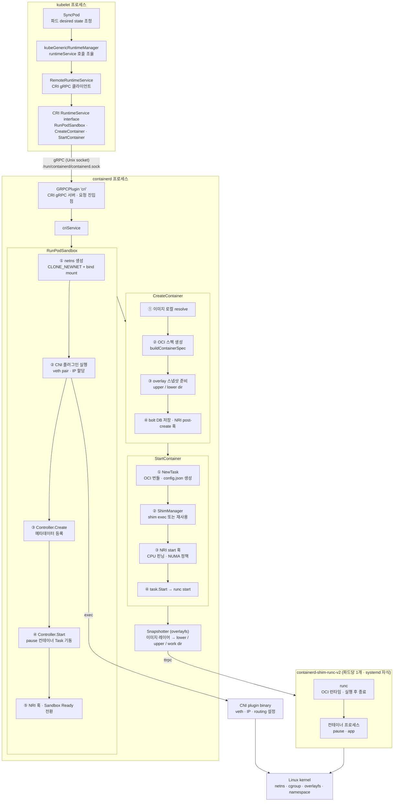

앞에서는 containerd가 kubelet, shim, CNI와 어떤 경계를 두고 상호작용하는지를 살펴봤다면, 이번에는 그 안쪽으로 한 단계 더 들어가 실제 처리 순서가 왜 그렇게 배치되는지를 따라가 보겠습니다.

# 왜 netns를 먼저 만들고 CNI를 나중에 실행하는가

`RunPodSandbox` 안으로 들어가 보면 가장 먼저 눈에 띄는 것은 처리 순서입니다. containerd는 netns를 만든 다음 CNI를 실행합니다. 얼핏 구현 세부처럼 보이지만, 이 순서는 사실상 바꿀 수 없습니다.

이유는 CNI가 netns를 입력으로 받기 때문입니다. CNI 플러그인이 수행하는 핵심 작업은 veth pair를 만들고 한쪽 끝을 파드의 네트워크 네임스페이스 안으로 옮기는 것입니다. `ip link set eth0 netns <ns>` 같은 조작이 대표적입니다. 이런 작업이 성립하려면 대상 네임스페이스가 먼저 존재해야 합니다. 그래서 CNI 플러그인은 `CNI_NETNS` 환경 변수로 전달받은 netns 경로(`/var/run/netns/cni-<uuid>`)를 전제 조건으로 사용합니다.

반대로 순서를 뒤집어 CNI를 먼저 실행한다고 가정해보면 문제가 더 분명해집니다. 플러그인은 인터페이스를 어느 네트워크 네임스페이스에 넣어야 하는지 알 수 없습니다. 네트워크 네임스페이스는 인터페이스를 담는 그릇이고, CNI는 그 그릇 안에 네트워크 장치를 배치하는 단계이기 때문입니다.

---

# 왜 네트워크 파일 단위로는 병렬이지만 플러그인 체인 내부는 직렬인가

`attachNetworks()`는 `/etc/cni/net.d/`의 설정 파일마다 goroutine을 만들어 병렬로 실행합니다. 반면 `AddNetworkList()` 안에서는 플러그인들을 하나씩 직렬로 실행합니다. 이 차이는 구현 취향이 아니라 의존성의 방향에서 나옵니다.

서로 다른 설정 파일은 서로 다른 네트워크를 담당합니다. 예를 들어 `10-bridge.conf`가 메인 CNI 체인을 처리하고 `99-loopback.conf`가 loopback 인터페이스를 처리한다면, 이 둘은 서로의 결과를 입력으로 사용하지 않습니다. 10번 파일의 결과가 99번 파일의 입력이 되지 않으니, 병렬로 돌려도 의미가 충돌하지 않습니다.

반대로 하나의 설정 파일 안에 나열된 플러그인들(`bridge` → `host-local` → `portmap` 등)은 하나의 파이프라인입니다. CNI 스펙은 앞 플러그인의 출력 결과(`Result`)를 다음 플러그인의 `prevResult` 입력으로 넘기도록 정의합니다. `bridge`가 veth pair를 만들고 반환한 인터페이스 정보가 있어야 `host-local`이 어디에 IP를 할당할지 알 수 있고, `portmap`도 이미 IP가 붙은 인터페이스를 알아야 포트 포워딩 규칙을 만들 수 있습니다. 여기서는 순서 자체가 의미입니다.

정리하면 병렬성의 단위는 독립성의 단위와 같습니다. 독립적인 것은 병렬로, 의존적인 것은 직렬로 처리합니다. go-cni 구현은 이 원칙을 그대로 코드로 옮긴 것입니다.

---

# 왜 CreateSandbox와 StartSandbox를 두 단계로 나누었는가

네트워크 설정이 끝나면 `RunPodSandbox`는 `sandboxService.CreateSandbox()`와 `StartSandbox()`를 순서대로 호출합니다. 처음 보면 둘을 한 번에 처리해도 될 것 같지만, 코드를 읽어보면 `CreateSandbox`는 메타데이터를 인메모리 store에 등록하는 정도에 그칩니다. 실행 로직을 비워 둔 채 별도 단계로 남겨 둔 데에는 이유가 있습니다.

핵심은 `sandbox.Controller` 인터페이스가 수용해야 하는 구현의 폭입니다. containerd는 runc 기반의 일반 Linux 컨테이너뿐 아니라 Kata Containers 같은 VM 기반 런타임도 지원합니다. runc 쪽에서는 pause 컨테이너를 Task로 직접 실행하는 `podsandbox.Controller`가 사용되고, Kata 쪽에서는 shim이 sandbox 생명주기 전체를 담당하는 `shim` Controller가 사용됩니다.

그래서 두 Controller의 `Start`가 하는 일도 근본적으로 다릅니다. `podsandbox.Controller.Start`는 pause 이미지를 확인하고 OCI 스펙을 생성한 뒤 Task를 기동합니다. 반면 Kata의 `shim` Controller는 `Start`에서 VM 자체를 부팅합니다. 이 과정에는 커널 로드와 에이전트 초기화 같은 무거운 작업이 포함됩니다. 이렇게 성격이 전혀 다른 구현을 같은 인터페이스로 추상화하려면, Create는 환경 준비와 의도 기록, Start는 실제 기동이라는 경계를 분명하게 나눠 둘 필요가 있습니다.

Create 단계가 메타데이터만 저장하도록 설계된 것도 같은 맥락입니다. 부작용이 거의 없는 단계는 실패해도 되돌리기 쉽습니다. 반대로 VM을 부팅했거나 Task를 실행한 뒤에 실패하면 정리해야 할 범위가 훨씬 넓어집니다. 두 단계를 분리하면 실패 처리와 롤백 책임도 단계별로 선명해집니다.

외부에서 상태를 관찰할 때도 이 구분은 유용합니다. "생성 요청은 등록됐지만 아직 실행되지는 않은 상태"와 "실제로 실행 중인 상태"는 옵저버 입장에서 전혀 다릅니다. `criService.RunPodSandbox`는 두 단계 사이에서 추가 검증을 수행할 수 있고, `sandbox.Controller`의 `Create`, `Start`, `Stop`, `Shutdown`도 각각 명확한 상태 전이를 표현하게 됩니다.

---

# 왜 CreateContainer와 StartContainer를 분리했는가

실제로 컨테이너 수준에서도 `CreateContainer`와 `StartContainer`가 분리되어 있습니다. 다만 여기서는 containerd 내부 구현보다 CRI 스펙의 영향이 더 직접적입니다. containerd가 임의로 둘을 나눈 것이 아니라, CRI 자체가 두 메서드를 별개로 정의하고 있고 containerd는 그 계약을 구현합니다.

이 분리의 이유는 kubelet의 파드 시작 흐름과 연관되어 있습니다. kubelet은 파드 안의 컨테이너를 모두 같은 방식으로 시작하지 않습니다. init 컨테이너는 앞선 컨테이너가 종료되어야 다음 컨테이너가 실행되고, 일반 컨테이너는 준비가 끝나면 함께 시작됩니다. 이 순서를 제어하려면 "실행 준비는 끝났지만 아직 프로세스는 뜨지 않은 상태"가 필요합니다.

그래서 `CreateContainer`는 이미지 스냅샷, OCI 스펙, FIFO 파이프를 준비하고 메타데이터를 저장하는 데서 멈춥니다. 이 시점에는 아직 프로세스가 없습니다. 이후 `StartContainer`가 호출되어야 비로소 shim을 통해 runc가 실행됩니다. kubelet은 모든 컨테이너에 대해 `CreateContainer`를 먼저 호출해 준비를 끝내 놓고, 원하는 순서에 맞춰 `StartContainer`를 호출할 수 있습니다.

실패 처리 측면에서도 이 분리는 이점이 큽니다. `CreateContainer`가 성공했다는 것은 적어도 이미지가 로컬에 있고 스냅샷이 준비되었다는 뜻입니다. 그다음 `StartContainer`가 실패하면, 이미 준비된 리소스를 재사용할 수 있고 정확히 어느 단계에서 실패했는지도 비교적 선명합니다. 반대로 준비와 실행이 하나의 호출에 묶여 있으면 어디까지 진행됐는지, 무엇을 되돌려야 하는지 경계가 흐려집니다.

이제 남는 질문은 `Create`는 정확히 어디까지 하는가입니다. containerd는 준비는 미리 하되, 되돌리기 어려운 부작용은 가능한 한 뒤로 미룹니다. 스냅샷 처리에서 그 성향이 가장 잘 드러납니다.

---

# 왜 스냅샷 디렉터리는 CreateContainer에서 만들고 마운트는 shim까지 미루는가

`CreateContainer`에서 overlayfs 스냅샷을 준비할 때, `createSnapshot()`은 `lowerdir`, `upperdir`, `workdir` 디렉터리를 생성하고 `[]mount.Mount` 구조체를 반환합니다. 그런데 `withNewSnapshot`은 이 반환값을 명시적으로 무시합니다. 실제 `mount(2)` 시스템 콜은 이 시점에 일어나지 않습니다. 이 이유는 크게 두 가지로 설명할 수 있습니다.

첫째, overlayfs 마운트는 컨테이너의 마운트 네임스페이스 안에서 수행되어야 자연스럽습니다. containerd가 호스트 마운트 네임스페이스에서 이를 미리 마운트해 버리면, 컨테이너가 시작될 때 그 마운트를 다시 컨테이너 쪽 네임스페이스로 옮기는 복잡한 절차가 필요합니다. 반면 shim이 runc를 실행하는 시점에는 컨테이너의 마운트 네임스페이스가 함께 설정되므로, runc가 그 과정에서 overlayfs를 구성하게 두는 편이 훨씬 단순합니다.

둘째, 정리 책임이 깔끔해집니다. `CreateContainer` 단계에서 만든 것은 디렉터리와 메타데이터뿐입니다. 만약 `StartContainer`가 호출되지 않은 채 컨테이너가 삭제된다면, 이 둘만 정리하면 됩니다. 반대로 마운트까지 미리 걸어 두었다면, 디렉터리를 지우기 전에 마운트를 먼저 해제해야 하고, 마운트 해제 실패가 후속 정리까지 막는 상황이 생길 수 있습니다. 마운트 시점을 shim으로 미루면 마운트의 수명도 shim의 수명과 거의 일치하게 되어 책임 경계가 훨씬 명확해집니다.

같은 지연 전략은 파일시스템 마운트에서 끝나지 않습니다. 이미지 레이어를 실제 스냅샷으로 풀어내는 Unpack 역시 필요한 시점까지 뒤로 미뤄집니다.

---

# 왜 이미지 Unpack이 pull 시점이 아닌 CreateContainer에서 처음 발생할 수 있는가

이제 자연스럽게 다음 질문이 이어집니다. 이미 `image pull`을 해 두었는데, 왜 어떤 이미지는 `CreateContainer`에서 처음 Unpack이 일어날까요?

containerd에서 `image pull`은 이미지 레이어를 content store에 압축된 tar 형태로 내려받는 단계입니다. 각 레이어는 SHA256 다이제스트로 식별되며, `/var/lib/containerd/io.containerd.content.v1.content/blobs/` 아래에 저장됩니다. 이 시점에는 아직 스냅샷터가 직접 관여하지 않습니다.

Unpack은 그 압축 tar를 풀어 스냅샷터가 이해하는 형태로 변환하는 단계입니다. overlay 스냅샷터라면 `snapshots/<N>/fs/`에 레이어 내용을 기록하고, bolt DB에 Committed 상태로 등록합니다. 중요한 점은, 이 작업을 pull 직후 곧바로 해버리면 containerd가 아직 모르는 정보를 성급하게 가정하게 된다는 것입니다.

대표적으로 pull 시점에는 어떤 스냅샷터를 쓸지 확정되지 않았을 수 있습니다. 같은 이미지라도 나중에 어떤 런타임 클래스와 함께 쓰이는지에 따라 overlay, nydus, zfs 등 서로 다른 스냅샷터를 선택할 수 있습니다. `CreateContainer`가 호출되어야 비로소 런타임 클래스가 결정되고, 그에 따라 어느 스냅샷터로 Unpack할지도 정해집니다.

디스크 사용량 측면에서도 지연이 유리합니다. pull 직후 바로 Unpack하면 "이미지는 미리 받아 두었지만 실제로 컨테이너는 만들지 않는" 시나리오에서도 압축을 풀어 추가 공간을 써 버리게 됩니다. content store는 레이어를 압축된 형태로 효율적으로 보관하지만, Unpack은 그보다 더 많은 공간을 요구합니다. 실제로 컨테이너를 만들 때까지 비용 지불을 늦출 수 있다면, 그 편이 더 합리적입니다.

`WithNewSnapshot`이 `s.Prepare`를 먼저 시도하고, `errdefs.IsNotFound`일 때만 `i.Unpack`을 호출하는 구조가 바로 이 지연 평가를 구현합니다. 이미 같은 이미지가 다른 컨테이너에 의해 Unpack된 적이 있다면 스냅샷이 존재하므로 Unpack을 건너뜁니다. 결국 Unpack은 pull의 필수 후속 단계가 아니라, 필요한 순간에 필요한 대상에 대해서만 한 번 수행되는 작업입니다.

---

# 요약: containerd가 반복하는 원칙

지금까지 본 결정들은 겉으로는 각각 다른 문제를 다루는 것처럼 보입니다. 그런데 한데 모아 놓고 보면 모두 비슷한 설계 감각으로 수렴합니다.

첫째, 부작용을 가능한 한 늦게 발생시킵니다. 스냅샷 마운트는 shim까지 미루고, Unpack은 컨테이너 생성 시점까지 미루고, Create 단계에는 실행 로직을 두지 않습니다. 취소하기 어려운 작업일수록 반드시 필요한 순간까지 뒤로 밉니다.

둘째, 결정을 가장 많은 정보를 아는 지점에서 내립니다. 어느 스냅샷터를 쓸지는 런타임 클래스를 알 때까지 결정하지 않고, 마운트는 컨테이너의 마운트 네임스페이스가 실제로 설정되는 시점에 수행합니다.

셋째, 동등한 수준의 것만 같은 수준에서 호출합니다. 같은 프로세스 내부의 서비스는 인메모리로, 프로세스 경계를 넘는 호출은 gRPC로, shim과의 통신은 ttrpc로 다룹니다. 성능과 격리의 필요가 실제로 생기는 경계에서만 IPC 레이어를 올립니다.

넷째, 독립적인 것은 병렬로, 의존적인 것은 직렬로 처리합니다. CNI 설정 파일 단위는 병렬이고, 플러그인 체인 내부는 직렬입니다.

다섯째, 인터페이스는 구현의 다양성을 수용합니다. `sandbox.Controller`가 runc와 Kata를 같은 인터페이스 아래에 두듯, CRI가 `CreateContainer`와 `StartContainer`를 분리해 kubelet이 실행 순서를 제어할 수 있게 하듯, 경계를 올바르게 그어 두면 내부 구현이 달라도 상위 레이어는 흔들리지 않습니다.

