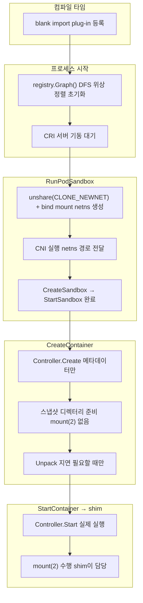

# 왜 netns를 먼저 만들고 CNI를 나중에 실행하는가

플러그인 초기화와 서비스 간 호출 이야기에서 조금 더 구체적인 영역으로 내려오면, `RunPodSandbox`의 처리 순서가 눈에 띕니다. netns를 생성하고, 그 다음에 CNI를 실행합니다. 이 순서는 뒤집을 수 없습니다.

CNI 플러그인이 수행하는 핵심 작업은 veth pair를 만들어 한쪽 끝을 파드의 네트워크 네임스페이스 안으로 이동시키는 것입니다. `ip link set eth0 netns <ns>` 와 같은 조작인데, 이것이 가능하려면 대상이 되는 네임스페이스가 먼저 존재해야 합니다. CNI 플러그인은 `CNI_NETNS` 환경 변수로 netns 경로(`/var/run/netns/cni-<uuid>`)를 전달받습니다. 이 경로가 없으면 플러그인은 실행할 수 없습니다.

반대로 생각하면 더 명확합니다. CNI가 먼저 실행된다면, 인터페이스를 어느 네임스페이스에 넣어야 하는지 알 수가 없습니다. netns는 CNI의 전제 조건입니다.

이 관계는 사실 네임스페이스의 작동 방식 자체에서 비롯됩니다. 네트워크 네임스페이스는 인터페이스를 담는 그릇과 같습니다. 그릇이 없으면 담을 수 없습니다.

---

# 왜 네트워크 파일 단위로는 병렬이지만 플러그인 체인 내부는 직렬인가

CNI 실행 방식에서 흥미로운 비대칭이 있습니다. `attachNetworks()`는 `/etc/cni/net.d/`의 설정 파일마다 goroutine을 만들어 병렬로 실행합니다. 그런데 `AddNetworkList()` 안에서는 플러그인들을 순서대로 하나씩 직렬로 실행합니다.

이 차이는 의존성 구조에서 비롯됩니다.

서로 다른 설정 파일은 서로 다른 네트워크를 담당합니다. 예를 들어 `10-bridge.conf`가 메인 CNI 체인을 처리하고 `99-loopback.conf`가 loopback 인터페이스를 처리한다면, 이 둘은 독립적입니다. 10번 파일의 결과가 99번 파일의 입력이 되지 않습니다. 따라서 병렬 실행이 안전합니다.

반면 하나의 설정 파일 안에 나열된 플러그인들(`bridge` → `host-local` → `portmap` 등)은 파이프라인을 구성합니다. CNI 스펙은 앞 플러그인의 출력 결과(`Result`)를 다음 플러그인의 `prevResult` 입력으로 전달하도록 정의합니다. `bridge` 플러그인이 veth pair를 만들고 반환한 인터페이스 정보가, `host-local`이 어느 인터페이스에 IP를 할당할지 알기 위해 필요합니다. `portmap`은 이미 IP가 할당된 인터페이스를 알아야 포트 포워딩 규칙을 만들 수 있습니다. 순서가 곧 의미입니다.

병렬성의 단위는 독립성의 단위와 같습니다. 독립적인 것은 병렬로, 의존적인 것은 직렬로. 이 원칙이 go-cni 구현에 그대로 반영되어 있습니다.

---

# 왜 CreateSandbox와 StartSandbox를 두 단계로 나누었는가

네트워크 설정이 완료되면 `RunPodSandbox`는 `sandboxService.CreateSandbox()`와 `StartSandbox()`를 순서대로 호출합니다. 코드를 읽다 보면 `CreateSandbox`는 메타데이터를 인메모리 store에 등록하는 것이 전부라는 걸 알 수 있습니다. 실행 로직은 전혀 없습니다. 왜 두 단계로 나누었을까요?

이 분리를 이해하려면 `sandbox.Controller` 인터페이스가 왜 존재하는지부터 봐야 합니다. containerd는 runc 기반의 일반 Linux 컨테이너뿐 아니라 Kata Containers 같은 VM 기반 런타임도 지원합니다. runc의 경우 pause 컨테이너를 Task로 직접 실행하는 `podsandbox.Controller`가 사용되고, Kata의 경우 shim이 sandbox 생명주기 전체를 담당하는 `shim` Controller가 사용됩니다.

두 Controller의 `Start`가 하는 일은 근본적으로 다릅니다. `podsandbox.Controller.Start`는 pause 이미지를 확인하고 OCI 스펙을 생성하고 Task를 기동합니다. Kata의 `shim` Controller는 `Start`에서 VM을 부팅합니다. VM 부팅은 커널 로드, 에이전트 초기화를 포함하는 무거운 작업입니다. 이 두 가지를 동일한 인터페이스로 추상화하려면, Create(환경 준비 및 의도 기록)와 Start(런타임 실제 기동)의 의미적 경계가 명확해야 합니다.

Create 단계가 메타데이터만 저장하는 것은 일부러 그렇게 설계한 것입니다. 부작용이 없는 단계는 실패해도 되돌리기 쉽습니다. 반면 VM을 부팅했거나 Task를 실행한 상태에서 실패하면 정리해야 할 것이 많습니다. 두 단계를 분리함으로써 각 단계의 실패 처리와 롤백 범위가 명확해집니다.

외부에서도 두 상태를 구분할 수 있게 됩니다. "생성 요청이 등록되었으나 아직 실행되지 않은" 상태와 "실제로 실행 중인" 상태는 옵저버 입장에서 의미가 다릅니다. `criService.RunPodSandbox`는 두 단계 사이에서 추가 검증을 할 수 있고, `sandbox.Controller` 인터페이스의 `Create`, `Start`, `Stop`, `Shutdown`은 각각 명확한 상태 전이를 표현합니다.

---

# 왜 CreateContainer와 StartContainer를 분리했는가

sandbox 수준에서 Create/Start를 나눈 것과 동일한 논리가 컨테이너 수준에서도 반복됩니다. 그런데 이 분리는 containerd 내부의 설계 결정이라기보다 CRI 스펙 자체가 이 두 메서드를 별개로 정의하고 있습니다. containerd는 이 스펙을 구현한 것입니다.

그렇다면 CRI는 왜 두 메서드로 나누었을까요?

kubelet의 파드 시작 흐름을 생각해보면 이유가 보입니다. kubelet은 파드 안의 여러 컨테이너를 시작할 때 init 컨테이너와 일반 컨테이너를 구분합니다. init 컨테이너는 순서대로 실행되어야 하고, 앞선 init 컨테이너가 완료되어야 다음 init 컨테이너가 시작됩니다. 일반 컨테이너들은 모두 준비되면 함께 시작됩니다. 이 흐름을 구현하려면 "준비는 해두되 아직 실행하지 않는" 상태가 필요합니다.

`CreateContainer`는 이미지 스냅샷, OCI 스펙, FIFO 파이프를 준비하고 메타데이터를 bolt DB에 저장합니다. 프로세스는 아직 없습니다. `StartContainer`가 호출될 때 비로소 shim을 통해 runc가 실행됩니다. kubelet은 모든 컨테이너에 대해 `CreateContainer`를 먼저 호출해 리소스를 준비해두고, 실행 순서를 제어하면서 `StartContainer`를 호출합니다.

또 다른 이점은 실패 처리입니다. `CreateContainer`가 성공했다는 것은 이미지가 로컬에 있고 스냅샷이 준비되었다는 것을 의미합니다. `StartContainer`가 실패하면 이미 준비된 리소스를 재사용하거나 정확히 어느 시점에서 실패했는지를 파악하기 쉽습니다. 준비와 실행이 하나의 호출에 묶여 있다면, 이 두 단계 중 어느 쪽이 실패했는지 구분이 어렵고 재시도 범위도 불명확해집니다.

---

# 왜 스냅샷 디렉터리는 CreateContainer에서 만들고 마운트는 shim까지 미루는가

`CreateContainer`에서 overlayfs 스냅샷을 준비할 때, `createSnapshot()`은 `lowerdir`, `upperdir`, `workdir` 디렉터리를 생성하고 `[]mount.Mount` 구조체를 반환합니다. 그런데 `withNewSnapshot`은 이 반환값을 명시적으로 무시합니다. 실제 `mount(2)` 시스템 콜은 이 시점에 발생하지 않습니다.

왜 마운트를 미루는가에는 두 가지 이유가 있습니다.

첫째, overlayfs 마운트는 컨테이너의 마운트 네임스페이스 안에서 수행되어야 합니다. containerd가 호스트 마운트 네임스페이스에서 overlayfs를 미리 마운트하면, 컨테이너가 시작될 때 그 마운트를 컨테이너의 마운트 네임스페이스로 옮기는 복잡한 과정이 필요합니다. shim이 runc를 실행하면, runc는 컨테이너의 마운트 네임스페이스를 설정하는 과정에서 overlayfs를 구성합니다. 이것이 훨씬 자연스럽습니다.

둘째, 정리(cleanup) 책임이 명확해집니다. `CreateContainer`는 디렉터리와 메타데이터를 만들었습니다. `StartContainer`가 호출되지 않은 채 컨테이너가 삭제된다면, 정리해야 할 것은 디렉터리와 메타데이터뿐입니다. 마운트가 이미 걸려 있었다면, 마운트를 해제하고 나서 디렉터리를 지워야 하는 두 단계가 됩니다. 마운트 해제 실패가 디렉터리 정리를 막는 상황도 생길 수 있습니다. 마운트 시점을 shim으로 미루면, 마운트 수명이 shim 수명과 일치하게 됩니다. shim이 종료되면 마운트도 해제됩니다.

---

# 왜 이미지 Unpack이 pull 시점이 아닌 CreateContainer에서 처음 발생할 수 있는가

containerd에서 `image pull`은 이미지 레이어를 content store에 압축된 tar 형태로 내려받는 것입니다. 각 레이어는 SHA256 다이제스트로 식별되며, `/var/lib/containerd/io.containerd.content.v1.content/blobs/` 아래에 저장됩니다. 이 시점에는 아직 스냅샷터가 관여하지 않습니다.

Unpack은 이 압축 tar를 풀어 스냅샷터가 이해하는 형태로 변환하는 과정입니다. overlay 스냅샷터라면 `snapshots/<N>/fs/`에 레이어 내용을 기록하고, bolt DB에 Committed 상태로 등록합니다. pull 시점에 미리 하면 안 되는 이유가 있습니다.

어느 스냅샷터를 쓸지를 pull 시점에는 모를 수 있습니다. 같은 이미지가 나중에 어떤 런타임 클래스와 함께 사용될지 알 수 없으며, 클러스터에는 overlay, nydus, zfs 등 여러 스냅샷터가 공존할 수 있습니다. `CreateContainer`가 호출되어야 비로소 런타임 클래스가 결정되고, 그에 따라 어떤 스냅샷터로 Unpack할지도 결정됩니다.

게다가 pull 후 바로 Unpack하면 "이미지를 캐시해두기 위해 pull했으나 실제로 컨테이너는 만들지 않는" 시나리오에서 디스크를 낭비합니다. content store는 레이어를 압축 형태로 효율적으로 저장합니다. Unpack은 압축을 풀어 더 많은 공간을 사용하는 작업입니다. 실제로 컨테이너를 만들 때까지 이 비용을 지불하지 않아도 됩니다.

`WithNewSnapshot`이 `s.Prepare`를 먼저 시도하고, `errdefs.IsNotFound`일 때만 `i.Unpack`을 호출하는 구조가 이 지연 평가를 구현합니다. 이미 Unpack된 적이 있다면(다른 컨테이너가 같은 이미지를 먼저 사용했다면) 스냅샷이 존재하므로 Unpack을 건너뜁니다. Unpack은 필요할 때, 필요한 대상을 위해 한 번만 수행됩니다.

---

# 요약: containerd가 반복하는 원칙

지금까지 여덟 가지 설계 결정을 살펴봤습니다. 개별 이유들을 모아보면 공통된 패턴이 있습니다.

첫째, 부작용을 가능한 한 늦게 발생시킵니다. 스냅샷 마운트는 shim까지 미루고, Unpack은 컨테이너 생성 시점까지 미루고, Create 단계에는 실행 로직을 두지 않습니다. 취소하기 어려운 작업일수록, 반드시 필요한 시점까지 뒤로 밉니다.

둘째, 결정을 가장 많은 정보를 아는 지점에서 내립니다. 어느 스냅샷터를 쓸지는 런타임 클래스를 알 때까지 결정하지 않습니다. 마운트는 컨테이너의 마운트 네임스페이스가 만들어지는 시점, 즉 shim이 처리하는 시점에 수행합니다.

셋째, 동등한 수준의 것만 같은 수준에서 호출합니다. 같은 프로세스 내부의 서비스는 인메모리로, 프로세스 경계를 넘는 호출은 gRPC로, shim과의 통신은 ttrpc로 다룹니다. 성능과 격리의 필요가 실제로 있는 경계에서만 IPC 레이어를 씁니다.

넷째, 독립적인 것은 병렬로, 의존적인 것은 직렬로. CNI 설정 파일 단위는 병렬, 플러그인 체인 내부는 직렬.

다섯째, 인터페이스는 구현의 다양성을 수용합니다. `sandbox.Controller`가 runc와 Kata를 동일한 인터페이스로 추상화하듯, CRI가 `CreateContainer`와 `StartContainer`를 분리하여 kubelet이 실행 순서를 제어할 수 있게 하듯, 경계를 올바르게 그으면 그 안의 구현이 달라져도 상위 레이어는 영향을 받지 않습니다.

