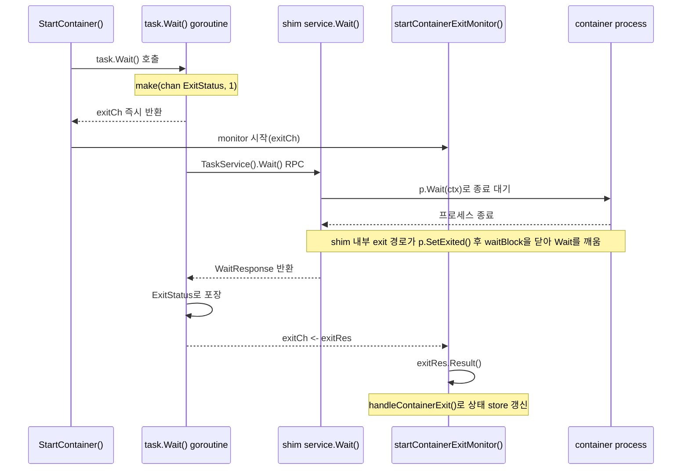
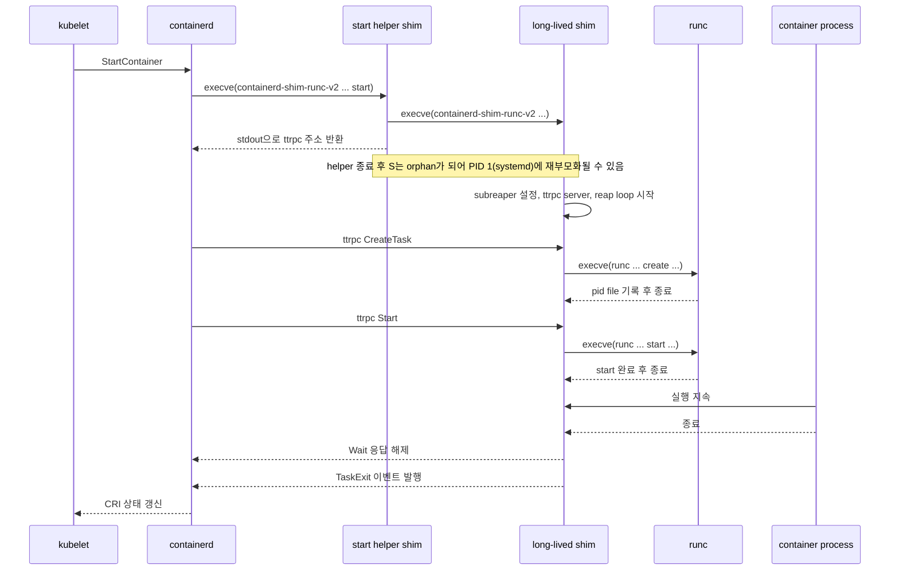

이전 포스트에서는 kubelet의 `CreateContainer`와 `StartContainer` 요청이 containerd 내부를 지나 `NewTask()`까지 내려가는 흐름을 추적했습니다. 다만 그 다음 단계, 즉 containerd 내부에서 어디서 `ShimManager.Start()`가 호출되고 거기서 shim 재사용과 새 shim 기동이 어떻게 갈리는지는 충분히 펼쳐 보지 못했습니다. 흐름을 따라가다 보면 `containerd-shim-runc-v2`가 계속 등장하지만, 정작 이 프로세스가 왜 필요하고 내부에서 무엇을 맡는지는 아직 따로 정리하지 못했습니다.

이번 글에서는 바로 그 빈칸을 메우겠습니다. containerd가 shim 프로세스를 어떻게 띄우는지, shim이 내부에서 어떻게 `runc create`와 `runc start`를 호출하는지, 그리고 `runc`가 사라진 뒤에도 shim이 왜 계속 살아 있으면서 컨테이너 종료를 감시하는지를 차례로 살펴보겠습니다.

---

## Shim이 존재하는 이유와 shim 기동 과정의 출발점

shim이 필요한 이유는 한 문장으로 요약할 수 있습니다. 컨테이너 프로세스의 수명을 containerd 데몬의 수명과 분리하기 위해서입니다.

만약 containerd가 직접 `runc`를 실행하고 직접 자식 프로세스를 기다리는 구조라면, containerd가 재시작되는 순간 부모 프로세스가 사라집니다. 그러면 실행 중인 컨테이너는 남아 있어도 누가 exit status를 수집하고, 누가 stdio와 cgroup 상태를 관리하고, 누가 나중에 재연결 지점을 제공할지가 불분명해집니다. shim은 바로 이 공백을 메우는 프로세스입니다.

여기에 `runc`의 성격이 더해집니다. `runc`는 데몬이 아니라 OCI 런타임 CLI입니다. `runc create`와 `runc start`는 컨테이너 초기화 작업을 수행한 뒤 돌아갑니다. 즉, `runc` 자신은 장기 실행 상태를 유지하지 않습니다. 그래서 컨테이너를 띄운 뒤에도 남아서 감시할 별도 프로세스가 필요합니다.

이 전제를 먼저 잡고 나면, CRI에서 shim을 어떤 단위로 묶는지도 자연스럽게 이어집니다. containerd 2.2.1의 CRI 경로에서는 sandbox-aware shim이면 여러 컨테이너를 하나의 sandbox shim 아래로 묶을 수 있고, 그 기준이 바로 sandbox ID입니다.

```go
// https://github.com/containerd/containerd/blob/dea7da592f5d1/cmd/containerd-shim-runc-v2/manager/manager_linux.go#L65
var groupLabels = []string{
	"io.containerd.runc.v2.group",
	"io.kubernetes.cri.sandbox-id", // ✅ CRI에서는 sandbox ID를 shim 그룹 키로 사용
}
```

즉, 오늘날 CRI의 기본 그림은 "컨테이너마다 shim 하나"보다 "pod sandbox마다 shim 하나"에 더 가깝습니다. 정확히는 shim이 sandbox API version 3 이상을 지원할 때 그렇고, 구버전 shim이면 containerd는 다시 shim 바이너리를 직접 띄우는 보수적 경로로 돌아갑니다.

다만 여기서 pod 단위로 묶이는 대상을 task나 bundle로 읽으면 안 됩니다. runtime v2 task manager가 다루는 task와 OCI bundle은 여전히 개별 task 기준이며, CRI의 일반 workload container 경로에서는 사실상 container ID 기준입니다. pod 단위로 공유되는 것은 shim endpoint 쪽이고, 각 container task는 자기 bundle을 가진 채 그 endpoint에 붙습니다.

이제 이 배경을 실제 호출 흐름 위에 얹어 보겠습니다. 이전 포스트의 `Task 생성 — shim 기동과 OCI 번들 준비`에서 보았던 `container.NewTask()` 호출이 바로 이 흐름의 입구입니다.

```go
// https://github.com/containerd/containerd/blob/dea7da592f5d1/internal/cri/server/container_start.go#L217
func (c *criService) StartContainer(ctx context.Context, r *runtime.StartContainerRequest) (retRes *runtime.StartContainerResponse, retErr error) {
	// ...
	task, err := container.NewTask(ctx, ioCreation, taskOpts...) // ✅ cri 5편에서 본 진입점
	// ...
}
```

해당 부분에서 하위 호출 줄까지 따라가 보겠습니다. 핵심은 `container.NewTask()`가 곧바로 shim의 `CreateTask` RPC로 들어가는 것이 아니라, containerd 내부의 task service와 runtime/v2 계층을 차례로 통과한 뒤 먼저 `ShimManager.Start()`를 수행한다는 점입니다.

```go
// https://github.com/containerd/containerd/blob/dea7da592f5d1/client/container.go#L241-L299
func (c *container) NewTask(ctx context.Context, ioCreate cio.Creator, opts ...NewTaskOpts) (_ Task, retErr error) {
	// ...
	request := &tasks.CreateTaskRequest{
		ContainerID: c.id,
		Terminal:    cfg.Terminal,
		Stdin:       cfg.Stdin,
		Stdout:      cfg.Stdout,
		Stderr:      cfg.Stderr,
	}
	// ...
	response, err := c.client.TaskService().Create(ctx, request) // ✅ 먼저 containerd task service로 전달
	if err != nil {
		return nil, errgrpc.ToNative(err)
	}
	// ...
}
```

`TaskService().Create()`는 바로 shim으로 가는 것이 아니라, containerd의 tasks 서비스 플러그인으로 들어갑니다.

```go
// https://github.com/containerd/containerd/blob/dea7da592f5d1/plugins/services/tasks/service.go#L62-L64
func (s *service) Create(ctx context.Context, r *api.CreateTaskRequest) (*api.CreateTaskResponse, error) {
	return s.local.Create(ctx, r) // ✅ gRPC service -> local task service 위임
}
```

그 다음 `local.Create()`가 CRI 요청을 `TaskManager`가 이해하는 `runtime.CreateOpts`로 변환한 뒤, 실제 runtime 구현인 `rtime.Create()`를 호출합니다.

여기서도 단위를 한 번 고정해 두는 편이 좋습니다. 아래 호출에서 `rtime.Create(ctx, r.ContainerID, opts)`로 내려가는 값이 runtime v2 쪽의 `taskID`가 되고, 이어서 `TaskManager.Create()`는 그 `taskID`로 bundle을 만듭니다. 즉 CRI의 일반 workload container 경로에서는 task와 bundle이 pod 기준이 아니라 container 기준으로 만들어집니다.

```go
// https://github.com/containerd/containerd/blob/dea7da592f5d1/plugins/services/tasks/local.go#L161-L255
func (l *local) Create(ctx context.Context, r *api.CreateTaskRequest, _ ...grpc.CallOption) (*api.CreateTaskResponse, error) {
	container, err := l.getContainer(ctx, r.ContainerID)
	if err != nil {
		return nil, errgrpc.ToGRPC(err)
	}

	// ...
	opts := runtime.CreateOpts{
		Spec:           container.Spec,
		IO:             runtime.IO{Stdin: r.Stdin, Stdout: r.Stdout, Stderr: r.Stderr, Terminal: r.Terminal},
		Runtime:        container.Runtime.Name,
		RuntimeOptions: container.Runtime.Options,
		TaskOptions:    r.Options,
		SandboxID:      container.SandboxID,
		Address:        taskAPIAddress,
		Version:        taskAPIVersion,
	}
	// ...
	c, err := rtime.Create(ctx, r.ContainerID, opts) // ✅ 여기서 runtime/v2 TaskManager.Create로 내려감
	if err != nil {
		return nil, errgrpc.ToGRPC(err)
	}
	// ...
}
```

이제부터가 `TaskManager` 내부입니다. `TaskManager.Create()`는 먼저 `NewBundle()`로 OCI 번들을 만들고, 그 다음 `m.manager.Start()`로 shim endpoint를 확보합니다. 그리고 shim 연결이 준비되면 `shimTask.Create()`로 실제 shim `CreateTask` RPC를 보냅니다.

```go
// https://github.com/containerd/containerd/blob/dea7da592f5d1/core/runtime/v2/task_manager.go#L153-L237
func (m *TaskManager) Create(ctx context.Context, taskID string, opts runtime.CreateOpts) (_ runtime.Task, retErr error) {
	bundle, err := NewBundle(ctx, m.root, m.state, taskID, opts.Spec) // ✅ bundle/config.json 준비
	if err != nil {
		return nil, err
	}
	// ...
	shim, err := m.manager.Start(ctx, taskID, bundle, opts) // ✅ 기존 shim 재사용 또는 새 shim bootstrap
	if err != nil {
		return nil, fmt.Errorf("failed to start shim: %w", err)
	}

	shimTask, err := newShimTask(shim) // ✅ shim client를 Task 인터페이스로 래핑
	if err != nil {
		return nil, err
	}

	t, err := func() (runtime.Task, error) {
		t, err := shimTask.Create(ctx, opts) // ✅ 여기서부터 실제 shim CreateTask RPC
		if err == nil || !errdefs.IsNotImplemented(err) {
			return t, err
		}
		// ...
		return t, err
	}()
	// ...
}
```

즉, `ShimManager.Start()`는 실제 shim RPC보다 앞선 bootstrap 단계입니다. 실제 shim 쪽 `TaskService/Create`는 아래 `shimTask.Create()`에서 시작됩니다.

```go
// https://github.com/containerd/containerd/blob/dea7da592f5d1/core/runtime/v2/shim.go#L594-L621
func (s *shimTask) Create(ctx context.Context, opts runtime.CreateOpts) (runtime.Task, error) {
	request := &task.CreateTaskRequest{
		ID:         s.ID(),
		Bundle:     s.Bundle(),
		Stdin:      opts.IO.Stdin,
		Stdout:     opts.IO.Stdout,
		Stderr:     opts.IO.Stderr,
		Terminal:   opts.IO.Terminal,
		Checkpoint: opts.Checkpoint,
		Options:    typeurl.MarshalProto(topts),
	}
	// ...
	_, err := s.task.Create(ctx, request) // ✅ 이미 연결된 shim endpoint로 TaskService/Create 전송
	if err != nil {
		return nil, errgrpc.ToNative(err)
	}
	// ...
}
```

따라서 cri 5편의 `NewTask()` 설명 바로 다음에는 아래 `ShimManager.Start()`가 오고, 그 다음에야 `shimTask.Create()`를 통해 shim RPC 본문으로 들어갑니다.

```go
// https://github.com/containerd/containerd/blob/dea7da592f5d1/core/runtime/v2/shim_manager.go#L226
func (m *ShimManager) Start(ctx context.Context, id string, bundle *Bundle, opts runtime.CreateOpts) (_ ShimInstance, retErr error) {
	// ...
	const supportSandboxAPIVersion = 3
	if params.Version < supportSandboxAPIVersion {
		shouldInvokeShimBinary = true // ✅ sandbox-aware shim이 아니면 새 shim 기동 경로로 감
	}

	if !shouldInvokeShimBinary {
		if err := os.WriteFile(filepath.Join(bundle.Path, "sandbox"), []byte(opts.SandboxID), 0600); err != nil {
			return nil, err
		}

		if err := writeBootstrapParams(filepath.Join(bundle.Path, "bootstrap.json"), params); err != nil {
			return nil, fmt.Errorf("failed to write bootstrap.json for bundle %s: %w", bundle.Path, err)
		}

		shim, err := loadShim(ctx, bundle, func() {}) // ✅ 기존 sandbox shim에 재연결
		// ...
		return shim, nil
	}

	return m.startShim(ctx, bundle, id, opts) // ✅ 필요하면 새 shim 바이너리 기동
}
```

정리하면 shim의 존재 이유는 세 가지입니다.

- containerd 재시작과 컨테이너 실행 수명을 분리하기 위해
- 장기 실행 데몬이 아닌 `runc` 대신 계속 남아 있을 프로세스가 필요하기 때문에
- pod 단위 그룹화, exit 감시, 이벤트 전달 같은 장기 책임을 한곳에 모으기 위해

이제 이 역할이 실제 코드에서 어떻게 새 shim bootstrap으로 이어지는지, 방금 본 `m.startShim(...)` 분기를 따라가 보겠습니다.

---

## Shim 바이너리 기동 흐름

앞 절에서는 shim이 왜 필요한지와 `ShimManager.Start()`의 분기까지 확인했습니다. 이제부터는 그중에서도 `return m.startShim(ctx, bundle, id, opts)`로 내려가는 "새 shim 기동" 경로만 따로 떼어서 보겠습니다.

다만 이 절은 `ShimManager.Start()`의 모든 경우를 대표하는 기본 경로가 아니라, 새 shim 프로세스를 실제로 띄우는 분기만 확대해서 보는 것입니다. sandbox-aware shim version 3 이상인 현재 CRI 기본 경로에서는 일반 workload container가 여기로 매번 내려오지 않습니다. 그런 container들은 바로 앞에서 본 `!shouldInvokeShimBinary` 경로로 기존 pod sandbox shim의 bootstrap 정보를 가져와 자기 bundle에 기록한 뒤, 같은 shim endpoint에 재연결합니다.

즉, 새 shim 기동이 중심이 되는 경우는 pause sandbox 자체를 처음 만들 때나, 구버전 shim 또는 호환성 fallback 때문에 containerd가 새 shim 바이너리를 다시 띄워야 할 때라고 이해하시는 편이 정확합니다.

```go
// https://github.com/containerd/containerd/blob/dea7da592f5d1/core/runtime/v2/task_manager.go#L199
func (m *TaskManager) Create(ctx context.Context, taskID string, opts runtime.CreateOpts) (_ runtime.Task, retErr error) {
	// ...
	shim, err := m.manager.Start(ctx, taskID, bundle, opts)
	if err != nil {
		return nil, fmt.Errorf("failed to start shim: %w", err)
	}

	shimTask, err := newShimTask(shim)
	if err != nil {
		return nil, err
	}

	t, err := shimTask.Create(ctx, opts)
	// ...
	return t, err
}

// https://github.com/containerd/containerd/blob/dea7da592f5d1/core/runtime/v2/shim_manager.go#L231
func (m *ShimManager) Start(ctx context.Context, id string, bundle *Bundle, opts runtime.CreateOpts) (_ ShimInstance, retErr error) {
	// ...
	if !shouldInvokeShimBinary {
		// ...
		return shim, nil
	}

	return m.startShim(ctx, bundle, id, opts)
}
```

여기서 먼저 짚어둘 점은 `opts.Runtime`가 이 단계에서는 `runc`가 아니라 shim 런타임 이름이라는 점입니다. 예를 들어 `io.containerd.runc.v2`는 `resolveRuntimePath()`를 거치면서 실제 파일 시스템 경로의 `containerd-shim-runc-v2` 바이너리로 해석됩니다. 즉 `binary.Start()`가 처음 실행하는 것은 `runc`가 아니라 shim 바이너리입니다.

```go
// https://github.com/containerd/containerd/blob/dea7da592f5d1/core/runtime/v2/shim_manager.go#L282
func (m *ShimManager) startShim(ctx context.Context, bundle *Bundle, id string, opts runtime.CreateOpts) (*shim, error) {
	// ...
	runtimePath, err := m.resolveRuntimePath(opts.Runtime)
	// ...

	b := shimBinary(bundle, shimBinaryConfig{
		runtime:      runtimePath,
		address:      m.containerdAddress,
		ttrpcAddress: m.containerdTTRPCAddress,
		env:          m.env,
	})
	shim, err := b.Start(ctx, typeurl.MarshalProto(topts), func() {
		// ...
	})
	// ...
	return shim, nil
}
```

이제 그 아래 `binary.Start()`를 보면 containerd가 bootstrap helper용 shim 프로세스를 직접 띄우는 지점이 나옵니다.

```go
// https://github.com/containerd/containerd/blob/dea7da592f5d1/core/runtime/v2/binary.go#L63
func (b *binary) Start(ctx context.Context, opts *types.Any, onClose func()) (_ *shim, err error) {
	args := []string{"-id", b.bundle.ID}
	args = append(args, "start") // ✅ 먼저 bootstrap 경로로 실행

	cmd, err := client.Command(ctx, &client.CommandConfig{
		Runtime:      b.runtime,
		Address:      b.containerdAddress,
		TTRPCAddress: b.containerdTTRPCAddress,
		Path:         b.bundle.Path,
		Opts:         opts,
		Args:         args,
		Env:          b.env,
	})
	// ...
	out, err := cmd.CombinedOutput()
	response := bytes.TrimSpace(out)

	params, err := parseStartResponse(response) // ✅ stdout JSON을 BootstrapParams로 파싱
	conn, err := makeConnection(ctx, b.bundle.ID, params, onCloseWithShimLog)

	if err := writeBootstrapParams(filepath.Join(b.bundle.Path, "bootstrap.json"), params); err != nil {
		return nil, fmt.Errorf("failed to write bootstrap.json: %w", err)
	}

	return &shim{bundle: b.bundle, client: conn, address: fmt.Sprintf("%s+%s", params.Protocol, params.Address), version: params.Version}, nil
}
```

하지만 이것만 보면 실제 argv가 충분히 드러나지 않습니다. 한 단계 더 내려가면 containerd가 shell script를 실행하는 것이 아니라 `exec.CommandContext()`로 shim 바이너리를 곧장 `execve(2)` 한다는 점이 분명해집니다.

```go
// https://github.com/containerd/containerd/blob/dea7da592f5d1/pkg/shim/util.go#L53
func Command(ctx context.Context, config *CommandConfig) (*exec.Cmd, error) {
	args := []string{
		"-namespace", ns,
		"-address", config.Address,
		"-publish-binary", self,
	}
	args = append(args, config.Args...)
	cmd := exec.CommandContext(ctx, config.Runtime, args...)
	// ...
}
```

따라서 첫 번째 bootstrap helper는 shell에서 아래 명령을 친 것과 거의 같은 효과를 냅니다.

```bash
containerd-shim-runc-v2 \
  -namespace <ns> \
  -address <containerd-grpc-address> \
  -publish-binary <containerd-binary-path> \
  -id <task-id> \
  start
```

이 첫 번째 프로세스는 장수 shim 서버 자체가 아니라 bootstrap helper입니다. 역할은 두 가지뿐입니다.

- 장수 shim을 실제로 한 번 더 띄운다.
- 그 장수 shim의 접속 주소를 stdout JSON으로 containerd에 돌려준다.

출발점은 아래 `main()`과 `run()`입니다.

```go
// https://github.com/containerd/containerd/blob/dea7da592f5d1/cmd/containerd-shim-runc-v2/main.go#L29
func main() {
	shim.Run(context.Background(), manager.NewShimManager("io.containerd.runc.v2"))
}
```

```go
// https://github.com/containerd/containerd/blob/dea7da592f5d1/pkg/shim/shim.go#L198-L302
func Run(ctx context.Context, manager Manager, opts ...BinaryOpts) {
	// ...
	if err := run(ctx, manager, config); err != nil {
		// ...
	}
}

func run(ctx context.Context, manager Manager, config Config) error {
	// ...
	switch action {
	case "start":
		opts := StartOpts{Address: addressFlag, TTRPCAddress: ttrpcAddress, Debug: debugFlag}
		params, err := manager.Start(ctx, id, opts) // ✅ 여기서 장수 shim 서버를 준비시키고, 현재 start용 shim 프로세스는 접속 정보만 반환
		// ...
		if _, err := os.Stdout.Write(data); err != nil {
			return err
		}
		return nil // ✅ 이 start용 shim 프로세스는 주소만 전달하고 종료
	}

	// ✅ action이 없으면 실제 장수 shim 서버 초기화로 계속 진행
	if !config.NoSetupLogger {
		// ...
	}
}
```

위 `manager`는 `main()`에서 `manager.NewShimManager(...)`로 넘긴 구현체이므로, 여기의 `manager.Start(...)`는 곧 `cmd/containerd-shim-runc-v2/manager/manager_linux.go`의 `Start()` 구현으로 연결됩니다. 즉 "장수 shim을 실제로 띄우는" 지점은 `run(action="start")` 안쪽의 `manager.Start()`입니다.

```go
// https://github.com/containerd/containerd/blob/dea7da592f5d1/cmd/containerd-shim-runc-v2/manager/manager_linux.go#L184-L232
func (manager) Start(ctx context.Context, id string, opts shim.StartOpts) (_ shim.BootstrapParams, retErr error) {
	var params shim.BootstrapParams
	params.Version = 3
	params.Protocol = "ttrpc"

	cmd, err := newCommand(ctx, id, opts.Address, opts.TTRPCAddress, opts.Debug) // ✅ 장수 shim 실행 명령 준비
	// ...
	s, err := newShimSocket(ctx, opts.Address, grouping, false)
	cmd.ExtraFiles = append(cmd.ExtraFiles, s.f) // ✅ 장수 shim이 바로 쓸 소켓 fd 전달

	if err := cmd.Start(); err != nil { // ✅ 여기서 장수 shim 프로세스 생성
		return params, err
	}
	// ...

	params.Address = sockets[0].addr // ✅ 현재 start용 shim 프로세스가 containerd에 돌려줄 접속 주소
	return params, nil
}
```

```go
// https://github.com/containerd/containerd/blob/dea7da592f5d1/cmd/containerd-shim-runc-v2/manager/manager_linux.go#L95-L109
func newCommand(ctx context.Context, id, containerdAddress, containerdTTRPCAddress string, debug bool) (*exec.Cmd, error) {
	// ...
	args := []string{
		"-namespace", ns,
		"-id", id,
		"-address", containerdAddress,
	}
	cmd := exec.Command(self, args...) // ✅ 두 번째 shim 프로세스는 "start" 없이 재실행
	cmd.Dir = cwd
	cmd.SysProcAttr = &syscall.SysProcAttr{
		// ✅ 새 process group만 만든다
		// ✅ 부모-자식 관계는 바꾸지 않는다
		Setpgid: true,
	}
	return cmd, nil
}
```

`exec.Command(self, args...)`에서 현재 실행 중인 `containerd-shim-runc-v2` 바이너리 경로를 얻고, 그 바이너리를 `exec.Command(self, args...)`로 그대로 다시 실행합니다. 즉 두 번째 프로세스는 "start용 shim helper가 같은 shim 바이너리를 start 인자 없이 재실행한 것"입니다.

shell에서 적으면 아래와 비슷한 효과입니다.

```bash
containerd-shim-runc-v2 \
	-namespace <ns> \
	-id <task-id> \
	-address <containerd-grpc-address>
```

`manager.Start()`는 `newShimSocket()`으로 미리 열어 둔 소켓 FD를 `cmd.ExtraFiles`로 넘깁니다. 그래서 두 번째 프로세스는 "주소를 다시 계산해서 listen하는" 것이 아니라, 부모가 넘겨준 이미 열린 socket FD를 이어받아 장수 shim 서버의 리스너로 사용합니다.

containerd가 첫 번째 프로세스의 stdout을 기다리는 이유도 여기서 자연스럽게 보입니다. containerd는 자신이 예상한 주소로 바로 붙는 것이 아니라, helper가 장수 shim을 띄우고 소켓 준비까지 끝낸 뒤 stdout으로 돌려준 `BootstrapParams`를 받아 그 값으로 접속합니다. 즉 첫 번째 start용 shim은 "이제 이 주소로 붙어라"를 확인해 주는 bootstrap helper입니다.

```go
// https://github.com/containerd/containerd/blob/dea7da592f5d1/pkg/shim/util_unix.go#L79-L87
func SocketAddress(ctx context.Context, socketPath, id string, debug bool) (string, error) {
	ns, err := namespaces.NamespaceRequired(ctx)
	if err != nil {
		return "", err
	}
	path := filepath.Join(socketPath, ns, id)
	d := sha256.Sum256([]byte(path))
	return fmt.Sprintf("unix://%s/%x", filepath.Join(socketRoot, "s"), d), nil // ✅ 주소 자체는 namespace/id 기준으로 결정적 계산
}
```

이 구조를 시간순으로 풀면 아래와 같습니다.

1. containerd가 `containerd-shim-runc-v2 ... start`를 직접 `execve`합니다.
2. 첫 번째 helper shim 프로세스는 `main()` -> `shim.Run()` -> `run(action="start")` 경로로 들어갑니다.
3. helper는 `manager.Start()` 안에서 같은 shim 바이너리를 다시 한 번 `execve`해 장수 shim 프로세스를 만듭니다.
4. helper는 장수 shim의 socket FD와 주소 준비가 끝나면 `BootstrapParams`를 stdout에 쓰고 종료합니다.
5. containerd는 그 stdout을 읽어 접속 정보를 파싱하고 `bootstrap.json`에 기록한 뒤 장수 shim endpoint에 붙습니다.
6. 두 번째 프로세스는 이제 `run(action="")` 경로로 들어가 장수 shim 서버 초기화를 계속 진행합니다.

여기서 `bootstrap.json`에는 방금 확보한 shim endpoint 정보가 기록됩니다. 이 파일은 이후 shim 복구 경로의 핵심 입력이 되지만, 그 복구 절차 자체는 별도 글에서 다루겠습니다.

stdout 응답이 구버전 shim일 수도 있기 때문에 containerd는 파싱도 약간 보수적으로 합니다.

```go
// https://github.com/containerd/containerd/blob/dea7da592f5d1/core/runtime/v2/shim.go#L222
func parseStartResponse(response []byte) (client.BootstrapParams, error) {
	var params client.BootstrapParams

	if err := json.Unmarshal(response, &params); err != nil || params.Version < 2 {
		params.Address = string(response) // ✅ 예전 shim은 주소 문자열만 stdout에 쓸 수 있음
		params.Protocol = "ttrpc"
		params.Version = 2
	}

	return params, nil
}
```

여기까지가 containerd가 shim endpoint를 확보하는 bootstrap 단계입니다.

## 장수 shim 서버 초기화와 대기

이제부터는 두 번째 프로세스만 보면 됩니다. 이 프로세스는 같은 `main()`으로 다시 들어오지만 이번에는 `action`이 비어 있으므로 `case "start"`로 빠지지 않고 장수 shim 서버 초기화로 계속 내려갑니다. 이 연결도 실제 코드로 보면 아래처럼 이어집니다.

```go
// https://github.com/containerd/containerd/blob/dea7da592f5d1/cmd/containerd-shim-runc-v2/main.go#L29
func main() {
	shim.Run(context.Background(), manager.NewShimManager("io.containerd.runc.v2"))
}

// https://github.com/containerd/containerd/blob/dea7da592f5d1/pkg/shim/shim.go#L238
func run(ctx context.Context, manager Manager, config Config) error {
	// ...
	signals, err := setupSignals(config)
	if err != nil {
		return err
	}

	if !config.NoSubreaper {
		if err := subreaper(); err != nil {
			return err
		}
	}

	// Handle explicit actions
	switch action {
	case "start":
		// ...
		return nil
	}

	if !config.NoSetupLogger {
		ctx, err = setLogger(ctx, id)
		if err != nil {
			return err
		}
	}
	// ...
}
```

여기서 중요한 순서는 아래와 같습니다.

- `setupSignals()`가 `SIGTERM`, `SIGINT`, `SIGPIPE`, `SIGCHLD`를 받을 채널을 준비합니다.
- `subreaper()`가 장수 shim을 descendant reaper로 설정합니다. (즉, shim이 직접 낳은 자식뿐 아니라 그 자식이 다시 만든 후손 프로세스까지 종료 회수 대상에 포함하도록 합니다.)
- logger와 plugin registry가 초기화됩니다.
- blank import로 등록돼 있던 task plugin이 `task.NewTaskService()`를 통해 실제 Task RPC 구현체를 만듭니다.
- `serve()`가 ttrpc 리스너를 열고, 동시에 signal/reaper loop도 함께 돌기 시작합니다.

task plugin이 실제로 어디서 연결되는지도 이 시점에서 한 번 잡아 두는 편이 좋습니다. `main.go`에서 `_ ".../task/plugin"`를 import했기 때문에, plugin init이 아래 registration을 미리 등록해 두고, `run()`이 plugin graph를 돌 때 이 구현이 실제로 활성화됩니다.

```go
// https://github.com/containerd/containerd/blob/dea7da592f5d1/cmd/containerd-shim-runc-v2/task/plugin/plugin_linux.go#L28
func init() {
	registry.Register(&plugin.Registration{
		Type: plugins.TTRPCPlugin,
		ID:   "task",
		InitFn: func(ic *plugin.InitContext) (interface{}, error) {
			// ...
			return task.NewTaskService(ic.Context, pp.(shim.Publisher), ss.(shutdown.Service))
		},
	})
}
```

즉 이후 `CreateTask`, `StartTask`, `Wait` 같은 Task RPC는 전부 이 `NewTaskService()`가 만든 구현체가 받습니다.

그리고 이 서비스 생성 시점에 두 개의 장기 goroutine이 붙습니다.

```go
// https://github.com/containerd/containerd/blob/dea7da592f5d1/cmd/containerd-shim-runc-v2/task/service.go#L63
func NewTaskService(ctx context.Context, publisher shim.Publisher, sd shutdown.Service) (taskAPI.TTRPCTaskService, error) {
	s := &service{
		events: make(chan interface{}, 128),
		ec:     reaper.Default.Subscribe(),
		// ...
	}
	go s.processExits()
	runcC.Monitor = reaper.Default
	go s.forward(ctx, publisher)
	return s, nil
}
```

즉 장수 shim은 "RPC를 받는 서버"이면서 동시에 **프로세스 종료를 감시하는 로컬 에이전트**입니다. 둘이 나뉘어 있는 것이 아니라 같은 프로세스 안에서 같이 올라갑니다.

이제 ttrpc listener가 실제로 어떻게 열리는지도 보겠습니다. helper가 `cmd.ExtraFiles`로 넘겨준 소켓 FD는 장수 shim 안에서 `serveListener(socketFlag, 3)`로 이어집니다.

```go
// https://github.com/containerd/containerd/blob/dea7da592f5d1/pkg/shim/shim.go#L243
func run(ctx context.Context, manager Manager, config Config) error {
	// ...
	if !config.NoSubreaper {
		if err := subreaper(); err != nil {
			return err
		}
	}
	// ...
	if err := serve(ctx, server, signals, sd.Shutdown, pprofHandler); err != nil {
		// ...
	}
	// ...
}

// https://github.com/containerd/containerd/blob/dea7da592f5d1/pkg/shim/shim.go#L452
func serve(ctx context.Context, server *ttrpc.Server, signals chan os.Signal, shutdown func(), pprof server) error {
	// ...
	l, err := serveListener(socketFlag, 3)
	if err != nil {
		return err
	}
	go func() {
		defer l.Close()
		if err := server.Serve(ctx, l); err != nil && !errors.Is(err, net.ErrClosed) {
			log.G(ctx).WithError(err).Fatal("containerd-shim: ttrpc server failure")
		}
	}()

	go handleExitSignals(ctx, logger, shutdown)
	return reap(ctx, logger, signals)
}
```

```go
// https://github.com/containerd/containerd/blob/dea7da592f5d1/pkg/shim/shim_unix.go#L52
func serveListener(path string, fd uintptr) (net.Listener, error) {
	if path == "" {
		return net.FileListener(os.NewFile(fd, "socket")) // ✅ 부모가 넘겨준 fd 3 사용
	}
	return net.Listen("unix", path)
}
```

즉 장수 shim이 ttrpc endpoint를 "새로 계산해서 listen"하는 것이 아니라, bootstrap helper가 이미 열어 둔 socket FD를 상속받아 그 위에 `server.Serve()`를 올립니다. 그래서 helper가 종료된 뒤에도 장수 shim은 같은 endpoint에서 계속 요청을 받을 수 있습니다.

이 시점부터 장수 shim은 두 축으로 대기합니다.

- ttrpc 서버 루프: `CreateTask`, `StartTask`, `Wait`, `Kill` 같은 RPC 처리
- signal/reaper 루프: `SIGCHLD`와 종료 신호 처리

### 왜 장수 shim이 systemd 하위로 보이는가

이제 `pstree`에서 왜 장수 shim이 systemd 하위로 보이는지도 자연스럽게 설명됩니다.

1. start용 helper shim 프로세스가 장수 shim을 실행합니다.
2. helper shim이 `BootstrapParams`를 stdout에 쓰고 종료합니다.
3. 장수 shim은 부모를 잃은 orphan가 됩니다.
4. 커널은 orphan를 PID 1로 재부모화합니다.
5. PID 1이 systemd인 환경에서는 `pstree`에서 장수 shim이 systemd 하위로 보입니다.

추가로 systemd 환경에서 containerd를 재시작해도 shim이 계속 살아남으려면, 부모 재지정과 별개로 systemd가 서비스 cgroup 전체를 한꺼번에 죽이지 않아야 합니다. containerd가 제공하는 service unit이 `KillMode=process`를 쓰는 이유가 바로 여기에 있습니다.

```ini
# https://github.com/containerd/containerd/blob/dea7da592f5d1/containerd.service#L20-L27
[Service]
ExecStart=/usr/local/bin/containerd

Type=notify
Delegate=yes
KillMode=process
# ✅ systemd가 main process인 containerd만 종료하고 shim/컨테이너 전체를 같이 죽이지 않도록 함
Restart=always
```

---

## CreateTask: `runc create`

이제부터는 이미 떠 있는 장수 shim이 ttrpc로 Task RPC를 받는 단계입니다. `CreateTask`의 실제 호출 코드로 바로 보면 아래처럼 이어집니다.

```go
// https://github.com/containerd/containerd/blob/dea7da592f5d1/core/runtime/v2/task_manager.go#L206
func (m *TaskManager) Create(ctx context.Context, taskID string, opts runtime.CreateOpts) (_ runtime.Task, retErr error) {
	// ...
	shimTask, err := newShimTask(shim)
	if err != nil {
		return nil, err
	}

	t, err := shimTask.Create(ctx, opts)
	// ...
	return t, err
}

// https://github.com/containerd/containerd/blob/dea7da592f5d1/core/runtime/v2/shim.go#L594
func (s *shimTask) Create(ctx context.Context, opts runtime.CreateOpts) (runtime.Task, error) {
	request := &task.CreateTaskRequest{
		ID:         s.ID(),
		Bundle:     s.Bundle(),
		Stdin:      opts.IO.Stdin,
		Stdout:     opts.IO.Stdout,
		Stderr:     opts.IO.Stderr,
		Terminal:   opts.IO.Terminal,
		Checkpoint: opts.Checkpoint,
		Options:    typeurl.MarshalProto(topts),
	}
	// ...
	_, err := s.task.Create(ctx, request)
	if err != nil {
		return nil, errgrpc.ToNative(err)
	}
	// ...
}
```

즉 containerd가 shim endpoint에 `CreateTask` RPC를 보내면, 그 안에서 shim service `Create()`가 `runc.NewContainer()`를 호출하고, 최종적으로 `go-runc` 래퍼를 통해 `runc create`를 직접 실행합니다.

```go
// https://github.com/containerd/containerd/blob/dea7da592f5d1/cmd/containerd-shim-runc-v2/task/service.go#L224
func (s *service) Create(ctx context.Context, r *taskAPI.CreateTaskRequest) (_ *taskAPI.CreateTaskResponse, err error) {
	container, err := runc.NewContainer(ctx, s.platform, r) // ✅ bundle, rootfs, io 정보를 받아 OCI container 준비
	if err != nil {
		return nil, err
	}

	s.containers[r.ID] = container

	s.send(&eventstypes.TaskCreate{
		ContainerID: r.ID,
		Bundle:      r.Bundle, // ✅ shim이 받은 bundle 경로(config.json 포함)를 그대로 이벤트에 포함
		Rootfs:      r.Rootfs,
		Pid:         uint32(container.Pid()),
	})

	return &taskAPI.CreateTaskResponse{
		Pid: uint32(container.Pid()),
	}, nil
}
```

여기서 핵심은 `r.Bundle`입니다. 이 경로 아래에는 containerd가 미리 준비한 `config.json`이 들어 있습니다. 즉, shim은 OCI 스펙을 새로 만드는 것이 아니라, containerd가 준비한 번들을 받아 그 위에서 런타임 실행만 담당합니다.

`runc.NewContainer()` 안으로 더 내려가면 두 가지가 이어집니다.

- `r.Rootfs`에 들어 있던 mount 목록을 실제 rootfs에 마운트한다.
- 그 다음 `process.Init.Create()`를 통해 `runc create`를 실행한다.

```go
// https://github.com/containerd/containerd/blob/dea7da592f5d1/cmd/containerd-shim-runc-v2/runc/container.go#L75
func NewContainer(ctx context.Context, platform stdio.Platform, r *task.CreateTaskRequest) (_ *Container, retErr error) {
	// ...
	if len(pmounts) > 0 {
		rootfs = filepath.Join(r.Bundle, "rootfs")
		if err := os.Mkdir(rootfs, 0711); err != nil && !os.IsExist(err) {
			return nil, err
		}
	}

	if err := mount.All(mounts, rootfs); err != nil { // ✅ overlay 등 rootfs 마운트 실제 수행
		return nil, fmt.Errorf("failed to mount rootfs component: %w", err)
	}

	p, err := newInit(ctx, r.Bundle, filepath.Join(r.Bundle, "work"), ns, platform, config, opts, rootfs)
	if err != nil {
		return nil, errgrpc.ToGRPC(err)
	}
	if err := p.Create(ctx, config); err != nil { // ✅ 결국 runc create로 내려감
		return nil, errgrpc.ToGRPC(err)
	}
	// ...
}
```

여기서 rootfs 마운트는 shell 한 줄에 대응하는 것이 아니라 각 mount entry마다 `mount(2)` syscall을 수행하는 단계입니다. overlay mount라면 lowerdir와 upperdir의 합성 결과인 merged view가 `rootfs` mountpoint에 붙습니다. shell로 억지로 대응시키면 overlay나 bind mount마다 `mount -t ...`를 여러 번 실행해 최종 rootfs 뷰를 만든 뒤 마지막에 `runc create`를 호출하는 셈입니다.

그 다음 `process.Init.Create()`가 최종적으로 OCI runtime create를 호출합니다.

```go
// https://github.com/containerd/containerd/blob/dea7da592f5d1/cmd/containerd-shim-runc-v2/process/init.go#L110
func (p *Init) Create(ctx context.Context, r *CreateConfig) (retError error) {
	pidFile := newPidFile(p.Bundle)

	opts := &runc.CreateOpts{
		PidFile:      pidFile.Path(),
		NoPivot:      p.NoPivotRoot,
		NoNewKeyring: p.NoNewKeyring,
	}

	if err := p.runtime.Create(ctx, r.ID, r.Bundle, opts); err != nil {
		return p.runtimeError(err, "OCI runtime create failed") // ✅ runc create
	}

	pid, err := pidFile.Read()
	if err != nil {
		return fmt.Errorf("failed to retrieve OCI runtime container pid: %w", err)
	}
	p.pid = pid // ✅ 컨테이너 init pid 확보
	return nil
}
```

이 `p.runtime.Create()`는 다시 `go-runc`로 내려가 아래처럼 직접 `runc` 바이너리를 실행합니다.

```go
// https://github.com/containerd/containerd/blob/dea7da592f5d1/vendor/github.com/containerd/go-runc/runc.go#L180
func (r *Runc) Create(context context.Context, id, bundle string, opts *CreateOpts) error {
	args := []string{"create", "--bundle", bundle}
	oargs, err := opts.args()
	// ...
	args = append(args, oargs...)
	cmd := r.command(context, append(args, id)...)
	// ...
}

func (r *Runc) command(context context.Context, args ...string) *exec.Cmd {
	cmd := exec.CommandContext(context, command, append(r.args(), args...)...)
	// ...
}
```

즉 shell에서 적으면 대략 아래와 같은 효과입니다.

```bash
runc \
  --root /run/containerd/runc/<namespace> \
  --log <bundle>/log.json \
  --log-format json \
  create \
  --bundle <bundle> \
  --pid-file <bundle>/init.pid \
  <id>
```

환경에 따라 여기에 `--console-socket`, `--no-pivot`, `--no-new-keyring`, `--systemd-cgroup` 등이 더 붙을 수 있습니다. 핵심은 여기서도 `sh -c "runc create ..."` 같은 단계가 전혀 없고, shim이 `runc` 바이너리를 직접 `execve` 한다는 점입니다.

여기서 더 중요한 포인트는 `CreateTask`가 단순 메타데이터 등록이 아니라 실제 실행 준비 단계라는 점입니다. 즉 이 구간에는 아래 작업이 함께 들어 있습니다.

- OCI 번들(`config.json`) 읽기
- rootfs 마운트
- `runc create` 수행
- shim 내부 컨테이너 상태 등록

다만 create와 start 사이에서 OCI runtime이 정확히 어떤 상태 전이를 거치고, 그 과정에서 init task와 pid file이 어떻게 다뤄지는지는 shim 자체보다는 OCI runtime spec 쪽 설명에 더 가깝습니다. 이 글에서는 `CreateTask`가 실제 실행 준비를 끝내는 단계라는 정도만 잡고 넘어가고, 그 lifecycle 세부는 다음 글에서 따로 확인하겠습니다.

---

## StartTask: `runc start`

앞 절에서 create 단계로 실행 준비를 마쳤다면, 이제 `StartTask`는 그 컨테이너를 실제 running 상태로 전환하는 단계입니다.

```go
// https://github.com/containerd/containerd/blob/dea7da592f5d1/internal/cri/server/container_start.go#L258
func (c *criService) StartContainer(ctx context.Context, r *runtime.StartContainerRequest) (retRes *runtime.StartContainerResponse, retErr error) {
	// ...
	if err := task.Start(ctx); err != nil {
		return nil, fmt.Errorf("failed to start containerd task %q: %w", id, err)
	}
	// ...
}

// https://github.com/containerd/containerd/blob/dea7da592f5d1/client/task.go#L243
func (t *task) Start(ctx context.Context) error {
	r, err := t.client.TaskService().Start(ctx, &tasks.StartRequest{
		ContainerID: t.id,
	})
	if err != nil {
		// ...
		return errgrpc.ToNative(err)
	}
	t.pid = r.Pid
	return nil
}
```

shim 서비스의 `Start()`는 내부 컨테이너를 조회한 뒤 `container.Start()`를 호출합니다.

```go
// https://github.com/containerd/containerd/blob/dea7da592f5d1/cmd/containerd-shim-runc-v2/task/service.go#L298
func (s *service) Start(ctx context.Context, r *taskAPI.StartRequest) (*taskAPI.StartResponse, error) {
	container, err := s.getContainer(r.ID)
	if err != nil {
		return nil, err
	}

	p, err := container.Start(ctx, r) // ✅ process.Init.Start 또는 exec.Start 호출
	if err != nil {
		return nil, errgrpc.ToGRPC(err)
	}

	s.send(&eventstypes.TaskStart{
		ContainerID: container.ID,
		Pid:         uint32(p.Pid()),
	})

	return &taskAPI.StartResponse{
		Pid: uint32(p.Pid()),
	}, nil
}
```

`container.Start()`는 아주 얇은 래퍼이고, 실제 핵심은 `process.Init.start()`입니다.

```go
// https://github.com/containerd/containerd/blob/dea7da592f5d1/cmd/containerd-shim-runc-v2/process/init.go#L272
func (p *Init) start(ctx context.Context) error {
	err := p.runtime.Start(ctx, p.id) // ✅ runc start
	return p.runtimeError(err, "OCI runtime start failed")
}
```

`go-runc` 쪽 구현은 더 얇습니다.

```go
// https://github.com/containerd/containerd/blob/dea7da592f5d1/vendor/github.com/containerd/go-runc/runc.go#L224
func (r *Runc) Start(context context.Context, id string) error {
	return r.runOrError(r.command(context, "start", id))
}
```

따라서 shell에서 적으면 아래 명령과 거의 같습니다.

```bash
runc \
	--root /run/containerd/runc/<namespace> \
	--log <bundle>/log.json \
	--log-format json \
	start \
	<id>
```

여기서도 shell script는 없습니다. shim이 `runc start`를 문자열로 넘겨 shell에 맡기는 것이 아니라, `runc` 바이너리를 직접 실행합니다.

이 지점이 shim 설계의 핵심을 가장 잘 보여줍니다. `runc start`는 컨테이너를 running 상태로 전환한 뒤 금방 종료합니다. 하지만 컨테이너 프로세스는 계속 살아 있고, shim도 계속 살아 있습니다. 즉, `runc`는 launch-only helper에 가깝고, 그 이후의 감시와 이벤트 전달 책임은 shim으로 넘어갑니다.

그래서 `StartTask` 이후의 그림은 다음과 같습니다.

- `runc`는 할 일을 마치고 종료
- 컨테이너 init 프로세스는 계속 실행
- shim은 남아서 컨테이너의 exit, exec, OOM, stdio를 관리

이 구조 덕분에 containerd는 매번 `runc`를 오래 붙잡고 있을 필요가 없습니다.

이제 남는 질문은 하나입니다. `runc`가 떠난 뒤 shim은 정확히 어떤 방식으로 종료를 감시하고 수거할까요? 다음 절에서 그 subreaper와 reaper 경로를 보겠습니다.

---

## Subreaper와 프로세스 감시

앞 절에서 본 것처럼 `runc create`와 `runc start`는 금방 끝납니다. 그래서 이제 핵심은 "shim이 자기 direct child인 `runc` 종료만 아는 것"이 아니라, 그 뒤에 계속 남는 container init/exec descendant들의 종료를 어떻게 받아내느냐입니다. 그 역할을 수행하는 축이 바로 shim의 subreaper + reaper 조합입니다.

```go
// https://github.com/containerd/containerd/blob/dea7da592f5d1/pkg/shim/shim.go#L243
func run(ctx context.Context, manager Manager, config Config) error {
	// ...
	if !config.NoSubreaper {
		if err := subreaper(); err != nil {
			return err
		}
	}
	// ...
	if err := serve(ctx, server, signals, sd.Shutdown, pprofHandler); err != nil {
		// ...
	}
	// ...
}

// https://github.com/containerd/containerd/blob/dea7da592f5d1/pkg/shim/shim_linux.go#L29
func subreaper() error {
	return reaper.SetSubreaper(1) // ✅ shim을 descendant reaper로 설정: prctl(PR_SET_CHILD_SUBREAPER, 1)
}

// https://github.com/containerd/containerd/blob/dea7da592f5d1/pkg/sys/reaper/reaper_utils_linux.go#L26
func SetSubreaper(i int) error {
	return unix.Prctl(unix.PR_SET_CHILD_SUBREAPER, uintptr(i), 0, 0, 0)
}
```

```go
// https://github.com/containerd/containerd/blob/dea7da592f5d1/pkg/shim/shim.go#L480
func serve(ctx context.Context, server *ttrpc.Server, signals chan os.Signal, shutdown func(), pprof server) error {
	// ...
	go handleExitSignals(ctx, logger, shutdown)
	return reap(ctx, logger, signals)
}

// https://github.com/containerd/containerd/blob/dea7da592f5d1/pkg/shim/shim_unix.go#L73
func reap(ctx context.Context, logger *log.Entry, signals chan os.Signal) error {
	for {
		select {
		case <-ctx.Done():
			return ctx.Err()
		case s := <-signals:
			switch s {
			case unix.SIGCHLD: // ✅ SIGCHLD: 자식 프로세스에 변화가 생겼을 때 wait4()로 회수해야 한다는 신호
				if err := reaper.Reap(); err != nil { // ✅ reap()가 wait4()로 자식 프로세스의 종료 상태를 회수
					logger.WithError(err).Error("reap exit status")
				}
			}
		}
	}
}

// https://github.com/containerd/containerd/blob/dea7da592f5d1/pkg/sys/reaper/reaper_unix.go#L64-L76
func Reap() error {
	now := time.Now()
	exits, err := reap(false) // ✅ 여기서 실제 wait4() 루프로 내려감
	for _, e := range exits {
		done := Default.notify(runc.Exit{ // ✅ wait4() 결과를 runc.Exit로 정규화해 monitor subscriber들로 전달
			Timestamp: now,
			Pid:       e.Pid,
			Status:    e.Status,
		})
		select {
		case <-done:
		case <-time.After(1 * time.Second):
		}
	}
	return err
}

// https://github.com/containerd/containerd/blob/dea7da592f5d1/pkg/sys/reaper/reaper_unix.go#L254
func reap(wait bool) (exits []exit, err error) {
	for {
		pid, err := unix.Wait4(-1, &ws, flag, &rus) // ✅ wait4(-1)로 자식 프로세스 중 어떤 프로세스가 종료됐는지 기다렸다가 pid와 exit status를 받아옴
		if err != nil {
			// ...
		}
		if pid <= 0 {
			return exits, nil
		}
		exits = append(exits, exit{Pid: pid, Status: exitStatus(ws)})
	}
}
```

여기서 왜 reaper가 필요할까요? 그 이유는 direct child의 종료만 알면 안 되기 때문입니다.

- shim이 직접 띄우는 `runc`는 짧게 살고 곧 종료됩니다.
- 하지만 실제로 오래 사는 것은 `runc`가 만든 컨테이너 init 프로세스와 exec/setns 관련 descendant들입니다.
- 이 중간 부모가 사라진 뒤 descendant들이 orphan가 되면, 기본 동작에서는 PID 1로 재부모화됩니다.
- 그러면 shim은 그 프로세스들의 부모가 아니므로 `wait4(-1)`로 종료 상태를 회수할 수 없습니다.
- subreaper를 켜 두면 이런 orphaned descendant가 PID 1 대신 shim 아래로 재부모화되어, shim이 직접 `SIGCHLD`를 받고 `wait4()`로 회수할 수 있습니다.

즉 "왜 자식의 종료만 알면 안 되나"에 대한 답은 간단합니다. shim이 정말 알아야 하는 것은 `runc`의 종료가 아니라, `runc`가 만들고 떠난 뒤에도 남아 있는 descendant들의 최종 exit status이기 때문입니다.

방금까지 본 `reap()` 쪽 코드는 `SIGCHLD`를 받고 `wait4()` 결과를 회수해 `runc.Exit` 형태의 공통 exit event로 바꾸는 데까지가 역할입니다. 아직 이 단계에서는 "이 pid가 어느 컨테이너의 어떤 프로세스인가"까지는 모릅니다. 그 해석은 다음 단계인 shim task service가 맡습니다.

즉 먼저 reaper 쪽만 떼어 보면 흐름은 `SIGCHLD -> wait4() -> reaper.Reap() -> Default.notify()`입니다. 여기까지는 "커널이 준 종료 정보"를 "shim 내부에서 전달 가능한 exit event"로 바꾸는 단계라고 보시면 됩니다.

```go
// https://github.com/containerd/containerd/blob/dea7da592f5d1/pkg/sys/reaper/reaper_unix.go#L194-L227
func (m *Monitor) notify(e runc.Exit) chan struct{} {
	// ...
	for _, s := range subscribers {
		s.do(func() {
			// ...
			s.c <- e // ✅ 같은 exit event를 monitor subscriber 채널들로 fan-out
		})
	}
	// ...
}
```

그다음 질문이 바로 "그러면 이 exit event를 실제로 누가 받느냐"입니다. 이 지점에서 처음 등장해야 하는 것이 `Subscribe()`입니다. `Subscribe()`는 shim task service가 시작될 때 미리 자신의 수신 채널을 monitor에 등록하는 초기화 단계입니다.

```go
// https://github.com/containerd/containerd/blob/dea7da592f5d1/cmd/containerd-shim-runc-v2/task/service.go#L63
func NewTaskService(ctx context.Context, publisher shim.Publisher, sd shutdown.Service) (taskAPI.TTRPCTaskService, error) {
	s := &service{
		events: make(chan interface{}, 128),
		ec:     reaper.Default.Subscribe(), // ✅ service 시작 시점에 exit 수신 채널 등록
		// ...
	}
	go s.processExits() // ✅ 이후 ec 채널로 들어오는 exit event를 계속 소비
	runcC.Monitor = reaper.Default
	go s.forward(ctx, publisher)
	return s, nil
}

// https://github.com/containerd/containerd/blob/dea7da592f5d1/pkg/sys/reaper/reaper_unix.go#L161-L168
func (m *Monitor) Subscribe() chan runc.Exit {
	c := make(chan runc.Exit, bufferSize)
	m.Lock()
	m.subscribers[c] = &subscriber{c: c} // ✅ task service가 받을 채널을 monitor에 등록
	m.Unlock()
	return c
}
```

따라서 시간순으로는 `NewTaskService() -> Subscribe() 등록 -> SIGCHLD -> wait4() -> reaper.Reap() -> Default.notify() -> s.ec 수신`입니다. 즉 `reap()`은 exit event를 만들어 publish하고, `Subscribe()`는 그보다 앞서 "그 이벤트를 받아 처리할 수신자"를 준비해 두는 단계입니다.

이제부터가 "받은 exit event를 실제 컨테이너/프로세스 종료 처리로 번역하는 단계"입니다. 정확히 컨테이너를 찾는 lookup은 `processExits()` 안의 `s.running[e.Pid]` 조회입니다. 여기서 `s.running`은 `pid -> []containerProcess` 맵이고, 각 `containerProcess`가 `Container`와 `Process`를 함께 들고 있으므로, 이 한 줄이 곧 "exit pid를 어느 컨테이너의 어떤 프로세스로 해석할 것인가"를 결정하는 지점입니다.

이제부터가 shim의 PID 매칭 단계입니다. `processExits()`는 `s.ec`에서 받은 `runc.Exit`를 먼저 `exitSubscribers`에 복사해 start 직후 race를 흡수하고, 이어서 `s.running[e.Pid]`를 조회해 exit PID를 `containerProcess{Container, Process}`로 역매핑합니다. init 프로세스라면 `containerInitExit`에 잠시 보관한 뒤 `handleInitExit()`로 보내고, 일반 exec라면 바로 `handleProcessExit()`로 보냅니다.

```go
// https://github.com/containerd/containerd/blob/dea7da592f5d1/cmd/containerd-shim-runc-v2/task/service.go#L661-L691
func (s *service) processExits() {
	for e := range s.ec {
		s.lifecycleMu.Lock()
		for subscriber := range s.exitSubscribers {
			(*subscriber)[e.Pid] = append((*subscriber)[e.Pid], e) // ✅ start 직후 early exit도 놓치지 않도록 stash
		}

		var cps []containerProcess
		for _, cp := range s.running[e.Pid] { // ✅ 바로 여기서 exit pid로 running map을 조회해 해당 container/process를 찾음
			_, init := cp.Process.(*process.Init)
			if init {
				s.containerInitExit[cp.Container] = e // ✅ init exit는 exec 종료 순서를 맞추기 위해 별도 보관
			}
			cps = append(cps, cp)
		}
		delete(s.running, e.Pid)
		s.lifecycleMu.Unlock()

		for _, cp := range cps {
			if ip, ok := cp.Process.(*process.Init); ok {
				s.handleInitExit(e, cp.Container, ip)
			} else {
				s.handleProcessExit(e, cp.Container, cp.Process)
			}
		}
	}
}

// https://github.com/containerd/containerd/blob/dea7da592f5d1/cmd/containerd-shim-runc-v2/task/service.go#L722-L764
func (s *service) handleInitExit(e runcC.Exit, c *runc.Container, p *process.Init) {
	// ...
	if numRunningExecs == 0 {
		s.handleProcessExit(e, c, p)
		return
	}

	go func() {
		// ...
		s.handleProcessExit(e, c, p) // ✅ init exit는 모든 exec exit를 보낸 뒤 마지막에 publish
	}()
}
```

즉 여기서 실제로 빠져 있던 연결고리는 아래 한 줄로 요약됩니다.

- `wait4()` 결과
- `reaper.Reap()`가 `runc.Exit`로 변환
- `Default.notify()`가 subscriber 채널들로 전달
- `processExits()`가 PID를 container/process로 역매핑
- `handleInitExit()` 또는 `handleProcessExit()`가 `TaskExit`를 생성

이 구조 덕분에 zombie 정리 책임, early-exit race 처리, 그리고 "container init의 exit는 exec exit들보다 마지막에 publish되어야 한다"는 ordering 규칙이 모두 shim 안에 모입니다.

"`runc`는 만들고 시작한 뒤 사라지고, shim은 끝날 때까지 기다린다."

즉 여기까지가 shim이 exit를 받아내는 단계입니다. 다음 절에서는 이 결과가 정확히 어떤 경로로 위 계층에 전달되는지 보겠습니다.

---

## 이벤트 전달

지금까지는 shim이 exit를 받아내는 지점까지 봤습니다. 여기서부터는 설명 축을 명시적으로 둘로 나누겠습니다. 먼저 shim 프로세스 내부에서 종료 사실이 `WaitResponse`로 정리되는 단계만 보고, 그다음 containerd/CRI가 그 응답을 `exitCh`와 상태 store로 전달하는 단계를 보겠습니다.

### shim 내부: `waitBlock`을 닫고 `Wait` RPC를 반환하는 단계

앞 절에서 본 `processExits()`의 마지막 단계에서는 `handleProcessExit()`가 `p.SetExited()`를 호출합니다. 여기까지는 모두 shim 프로세스 내부 코드입니다.

```go
// https://github.com/containerd/containerd/blob/dea7da592f5d1/cmd/containerd-shim-runc-v2/task/service.go#L766
func (s *service) handleProcessExit(e runcC.Exit, c *runc.Container, p process.Process) {
	p.SetExited(e.Status) // ✅ 같은 p.Wait(ctx)로 block 중이던 shim Wait RPC를 풀어 줌
	s.send(&eventstypes.TaskExit{
		ContainerID: c.ID,
		ID:          p.ID(),
		Pid:         uint32(e.Pid),
		ExitStatus:  uint32(e.Status),
		ExitedAt:    protobuf.ToTimestamp(p.ExitedAt()),
	})
	// ...
}

// https://github.com/containerd/containerd/blob/dea7da592f5d1/cmd/containerd-shim-runc-v2/process/init.go#L278
func (p *Init) SetExited(status int) {
	p.mu.Lock()
	defer p.mu.Unlock()

	p.initState.SetExited(status)
}

func (p *Init) setExited(status int) {
	p.exited = time.Now()
	p.status = status
	p.Platform.ShutdownConsole(context.Background(), p.console)
	close(p.waitBlock) // ✅ 종료 신호용 waitBlock 채널 닫음
}

// https://github.com/containerd/containerd/blob/dea7da592f5d1/cmd/containerd-shim-runc-v2/process/init.go#L217-L223
func (p *Init) Wait(ctx context.Context) error {
	select {
	case <-p.waitBlock:
		return nil // ✅ 채널이 닫히면 이 receive가 즉시 진행되어 Wait()가 반환
	case <-ctx.Done():
		return ctx.Err()
	}
}

// https://github.com/containerd/containerd/blob/dea7da592f5d1/cmd/containerd-shim-runc-v2/task/service.go#L578-L590
func (s *service) Wait(ctx context.Context, r *taskAPI.WaitRequest) (*taskAPI.WaitResponse, error) {
	container, err := s.getContainer(r.ID)
	if err != nil {
		return nil, err
	}
	p, err := container.Process(r.ExecID)
	if err != nil {
		return nil, errgrpc.ToGRPC(err)
	}
	if err = p.Wait(ctx); err != nil { // ✅ waitBlock을 직접 기다리는 상위 shim RPC
		return nil, errgrpc.ToGRPC(err)
	}
	return &taskAPI.WaitResponse{
		ExitStatus: uint32(p.ExitStatus()),
		ExitedAt:   protobuf.ToTimestamp(p.ExitedAt()),
	}, nil // ✅ waitBlock이 닫힌 뒤 같은 p에서 종료 정보를 읽어 Wait 응답 생성
}
```

이 코드에서 핵심은 `handleProcessExit()`와 `service.Wait()`가 서로 다른 상태를 다루는 것이 아니라, 같은 `process.Process` 객체 `p`를 공유한다는 점입니다. `close(p.waitBlock)`는 값을 보내는 것이 아니라 채널 자체를 닫는 동작이므로, 이미 `p.Wait(ctx)`에서 block 중이던 goroutine은 즉시 풀립니다. 그래서 shim은 polling 없이 바로 `WaitResponse`를 만들 수 있습니다. 같은 `waitBlock`을 기다리는 goroutine이 여러 개라면 이 `close`는 그들을 한 번에 깨우는 broadcast 역할도 합니다. 즉 여기서는 "종료 사실을 감지한다"와 동시에 "그 1회성 종료 사실을 같은 `p`를 기다리던 여러 waiter에게 fan-out한다"는 첫 번째 확장이 일어납니다.

아래 `Container.Process()`가 바로 `service.Wait()`가 같은 `p`를 다시 찾아오는 지점입니다.

```go
// https://github.com/containerd/containerd/blob/dea7da592f5d1/cmd/containerd-shim-runc-v2/runc/container.go#L290
func (c *Container) Process(id string) (process.Process, error) {
	c.mu.Lock()
	defer c.mu.Unlock()
	if id == "" {
		if c.process == nil {
			return nil, fmt.Errorf("container must be created: %w", errdefs.ErrFailedPrecondition)
		}
		return c.process, nil
	}
	p, ok := c.processes[id]
	if !ok {
		return nil, fmt.Errorf("process does not exist %s: %w", id, errdefs.ErrNotFound)
	}
	return p, nil
}
```

즉 shim 내부 흐름만 세로로 적으면 아래와 같습니다.

1. `processExits()`가 종료된 PID를 해석해 `handleProcessExit()`를 호출합니다.
2. `p.SetExited()`가 종료 코드와 종료 시각을 기록하고 `close(p.waitBlock)`를 실행합니다.
3. shim의 `service.Wait()`가 `p.Wait(ctx)`에서 깨어납니다.
4. shim이 `WaitResponse`를 만들어 ttrpc 응답으로 반환합니다.

여기까지가 shim 내부 경계입니다. 이제부터는 shim 바깥, 즉 containerd와 CRI 코드로 넘어갑니다.

### containerd/CRI: `WaitResponse`를 `exitCh`와 상태 store로 전달하는 단계

파일 경로가 `client/`와 `internal/cri/server/`로 바뀌는 순간부터는 주체가 shim이 아니라 containerd client와 CRI 서비스입니다. 이 단계에서는 더 이상 `waitBlock`을 다루지 않고, shim이 이미 돌려준 `WaitResponse`를 상위 계층에 전달하는 일만 합니다.

```go
// https://github.com/containerd/containerd/blob/dea7da592f5d1/client/task.go#L332-L352
func (t *task) Wait(ctx context.Context) (<-chan ExitStatus, error) {
	c := make(chan ExitStatus, 1)
	go func() {
		defer close(c)
		r, err := t.client.TaskService().Wait(ctx, &tasks.WaitRequest{
			ContainerID: t.id,
		})
		if err != nil {
			c <- ExitStatus{code: UnknownExitStatus, err: err}
			return
		}
		c <- ExitStatus{
			code:     r.ExitStatus,
			exitedAt: protobuf.FromTimestamp(r.ExitedAt),
		} // ✅ shim Wait RPC 응답을 exitCh로 전달
	}()
	return c, nil // ✅ caller는 exitCh를 먼저 받고, 종료 결과는 나중에 받음
}

// https://github.com/containerd/containerd/blob/dea7da592f5d1/internal/cri/server/container_start.go#L140
func (c *criService) StartContainer(ctx context.Context, r *runtime.StartContainerRequest) (retRes *runtime.StartContainerResponse, retErr error) {
	// ...
	exitCh, err := task.Wait(ctrdutil.NamespacedContext())
	if err != nil {
		return nil, fmt.Errorf("failed to wait for containerd task: %w", err)
	}
	// ...
	c.startContainerExitMonitor(context.Background(), id, task.Pid(), exitCh)
	// ...
}

// https://github.com/containerd/containerd/blob/dea7da592f5d1/internal/cri/server/events.go#L117-L148
func (c *criService) startContainerExitMonitor(ctx context.Context, id string, pid uint32, exitCh <-chan containerd.ExitStatus) <-chan struct{} {
	stopCh := make(chan struct{})
	go func() {
		defer close(stopCh)
		select {
		case exitRes := <-exitCh: // ✅ 바로 위 task.Wait() goroutine이 넣은 종료 결과 수신
			exitStatus, exitedAt, err := exitRes.Result()
			// ...
			e := &eventtypes.TaskExit{
				ContainerID: id,
				ID:          id,
				Pid:         pid,
				ExitStatus:  exitStatus,
				ExitedAt:    protobuf.ToTimestamp(exitedAt),
			}
			// ...
			_ = c.handleContainerExit(dctx, e, cntr, cntr.SandboxID) // ✅ 상태 store 갱신, kubelet은 이후 이 상태를 조회
		}
	}()
	return stopCh
}
```

즉 `task.Wait()`는 종료 결과를 바로 돌려주는 함수가 아니라, "미래에 한 번 도착할 종료 결과"를 채널로 약속하는 함수입니다. client는 `make(chan ExitStatus, 1)`로 버퍼 1짜리 채널을 만든 뒤, 별도 goroutine에 긴 `TaskService().Wait()` RPC를 맡깁니다. shim이 나중에 `WaitResponse`를 돌려주면 그 goroutine은 결과를 `ExitStatus`로 포장해 `exitCh`에 한 번만 넣고 종료합니다. 그리고 CRI의 `startContainerExitMonitor()`가 그 `exitCh`를 읽어 container store 상태를 갱신합니다. 여기서 `Result()`는 네트워크 호출이 아니라, 이미 채널로 전달된 `ExitStatus` 구조체에서 `(exit code, exitedAt, err)`를 꺼내는 얇은 언패킹 메서드입니다.

시퀀스 다이어그램으로 그려 보면 아래와 같습니다.



샌드박스도 같은 패턴입니다.

```go
// https://github.com/containerd/containerd/blob/dea7da592f5d1/internal/cri/server/sandbox_run.go#L358
func (c *criService) RunPodSandbox(ctx context.Context, r *runtime.RunPodSandboxRequest) (_ *runtime.RunPodSandboxResponse, retErr error) {
	// ...
	exitCh, err := c.sandboxService.WaitSandbox(util.NamespacedContext(), sandbox.Sandboxer, id)
	if err != nil {
		return nil, fmt.Errorf("failed to wait sandbox %s: %v", id, err)
	}
	// ...
	c.startSandboxExitMonitor(context.Background(), id, exitCh)
	// ...
}
```

여기까지의 흐름만으로도 shim이 bootstrap 이후에도 별도 프로세스로 남아 있어야 하는 이유는 충분히 드러납니다.

---

## 마치며

여기까지의 흐름을 한 번에 묶어 보면, shim의 책임은 결국 네 단계로 정리됩니다.

- bootstrap: helper shim과 장수 shim의 2단계 `exec`로 endpoint를 준비합니다.
- 격리: containerd와 컨테이너 실행 수명을 분리합니다.
- 감시: subreaper와 `wait4()` 루프로 descendant 종료를 수거합니다.
- 전달: `Wait` 응답과 `TaskExit`를 통해 종료 상태를 위 계층으로 올려 보냅니다.

앞에서 살펴본 bootstrap, `CreateTask`와 `StartTask`, subreaper/reaper, `Wait`와 이벤트 전달 경로가 모두 이 네 단계를 중심으로 맞물립니다.

shim은 `runc`가 떠난 뒤에도 남아 실행 상태를 붙들고, descendant 종료를 수거하고, `Wait`와 이벤트를 통해 상태를 위 계층으로 올리는 역할을 수행합니다. 그래서 shim이 단순 bootstrap helper가 아니라, 컨테이너 수명과 가장 가까운 곳에서 장기 책임을 맡는 별도 프로세스라는 점이 선명해집니다.

다음 편에서는 이 shim이 pause sandbox와 일반 workload container를 어떤 단위로 묶고, pod 내부의 여러 컨테이너를 하나의 shim 아래에서 어떻게 관리하는지 더 이어서 정리해 보겠습니다.


